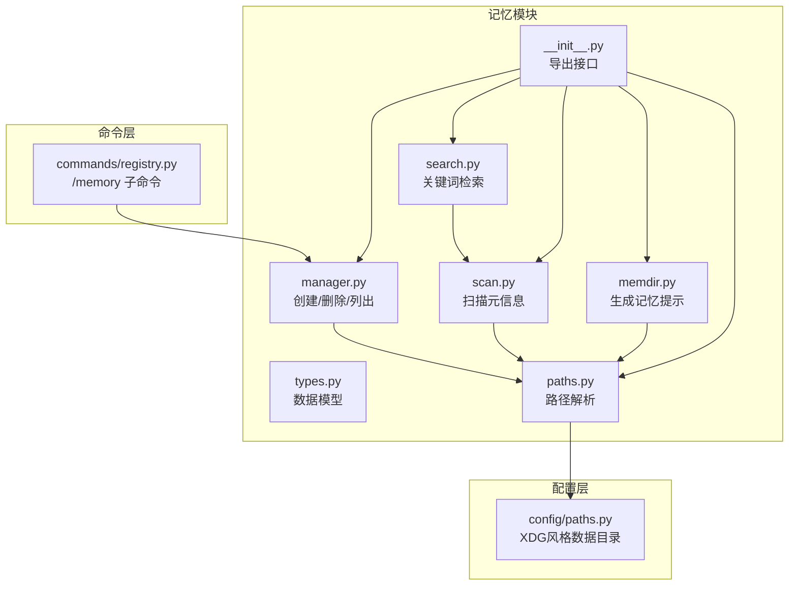
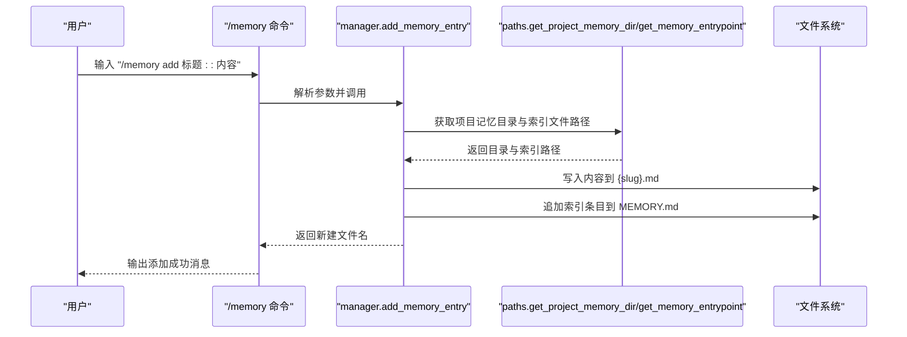
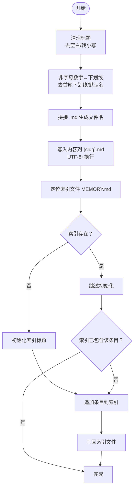
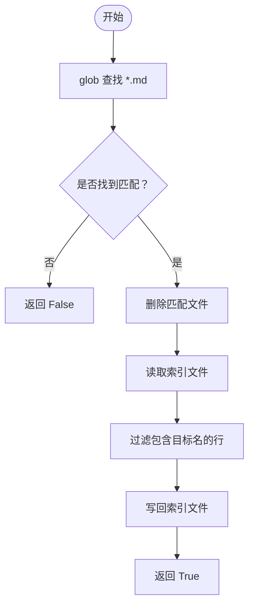
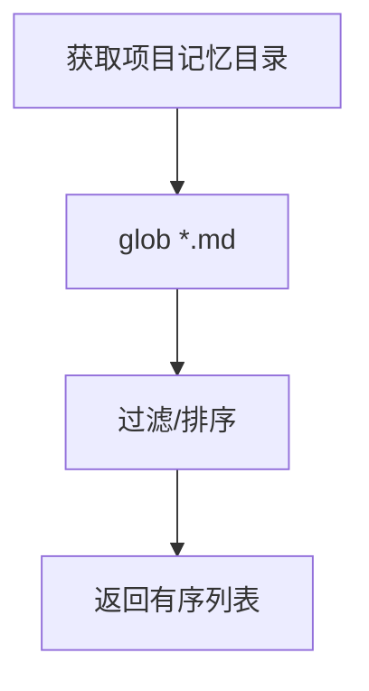
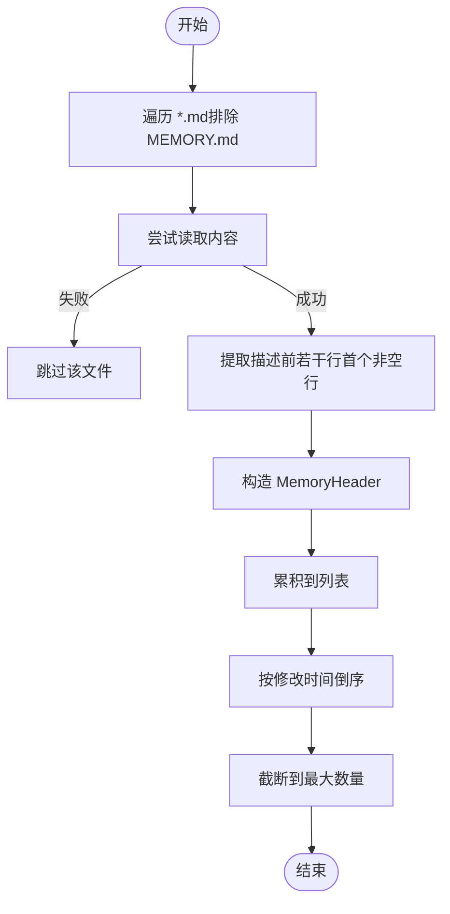
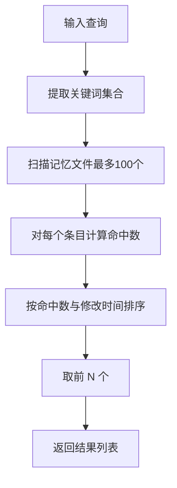
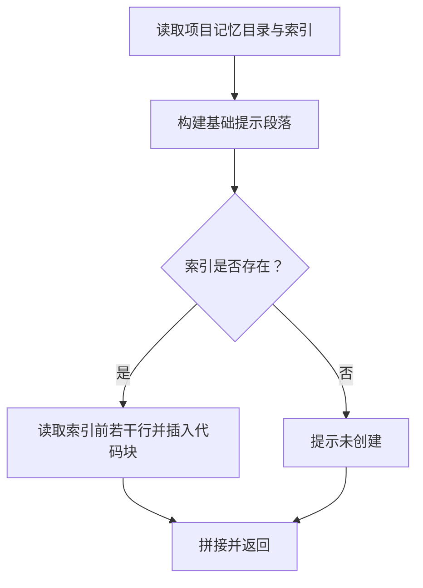
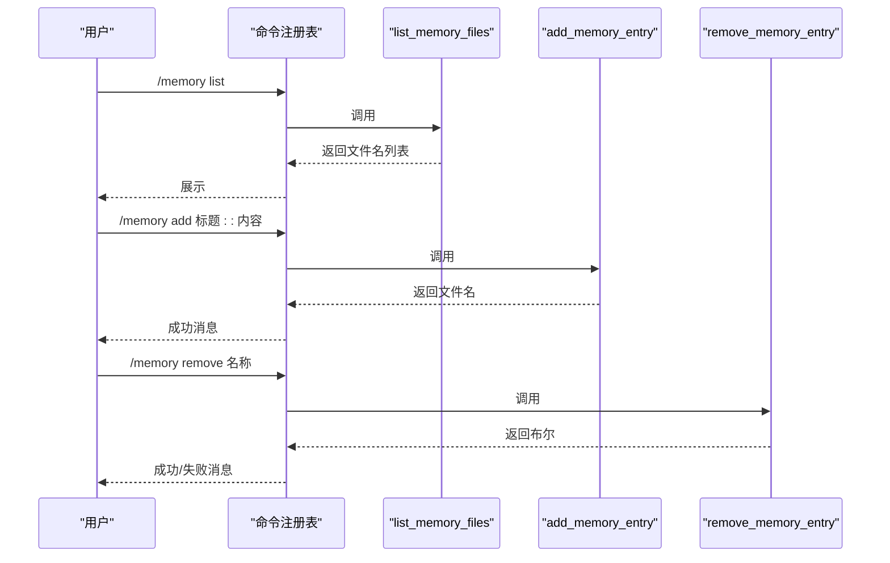
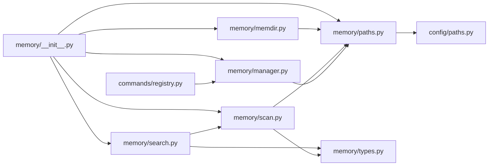

# 记忆管理器

<cite>
**本文引用的文件**
- [manager.py](file://src/openharness/memory/manager.py)
- [memdir.py](file://src/openharness/memory/memdir.py)
- [paths.py](file://src/openharness/memory/paths.py)
- [scan.py](file://src/openharness/memory/scan.py)
- [search.py](file://src/openharness/memory/search.py)
- [types.py](file://src/openharness/memory/types.py)
- [__init__.py](file://src/openharness/memory/__init__.py)
- [registry.py](file://src/openharness/commands/registry.py)
- [paths.py](file://src/openharness/config/paths.py)
- [test_memdir.py](file://tests/test_memory/test_memdir.py)
</cite>

## 目录
1. [简介](#简介)
2. [项目结构](#项目结构)
3. [核心组件](#核心组件)
4. [架构总览](#架构总览)
5. [详细组件分析](#详细组件分析)
6. [依赖分析](#依赖分析)
7. [性能考虑](#性能考虑)
8. [故障排查指南](#故障排查指南)
9. [结论](#结论)
10. [附录：命名规范与最佳实践](#附录：命名规范与最佳实践)

## 简介
本文件为“记忆管理器”的技术文档，聚焦于记忆文件的创建、删除、列表管理与检索能力。重点解释以下函数的实现原理与工作流程：
- add_memory_entry：创建记忆文件并更新索引
- remove_memory_entry：删除记忆文件并同步索引
- list_memory_files：遍历项目记忆目录并返回有序文件列表
- scan_memory_files：扫描并提取记忆文件元信息（用于排序与展示）
- find_relevant_memories：基于关键词的简单检索
- load_memory_prompt：生成记忆提示，包含索引预览

同时给出记忆文件命名规范、错误处理与异常场景、以及扩展与定制建议，帮助开发者在现有框架上进行二次开发。

## 项目结构
记忆管理器位于 src/openharness/memory 目录下，围绕“项目级持久化记忆”展开，采用“数据目录 + 项目哈希目录 + 索引文件”的组织方式。命令层通过命令注册表暴露记忆子命令，供用户交互使用。

图表来源
- [manager.py:1-51](file://src/openharness/memory/manager.py#L1-L51)
- [scan.py:1-39](file://src/openharness/memory/scan.py#L1-L39)
- [search.py:1-31](file://src/openharness/memory/search.py#L1-L31)
- [memdir.py:1-35](file://src/openharness/memory/memdir.py#L1-L35)
- [types.py:1-17](file://src/openharness/memory/types.py#L1-L17)
- [paths.py:1-23](file://src/openharness/memory/paths.py#L1-L23)
- [__init__.py:1-19](file://src/openharness/memory/__init__.py#L1-L19)
- [registry.py:322-356](file://src/openharness/commands/registry.py#L322-L356)
- [paths.py:1-117](file://src/openharness/config/paths.py#L1-L117)

章节来源
- [manager.py:1-51](file://src/openharness/memory/manager.py#L1-L51)
- [paths.py:1-23](file://src/openharness/memory/paths.py#L1-L23)
- [scan.py:1-39](file://src/openharness/memory/scan.py#L1-L39)
- [search.py:1-31](file://src/openharness/memory/search.py#L1-L31)
- [memdir.py:1-35](file://src/openharness/memory/memdir.py#L1-L35)
- [types.py:1-17](file://src/openharness/memory/types.py#L1-L17)
- [__init__.py:1-19](file://src/openharness/memory/__init__.py#L1-L19)
- [registry.py:322-356](file://src/openharness/commands/registry.py#L322-L356)
- [paths.py:1-117](file://src/openharness/config/paths.py#L1-L117)

## 核心组件
- 路径解析：根据项目根目录计算稳定的记忆目录，并定位索引文件
- 文件管理：创建/删除记忆文件，维护索引条目
- 扫描与检索：读取文件内容摘要，按修改时间排序；基于关键词计分检索
- 提示生成：汇总记忆目录与索引内容，形成可嵌入系统提示的文本

章节来源
- [paths.py:11-23](file://src/openharness/memory/paths.py#L11-L23)
- [manager.py:11-51](file://src/openharness/memory/manager.py#L11-L51)
- [scan.py:11-39](file://src/openharness/memory/scan.py#L11-L39)
- [search.py:12-31](file://src/openharness/memory/search.py#L12-L31)
- [memdir.py:10-35](file://src/openharness/memory/memdir.py#L10-L35)

## 架构总览
记忆管理器遵循“命令驱动 + 模块化实现”的设计。命令层负责用户输入解析与调用，模块层提供具体功能，路径层统一管理数据目录与索引文件位置。

图表来源
- [registry.py:345-350](file://src/openharness/commands/registry.py#L345-L350)
- [manager.py:17-29](file://src/openharness/memory/manager.py#L17-L29)
- [paths.py:11-23](file://src/openharness/memory/paths.py#L11-L23)

## 详细组件分析

### 组件一：add_memory_entry（创建记忆文件并更新索引）
- 标题到文件名的转换规则
  - 将标题去首尾空白、转小写
  - 非字母数字字符替换为下划线
  - 去除首尾下划线；若为空则回退为默认名称
  - 生成 slug 后拼接 .md 作为文件名
- 内容写入机制
  - 使用 UTF-8 编码写入内容（末尾追加换行）
- 索引文件更新流程
  - 定位索引文件（MEMORY.md）
  - 若不存在则初始化为包含标题的索引
  - 若索引中未包含当前条目，则追加一条 Markdown 列表项
  - 写回索引文件

图表来源
- [manager.py:17-29](file://src/openharness/memory/manager.py#L17-L29)

章节来源
- [manager.py:17-29](file://src/openharness/memory/manager.py#L17-L29)

### 组件二：remove_memory_entry（删除记忆文件并同步索引）
- 文件匹配
  - 在记忆目录下查找扩展名为 .md 的文件
  - 匹配规则：文件名或不带扩展名的文件名与目标名称一致
- 删除操作
  - 若找到匹配文件且存在，则执行删除
- 索引同步
  - 读取索引文件内容
  - 过滤掉包含目标文件名的行
  - 写回索引文件（去除多余空行）

图表来源
- [manager.py:32-50](file://src/openharness/memory/manager.py#L32-L50)

章节来源
- [manager.py:32-50](file://src/openharness/memory/manager.py#L32-L50)

### 组件三：list_memory_files（遍历并返回有序文件列表）
- 遍历逻辑
  - 获取项目记忆目录
  - 使用通配符匹配所有 .md 文件
  - 对结果进行排序（字典序）
- 返回值
  - 返回排序后的 Path 列表

图表来源
- [manager.py:11-14](file://src/openharness/memory/manager.py#L11-L14)

章节来源
- [manager.py:11-14](file://src/openharness/memory/manager.py#L11-L14)

### 组件四：scan_memory_files（扫描元信息）
- 功能概述
  - 遍历记忆目录下的 .md 文件（排除索引文件）
  - 读取文件内容前若干行，提取第一段非空内容作为描述
  - 构造 MemoryHeader 元信息（路径、标题、描述、修改时间）
  - 按修改时间倒序排序，限制最大数量
- 错误处理
  - 对读取失败的文件跳过，避免中断

图表来源
- [scan.py:11-39](file://src/openharness/memory/scan.py#L11-L39)
- [types.py:9-17](file://src/openharness/memory/types.py#L9-L17)

章节来源
- [scan.py:11-39](file://src/openharness/memory/scan.py#L11-L39)
- [types.py:9-17](file://src/openharness/memory/types.py#L9-L17)

### 组件五：find_relevant_memories（关键词检索）
- 关键词提取
  - 将查询转小写，提取长度≥3的字母数字与下划线片段
- 匹配策略
  - 对每个 MemoryHeader，统计查询词在标题+描述中的命中次数
  - 按命中数降序、修改时间降序排序
  - 返回前 N 个结果

图表来源
- [search.py:12-31](file://src/openharness/memory/search.py#L12-L31)
- [scan.py:11-39](file://src/openharness/memory/scan.py#L11-L39)

章节来源
- [search.py:12-31](file://src/openharness/memory/search.py#L12-L31)
- [scan.py:11-39](file://src/openharness/memory/scan.py#L11-L39)

### 组件六：load_memory_prompt（生成记忆提示）
- 功能概述
  - 生成一段包含记忆目录、使用说明与索引预览的提示文本
  - 若索引文件存在，截取指定行数并在代码块中展示
- 参数
  - 支持限制索引展示的最大行数

图表来源
- [memdir.py:10-35](file://src/openharness/memory/memdir.py#L10-L35)

章节来源
- [memdir.py:10-35](file://src/openharness/memory/memdir.py#L10-L35)

### 组件七：命令集成（/memory 子命令）
- 命令行为
  - list：列出所有记忆文件名
  - show NAME：显示对应文件内容
  - add TITLE :: CONTENT：创建记忆条目
  - remove NAME：删除记忆条目
- 与模块的对接
  - list/show/add/remove 分别调用 list_memory_files、读取文件、add_memory_entry、remove_memory_entry

图表来源
- [registry.py:322-356](file://src/openharness/commands/registry.py#L322-L356)
- [manager.py:11-51](file://src/openharness/memory/manager.py#L11-L51)

章节来源
- [registry.py:322-356](file://src/openharness/commands/registry.py#L322-L356)
- [manager.py:11-51](file://src/openharness/memory/manager.py#L11-L51)

## 依赖分析
- 模块内依赖
  - manager 依赖 paths 提供稳定目录与索引文件路径
  - scan 依赖 paths 与 types
  - search 依赖 scan 与 types
  - memdir 依赖 paths
  - __init__ 统一导出各模块接口
- 命令层依赖
  - commands/registry 通过导入 manager 接口实现命令行为

图表来源
- [registry.py:322-356](file://src/openharness/commands/registry.py#L322-L356)
- [manager.py:1-51](file://src/openharness/memory/manager.py#L1-L51)
- [scan.py:1-39](file://src/openharness/memory/scan.py#L1-L39)
- [search.py:1-31](file://src/openharness/memory/search.py#L1-L31)
- [memdir.py:1-35](file://src/openharness/memory/memdir.py#L1-L35)
- [__init__.py:1-19](file://src/openharness/memory/__init__.py#L1-L19)
- [paths.py:1-23](file://src/openharness/memory/paths.py#L1-L23)
- [paths.py:1-117](file://src/openharness/config/paths.py#L1-L117)

章节来源
- [registry.py:322-356](file://src/openharness/commands/registry.py#L322-L356)
- [manager.py:1-51](file://src/openharness/memory/manager.py#L1-L51)
- [scan.py:1-39](file://src/openharness/memory/scan.py#L1-L39)
- [search.py:1-31](file://src/openharness/memory/search.py#L1-L31)
- [memdir.py:1-35](file://src/openharness/memory/memdir.py#L1-L35)
- [__init__.py:1-19](file://src/openharness/memory/__init__.py#L1-L19)
- [paths.py:1-23](file://src/openharness/memory/paths.py#L1-L23)
- [paths.py:1-117](file://src/openharness/config/paths.py#L1-L117)

## 性能考虑
- 文件扫描与排序
  - list_memory_files 仅做目录遍历与排序，复杂度 O(n log n)，n 为 .md 文件数量
- 扫描元信息
  - scan_memory_files 对每个文件读取少量行并构造元信息，整体复杂度近似 O(n·k)，k 为前若干行数
- 检索评分
  - find_relevant_memories 对最多 100 个条目进行关键词计分，复杂度近似 O(T·M)，T 为查询词数，M 为条目数
- I/O 优化建议
  - 大量文件时可考虑缓存最近修改时间，减少 stat 调用
  - 检索时可引入更高效的索引（如倒排表），但当前实现以简洁为主

[本节为通用性能讨论，无需特定文件来源]

## 故障排查指南
- 创建记忆失败
  - 检查数据目录权限与可用空间（由配置层决定）
  - 确认标题转换后生成的文件名合法
- 删除记忆无效
  - 确认传入的名称与文件名（含扩展名或不含扩展名）一致
  - 检查索引文件是否被意外修改导致匹配不到
- 列表为空
  - 确认项目记忆目录存在且包含 .md 文件
  - 检查是否误删了索引文件
- 检索无结果
  - 查询词需至少 3 个字符
  - 确认文件描述提取正常（前若干行首个非空行）

章节来源
- [paths.py:37-51](file://src/openharness/config/paths.py#L37-L51)
- [manager.py:17-29](file://src/openharness/memory/manager.py#L17-L29)
- [manager.py:32-50](file://src/openharness/memory/manager.py#L32-L50)
- [scan.py:18-21](file://src/openharness/memory/scan.py#L18-L21)
- [search.py:19-21](file://src/openharness/memory/search.py#L19-L21)

## 结论
记忆管理器以简洁的文件系统为基础，结合稳定的项目目录与索引文件，实现了轻量而实用的记忆存储与检索能力。其核心优势在于：
- 易于理解与扩展
- 与命令层无缝集成
- 提供检索与提示生成辅助

对于更大规模的项目，可在现有基础上引入更复杂的索引与缓存机制，以提升检索效率与稳定性。

[本节为总结性内容，无需特定文件来源]

## 附录：命名规范与最佳实践

### 文件命名规范
- 标题到文件名的转换规则
  - 去除首尾空白并转为小写
  - 非字母数字字符统一替换为下划线
  - 去除首尾下划线；若为空则使用默认名称
  - 最终拼接 .md 作为文件名
- 建议
  - 标题尽量简洁明确，便于生成易读的文件名
  - 避免使用特殊字符，确保跨平台兼容

章节来源
- [manager.py:20](file://src/openharness/memory/manager.py#L20)

### 目录与索引
- 项目记忆目录
  - 由项目根目录与哈希组合生成，保证不同项目隔离
  - 索引文件固定命名为 MEMORY.md
- 建议
  - 不要手动修改索引文件格式，以免影响解析
  - 保持索引条目与文件名一致

章节来源
- [paths.py:11-23](file://src/openharness/memory/paths.py#L11-L23)

### 错误处理与异常情况
- 文件读取失败
  - 扫描阶段对无法读取的文件直接跳过，避免中断
- 索引缺失
  - 创建时若索引不存在会自动初始化
- 删除未命中
  - 返回 False 表示未找到匹配文件

章节来源
- [scan.py:20-21](file://src/openharness/memory/scan.py#L20-L21)
- [manager.py:25-28](file://src/openharness/memory/manager.py#L25-L28)
- [manager.py:36-37](file://src/openharness/memory/manager.py#L36-L37)

### 扩展与定制指南
- 新增检索策略
  - 可在现有检索基础上增加 TF-IDF 或向量相似度
  - 保持 MemoryHeader 结构不变，便于与 scan/search 协作
- 索引增强
  - 可引入 YAML 头部或数据库索引，支持更丰富的元信息
- 命令扩展
  - 在命令注册表中新增子命令，复用 manager 的核心函数
- 测试建议
  - 参考测试用例对路径稳定性、索引生成与检索结果进行验证

章节来源
- [search.py:12-31](file://src/openharness/memory/search.py#L12-L31)
- [scan.py:11-39](file://src/openharness/memory/scan.py#L11-L39)
- [registry.py:322-356](file://src/openharness/commands/registry.py#L322-L356)
- [test_memdir.py:15-53](file://tests/test_memory/test_memdir.py#L15-L53)