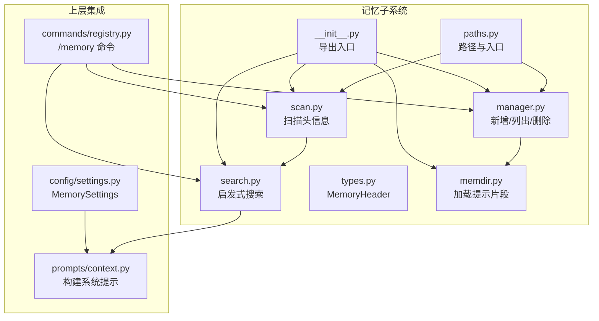
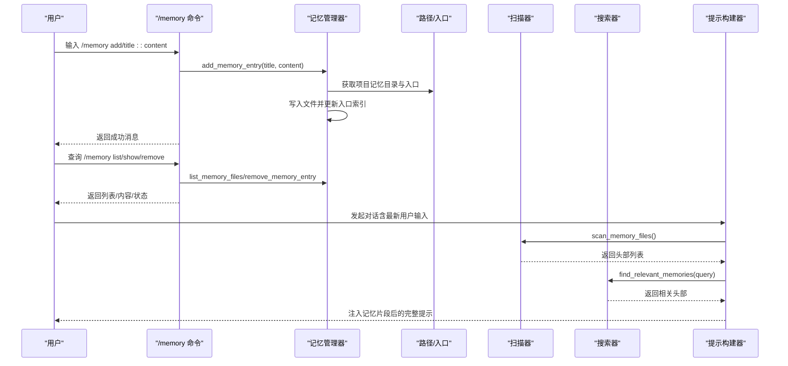
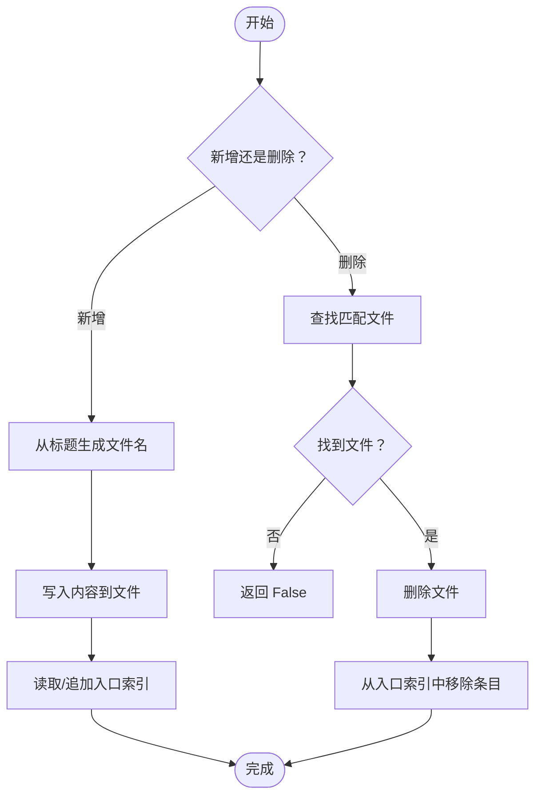
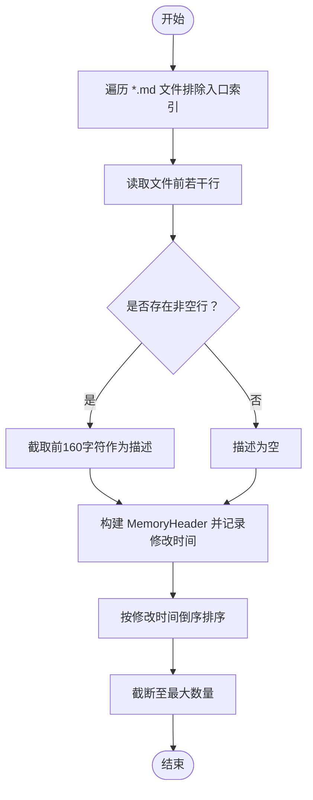
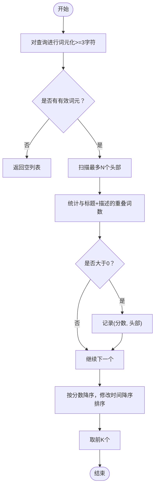
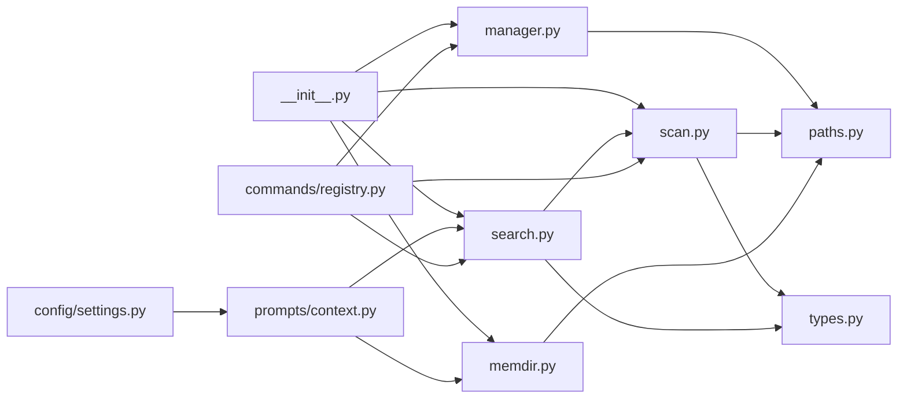

# 记忆系统

<cite>
**本文引用的文件**
- [src/openharness/memory/__init__.py](file://src/openharness/memory/__init__.py)
- [src/openharness/memory/manager.py](file://src/openharness/memory/manager.py)
- [src/openharness/memory/memdir.py](file://src/openharness/memory/memdir.py)
- [src/openharness/memory/paths.py](file://src/openharness/memory/paths.py)
- [src/openharness/memory/scan.py](file://src/openharness/memory/scan.py)
- [src/openharness/memory/search.py](file://src/openharness/memory/search.py)
- [src/openharness/memory/types.py](file://src/openharness/memory/types.py)
- [src/openharness/prompts/context.py](file://src/openharness/prompts/context.py)
- [src/openharness/config/settings.py](file://src/openharness/config/settings.py)
- [src/openharness/commands/registry.py](file://src/openharness/commands/registry.py)
- [tests/test_memory/test_memdir.py](file://tests/test_memory/test_memdir.py)
</cite>

## 目录
1. [简介](#简介)
2. [项目结构](#项目结构)
3. [核心组件](#核心组件)
4. [架构总览](#架构总览)
5. [详细组件分析](#详细组件分析)
6. [依赖分析](#依赖分析)
7. [性能考虑](#性能考虑)
8. [故障排查指南](#故障排查指南)
9. [结论](#结论)
10. [附录：配置与最佳实践](#附录配置与最佳实践)

## 简介
本文件系统性阐述 OpenHarness 记忆系统的设计目标、数据模型、工作流程与扩展方法。记忆系统的核心目标是为项目提供跨会话持久化的知识存储能力，使用户或项目上下文能够在不同会话之间持续存在并被智能检索与利用。系统通过“项目级持久化目录 + 入口索引文件”的方式组织知识，并提供扫描、搜索与提示注入能力，帮助在对话中动态引入相关记忆。

## 项目结构
记忆系统位于 src/openharness/memory 目录下，围绕以下模块协同工作：
- 路径与入口：根据项目路径生成稳定的数据目录与入口索引文件
- 管理器：负责新增、列出、删除记忆条目，并维护入口索引
- 扫描器：读取目录中的 Markdown 文件，提取标题与描述摘要
- 搜索器：基于查询词进行简单启发式匹配，返回相关度最高的记忆
- 类型定义：统一的记忆元数据结构
- 提示集成：在运行时构建系统提示，按需注入记忆内容
- 配置：控制记忆功能的开关与参数上限
- 命令行接口：提供 /memory 命令用于交互式管理

图表来源
- [src/openharness/memory/paths.py:11-23](file://src/openharness/memory/paths.py#L11-L23)
- [src/openharness/memory/manager.py:11-51](file://src/openharness/memory/manager.py#L11-L51)
- [src/openharness/memory/scan.py:11-39](file://src/openharness/memory/scan.py#L11-L39)
- [src/openharness/memory/search.py:12-31](file://src/openharness/memory/search.py#L12-L31)
- [src/openharness/memory/types.py:9-17](file://src/openharness/memory/types.py#L9-L17)
- [src/openharness/memory/memdir.py:10-35](file://src/openharness/memory/memdir.py#L10-L35)
- [src/openharness/memory/__init__.py:3-18](file://src/openharness/memory/__init__.py#L3-L18)
- [src/openharness/prompts/context.py:72-99](file://src/openharness/prompts/context.py#L72-L99)
- [src/openharness/config/settings.py:41-47](file://src/openharness/config/settings.py#L41-L47)
- [src/openharness/commands/registry.py:322-356](file://src/openharness/commands/registry.py#L322-L356)

章节来源
- [src/openharness/memory/__init__.py:1-19](file://src/openharness/memory/__init__.py#L1-L19)
- [src/openharness/memory/paths.py:1-23](file://src/openharness/memory/paths.py#L1-L23)
- [src/openharness/memory/manager.py:1-51](file://src/openharness/memory/manager.py#L1-L51)
- [src/openharness/memory/scan.py:1-39](file://src/openharness/memory/scan.py#L1-L39)
- [src/openharness/memory/search.py:1-31](file://src/openharness/memory/search.py#L1-L31)
- [src/openharness/memory/types.py:1-17](file://src/openharness/memory/types.py#L1-L17)
- [src/openharness/memory/memdir.py:1-35](file://src/openharness/memory/memdir.py#L1-L35)
- [src/openharness/prompts/context.py:1-102](file://src/openharness/prompts/context.py#L1-L102)
- [src/openharness/config/settings.py:41-47](file://src/openharness/config/settings.py#L41-L47)
- [src/openharness/commands/registry.py:322-356](file://src/openharness/commands/registry.py#L322-L356)

## 核心组件
- 记忆目录与入口
  - 项目记忆目录由项目路径经哈希生成稳定标识，确保跨会话一致
  - 入口索引文件作为“记忆清单”，记录各记忆条目的标题与链接
- 记忆管理器
  - 新增：根据标题生成文件名（仅字母数字与下划线，转小写），写入内容并追加到入口索引
  - 列表：枚举项目记忆目录下的所有 Markdown 文件
  - 删除：删除对应文件并从入口索引中移除条目
- 扫描器
  - 遍历目录，跳过入口索引文件，读取前若干行提取首行非空文本作为描述摘要
  - 以修改时间倒序排序，限制最大返回数量
- 搜索器
  - 对查询进行分词（至少3字符的字母数字词），统计与标题+描述的重叠词数
  - 结果按重叠数降序、修改时间降序排序，限制最大结果数量
- 类型定义
  - MemoryHeader：包含路径、标题、描述摘要与修改时间
- 提示集成
  - 构建系统提示时，可按配置注入“记忆目录位置”和“入口索引内容”
  - 若开启记忆且有最新用户输入，按配置限制返回若干相关记忆并内联展示
- 配置项
  - MemorySettings：启用开关、最大返回文件数、入口索引最大行数

章节来源
- [src/openharness/memory/paths.py:11-23](file://src/openharness/memory/paths.py#L11-L23)
- [src/openharness/memory/manager.py:11-51](file://src/openharness/memory/manager.py#L11-L51)
- [src/openharness/memory/scan.py:11-39](file://src/openharness/memory/scan.py#L11-L39)
- [src/openharness/memory/search.py:12-31](file://src/openharness/memory/search.py#L12-L31)
- [src/openharness/memory/types.py:9-17](file://src/openharness/memory/types.py#L9-L17)
- [src/openharness/prompts/context.py:72-99](file://src/openharness/prompts/context.py#L72-L99)
- [src/openharness/config/settings.py:41-47](file://src/openharness/config/settings.py#L41-L47)

## 架构总览
记忆系统采用“数据持久化 + 元数据扫描 + 启发式搜索 + 提示注入”的分层设计。命令行与提示构建器作为外部调用方，通过统一的导出接口访问核心能力。

图表来源
- [src/openharness/commands/registry.py:322-356](file://src/openharness/commands/registry.py#L322-L356)
- [src/openharness/memory/manager.py:17-29](file://src/openharness/memory/manager.py#L17-L29)
- [src/openharness/memory/scan.py:11-39](file://src/openharness/memory/scan.py#L11-L39)
- [src/openharness/memory/search.py:12-31](file://src/openharness/memory/search.py#L12-L31)
- [src/openharness/prompts/context.py:72-99](file://src/openharness/prompts/context.py#L72-L99)

## 详细组件分析

### 组件一：记忆目录与入口（paths.py）
- 设计要点
  - 使用项目绝对路径的哈希前缀生成稳定目录名，避免同名冲突
  - 入口索引文件固定命名为 MEMORY.md，便于统一识别
- 关键行为
  - 创建目录（必要时递归）
  - 返回入口文件路径
- 复杂度
  - 路径计算为 O(1)，I/O 成本取决于磁盘性能

章节来源
- [src/openharness/memory/paths.py:11-23](file://src/openharness/memory/paths.py#L11-L23)

### 组件二：记忆管理器（manager.py）
- 设计要点
  - 新增：标题规范化（仅保留字母数字与下划线，转小写），避免非法文件名
  - 更新：若入口不存在则初始化；若条目未在索引中则追加
  - 删除：先删文件，再从入口中剔除对应行
- 关键行为
  - list_memory_files：枚举 *.md
  - add_memory_entry：写入内容并维护索引
  - remove_memory_entry：删除并清理索引
- 错误处理
  - 文件读写异常时跳过该文件
  - 删除失败时返回 False

图表来源
- [src/openharness/memory/manager.py:17-51](file://src/openharness/memory/manager.py#L17-L51)

章节来源
- [src/openharness/memory/manager.py:11-51](file://src/openharness/memory/manager.py#L11-L51)

### 组件三：扫描器（scan.py）
- 设计要点
  - 遍历目录，跳过入口索引文件
  - 读取文件前若干行，取首个非空行作为描述摘要
  - 以修改时间倒序排序，限制最大返回数量
- 关键行为
  - scan_memory_files：返回 MemoryHeader 列表
- 性能特性
  - 时间复杂度近似 O(N)（N 为文件数）+ 排序 O(N log N)

图表来源
- [src/openharness/memory/scan.py:11-39](file://src/openharness/memory/scan.py#L11-L39)

章节来源
- [src/openharness/memory/scan.py:11-39](file://src/openharness/memory/scan.py#L11-L39)

### 组件四：搜索器（search.py）
- 设计要点
  - 将查询拆分为至少3个字符的词元，忽略大小写
  - 统计与标题+描述的重叠词数作为相关性分数
  - 先按分数降序，再按修改时间降序，限制最大结果数量
- 关键行为
  - find_relevant_memories：返回 MemoryHeader 列表
- 复杂度
  - 对每个头部进行一次子串匹配，整体约 O(Q × H)，Q 为词元数，H 为扫描头部数

图表来源
- [src/openharness/memory/search.py:12-31](file://src/openharness/memory/search.py#L12-L31)

章节来源
- [src/openharness/memory/search.py:12-31](file://src/openharness/memory/search.py#L12-L31)

### 组件五：类型定义（types.py）
- 设计要点
  - MemoryHeader：不可变数据类，承载路径、标题、描述与修改时间
- 用途
  - 在扫描与搜索阶段作为统一的元数据载体

章节来源
- [src/openharness/memory/types.py:9-17](file://src/openharness/memory/types.py#L9-L17)

### 组件六：提示集成（memdir.py 与 prompts/context.py）
- 设计要点
  - memdir.load_memory_prompt：生成包含“记忆目录位置”和“入口索引内容”的提示片段
  - prompts/context.build_runtime_system_prompt：在启用记忆时注入提示片段，并按需内联相关记忆内容
- 关键行为
  - 受配置项控制：是否启用、入口索引最大行数、搜索最大文件数

章节来源
- [src/openharness/memory/memdir.py:10-35](file://src/openharness/memory/memdir.py#L10-L35)
- [src/openharness/prompts/context.py:72-99](file://src/openharness/prompts/context.py#L72-L99)
- [src/openharness/config/settings.py:41-47](file://src/openharness/config/settings.py#L41-L47)

### 组件七：命令行接口（commands/registry.py）
- 设计要点
  - /memory list/show/add/remove：直接委托给管理器与扫描器
  - 展示记忆目录与入口路径，便于用户定位
- 交互流程
  - 解析动作与参数，调用相应函数，返回人类可读消息

章节来源
- [src/openharness/commands/registry.py:322-356](file://src/openharness/commands/registry.py#L322-L356)

## 依赖分析
- 内聚性
  - 记忆子系统内部模块职责清晰：路径/入口、管理、扫描、搜索、类型、提示集成
- 耦合性
  - 上层通过 __init__.py 导出统一接口，降低耦合
  - 提示构建器与命令行仅依赖导出接口，不直接依赖具体实现细节
- 外部依赖
  - 依赖配置模块提供的 MemorySettings
  - 依赖路径模块提供的数据目录与入口文件路径

图表来源
- [src/openharness/memory/__init__.py:3-18](file://src/openharness/memory/__init__.py#L3-L18)
- [src/openharness/memory/manager.py:8-8](file://src/openharness/memory/manager.py#L8-L8)
- [src/openharness/memory/scan.py:7-8](file://src/openharness/memory/scan.py#L7-L8)
- [src/openharness/memory/search.py:8-9](file://src/openharness/memory/search.py#L8-L9)
- [src/openharness/memory/memdir.py:7-7](file://src/openharness/memory/memdir.py#L7-L7)
- [src/openharness/prompts/context.py:9-9](file://src/openharness/prompts/context.py#L9-L9)
- [src/openharness/config/settings.py:41-47](file://src/openharness/config/settings.py#L41-L47)
- [src/openharness/commands/registry.py:322-356](file://src/openharness/commands/registry.py#L322-L356)

章节来源
- [src/openharness/memory/__init__.py:1-19](file://src/openharness/memory/__init__.py#L1-L19)
- [src/openharness/memory/manager.py:1-51](file://src/openharness/memory/manager.py#L1-L51)
- [src/openharness/memory/scan.py:1-39](file://src/openharness/memory/scan.py#L1-L39)
- [src/openharness/memory/search.py:1-31](file://src/openharness/memory/search.py#L1-L31)
- [src/openharness/memory/memdir.py:1-35](file://src/openharness/memory/memdir.py#L1-L35)
- [src/openharness/prompts/context.py:1-102](file://src/openharness/prompts/context.py#L1-L102)
- [src/openharness/config/settings.py:41-47](file://src/openharness/config/settings.py#L41-L47)
- [src/openharness/commands/registry.py:322-356](file://src/openharness/commands/registry.py#L322-L356)

## 性能考虑
- 扫描与排序
  - 当记忆文件较多时，扫描与排序成本上升。可通过减少 max_files 与 max_entrypoint_lines 控制 I/O 与渲染量
- 搜索复杂度
  - 词元化与逐条匹配的时间复杂度与头部数量成正比。建议限制扫描窗口与结果数量
- 文件系统开销
  - 频繁读取大量小文件可能受文件系统元数据影响。可考虑合并相关记忆或缓存最近访问的头部
- 建议
  - 合理设置 MemorySettings 的 max_files 与 max_entrypoint_lines
  - 将长篇内容拆分为多个主题明确的记忆文件，提升匹配精度与性能
  - 定期清理不再需要的记忆文件，保持目录整洁

## 故障排查指南
- 新增记忆后未出现在入口索引
  - 检查标题是否为空或仅包含非法字符导致文件名异常
  - 确认入口索引文件存在且未被意外删除
- 删除记忆后索引未更新
  - 确认删除名称与文件名或不含扩展名的 stem 匹配
  - 检查入口索引中是否仍残留条目
- 搜索无结果
  - 查询词需至少3个字符
  - 确认记忆文件已正确写入且未被删除
- 提示中未显示记忆
  - 检查配置项 memory.enabled 是否为 True
  - 确认入口索引内容未超过 max_entrypoint_lines 的限制

章节来源
- [src/openharness/memory/manager.py:17-51](file://src/openharness/memory/manager.py#L17-L51)
- [src/openharness/memory/search.py:19-21](file://src/openharness/memory/search.py#L19-L21)
- [src/openharness/prompts/context.py:72-78](file://src/openharness/prompts/context.py#L72-L78)
- [src/openharness/config/settings.py:41-47](file://src/openharness/config/settings.py#L41-L47)
- [tests/test_memory/test_memdir.py:41-53](file://tests/test_memory/test_memdir.py#L41-L53)

## 结论
OpenHarness 记忆系统以简洁可靠的方式实现了跨会话持久化知识存储：稳定的项目级目录、轻量的入口索引、高效的扫描与启发式搜索，以及可配置的提示注入。通过合理设置配置项与遵循命名规范，可在保证性能的同时获得良好的检索体验。

## 附录：配置与最佳实践

### 配置选项
- MemorySettings.enabled
  - 类型：布尔
  - 作用：启用/禁用记忆功能
- MemorySettings.max_files
  - 类型：整数
  - 作用：搜索返回的最大记忆数量
- MemorySettings.max_entrypoint_lines
  - 类型：整数
  - 作用：提示中入口索引的最大行数

章节来源
- [src/openharness/config/settings.py:41-47](file://src/openharness/config/settings.py#L41-L47)

### 文件命名与目录组织
- 目录
  - 项目记忆目录：由项目路径哈希生成，确保唯一性
  - 入口索引文件：MEMORY.md，位于项目记忆目录根部
- 文件命名
  - 标题经规范化处理（仅保留字母数字与下划线，转小写），作为文件名
  - 建议使用简短、语义明确的标题，便于检索与维护

章节来源
- [src/openharness/memory/paths.py:11-23](file://src/openharness/memory/paths.py#L11-L23)
- [src/openharness/memory/manager.py:17-21](file://src/openharness/memory/manager.py#L17-L21)

### 使用场景与最佳实践
- 场景
  - 存储项目规则、约定与背景知识
  - 记录常见问题与解决方案
  - 归档会议纪要、设计决策与技术债说明
- 最佳实践
  - 将长内容拆分为多个主题明确的记忆文件
  - 保持标题简洁且具检索价值
  - 定期回顾与精简，移除过时内容
  - 使用 /memory 命令进行日常维护与核验

### 扩展与定制指南
- 自定义搜索策略
  - 可在现有启发式基础上增加 TF-IDF 或向量相似度计算
  - 注意平衡准确率与性能，限制扫描窗口与结果数量
- 增强索引能力
  - 引入更丰富的元数据（如标签、作者、创建时间）
  - 支持全文索引或外部搜索引擎（如本地向量库）
- 提示注入优化
  - 控制内联记忆内容长度，避免超出上下文限制
  - 支持分段注入与摘要优先策略
- 命令行增强
  - 提供批量导入/导出、按标签筛选、编辑器集成等功能