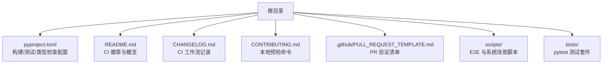
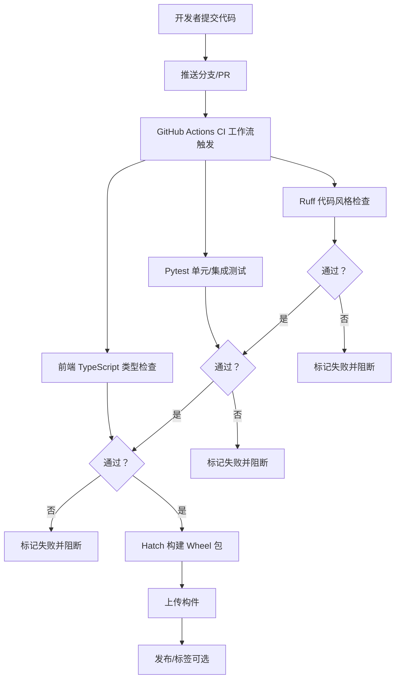
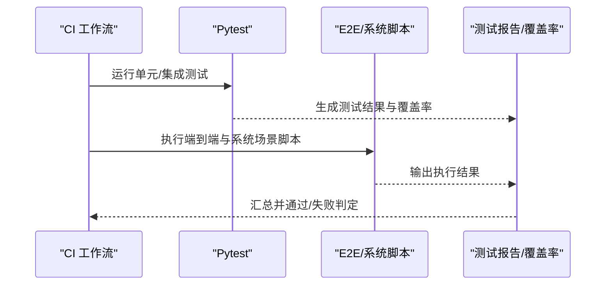
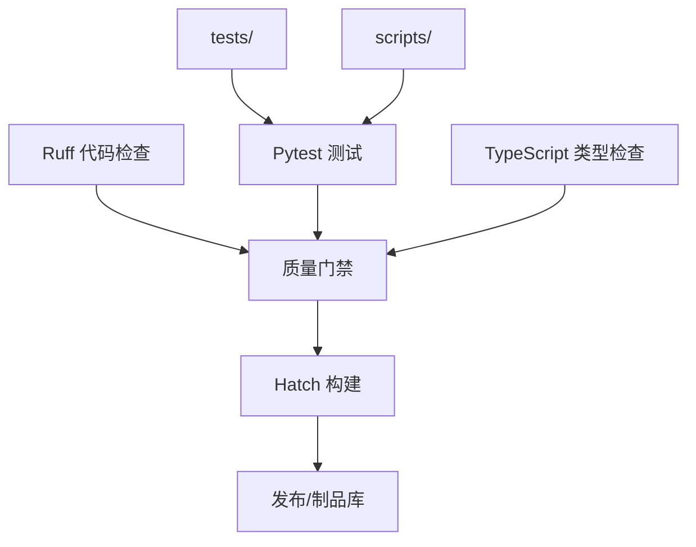

# CI/CD 和自动化

<cite>
**本文引用的文件**
- [README.md](file://README.md)
- [CHANGELOG.md](file://CHANGELOG.md)
- [CONTRIBUTING.md](file://CONTRIBUTING.md)
- [pyproject.toml](file://pyproject.toml)
- [.github/PULL_REQUEST_TEMPLATE.md](file://.github/PULL_REQUEST_TEMPLATE.md)
- [scripts/test_harness_features.py](file://scripts/test_harness_features.py)
- [scripts/test_real_skills_plugins.py](file://scripts/test_real_skills_plugins.py)
- [scripts/react_tui_e2e.py](file://scripts/react_tui_e2e.py)
- [scripts/test_tui_interactions.py](file://scripts/test_tui_interactions.py)
- [scripts/e2e_smoke.py](file://scripts/e2e_smoke.py)
- [scripts/test_cli_flags.py](file://scripts/test_cli_flags.py)
- [scripts/test_docker_sandbox_e2e.py](file://scripts/test_docker_sandbox_e2e.py)
- [scripts/local_system_scenarios.py](file://scripts/local_system_scenarios.py)
- [tests/](file://tests/)
</cite>

## 目录
1. [简介](#简介)
2. [项目结构](#项目结构)
3. [核心组件](#核心组件)
4. [架构总览](#架构总览)
5. [详细组件分析](#详细组件分析)
6. [依赖关系分析](#依赖关系分析)
7. [性能考量](#性能考量)
8. [故障排查指南](#故障排查指南)
9. [结论](#结论)
10. [附录](#附录)

## 简介
本指南面向 OpenHarness 项目的持续集成与交付（CI/CD）及自动化运维，目标是帮助贡献者与维护者：
- 建立稳定可靠的自动化测试流水线（单元、集成、端到端）
- 集成代码质量检查与安全扫描
- 规划多环境部署与回滚策略
- 实施发布管理与版本控制最佳实践
- 编写与维护自动化运维脚本
- 建立持续监控与反馈闭环

基于仓库现有信息，README 显示存在 GitHub Actions CI 工作流；CHANGELOG 提及“GitHub Actions CI 工作流”；CONTRIBUTING.md 与 PR 模板明确了本地预检命令（lint、pytest、前端类型检查）。这些为本指南提供了事实依据。

## 项目结构
围绕 CI/CD 与自动化，仓库的关键位置如下：
- 根级配置与工具链：pyproject.toml（构建、测试、类型检查、格式化规则）
- 文档与模板：README（CI 徽章）、CHANGELOG（CI 工作流记录）、CONTRIBUTING（本地预检）、PR 模板
- 自动化测试脚本：scripts/ 下的各类 E2E 与系统场景脚本
- 单元/集成测试：tests/ 目录（pytest 配置在 pyproject.toml）

图示来源
- [README.md:34](file://README.md#L34)
- [CHANGELOG.md:45](file://CHANGELOG.md#L45)
- [CONTRIBUTING.md:29-43](file://CONTRIBUTING.md#L29-L43)
- [pyproject.toml:75-86](file://pyproject.toml#L75-L86)

章节来源
- [README.md:34](file://README.md#L34)
- [CHANGELOG.md:45](file://CHANGELOG.md#L45)
- [CONTRIBUTING.md:29-43](file://CONTRIBUTING.md#L29-L43)
- [pyproject.toml:75-86](file://pyproject.toml#L75-L86)

## 核心组件
- 本地预检与 PR 验证
  - Python 代码风格与静态检查：ruff
  - 单元/集成测试：pytest
  - 前端类型检查：TypeScript（通过 PR 模板中的命令）
- 自动化测试脚本
  - 脚本化 E2E 与系统场景覆盖，作为 CI 的补充或独立验证
- 构建与打包
  - 使用 hatchling 构建 wheel 包，包含前端资源
- 版本与发布
  - CHANGELOG 记录版本变更，README 展示版本徽章与状态

章节来源
- [CONTRIBUTING.md:29-43](file://CONTRIBUTING.md#L29-L43)
- [.github/PULL_REQUEST_TEMPLATE.md:8-10](file://.github/PULL_REQUEST_TEMPLATE.md#L8-L10)
- [pyproject.toml:1-86](file://pyproject.toml#L1-L86)
- [CHANGELOG.md:18-48](file://CHANGELOG.md#L18-L48)
- [README.md:721-737](file://README.md#L721-L737)

## 架构总览
下图展示了从代码提交到测试、质量门禁与发布的整体流程，映射到仓库中已有的工具链与脚本：

图示来源
- [README.md:34](file://README.md#L34)
- [CHANGELOG.md:45](file://CHANGELOG.md#L45)
- [CONTRIBUTING.md:29-43](file://CONTRIBUTING.md#L29-L43)
- [pyproject.toml:75-86](file://pyproject.toml#L75-L86)

## 详细组件分析

### GitHub Actions 工作流配置与自定义
- 现状
  - README 显示 CI 徽章，指向 ci.yml；CHANGELOG 提及“GitHub Actions CI 工作流”
  - 本地预检命令明确包含 ruff 与 pytest，前端类型检查通过 PR 模板命令
- 建议配置要点
  - 触发策略：对主分支保护、PR、tag 推送设置不同阶段的 job
  - 并行矩阵：按 Python 版本、操作系统矩阵运行测试
  - 代码覆盖率：启用 pytest-cov，上传覆盖率报告
  - 前端检查：在独立 job 中执行 TypeScript 类型检查
  - 安全扫描：集成 SAST（如 CodeQL 或 ruff 安全规则），必要时加入依赖漏洞扫描
  - 构件与发布：构建 wheel，上传到发布页或制品库；支持自动打 tag 与生成变更日志
- 参考路径
  - 本地预检命令：[CONTRIBUTING.md:34-43](file://CONTRIBUTING.md#L34-L43)
  - PR 验证清单：[.github/PULL_REQUEST_TEMPLATE.md:8-10](file://.github/PULL_REQUEST_TEMPLATE.md#L8-L10)
  - 构建配置：[pyproject.toml:1-86](file://pyproject.toml#L1-L86)

章节来源
- [README.md:34](file://README.md#L34)
- [CHANGELOG.md:45](file://CHANGELOG.md#L45)
- [CONTRIBUTING.md:29-43](file://CONTRIBUTING.md#L29-L43)
- [.github/PULL_REQUEST_TEMPLATE.md:8-10](file://.github/PULL_REQUEST_TEMPLATE.md#L8-L10)
- [pyproject.toml:1-86](file://pyproject.toml#L1-L86)

### 自动化测试流程（单元/集成/端到端）
- 单元与集成测试（pytest）
  - 配置：tests 目录、pytest 配置在 pyproject.toml
  - 运行：CONTRIBUTING 与 PR 模板中的命令
- 端到端与系统场景脚本
  - scripts/ 下包含多种 E2E 与系统场景脚本，用于覆盖真实使用路径
  - README 列出多类 E2E 套件数量与覆盖范围
- 建议
  - 将 scripts/ 中的脚本纳入 CI 矩阵或独立 job，确保真实环境行为被验证
  - 对关键路径（如 React TUI、插件加载、权限系统）分别建立专用 job
  - 结合覆盖率报告，逐步提升关键模块的测试密度

图示来源
- [README.md:721-737](file://README.md#L721-L737)
- [CONTRIBUTING.md:34-43](file://CONTRIBUTING.md#L34-L43)
- [pyproject.toml:75-77](file://pyproject.toml#L75-L77)

章节来源
- [README.md:721-737](file://README.md#L721-L737)
- [CONTRIBUTING.md:34-43](file://CONTRIBUTING.md#L34-L43)
- [pyproject.toml:75-77](file://pyproject.toml#L75-L77)

### 代码质量检查与安全扫描
- 代码风格与静态检查
  - ruff：统一风格、发现潜在问题
- 类型检查
  - mypy：严格模式，建议在 CI 中启用
- 安全扫描
  - 建议引入 CodeQL 或 ruff 安全规则；对第三方依赖进行漏洞扫描
- 建议实践
  - 将质量门禁设为强制：不满足要求则阻断合并
  - 对新增模块逐步提高类型注解覆盖率

章节来源
- [CONTRIBUTING.md:34](file://CONTRIBUTING.md#L34)
- [pyproject.toml:79-86](file://pyproject.toml#L79-L86)

### 自动化部署流水线（多环境与回滚）
- 多环境部署
  - 建议按开发/预发布/生产划分环境变量与配置文件
  - 使用 secrets 管理敏感信息，避免硬编码
- 回滚策略
  - 采用蓝绿/金丝雀发布；若失败快速回滚至上一稳定版本
  - 发布前进行健康检查与最小功能验证
- 构建与分发
  - 使用 hatchling 构建 wheel，上传至制品库或直接发布到 PyPI
  - 为每个发布打 tag，并生成对应变更日志

章节来源
- [pyproject.toml:54-74](file://pyproject.toml#L54-L74)
- [CHANGELOG.md:18-48](file://CHANGELOG.md#L18-L48)

### 发布管理与版本控制最佳实践
- 版本号与变更日志
  - 严格遵循 Keep a Changelog 格式；在 CHANGELOG 中记录重大变更
- 标签与发布
  - 主分支受保护，仅允许带标签的合并；每次发布打上对应 tag
- 文档同步
  - README 中展示最新版本状态与徽章，保持与发布一致

章节来源
- [CHANGELOG.md:1-105](file://CHANGELOG.md#L1-L105)
- [README.md:154-193](file://README.md#L154-L193)

### 自动化运维脚本（编写与维护）
- 脚本职责
  - 覆盖真实系统场景（如 Docker Sandbox、TUI 交互、技能/插件加载等）
- 维护建议
  - 以模块化方式组织脚本，便于复用与调试
  - 在 CI 中定期运行，确保与核心功能同步演进
  - 为关键脚本添加超时与重试机制，增强稳定性

章节来源
- [scripts/test_harness_features.py](file://scripts/test_harness_features.py)
- [scripts/test_real_skills_plugins.py](file://scripts/test_real_skills_plugins.py)
- [scripts/react_tui_e2e.py](file://scripts/react_tui_e2e.py)
- [scripts/test_tui_interactions.py](file://scripts/test_tui_interactions.py)
- [scripts/e2e_smoke.py](file://scripts/e2e_smoke.py)
- [scripts/test_cli_flags.py](file://scripts/test_cli_flags.py)
- [scripts/test_docker_sandbox_e2e.py](file://scripts/test_docker_sandbox_e2e.py)
- [scripts/local_system_scenarios.py](file://scripts/local_system_scenarios.py)

### 持续监控与反馈闭环
- 监控指标
  - CI 成功率、测试耗时、覆盖率趋势、构建时间
- 反馈闭环
  - 将失败原因与修复建议反馈给贡献者；对高频失败模块优先优化测试与文档
- 建议工具
  - 使用制品库与发布页追踪版本；结合 README 徽章与 CHANGELOG 形成可视化反馈

章节来源
- [README.md:34](file://README.md#L34)
- [README.md:721-737](file://README.md#L721-L737)

## 依赖关系分析
- 工具链耦合
  - ruff 与 pytest 与前端类型检查共同构成质量门禁
  - hatchling 与打包配置决定产物与分发路径
- 测试与脚本耦合
  - tests/ 与 scripts/ 共同覆盖核心功能，CI 应并行运行以缩短反馈周期

图示来源
- [pyproject.toml:75-86](file://pyproject.toml#L75-L86)
- [CONTRIBUTING.md:29-43](file://CONTRIBUTING.md#L29-L43)

章节来源
- [pyproject.toml:75-86](file://pyproject.toml#L75-L86)
- [CONTRIBUTING.md:29-43](file://CONTRIBUTING.md#L29-L43)

## 性能考量
- 并行化
  - 将 lint、测试、类型检查拆分为独立 job，充分利用 runners 并行能力
- 矩阵构建
  - 按 Python 版本与操作系统矩阵运行，减少单 job 时长
- 缓存与重用
  - 缓存依赖安装与测试缓存，缩短重复任务时间
- 覆盖率与回归
  - 逐步提升关键模块覆盖率，降低回归风险与修复成本

## 故障排查指南
- 常见问题定位
  - 本地预检失败：对照 CONTRIBUTING 与 PR 模板命令逐项排查
  - 测试不稳定：检查脚本超时、外部依赖可用性与并发锁竞争
  - 构建失败：核对 hatchling 配置与前端资源包含情况
- 快速恢复
  - 临时关闭高风险 job，先保证主干稳定
  - 回滚到上一稳定 tag，修复后再重新发布

章节来源
- [CONTRIBUTING.md:29-43](file://CONTRIBUTING.md#L29-L43)
- [pyproject.toml:54-74](file://pyproject.toml#L54-L74)

## 结论
通过将现有工具链（ruff、pytest、TypeScript 检查）与脚本化 E2E 测试整合进 GitHub Actions，OpenHarness 可以建立起稳定高效的 CI/CD 体系。配合严格的版本与发布管理、多环境部署与回滚策略，以及持续监控与反馈闭环，能够显著提升交付质量与团队协作效率。

## 附录
- 关键参考路径
  - 本地预检命令：[CONTRIBUTING.md:34-43](file://CONTRIBUTING.md#L34-L43)
  - PR 验证清单：[.github/PULL_REQUEST_TEMPLATE.md:8-10](file://.github/PULL_REQUEST_TEMPLATE.md#L8-L10)
  - 构建与打包：[pyproject.toml:1-86](file://pyproject.toml#L1-L86)
  - 测试套件与脚本：[README.md:721-737](file://README.md#L721-L737)，[tests/](file://tests/)
  - CI 工作流记录：[CHANGELOG.md:45](file://CHANGELOG.md#L45)
  - CI 徽章与状态：[README.md:34](file://README.md#L34)