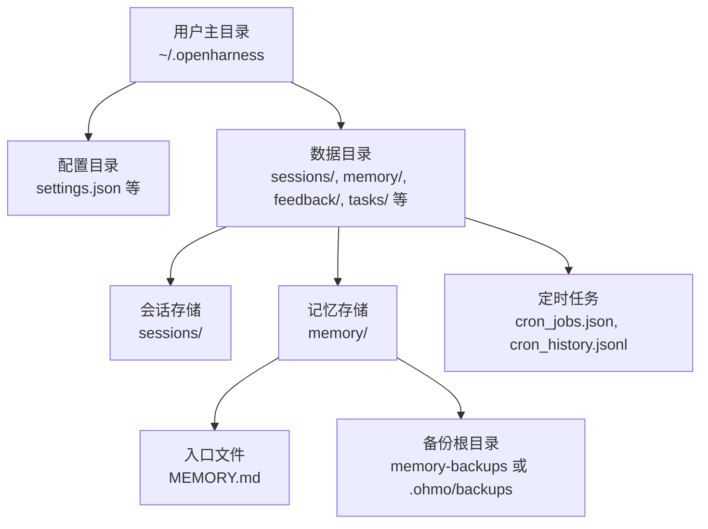
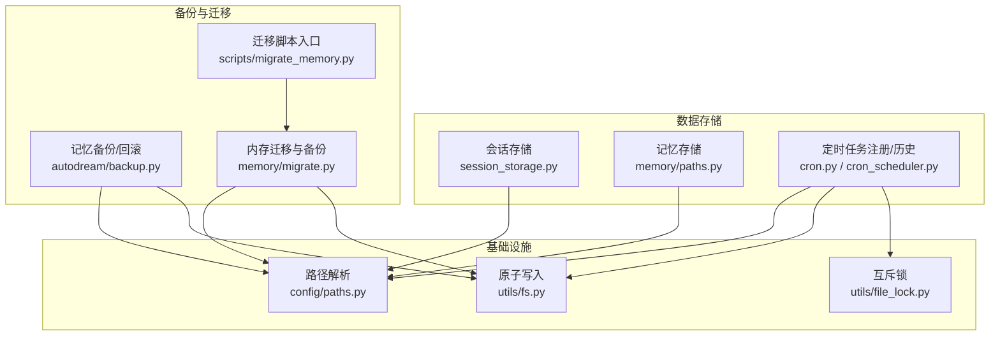
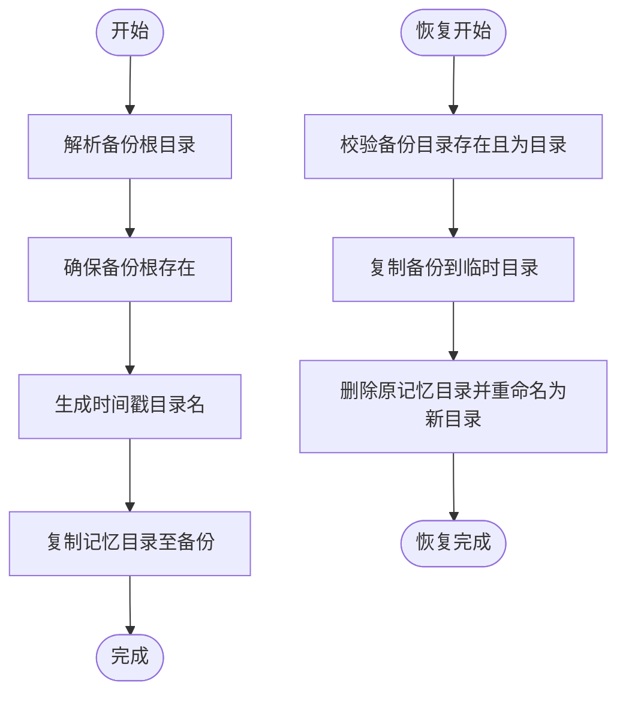
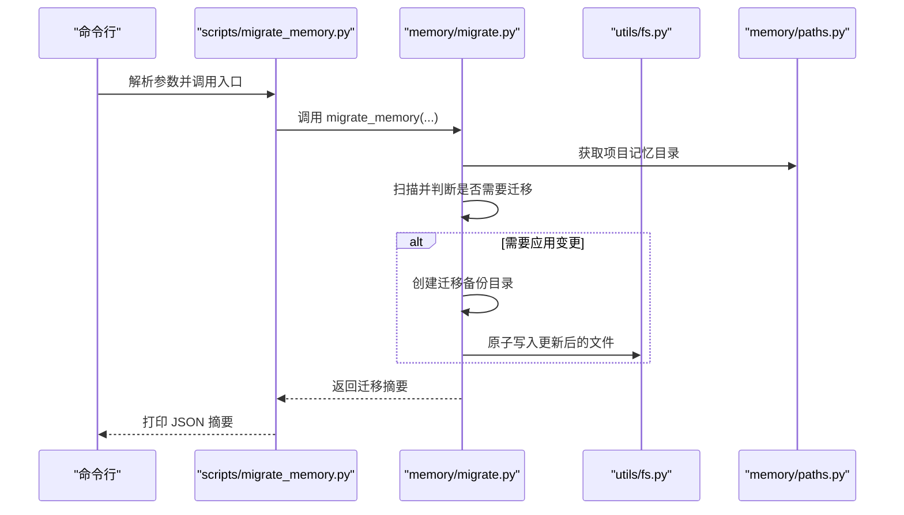
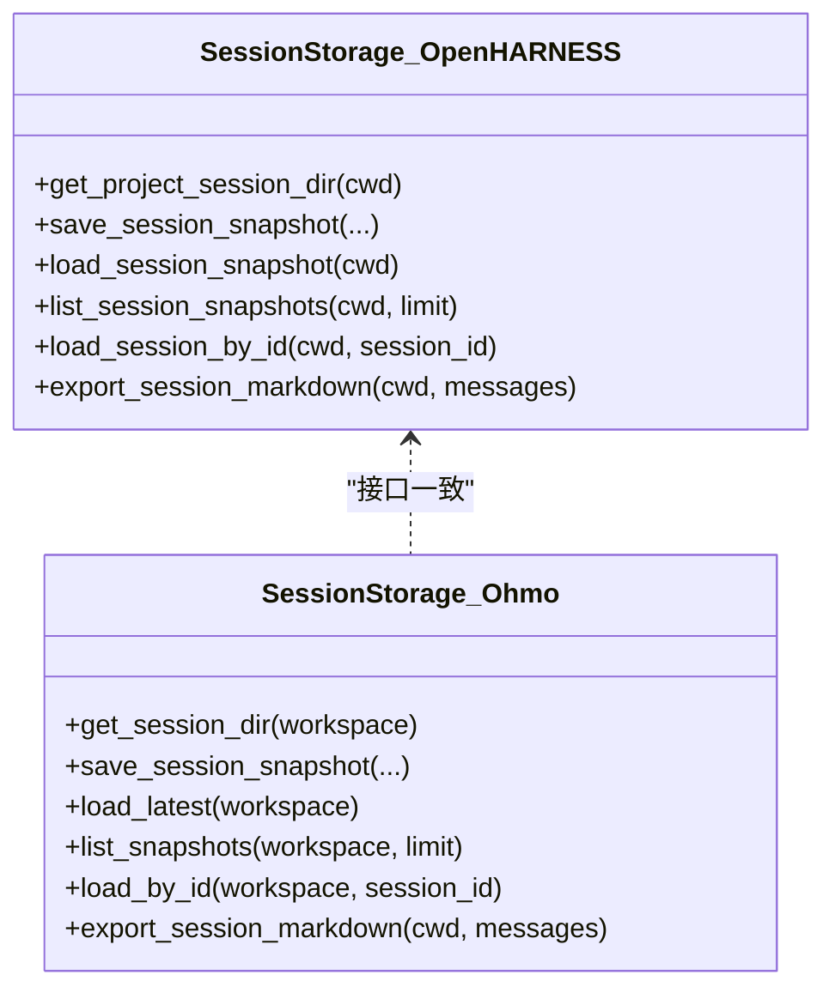
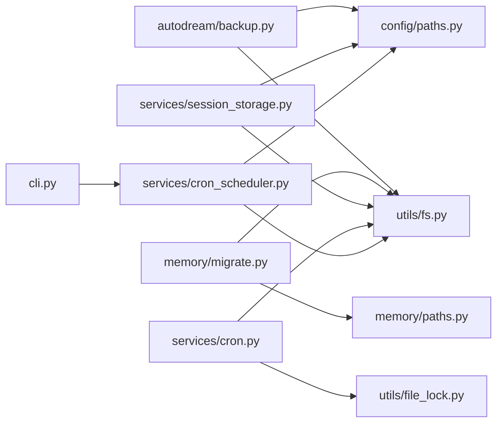

# 备份和恢复

<cite>
**本文引用的文件**
- [backup.py](file://src/openharness/services/autodream/backup.py)
- [migrate.py](file://src/openharness/memory/migrate.py)
- [migrate_memory.py](file://scripts/migrate_memory.py)
- [session_storage.py（ohmo）](file://ohmo/session_storage.py)
- [session_storage.py（openharness）](file://src/openharness/services/session_storage.py)
- [paths.py（config）](file://src/openharness/config/paths.py)
- [paths.py（memory）](file://src/openharness/memory/paths.py)
- [fs.py](file://src/openharness/utils/fs.py)
- [file_lock.py](file://src/openharness/utils/file_lock.py)
- [settings.py](file://src/openharness/config/settings.py)
- [cron.py](file://src/openharness/services/cron.py)
- [cron_scheduler.py](file://src/openharness/services/cron_scheduler.py)
- [cli.py](file://src/openharness/cli.py)
- [schema.py（memory）](file://src/openharness/memory/schema.py)
</cite>

## 目录
1. [简介](#简介)
2. [项目结构与数据位置概览](#项目结构与数据位置概览)
3. [核心组件与职责](#核心组件与职责)
4. [架构总览](#架构总览)
5. [详细组件分析](#详细组件分析)
6. [依赖关系分析](#依赖关系分析)
7. [性能与可靠性考量](#性能与可靠性考量)
8. [故障排查与恢复测试](#故障排查与恢复测试)
9. [结论](#结论)
10. [附录：操作清单与最佳实践](#附录操作清单与最佳实践)

## 简介
本指南面向 OpenHarness 的运维与平台工程团队，系统化阐述会话数据与记忆数据的备份与恢复策略，覆盖自动备份、手动备份、数据迁移与版本升级的备份策略、灾难恢复计划与演练方法、数据完整性验证与恢复测试流程、备份存储的安全性与访问控制、备份自动化脚本与监控工具的使用方法，并总结常见备份场景的处理方案与最佳实践。

## 项目结构与数据位置概览
OpenHarness 将持久化数据按功能域分层存放于用户主目录下的统一数据根目录中，遵循 XDG 类约定，便于集中备份与迁移。关键路径包括：
- 配置与数据根目录：通过环境变量或默认值解析，位于用户主目录下。
- 会话存储：按项目或工作区区分，分别保存最新快照与历史会话文件。
- 记忆存储：按项目生成稳定目录，入口文件为 MEMORY.md。
- 备份根目录：记忆备份默认位于数据根目录下的子路径；ohmo 记忆备份位于其工作区内的 backups 子目录。
- 定时任务注册与历史：以 JSON/JSONL 格式写入数据根目录，支持原子写入与互斥锁保护。

**图表来源**
- [paths.py（config）:37-100](file://src/openharness/config/paths.py#L37-L100)

**章节来源**
- [paths.py（config）:37-100](file://src/openharness/config/paths.py#L37-L100)
- [paths.py（memory）:11-23](file://src/openharness/memory/paths.py#L11-L23)

## 核心组件与职责
- 记忆备份与回滚
  - 提供记忆目录的时间戳备份、差异比较、格式化摘要与最近一次备份定位、从备份恢复等能力。
- 内存迁移与备份
  - 在执行迁移前自动创建备份目录，确保可回滚。
- 会话存储
  - 保存最新会话与按 ID 历史会话，支持导出 Markdown 转录。
- 路径与数据根
  - 统一解析配置、数据、日志、会话、任务、反馈等目录，支持环境变量覆盖。
- 原子写入与互斥锁
  - 所有写入均采用原子替换策略，避免半写文件；对共享配置（如定时任务注册）配合互斥锁保证并发安全。
- 定时任务与监控
  - 注册、调度、执行历史记录与状态查询，便于监控与审计。

**章节来源**
- [backup.py:13-105](file://src/openharness/services/autodream/backup.py#L13-L105)
- [migrate.py:38-138](file://src/openharness/memory/migrate.py#L38-L138)
- [session_storage.py（openharness）:63-231](file://src/openharness/services/session_storage.py#L63-L231)
- [session_storage.py（ohmo）:41-203](file://ohmo/session_storage.py#L41-L203)
- [paths.py（config）:37-100](file://src/openharness/config/paths.py#L37-L100)
- [fs.py:39-99](file://src/openharness/utils/fs.py#L39-L99)
- [file_lock.py:26-80](file://src/openharness/utils/file_lock.py#L26-L80)
- [cron.py:23-137](file://src/openharness/services/cron.py#L23-L137)
- [cron_scheduler.py:54-84](file://src/openharness/services/cron_scheduler.py#L54-L84)

## 架构总览
下图展示备份与恢复在系统中的交互关系，涵盖记忆备份、会话存储、迁移备份、原子写入与互斥锁、定时任务与历史记录等模块。

**图表来源**
- [session_storage.py（openharness）:54-231](file://src/openharness/services/session_storage.py#L54-L231)
- [session_storage.py（ohmo）:24-203](file://ohmo/session_storage.py#L24-L203)
- [paths.py（memory）:11-23](file://src/openharness/memory/paths.py#L11-L23)
- [paths.py（config）:37-100](file://src/openharness/config/paths.py#L37-L100)
- [backup.py:13-105](file://src/openharness/services/autodream/backup.py#L13-L105)
- [migrate.py:38-138](file://src/openharness/memory/migrate.py#L38-L138)
- [migrate_memory.py:1-15](file://scripts/migrate_memory.py#L1-L15)
- [fs.py:39-99](file://src/openharness/utils/fs.py#L39-L99)
- [file_lock.py:26-80](file://src/openharness/utils/file_lock.py#L26-L80)
- [cron.py:23-137](file://src/openharness/services/cron.py#L23-L137)
- [cron_scheduler.py:54-84](file://src/openharness/services/cron_scheduler.py#L54-L84)

## 详细组件分析

### 记忆备份与回滚（autodream）
- 默认备份根目录策略：优先识别 ohmo 工作区内的 backups 目录；否则基于数据根目录与应用标签生成备份路径。
- 创建备份：对目标记忆目录进行时间戳命名的完整复制，忽略特定锁定文件，确保幂等与可重试。
- 差异计算与格式化：对比两个记忆目录的 Markdown 文件集合，输出新增、删除、变更文件列表。
- 最近备份定位：扫描备份根目录，返回最近修改时间的备份。
- 恢复流程：将备份内容复制到临时目录，再原子替换原记忆目录，避免部分覆盖风险。

**图表来源**
- [backup.py:13-105](file://src/openharness/services/autodream/backup.py#L13-L105)

**章节来源**
- [backup.py:13-105](file://src/openharness/services/autodream/backup.py#L13-L105)

### 内存迁移与备份（memory/migrate）
- 迁移流程：扫描项目记忆目录，逐个文件解析并渲染带元数据的 Markdown，若发现需要变更则记录变更集。
- 备份策略：当执行“应用”模式时，先创建迁移备份目录，复制当前所有记忆文件与使用索引，再原子写入更新后的文件。
- 输出摘要：统计扫描数、变更数、未变更数、失败数、备份目录路径、变更文件列表与失败文件列表。

**图表来源**
- [migrate.py:38-138](file://src/openharness/memory/migrate.py#L38-L138)
- [migrate_memory.py:1-15](file://scripts/migrate_memory.py#L1-L15)
- [fs.py:69-99](file://src/openharness/utils/fs.py#L69-L99)
- [paths.py（memory）:11-23](file://src/openharness/memory/paths.py#L11-L23)

**章节来源**
- [migrate.py:38-138](file://src/openharness/memory/migrate.py#L38-L138)
- [migrate_memory.py:1-15](file://scripts/migrate_memory.py#L1-L15)

### 会话存储（openharness 与 ohmo）
- 项目级会话存储：按项目路径哈希生成目录，保存最新快照与按 ID 的历史快照，支持摘要提取与消息计数。
- ohmo 会话存储：提供相同接口，但目录根来自 ohmo 工作区，支持按会话密钥保存“latest-<token>.json”，便于多会话键关联。
- 导出 Markdown：将对话消息导出为结构化 Markdown 文档，便于离线审阅与归档。

**图表来源**
- [session_storage.py（openharness）:54-231](file://src/openharness/services/session_storage.py#L54-L231)
- [session_storage.py（ohmo）:24-203](file://ohmo/session_storage.py#L24-L203)

**章节来源**
- [session_storage.py（openharness）:54-231](file://src/openharness/services/session_storage.py#L54-L231)
- [session_storage.py（ohmo）:24-203](file://ohmo/session_storage.py#L24-L203)

### 路径解析与数据根（config/paths）
- 支持通过环境变量覆盖配置目录、数据目录、日志目录等。
- 会话、任务、反馈、定时任务注册与历史等目录均在此处统一解析与创建。

**章节来源**
- [paths.py（config）:37-100](file://src/openharness/config/paths.py#L37-L100)

### 原子写入与互斥锁（utils/fs 与 utils/file_lock）
- 原子写入：采用临时文件+替换策略，确保崩溃或断电时不会产生截断文件；支持设置文件权限。
- 互斥锁：对共享 JSON 注册表（如定时任务注册）在读改写序列期间加锁，避免竞态。

**章节来源**
- [fs.py:39-99](file://src/openharness/utils/fs.py#L39-L99)
- [file_lock.py:26-80](file://src/openharness/utils/file_lock.py#L26-L80)

### 定时任务与历史（services/cron 与 services/cron_scheduler）
- 注册与管理：加载/保存定时任务，校验表达式与时区，启用/禁用任务，标记执行结果并重新计算下次运行时间。
- 调度与历史：守护进程周期检查到期任务并并发执行，将每次执行记录追加到历史文件，支持状态查询与日志路径查看。

**章节来源**
- [cron.py:23-137](file://src/openharness/services/cron.py#L23-L137)
- [cron_scheduler.py:54-84](file://src/openharness/services/cron_scheduler.py#L54-L84)
- [cli.py:898-934](file://src/openharness/cli.py#L898-L934)

## 依赖关系分析
- 记忆备份依赖路径解析与原子写入，确保备份目录存在与备份文件原子落盘。
- 内存迁移依赖路径解析、原子写入与文件系统操作，保证迁移过程可回滚。
- 会话存储依赖路径解析与原子写入，确保快照与转录文件安全持久。
- 定时任务注册依赖互斥锁与原子写入，保障并发安全与一致性。
- CLI 提供定时任务状态与列表查询，便于运维监控。

**图表来源**
- [backup.py:13-105](file://src/openharness/services/autodream/backup.py#L13-L105)
- [migrate.py:38-138](file://src/openharness/memory/migrate.py#L38-L138)
- [session_storage.py（openharness）:54-231](file://src/openharness/services/session_storage.py#L54-L231)
- [paths.py（config）:37-100](file://src/openharness/config/paths.py#L37-L100)
- [paths.py（memory）:11-23](file://src/openharness/memory/paths.py#L11-L23)
- [fs.py:39-99](file://src/openharness/utils/fs.py#L39-L99)
- [file_lock.py:26-80](file://src/openharness/utils/file_lock.py#L26-L80)
- [cron.py:23-137](file://src/openharness/services/cron.py#L23-L137)
- [cron_scheduler.py:54-84](file://src/openharness/services/cron_scheduler.py#L54-L84)
- [cli.py:898-934](file://src/openharness/cli.py#L898-L934)

**章节来源**
- 同上

## 性能与可靠性考量
- 原子写入与互斥锁：显著降低并发写入与崩溃导致的数据损坏风险，提升可靠性。
- 时间戳命名备份：避免同名覆盖冲突，便于按时间顺序检索与选择恢复点。
- 差异计算：仅关注 Markdown 文件变更，减少不必要的全量备份与恢复成本。
- 会话与记忆目录结构清晰：便于增量备份与快速定位问题文件。

[本节为通用指导，无需具体文件引用]

## 故障排查与恢复测试
- 数据完整性验证
  - 使用差异函数对比备份前后记忆目录，确认变更范围与数量。
  - 对会话快照进行 JSON 解析与消息计数校验，确保无截断与字段缺失。
- 恢复测试流程
  - 选择最近备份或指定备份时间点，执行恢复流程，核对入口文件与子文件完整性。
  - 恢复后重新加载会话与记忆，验证对话上下文与索引可用性。
- 定时任务与历史核查
  - 查看历史文件末尾条目，确认最近一次执行状态与耗时。
  - 通过 CLI 查询状态与作业列表，定位异常作业并重试。

**章节来源**
- [backup.py:51-76](file://src/openharness/services/autodream/backup.py#L51-L76)
- [session_storage.py（openharness）:123-207](file://src/openharness/services/session_storage.py#L123-L207)
- [cron_scheduler.py:67-84](file://src/openharness/services/cron_scheduler.py#L67-L84)
- [cli.py:907-934](file://src/openharness/cli.py#L907-L934)

## 结论
OpenHarness 在备份与恢复方面具备完善的基础设施：原子写入与互斥锁保障数据一致性，记忆备份与迁移备份提供可回滚能力，会话存储与定时任务历史便于审计与恢复。结合本文的操作清单与最佳实践，可在日常运维中实现高可靠、可追溯、可验证的备份与恢复体系。

[本节为总结，无需具体文件引用]

## 附录：操作清单与最佳实践

- 自动备份策略
  - 记忆数据：在关键节点（如 AutoDream 触发前）自动创建时间戳备份，保留多个滚动备份以便回退。
  - 会话数据：定期导出会话 Markdown 转录作为离线归档，同时保留 JSON 快照用于系统内恢复。
  - 定时任务：在执行前记录历史条目，执行后更新下次运行时间，便于监控与回溯。
- 手动备份流程
  - 记忆备份：调用备份函数生成时间戳目录，必要时使用差异函数生成摘要报告。
  - 迁移备份：执行迁移脚本时选择“应用”模式，系统自动创建迁移备份目录。
  - 会话备份：导出 Markdown 转录并复制 JSON 快照目录。
- 数据迁移与版本升级
  - 迁移前务必创建备份；迁移后核对摘要与差异，确认变更符合预期。
  - 对于跨版本升级，建议先在测试环境演练，再在生产环境执行。
- 灾难恢复计划与演练
  - 制定恢复时间目标（RTO）与恢复点目标（RPO），明确恢复步骤与验证标准。
  - 定期进行恢复演练，模拟不同故障场景（磁盘损坏、配置丢失、迁移失败）。
- 数据完整性验证与恢复测试
  - 使用差异函数与文件计数核验备份完整性；恢复后验证会话与记忆可用性。
  - 检查定时任务历史与状态，确保调度器正常运行。
- 备份存储安全性与访问控制
  - 使用原子写入与互斥锁，避免并发破坏；对敏感文件设置最小权限（如 0600）。
  - 对外部存储介质实施访问控制与加密，定期轮换密钥与审计访问日志。
- 备份自动化脚本与监控
  - 编写定时任务，自动触发备份与迁移备份；通过 CLI 查询状态与历史。
  - 结合日志与告警机制，及时发现并处理备份失败与恢复异常。

[本节为通用指导，无需具体文件引用]