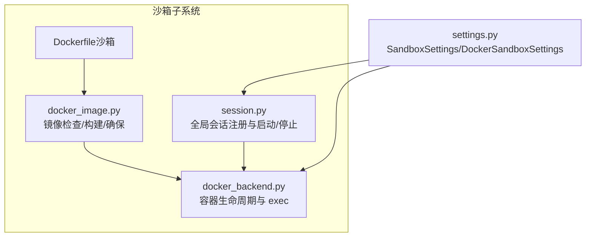
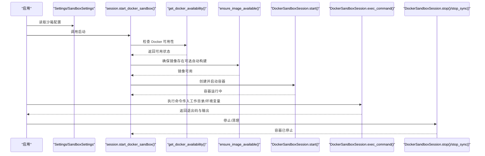
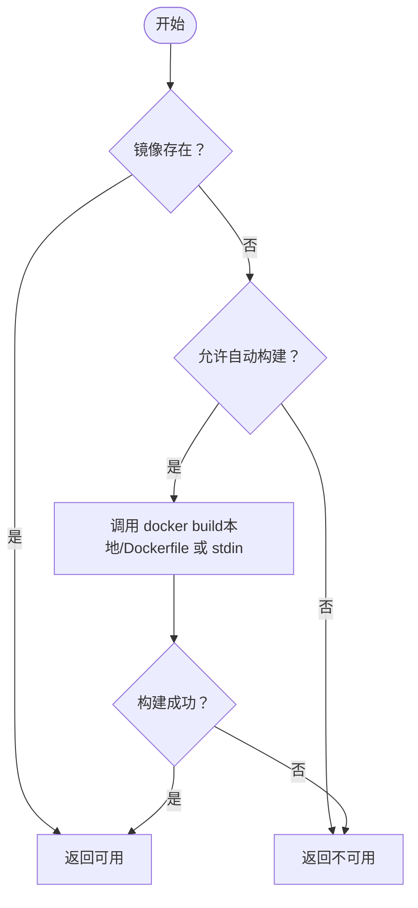
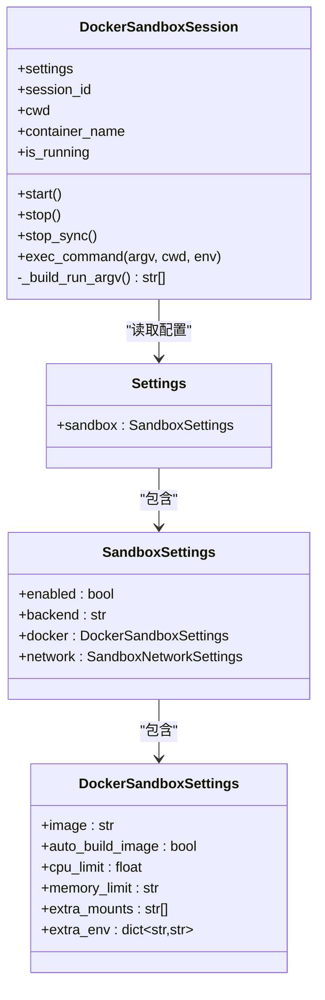
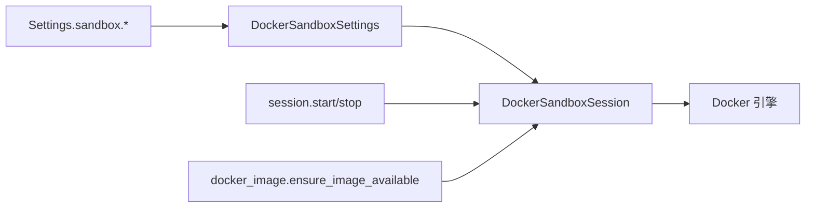

# 容器化和 Docker 部署

<cite>
**本文引用的文件**
- [Dockerfile（沙箱）](file://src/openharness/sandbox/Dockerfile)
- [Docker 镜像与构建工具](file://src/openharness/sandbox/docker_image.py)
- [Docker 后端会话管理](file://src/openharness/sandbox/docker_backend.py)
- [沙箱会话模块（全局注册）](file://src/openharness/sandbox/session.py)
- [设置模型（含沙箱配置）](file://src/openharness/config/settings.py)
- [端到端 Docker 沙箱测试](file://scripts/test_docker_sandbox_e2e.py)
- [网络访问守卫（HTTP 安全）](file://src/openharness/utils/network_guard.py)
- [项目构建与脚本入口（pyproject.toml）](file://pyproject.toml)
</cite>

## 目录
1. [简介](#简介)
2. [项目结构](#项目结构)
3. [核心组件](#核心组件)
4. [架构总览](#架构总览)
5. [详细组件分析](#详细组件分析)
6. [依赖关系分析](#依赖关系分析)
7. [性能考量](#性能考量)
8. [故障排查指南](#故障排查指南)
9. [结论](#结论)
10. [附录：构建、推送与版本管理](#附录构建推送与版本管理)

## 简介
本指南面向在生产或开发环境中使用 OpenHarness 的容器化部署需求，聚焦以下目标：
- 解释沙箱执行环境的 Dockerfile 构建过程与镜像优化策略
- 说明容器运行时的用户权限、文件系统挂载与网络隔离配置
- 提供基于现有实现的 Docker Compose 多容器编排思路
- 总结容器安全最佳实践（非 root 运行、资源限制、网络安全）
- 给出镜像构建、推送与版本管理流程建议
- 提供容器调试与故障排除方法

## 项目结构
OpenHarness 在沙箱子系统中提供了完整的 Docker 支持，核心文件位于 src/openharness/sandbox 下，并通过配置模块进行启用与参数化。

**图表来源**
- [Dockerfile（沙箱）:1-7](file://src/openharness/sandbox/Dockerfile#L1-L7)
- [Docker 镜像与构建工具:1-104](file://src/openharness/sandbox/docker_image.py#L1-L104)
- [Docker 后端会话管理:1-233](file://src/openharness/sandbox/docker_backend.py#L1-L233)
- [沙箱会话模块（全局注册）:1-64](file://src/openharness/sandbox/session.py#L1-L64)
- [设置模型（含沙箱配置）:77-114](file://src/openharness/config/settings.py#L77-L114)

**章节来源**
- [Dockerfile（沙箱）:1-7](file://src/openharness/sandbox/Dockerfile#L1-L7)
- [Docker 镜像与构建工具:1-104](file://src/openharness/sandbox/docker_image.py#L1-L104)
- [Docker 后端会话管理:1-233](file://src/openharness/sandbox/docker_backend.py#L1-L233)
- [沙箱会话模块（全局注册）:1-64](file://src/openharness/sandbox/session.py#L1-L64)
- [设置模型（含沙箱配置）:77-114](file://src/openharness/config/settings.py#L77-L114)

## 核心组件
- Dockerfile（沙箱）：定义基础镜像、安装必要工具、创建非 root 用户并切换。
- docker_image.py：封装镜像存在性检查、默认镜像构建、以及“确保可用”的逻辑。
- docker_backend.py：负责 Docker 可用性检测、容器 run/stop 生命周期、exec 命令执行、资源限制与网络策略。
- session.py：提供全局 Docker 沙箱会话的启动/停止与 atexit 清理。
- settings.py：定义 SandboxSettings 与 DockerSandboxSettings，用于控制镜像名、自动构建、CPU/内存限制、额外挂载与环境变量等。

**章节来源**
- [Dockerfile（沙箱）:1-7](file://src/openharness/sandbox/Dockerfile#L1-L7)
- [Docker 镜像与构建工具:1-104](file://src/openharness/sandbox/docker_image.py#L1-L104)
- [Docker 后端会话管理:1-233](file://src/openharness/sandbox/docker_backend.py#L1-L233)
- [沙箱会话模块（全局注册）:1-64](file://src/openharness/sandbox/session.py#L1-L64)
- [设置模型（含沙箱配置）:93-114](file://src/openharness/config/settings.py#L93-L114)

## 架构总览
下图展示了从应用配置到容器运行、命令执行与清理的整体流程。

**图表来源**
- [设置模型（含沙箱配置）:104-114](file://src/openharness/config/settings.py#L104-L114)
- [沙箱会话模块（全局注册）:29-64](file://src/openharness/sandbox/session.py#L29-L64)
- [Docker 后端会话管理:19-233](file://src/openharness/sandbox/docker_backend.py#L19-L233)
- [Docker 镜像与构建工具:93-104](file://src/openharness/sandbox/docker_image.py#L93-L104)

## 详细组件分析

### Dockerfile 构建与镜像优化
- 基础镜像：使用官方 python:3.11-slim，体积小、安全基线较好。
- 工具安装：仅安装 bash、ripgrep、git，减少镜像层与攻击面；apt 缓存清理避免残留。
- 用户与权限：创建 ohuser 并切换至该用户运行，遵循“非 root 最小权限”原则。
- 优化建议（基于现有实现）：
  - 使用多阶段构建以进一步瘦身（当前实现为单阶段，适合快速迭代）。
  - 固定依赖版本与镜像标签，便于可重复构建与审计。
  - 将常用工具打包为独立只读层，提升缓存命中率。

**章节来源**
- [Dockerfile（沙箱）:1-7](file://src/openharness/sandbox/Dockerfile#L1-L7)

### 镜像管理与构建流程
- 镜像存在性检查：通过 docker image inspect 判断本地是否存在目标镜像。
- 默认镜像构建：优先使用本地 Dockerfile；若不存在则回退到内嵌内容并通过 stdin 构建。
- 自动构建开关：由配置项控制，未找到镜像时可选择抛错或自动构建。
- 测试验证：端到端测试覆盖镜像构建成功、工具可用性与容器生命周期。

**图表来源**
- [Docker 镜像与构建工具:29-104](file://src/openharness/sandbox/docker_image.py#L29-L104)
- [端到端 Docker 沙箱测试:120-138](file://scripts/test_docker_sandbox_e2e.py#L120-L138)

**章节来源**
- [Docker 镜像与构建工具:1-104](file://src/openharness/sandbox/docker_image.py#L1-L104)
- [端到端 Docker 沙箱测试:120-138](file://scripts/test_docker_sandbox_e2e.py#L120-L138)

### 容器生命周期与命令执行
- 容器命名：按会话 ID 生成唯一名称，便于定位与清理。
- 网络策略：默认使用 --network=none，不支持域名级白名单/黑名单（以“失败关闭”策略避免放宽限制）。
- 资源限制：支持 CPU 上限（--cpus）与内存上限（--memory），零值时跳过。
- 文件系统挂载：绑定挂载项目目录到相同路径，并设置工作目录；支持额外挂载列表与环境变量透传。
- 命令执行：通过 docker exec 在容器内执行命令，支持 cwd 与 env 注入。
- 停止策略：优雅停止（带超时），同时提供 atexit 同步停止以防进程异常退出。

**图表来源**
- [Docker 后端会话管理:61-233](file://src/openharness/sandbox/docker_backend.py#L61-L233)
- [设置模型（含沙箱配置）:104-114](file://src/openharness/config/settings.py#L104-L114)

**章节来源**
- [Docker 后端会话管理:82-128](file://src/openharness/sandbox/docker_backend.py#L82-L128)
- [Docker 后端会话管理:130-181](file://src/openharness/sandbox/docker_backend.py#L130-L181)
- [Docker 后端会话管理:198-233](file://src/openharness/sandbox/docker_backend.py#L198-L233)
- [设置模型（含沙箱配置）:93-114](file://src/openharness/config/settings.py#L93-L114)

### 全局会话与清理
- 全局会话注册：启动后保存活动会话，提供查询与状态判断。
- atexit 注册：进程退出时尝试同步停止容器，防止僵尸容器。
- 失败处理：当 Docker 不可用且 fail_if_unavailable 为真时抛错。

**章节来源**
- [沙箱会话模块（全局注册）:19-64](file://src/openharness/sandbox/session.py#L19-L64)

### 网络与安全策略
- 网络隔离：Docker 后端默认禁用出站网络（--network=none），不强制域名级策略。
- HTTP 出站安全：提供网络守卫工具对 HTTP/HTTPS URL 进行语法与地址合法性校验，拒绝非公网地址与重定向链路中的私有地址。
- 端口与代理：支持显式代理与环境变量代理，严格校验代理 URL。

**章节来源**
- [Docker 后端会话管理:98-107](file://src/openharness/sandbox/docker_backend.py#L98-L107)
- [网络访问守卫（HTTP 安全）:25-96](file://src/openharness/utils/network_guard.py#L25-L96)

## 依赖关系分析
- 配置驱动：所有 Docker 行为由 Settings.sandbox 与 Settings.sandbox.docker 控制。
- 运行时耦合：docker_backend 依赖 docker_image 的镜像可用性保障；session 对外暴露统一的启动/停止接口。
- 外部依赖：需要宿主机安装并运行 Docker 引擎，CLI 可用且守护进程可达。

**图表来源**
- [设置模型（含沙箱配置）:104-114](file://src/openharness/config/settings.py#L104-L114)
- [Docker 后端会话管理:132-142](file://src/openharness/sandbox/docker_backend.py#L132-L142)
- [Docker 镜像与构建工具:93-104](file://src/openharness/sandbox/docker_image.py#L93-L104)
- [沙箱会话模块（全局注册）:29-64](file://src/openharness/sandbox/session.py#L29-L64)

**章节来源**
- [设置模型（含沙箱配置）:104-114](file://src/openharness/config/settings.py#L104-L114)
- [Docker 后端会话管理:132-142](file://src/openharness/sandbox/docker_backend.py#L132-L142)
- [Docker 镜像与构建工具:93-104](file://src/openharness/sandbox/docker_image.py#L93-L104)
- [沙箱会话模块（全局注册）:29-64](file://src/openharness/sandbox/session.py#L29-L64)

## 性能考量
- 镜像大小：使用 python:3.11-slim 与最小工具集，有助于缩短拉取与启动时间。
- 层缓存：固定依赖版本与安装顺序，提升构建缓存命中率。
- 资源限制：合理设置 CPU 与内存上限，避免资源争用与 OOM。
- I/O：避免频繁写入宿主机，利用容器内临时空间；必要时使用卷挂载。

## 故障排查指南
- Docker 不可用
  - 症状：启动时报“Docker CLI 未找到/守护进程未运行”。
  - 排查：确认 docker 命令存在、Docker 服务运行、平台支持。
  - 参考
    - [Docker 后端会话管理:19-58](file://src/openharness/sandbox/docker_backend.py#L19-L58)
- 镜像缺失
  - 症状：无法启动，提示镜像不可用且未开启自动构建。
  - 排查：检查镜像名、仓库权限、网络；开启 auto_build_image 或手动构建。
  - 参考
    - [Docker 镜像与构建工具:93-104](file://src/openharness/sandbox/docker_image.py#L93-L104)
- 容器无法启动
  - 症状：docker run 返回错误。
  - 排查：查看日志、确认资源限制是否过严、挂载路径是否存在。
  - 参考
    - [Docker 后端会话管理:130-158](file://src/openharness/sandbox/docker_backend.py#L130-L158)
- 命令执行失败
  - 症状：docker exec 返回非零退出码或无输出。
  - 排查：确认工作目录、环境变量、命令正确性；检查网络策略（默认 none）。
  - 参考
    - [Docker 后端会话管理:198-233](file://src/openharness/sandbox/docker_backend.py#L198-L233)
- 端到端测试失败
  - 症状：镜像/生命周期/文件系统/网络/资源限制测试失败。
  - 排查：参考端到端测试用例，逐项比对期望行为。
  - 参考
    - [端到端 Docker 沙箱测试:120-654](file://scripts/test_docker_sandbox_e2e.py#L120-L654)

**章节来源**
- [Docker 后端会话管理:19-58](file://src/openharness/sandbox/docker_backend.py#L19-L58)
- [Docker 镜像与构建工具:93-104](file://src/openharness/sandbox/docker_image.py#L93-L104)
- [Docker 后端会话管理:130-158](file://src/openharness/sandbox/docker_backend.py#L130-L158)
- [Docker 后端会话管理:198-233](file://src/openharness/sandbox/docker_backend.py#L198-L233)
- [端到端 Docker 沙箱测试:120-654](file://scripts/test_docker_sandbox_e2e.py#L120-L654)

## 结论
OpenHarness 的 Docker 沙箱以“最小权限、严格隔离、可配置资源限制”为核心设计，结合端到端测试验证了镜像、生命周期、文件系统隔离、网络隔离与资源限制的关键能力。生产部署建议配合镜像版本化、资源配额与网络安全策略，形成稳定可靠的容器化运行环境。

## 附录：构建、推送与版本管理
- 构建
  - 使用内置 Dockerfile 或内嵌内容构建镜像，默认标签为最新版。
  - 参考
    - [Docker 镜像与构建工具:44-90](file://src/openharness/sandbox/docker_image.py#L44-L90)
- 推送
  - 建议在 CI 中完成构建与推送，使用固定标签（如语义化版本）与 latest 标签区分。
  - 参考
    - [项目构建与脚本入口（pyproject.toml）:1-86](file://pyproject.toml#L1-L86)
- 版本管理
  - 在 settings 中锁定镜像版本，避免漂移。
  - 参考
    - [设置模型（含沙箱配置）](file://src/openharness/config/settings.py#L96)