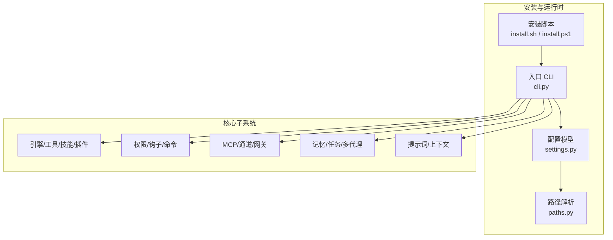
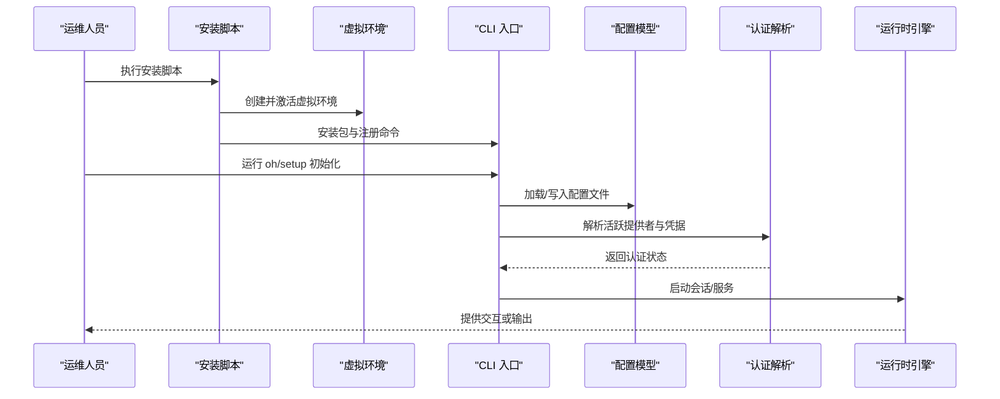
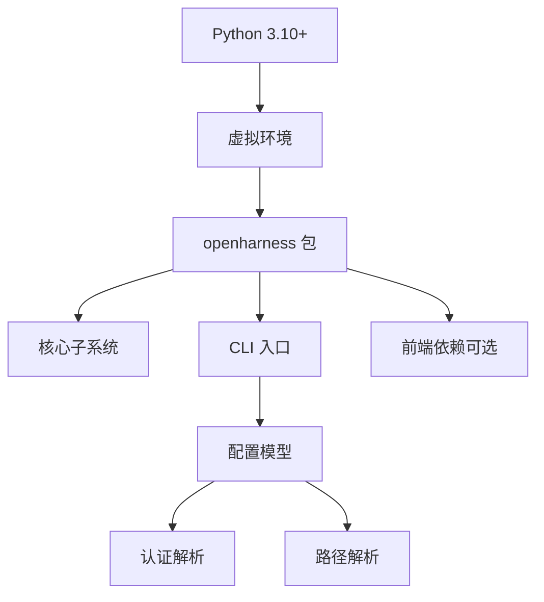

# 生产环境部署

<cite>
**本文档引用的文件**
- [README.md](file://README.md)
- [pyproject.toml](file://pyproject.toml)
- [install.sh](file://scripts/install.sh)
- [install.ps1](file://scripts/install.ps1)
- [settings.py](file://src/openharness/config/settings.py)
- [paths.py](file://src/openharness/config/paths.py)
- [schema.py](file://src/openharness/config/schema.py)
- [cli.py](file://src/openharness/cli.py)
- [RELEASE_NOTES_v0.1.9.md](file://RELEASE_NOTES_v0.1.9.md)
</cite>

## 目录
1. [简介](#简介)
2. [项目结构](#项目结构)
3. [核心组件](#核心组件)
4. [架构总览](#架构总览)
5. [详细组件分析](#详细组件分析)
6. [依赖关系分析](#依赖关系分析)
7. [性能考虑](#性能考虑)
8. [故障排查指南](#故障排查指南)
9. [结论](#结论)
10. [附录](#附录)

## 简介
本指南面向在生产环境中部署 OpenHarness 的工程团队，覆盖系统要求与依赖项配置（Python 版本、操作系统兼容性、硬件建议）、部署前准备（环境变量、网络与安全策略）、完整安装流程（从源码编译到服务启动）、配置优化与性能调优、多场景部署示例（单机、集群、云平台）以及部署验证与健康检查方法。内容基于仓库中的安装脚本、配置模型与 CLI 文档整理而成，确保可操作性与可追溯性。

## 项目结构
OpenHarness 采用模块化分层设计，核心子系统包括引擎、工具集、技能系统、插件生态、权限治理、MCP 协议、记忆与任务管理、多代理协调、提示词构建、配置与路径解析、终端 UI 等。安装脚本与配置模型共同定义了生产部署的关键路径与默认行为。

图示来源
- [install.sh:1-388](file://scripts/install.sh#L1-L388)
- [install.ps1:1-330](file://scripts/install.ps1#L1-L330)
- [cli.py:1-800](file://src/openharness/cli.py#L1-L800)
- [settings.py:1-800](file://src/openharness/config/settings.py#L1-L800)
- [paths.py:1-161](file://src/openharness/config/paths.py#L1-L161)

章节来源
- [README.md:446-502](file://README.md#L446-L502)
- [pyproject.toml:1-86](file://pyproject.toml#L1-L86)

## 核心组件
- 安装与环境准备：自动检测 Python 3.10+、Node.js 18+（可选）、虚拟环境隔离、PATH 注册与前端依赖安装。
- 配置与路径：支持 OPENHARNESS_CONFIG_DIR、OPENHARNESS_DATA_DIR、OPENHARNESS_LOGS_DIR 等环境变量；默认位于用户主目录下的 .openharness。
- 设置模型：集中管理 API 凭据、模型选择、权限模式、内存与沙箱、MCP 服务器、UI 行为等。
- CLI 入口：提供交互式会话、非交互输出、干运行预览、子命令体系（provider、auth、plugin、mcp、cron、autopilot）。

章节来源
- [install.sh:88-128](file://scripts/install.sh#L88-L128)
- [install.ps1:60-96](file://scripts/install.ps1#L60-L96)
- [paths.py:15-68](file://src/openharness/config/paths.py#L15-L68)
- [settings.py:534-580](file://src/openharness/config/settings.py#L534-L580)
- [cli.py:751-780](file://src/openharness/cli.py#L751-L780)

## 架构总览
下图展示生产部署中从安装到运行的核心交互路径，涵盖环境准备、配置加载、认证解析与服务启动。

图示来源
- [install.sh:184-238](file://scripts/install.sh#L184-L238)
- [install.ps1:127-191](file://scripts/install.ps1#L127-L191)
- [cli.py:751-780](file://src/openharness/cli.py#L751-L780)
- [settings.py:691-800](file://src/openharness/config/settings.py#L691-L800)

## 详细组件分析

### 系统要求与依赖项
- Python 版本：要求 Python 3.10 及以上，安装脚本会检测并提示升级路径。
- 操作系统：支持 Linux、macOS、WSL、Windows（原生 PowerShell），安装脚本对各平台进行差异化处理。
- Node.js：用于 React 终端 UI（TUI），建议 18+；若未安装则跳过 TUI 依赖安装。
- 依赖包：通过 pyproject.toml 声明，包括 anthropic、openai、rich、prompt-toolkit、textual、typer、pydantic、httpx、websockets、mcp、pyyaml、questionary、watchfiles、croniter、各类 IM SDK 等。

章节来源
- [pyproject.toml:11](file://pyproject.toml#L11)
- [install.sh:88-128](file://scripts/install.sh#L88-L128)
- [install.sh:150-179](file://scripts/install.sh#L150-L179)
- [install.ps1:60-96](file://scripts/install.ps1#L60-L96)
- [install.ps1:99-122](file://scripts/install.ps1#L99-L122)

### 部署前准备
- 环境变量
  - API 凭据：ANTHROPIC_API_KEY 或 OPENAI_API_KEY（根据提供者自动选择）。
  - API 格式：OPENHARNESS_API_FORMAT 支持 anthropic/openai/copilot。
  - 网络搜索：OPENHARNESS_WEB_SEARCH_URL 指向可信搜索端点；OPENHARNESS_WEB_PROXY 为代理地址（不含凭据）。
  - 配置与数据目录：OPENHARNESS_CONFIG_DIR、OPENHARNESS_DATA_DIR、OPENHARNESS_LOGS_DIR。
  - 前端调试：OPENHARNESS_FRONTEND_RAW_RETURN、OPENHARNESS_FRONTEND_SCRIPT、OPENHARNESS_FRONTEND_CONFIG。
- 网络设置：默认不继承系统 HTTP_PROXY/HTTPS_PROXY，需显式设置 OPENHARNESS_WEB_PROXY。
- 安全配置：权限模式（默认/自动/计划模式）、路径规则、命令黑名单；订阅类提供者使用外部令牌而非明文 API Key。

章节来源
- [README.md:570-584](file://README.md#L570-L584)
- [settings.py:4-8](file://src/openharness/config/settings.py#L4-L8)
- [settings.py:712-728](file://src/openharness/config/settings.py#L712-L728)
- [settings.py:803-804](file://src/openharness/config/settings.py#L803-L804)
- [paths.py:15-68](file://src/openharness/config/paths.py#L15-L68)

### 安装步骤（从源码到服务启动）
- Linux/macOS/WSL
  - 使用一键安装脚本或 pip 安装；脚本自动创建虚拟环境、安装前端依赖、注册命令到 ~/.local/bin 并更新 PATH。
  - 验证安装后执行 oh setup 完成提供者与认证配置。
- Windows（原生）
  - 使用 PowerShell 一键安装脚本；自动创建虚拟环境、安装前端依赖、将脚本路径加入用户 PATH。
  - 首次运行可能需要重启终端以使 PATH 生效。
- 服务启动
  - 交互式：oh 或 openh（Windows）进入会话。
  - 非交互：oh -p "你的提示" 获取一次性输出。
  - 干运行：oh --dry-run 预览配置与路径可行性，避免实际调用模型或工具。

章节来源
- [install.sh:184-313](file://scripts/install.sh#L184-L313)
- [install.ps1:127-305](file://scripts/install.ps1#L127-L305)
- [README.md:197-284](file://README.md#L197-L284)
- [cli.py:396-597](file://src/openharness/cli.py#L396-L597)

### 配置文件优化与性能调优
- 配置文件位置与加载顺序
  - 默认位于 ~/.openharness/settings.json；可通过 OPENHARNESS_CONFIG_DIR 覆盖。
  - 加载优先级：CLI 参数 > 环境变量 > 配置文件 > 默认值。
- 关键优化项
  - 上下文窗口与自动压缩阈值：context_window_tokens、auto_compact_threshold_tokens。
  - 记忆系统：启用/禁用、最大文件数、条目大小限制、自动提取与自动梦境备份。
  - 模型与提供者：通过 provider/profiles/model 精准控制；支持订阅桥接与第三方兼容端点。
  - 权限与安全：mode/default/plan/auto；path_rules/denied_commands；敏感路径保护。
  - UI 行为：主题、输出样式、快速模式、努力级别与迭代轮次。
  - 沙箱与网络：允许/拒绝域名与文件系统路径、Docker 镜像与资源限制。
  - MCP 服务器：传输类型（stdio/http/ws）、URL 校验、错误预检。
- 环境变量映射
  - API Key：ANTHROPIC_API_KEY、OPENAI_API_KEY。
  - API 格式：OPENHARNESS_API_FORMAT。
  - 网络搜索与代理：OPENHARNESS_WEB_SEARCH_URL、OPENHARNESS_WEB_PROXY。
  - 路径与日志：OPENHARNESS_CONFIG_DIR、OPENHARNESS_DATA_DIR、OPENHARNESS_LOGS_DIR。

章节来源
- [paths.py:15-68](file://src/openharness/config/paths.py#L15-L68)
- [settings.py:534-580](file://src/openharness/config/settings.py#L534-L580)
- [settings.py:606-626](file://src/openharness/config/settings.py#L606-L626)
- [settings.py:628-689](file://src/openharness/config/settings.py#L628-L689)
- [settings.py:712-728](file://src/openharness/config/settings.py#L712-L728)
- [settings.py:803-804](file://src/openharness/config/settings.py#L803-L804)
- [README.md:570-584](file://README.md#L570-L584)

### 多场景部署示例

#### 单机部署（推荐入门与小规模）
- 使用一键安装脚本完成环境准备与命令注册。
- 通过 oh setup 选择提供者（如 Anthropic/Claude 或 OpenAI 兼容），配置 API Key。
- 启动 oh 进入交互式会话；或使用 oh -p "提示" 获取非交互输出。
- 如需本地模型，可添加 Ollama 兼容端点并设置 base_url 与模型名。

章节来源
- [install.sh:184-238](file://scripts/install.sh#L184-L238)
- [README.md:376-413](file://README.md#L376-L413)

#### 集群部署（高可用与扩展）
- 建议将配置与数据目录挂载至共享存储（NFS/对象存储），并通过 OPENHARNESS_CONFIG_DIR/OPENHARNESS_DATA_DIR 统一指向。
- 将 ohmo 网关作为独立进程运行，结合 systemd 或容器编排工具实现自启与健康检查。
- 对外暴露网关端口并配置反向代理（Nginx/Traefik），开启 TLS 与访问控制。
- 在各节点上统一安装与配置，确保 Python 与 Node.js 版本一致，并复用相同的 provider 配置文件。

[本节为通用实践建议，不直接分析具体文件，故无“章节来源”]

#### 云平台部署（公有云/私有云）
- AWS/Azure/GCP：在弹性计算实例上按单机部署方式安装，结合 IAM 角色与密钥管理服务（Secrets Manager/Vault）存储 API Key。
- Kubernetes：将 oh 与 ohmo 作为 Deployment 运行，ConfigMap 管理 settings.json，Secret 管理 API Key；持久卷挂载数据目录。
- 容器镜像：可基于官方包构建最小镜像，仅包含 Python 运行时与已安装的包，减少攻击面。
- 网络策略：限制出站访问，仅允许必要的上游 API 端点；必要时通过出口网关或代理统一访问。

[本节为通用实践建议，不直接分析具体文件，故无“章节来源”]

### 部署验证与健康检查
- 干运行预检：oh --dry-run 检查配置解析、认证状态、MCP 配置有效性与入口路径可行性。
- CLI 功能测试：oh --version、oh --help、oh -p "Hello"。
- 认证状态：oh auth status；对于订阅类提供者，确认令牌可用。
- ohmo 网关：ohmo gateway status/restart；检查日志目录与会话历史。
- 性能指标：观察输出格式（text/json/stream-json）与响应时间；必要时调整 effort/passes 与 max_turns。

章节来源
- [cli.py:396-597](file://src/openharness/cli.py#L396-L597)
- [cli.py:745-750](file://src/openharness/cli.py#L745-L750)
- [README.md:268-304](file://README.md#L268-L304)

## 依赖关系分析
OpenHarness 的安装与运行依赖于 Python 与若干关键库，安装脚本负责环境隔离与依赖安装；配置模型决定运行时行为；CLI 提供统一入口与子命令体系。

图示来源
- [pyproject.toml:16-36](file://pyproject.toml#L16-L36)
- [install.sh:184-238](file://scripts/install.sh#L184-L238)
- [install.ps1:127-191](file://scripts/install.ps1#L127-L191)
- [settings.py:534-580](file://src/openharness/config/settings.py#L534-L580)
- [paths.py:15-68](file://src/openharness/config/paths.py#L15-L68)

章节来源
- [pyproject.toml:1-86](file://pyproject.toml#L1-L86)
- [install.sh:184-238](file://scripts/install.sh#L184-L238)
- [install.ps1:127-191](file://scripts/install.ps1#L127-L191)

## 性能考虑
- 模型与上下文
  - 合理设置 context_window_tokens 与 auto_compact_threshold_tokens，避免超长上下文导致延迟上升。
  - 对于长对话或多轮任务，启用自动压缩与会话记忆，平衡成本与效果。
- 工具与并发
  - 工具执行前进行权限校验与钩子事件，避免无效调用；合理规划工具链以减少往返。
- UI 与前端
  - React TUI 在 Node.js 18+ 下体验更佳；在受限环境中可关闭前端依赖以降低资源占用。
- 网络与代理
  - 明确网络出口与代理配置，避免不必要的 DNS 查询与连接超时。
- 沙箱与资源
  - Docker 沙箱可限制 CPU/内存与挂载点，防止资源滥用；仅在需要时启用。

[本节提供通用指导，不直接分析具体文件，故无“章节来源”]

## 故障排查指南
- 安装失败
  - Python 版本过低：根据提示升级至 3.10+。
  - Node.js 缺失：安装 18+ 或忽略 TUI 依赖。
  - PATH 未更新：按安装脚本提示重新加载 shell 或重启终端。
- 认证问题
  - API Key 未设置或环境变量拼写错误：检查 ANTHROPIC_API_KEY/OPENAI_API_KEY。
  - 第三方端点：订阅类提供者仅支持直连 Anthropic/Claude 端点，需改用 API Key 方案。
- 配置问题
  - 干运行报错：使用 oh --dry-run 查看 readiness 等级与 next actions，按提示修复。
  - MCP 配置：检查传输类型与 URL 格式，确保命令存在或 URL 可达。
- 日志与诊断
  - 日志目录：OPENHARNESS_LOGS_DIR；会话与任务输出：OPENHARNESS_DATA_DIR。
  - 使用 --debug 输出更详细信息（如适用）。

章节来源
- [install.sh:88-128](file://scripts/install.sh#L88-L128)
- [install.ps1:60-96](file://scripts/install.ps1#L60-L96)
- [settings.py:691-800](file://src/openharness/config/settings.py#L691-L800)
- [cli.py:333-394](file://src/openharness/cli.py#L333-L394)
- [paths.py:54-68](file://src/openharness/config/paths.py#L54-L68)

## 结论
通过遵循本指南，可在生产环境中稳定部署 OpenHarness。建议优先完成系统要求与依赖项检查，规范配置文件与环境变量，利用干运行预检与健康检查机制保障上线质量。针对不同场景选择合适的部署形态（单机、集群、云平台），并持续优化上下文窗口、工具链与网络策略以获得最佳性能与安全性。

## 附录

### 环境变量速查表
- ANTHROPIC_API_KEY / OPENAI_API_KEY：API 凭据
- OPENHARNESS_API_FORMAT：api_format（anthropic/openai/copilot）
- OPENHARNESS_WEB_SEARCH_URL：Web 搜索端点
- OPENHARNESS_WEB_PROXY：HTTP/HTTPS 代理（不含凭据）
- OPENHARNESS_CONFIG_DIR / OPENHARNESS_DATA_DIR / OPENHARNESS_LOGS_DIR：配置/数据/日志目录
- OPENHARNESS_FRONTEND_*：前端调试相关

章节来源
- [settings.py:4-8](file://src/openharness/config/settings.py#L4-L8)
- [settings.py:712-728](file://src/openharness/config/settings.py#L712-L728)
- [README.md:570-584](file://README.md#L570-L584)
- [paths.py:15-68](file://src/openharness/config/paths.py#L15-L68)