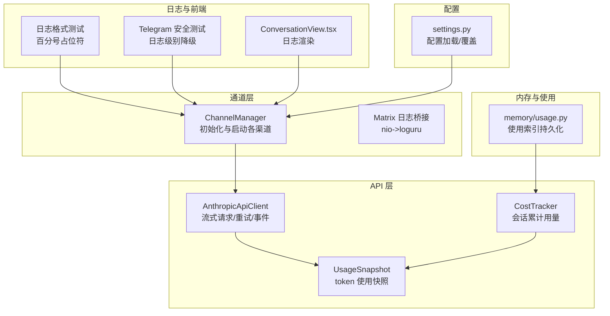
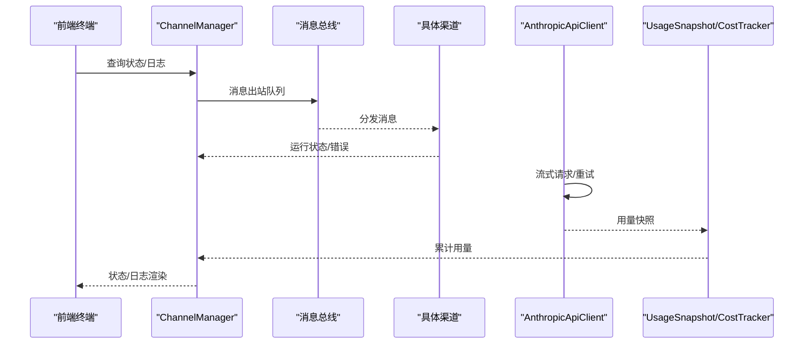
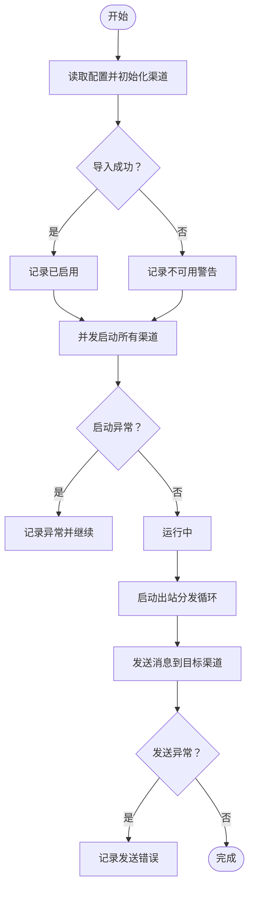
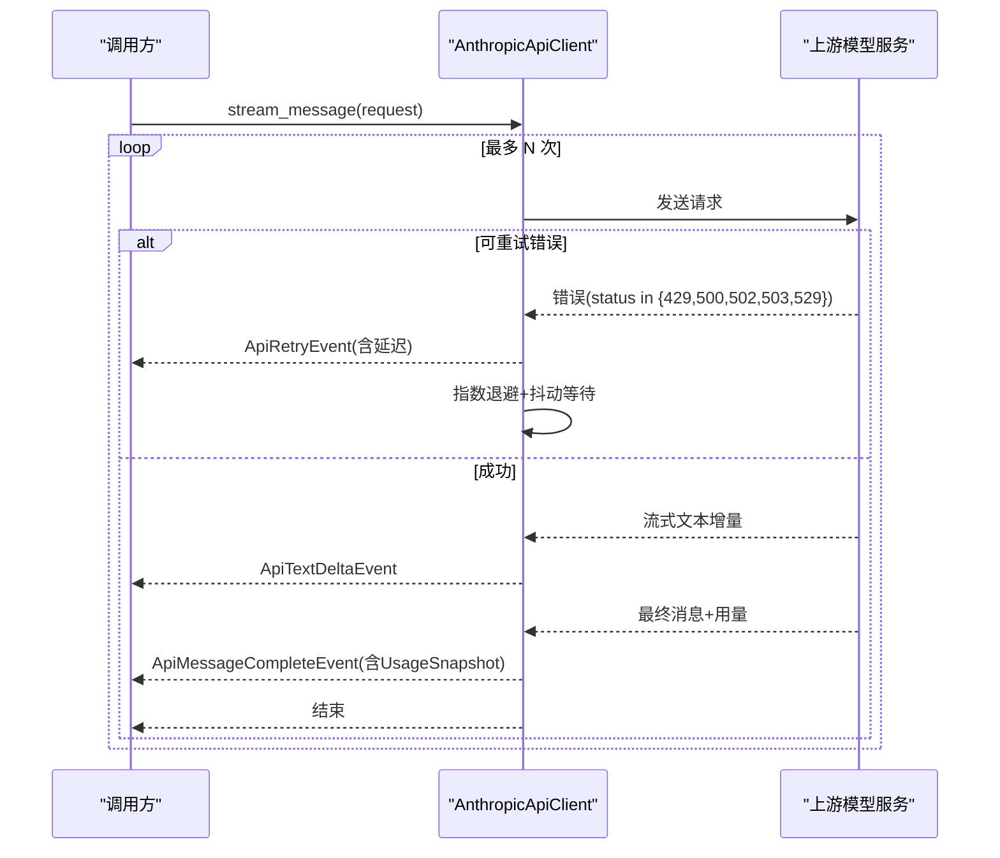
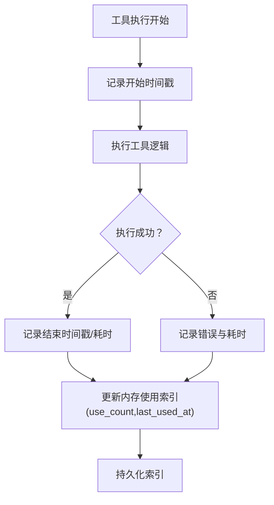
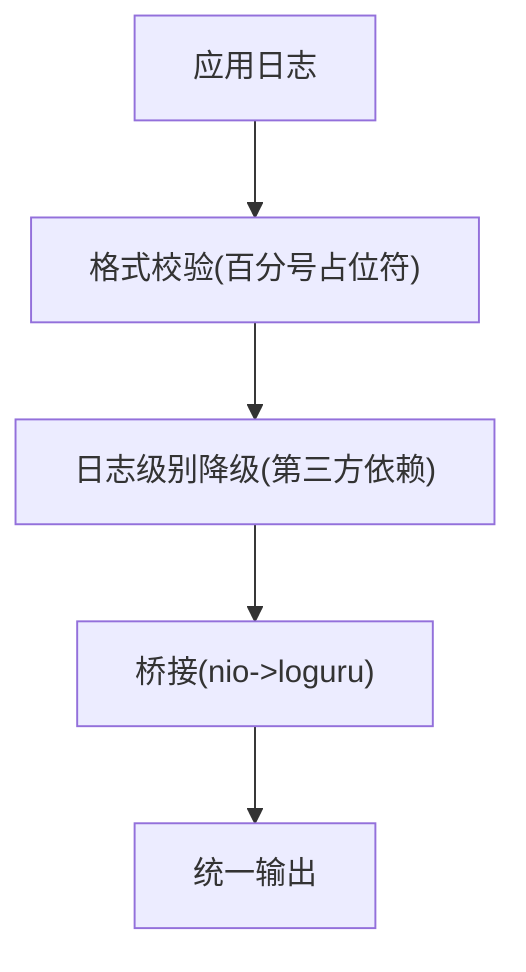
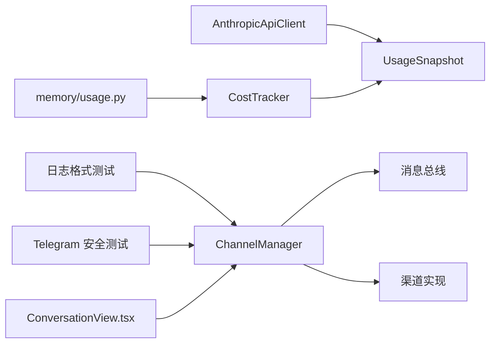

# 监控和日志管理

<cite>
**本文引用的文件**
- [src/openharness/channels/impl/manager.py](file://src/openharness/channels/impl/manager.py)
- [src/openharness/channels/impl/matrix.py](file://src/openharness/channels/impl/matrix.py)
- [src/openharness/api/client.py](file://src/openharness/api/client.py)
- [src/openharness/api/usage.py](file://src/openharness/api/usage.py)
- [src/openharness/engine/cost_tracker.py](file://src/openharness/engine/cost_tracker.py)
- [src/openharness/memory/usage.py](file://src/openharness/memory/usage.py)
- [tests/test_logging/test_format_strings.py](file://tests/test_logging/test_format_strings.py)
- [tests/test_channels/test_telegram_security.py](file://tests/test_channels/test_telegram_security.py)
- [frontend/terminal/src/components/ConversationView.tsx](file://frontend/terminal/src/components/ConversationView.tsx)
- [src/openharness/config/settings.py](file://src/openharness/config/settings.py)
- [autopilot-dashboard/package.json](file://autopilot-dashboard/package.json)
</cite>

## 目录
1. [简介](#简介)
2. [项目结构](#项目结构)
3. [核心组件](#核心组件)
4. [架构总览](#架构总览)
5. [详细组件分析](#详细组件分析)
6. [依赖关系分析](#依赖关系分析)
7. [性能考量](#性能考量)
8. [故障排查指南](#故障排查指南)
9. [结论](#结论)
10. [附录](#附录)

## 简介
本指南面向 OpenHarness 的运维与开发团队，提供一套可落地的监控与日志管理方案。内容覆盖关键性能指标（KPI）采集方法（API 调用统计、内存使用、工具执行时间）、日志系统配置与日志级别管理、日志聚合与分析（ELK Stack 集成思路）、告警机制与通知策略、资源使用监控、错误追踪与性能瓶颈分析，并给出监控仪表板配置示例与常用查询语句。

## 项目结构
OpenHarness 的监控与日志相关能力主要分布在以下模块：
- 通道层：负责消息分发、渠道可用性与运行状态记录
- API 层：封装外部模型服务调用，内置重试与错误翻译
- 计费与用量：记录输入/输出 token 统计
- 内存使用索引：记录记忆条目的使用频次与时间
- 日志测试与安全：确保日志格式规范与敏感信息脱敏
- 前端终端：展示日志与状态信息
- 配置系统：集中化配置加载与环境变量覆盖

**图表来源**
- [src/openharness/channels/impl/manager.py:17-258](file://src/openharness/channels/impl/manager.py#L17-L258)
- [src/openharness/channels/impl/matrix.py:124-141](file://src/openharness/channels/impl/matrix.py#L124-L141)
- [src/openharness/api/client.py:118-268](file://src/openharness/api/client.py#L118-L268)
- [src/openharness/api/usage.py:8-18](file://src/openharness/api/usage.py#L8-L18)
- [src/openharness/engine/cost_tracker.py:8-24](file://src/openharness/engine/cost_tracker.py#L8-L24)
- [src/openharness/memory/usage.py:1-153](file://src/openharness/memory/usage.py#L1-L153)
- [tests/test_logging/test_format_strings.py:1-52](file://tests/test_logging/test_format_strings.py#L1-L52)
- [tests/test_channels/test_telegram_security.py:1-36](file://tests/test_channels/test_telegram_security.py#L1-L36)
- [frontend/terminal/src/components/ConversationView.tsx:155-190](file://frontend/terminal/src/components/ConversationView.tsx#L155-L190)
- [src/openharness/config/settings.py:1-200](file://src/openharness/config/settings.py#L1-L200)

**章节来源**
- [src/openharness/channels/impl/manager.py:17-258](file://src/openharness/channels/impl/manager.py#L17-L258)
- [src/openharness/api/client.py:118-268](file://src/openharness/api/client.py#L118-L268)
- [src/openharness/api/usage.py:8-18](file://src/openharness/api/usage.py#L8-L18)
- [src/openharness/engine/cost_tracker.py:8-24](file://src/openharness/engine/cost_tracker.py#L8-L24)
- [src/openharness/memory/usage.py:1-153](file://src/openharness/memory/usage.py#L1-L153)
- [tests/test_logging/test_format_strings.py:1-52](file://tests/test_logging/test_format_strings.py#L1-L52)
- [tests/test_channels/test_telegram_security.py:1-36](file://tests/test_channels/test_telegram_security.py#L1-L36)
- [frontend/terminal/src/components/ConversationView.tsx:155-190](file://frontend/terminal/src/components/ConversationView.tsx#L155-L190)
- [src/openharness/config/settings.py:1-200](file://src/openharness/config/settings.py#L1-L200)

## 核心组件
- 通道管理器（ChannelManager）
  - 负责按配置启用各聊天渠道，启动/停止与消息分发；在启动失败时记录异常并继续运行其他渠道。
  - 提供状态查询接口，返回每个渠道的启用与运行状态。
- API 客户端（AnthropicApiClient）
  - 封装异步流式请求，内置指数退避与抖动重试；对可重试错误进行自动补偿；将最终消息与用量事件上抛。
- 用量模型与累计器（UsageSnapshot/CostTracker）
  - UsageSnapshot 表征单次调用的输入/输出 token；CostTracker 在会话生命周期内累加用量。
- 内存使用索引（memory/usage.py）
  - 记录记忆条目被召回使用的次数与最近使用时间，支持过期与低价值条目识别。
- 日志与安全（日志格式测试、Telegram 日志级别降级、Matrix 日志桥接）
  - 统一使用标准库 logging 并通过测试约束占位符风格；对第三方依赖日志级别进行降级以避免泄露敏感信息；将矩阵 SDK 日志桥接到统一日志框架。

**章节来源**
- [src/openharness/channels/impl/manager.py:17-258](file://src/openharness/channels/impl/manager.py#L17-L258)
- [src/openharness/api/client.py:118-268](file://src/openharness/api/client.py#L118-L268)
- [src/openharness/api/usage.py:8-18](file://src/openharness/api/usage.py#L8-L18)
- [src/openharness/engine/cost_tracker.py:8-24](file://src/openharness/engine/cost_tracker.py#L8-L24)
- [src/openharness/memory/usage.py:1-153](file://src/openharness/memory/usage.py#L1-L153)
- [tests/test_logging/test_format_strings.py:1-52](file://tests/test_logging/test_format_strings.py#L1-L52)
- [tests/test_channels/test_telegram_security.py:1-36](file://tests/test_channels/test_telegram_security.py#L1-L36)
- [src/openharness/channels/impl/matrix.py:124-141](file://src/openharness/channels/impl/matrix.py#L124-L141)

## 架构总览
下图展示了监控与日志在系统中的交互路径：通道层负责事件与状态上报，API 层产出用量与错误事件，内存层记录使用行为，前端负责可视化呈现，配置系统提供统一参数来源。

**图表来源**
- [src/openharness/channels/impl/manager.py:171-239](file://src/openharness/channels/impl/manager.py#L171-L239)
- [src/openharness/api/client.py:161-258](file://src/openharness/api/client.py#L161-L258)
- [src/openharness/api/usage.py:8-18](file://src/openharness/api/usage.py#L8-L18)
- [src/openharness/engine/cost_tracker.py:14-24](file://src/openharness/engine/cost_tracker.py#L14-L24)
- [frontend/terminal/src/components/ConversationView.tsx:155-190](file://frontend/terminal/src/components/ConversationView.tsx#L155-L190)

## 详细组件分析

### 通道管理与可观测性
- 启停流程
  - 初始化阶段：根据配置尝试导入并实例化各渠道，成功则记录“已启用”，失败则记录“不可用”警告。
  - 启动阶段：并发启动所有渠道，捕获异常并记录失败原因，不影响其他渠道运行。
  - 停止阶段：取消分发任务，逐个停止渠道并记录错误。
- 状态与日志
  - 提供 get_status 返回每个渠道的启用与运行状态。
  - 分发器在启动时打印启动日志，并在超时/异常时进行相应处理。

**图表来源**
- [src/openharness/channels/impl/manager.py:35-187](file://src/openharness/channels/impl/manager.py#L35-L187)
- [src/openharness/channels/impl/manager.py:189-239](file://src/openharness/channels/impl/manager.py#L189-L239)

**章节来源**
- [src/openharness/channels/impl/manager.py:35-187](file://src/openharness/channels/impl/manager.py#L35-L187)
- [src/openharness/channels/impl/manager.py:189-239](file://src/openharness/channels/impl/manager.py#L189-L239)

### API 调用统计与重试
- 重试策略
  - 最大重试次数与指数退避，结合随机抖动；优先读取上游 Retry-After 头部控制延迟上限。
  - 对可重试状态码与网络类异常进行自动补偿，非可重试错误或达到上限后抛出标准化错误。
- 事件流
  - 流式事件包含增量文本与最终完整消息；最终消息携带用量快照。
- 错误翻译
  - 将上游错误映射为统一的认证失败、限流失败、请求失败等类型，便于上层处理。

**图表来源**
- [src/openharness/api/client.py:87-197](file://src/openharness/api/client.py#L87-L197)
- [src/openharness/api/client.py:199-258](file://src/openharness/api/client.py#L199-L258)
- [src/openharness/api/usage.py:8-18](file://src/openharness/api/usage.py#L8-L18)

**章节来源**
- [src/openharness/api/client.py:87-197](file://src/openharness/api/client.py#L87-L197)
- [src/openharness/api/client.py:199-258](file://src/openharness/api/client.py#L199-L258)
- [src/openharness/api/usage.py:8-18](file://src/openharness/api/usage.py#L8-L18)

### 内存使用与工具执行时间
- 内存使用索引
  - 记录每次召回导致的 use_count 增长与 last_used_at 更新；支持扫描过期/低重要性且长时间未使用的记忆条目，辅助自动清理。
- 工具执行时间
  - 建议在工具执行前后打点，结合会话上下文记录开始/结束时间与标签，形成工具执行时间序列。

**图表来源**
- [src/openharness/memory/usage.py:82-104](file://src/openharness/memory/usage.py#L82-L104)
- [src/openharness/memory/usage.py:107-136](file://src/openharness/memory/usage.py#L107-L136)

**章节来源**
- [src/openharness/memory/usage.py:82-104](file://src/openharness/memory/usage.py#L82-L104)
- [src/openharness/memory/usage.py:107-136](file://src/openharness/memory/usage.py#L107-L136)

### 日志系统配置与日志级别管理
- 占位符规范
  - 通过静态检查确保使用 %s 风格占位符，避免 {} 风格导致性能问题与格式错误。
- 第三方依赖日志级别降级
  - 针对 httpx/httpcore/telegram.ext 等依赖，将日志级别提升至 WARNING，减少敏感信息泄露与噪声。
- 矩阵 SDK 日志桥接
  - 将 matrix-nio 标准库日志桥接到统一日志框架，保证日志一致性。

**图表来源**
- [tests/test_logging/test_format_strings.py:42-51](file://tests/test_logging/test_format_strings.py#L42-L51)
- [tests/test_channels/test_telegram_security.py:15-23](file://tests/test_channels/test_telegram_security.py#L15-L23)
- [src/openharness/channels/impl/matrix.py:124-141](file://src/openharness/channels/impl/matrix.py#L124-L141)

**章节来源**
- [tests/test_logging/test_format_strings.py:42-51](file://tests/test_logging/test_format_strings.py#L42-L51)
- [tests/test_channels/test_telegram_security.py:15-23](file://tests/test_channels/test_telegram_security.py#L15-L23)
- [src/openharness/channels/impl/matrix.py:124-141](file://src/openharness/channels/impl/matrix.py#L124-L141)

### 日志聚合与分析（ELK Stack 集成思路）
- 数据源
  - 应用标准输出/文件日志；容器日志；渠道 SDK 日志（经桥接后统一）。
- 索引与字段
  - 关键字段：timestamp、level、logger、channel、status、error_type、retry_attempt、duration_ms、tokens_input/tokens_output、memory_id、session_id。
- 查询示例（概念性）
  - API 错误率：count by error_type where level='ERROR'
  - 重试分布：histogram of retry_attempt
  - 渠道成功率：rate of status='success' per channel
  - Token 消耗趋势：sum(tokens_input)+sum(tokens_output) over time
  - 内存召回热力：top memory_id by use_count
- 可视化
  - 仪表板卡片：错误率、重试率、渠道健康度、用量曲线、内存使用排行。

[本节为通用集成建议，不直接分析具体文件，故无“章节来源”]

### 告警机制与通知策略
- 触发条件（示例）
  - API 错误率短时超过阈值
  - 重试次数占比上升
  - 渠道连续启动失败
  - Token 用量异常激增
  - 内存召回异常停滞
- 通知策略
  - 分级通知：Warn/Alert/Pager Duty
  - 多通道：邮件/IM/Webhook
  - 去抖与静默窗口，避免风暴

[本节为通用实践建议，不直接分析具体文件，故无“章节来源”]

### 监控仪表板配置示例与常用查询
- 仪表板布局
  - 顶部：总览 KPI（错误率、重试率、用量）
  - 中部：渠道健康度与状态
  - 下部：日志流与告警列表
- 常用查询（示例）
  - 错误率：count by level where level='ERROR' and _time>now()-1h
  - 重试率：count where event_type='ApiRetryEvent' and _time>now()-1h
  - 渠道成功率：rate of status='success' by channel
  - 用量趋势：sum(tokens_input)+sum(tokens_output) by _time/10m
  - 内存召回：top memory_id by sum(use_count) over last 7d

[本节为通用实践建议，不直接分析具体文件，故无“章节来源”]

## 依赖关系分析
- 组件耦合
  - ChannelManager 依赖配置与消息总线，向上游渠道暴露统一接口；与 API 客户端解耦，通过事件与用量模型交互。
  - API 客户端与用量模型独立，仅通过事件传递数据，降低耦合。
  - 内存使用索引与用量累计器通过会话上下文关联，形成闭环。
- 外部依赖
  - 第三方渠道 SDK（如 Telegram/Matrix/Slack 等），通过日志桥接与级别降级进行治理。
- 循环依赖
  - 当前结构未见循环依赖迹象。

**图表来源**
- [src/openharness/channels/impl/manager.py:17-258](file://src/openharness/channels/impl/manager.py#L17-L258)
- [src/openharness/api/client.py:118-268](file://src/openharness/api/client.py#L118-L268)
- [src/openharness/api/usage.py:8-18](file://src/openharness/api/usage.py#L8-L18)
- [src/openharness/engine/cost_tracker.py:8-24](file://src/openharness/engine/cost_tracker.py#L8-L24)
- [src/openharness/memory/usage.py:1-153](file://src/openharness/memory/usage.py#L1-L153)
- [tests/test_logging/test_format_strings.py:1-52](file://tests/test_logging/test_format_strings.py#L1-L52)
- [tests/test_channels/test_telegram_security.py:1-36](file://tests/test_channels/test_telegram_security.py#L1-L36)
- [frontend/terminal/src/components/ConversationView.tsx:155-190](file://frontend/terminal/src/components/ConversationView.tsx#L155-L190)

**章节来源**
- [src/openharness/channels/impl/manager.py:17-258](file://src/openharness/channels/impl/manager.py#L17-L258)
- [src/openharness/api/client.py:118-268](file://src/openharness/api/client.py#L118-L268)
- [src/openharness/api/usage.py:8-18](file://src/openharness/api/usage.py#L8-L18)
- [src/openharness/engine/cost_tracker.py:8-24](file://src/openharness/engine/cost_tracker.py#L8-L24)
- [src/openharness/memory/usage.py:1-153](file://src/openharness/memory/usage.py#L1-L153)
- [tests/test_logging/test_format_strings.py:1-52](file://tests/test_logging/test_format_strings.py#L1-L52)
- [tests/test_channels/test_telegram_security.py:1-36](file://tests/test_channels/test_telegram_security.py#L1-L36)
- [frontend/terminal/src/components/ConversationView.tsx:155-190](file://frontend/terminal/src/components/ConversationView.tsx#L155-L190)

## 性能考量
- 日志性能
  - 使用 %s 占位符，避免字符串拼接与格式化开销；必要时采用结构化日志字段。
- API 请求
  - 合理设置最大重试次数与退避上限，避免雪崩效应；利用上游 Retry-After 控制速率。
- 内存与索引
  - 定期清理低价值记忆条目，降低索引规模；对频繁访问的索引进行缓存与批量写入。
- 前端渲染
  - 日志列表按需渲染，避免一次性渲染大量节点；对高频日志进行去重与合并。

[本节提供通用指导，不直接分析具体文件，故无“章节来源”]

## 故障排查指南
- 渠道无法启动
  - 检查配置是否启用、依赖是否安装、网络连通性；查看启动异常日志定位具体渠道。
- API 调用失败
  - 关注重试事件与最终错误类型；核对鉴权头与模型名称；观察上游状态码与 Retry-After。
- 日志泄露或噪声
  - 确认第三方依赖日志级别已降级；检查日志格式测试是否通过。
- 前端日志显示异常
  - 检查日志级别映射与渲染组件逻辑。

**章节来源**
- [src/openharness/channels/impl/manager.py:163-169](file://src/openharness/channels/impl/manager.py#L163-L169)
- [src/openharness/api/client.py:182-197](file://src/openharness/api/client.py#L182-L197)
- [tests/test_channels/test_telegram_security.py:15-23](file://tests/test_channels/test_telegram_security.py#L15-L23)
- [tests/test_logging/test_format_strings.py:42-51](file://tests/test_logging/test_format_strings.py#L42-L51)
- [frontend/terminal/src/components/ConversationView.tsx:155-190](file://frontend/terminal/src/components/ConversationView.tsx#L155-L190)

## 结论
通过在通道层、API 层、内存层与日志层建立统一的观测与治理机制，OpenHarness 可实现对关键性能指标的持续监控与告警。配合 ELK Stack 的日志聚合与仪表板，能够快速定位错误、识别性能瓶颈并优化资源使用。建议在生产环境中启用严格的日志格式规范、第三方依赖日志级别降级与日志桥接，确保可观测性与安全性并重。

## 附录
- 自动驾驶仪表板（Autopilot Dashboard）
  - 前端依赖与构建脚本位于 autopilot-dashboard 目录，可用于构建与预览仪表板页面。
  
**章节来源**
- [autopilot-dashboard/package.json:1-22](file://autopilot-dashboard/package.json#L1-L22)