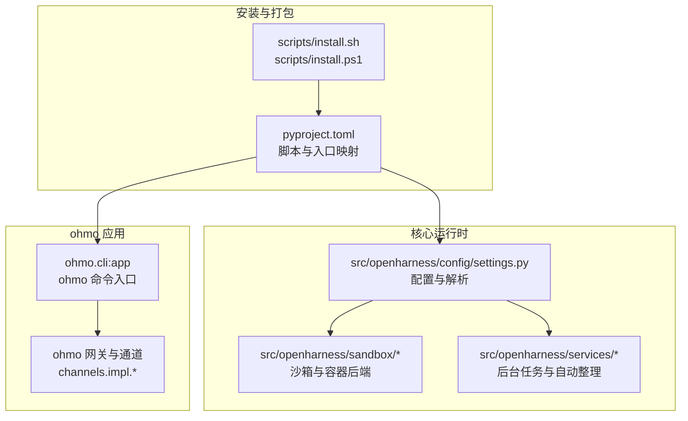
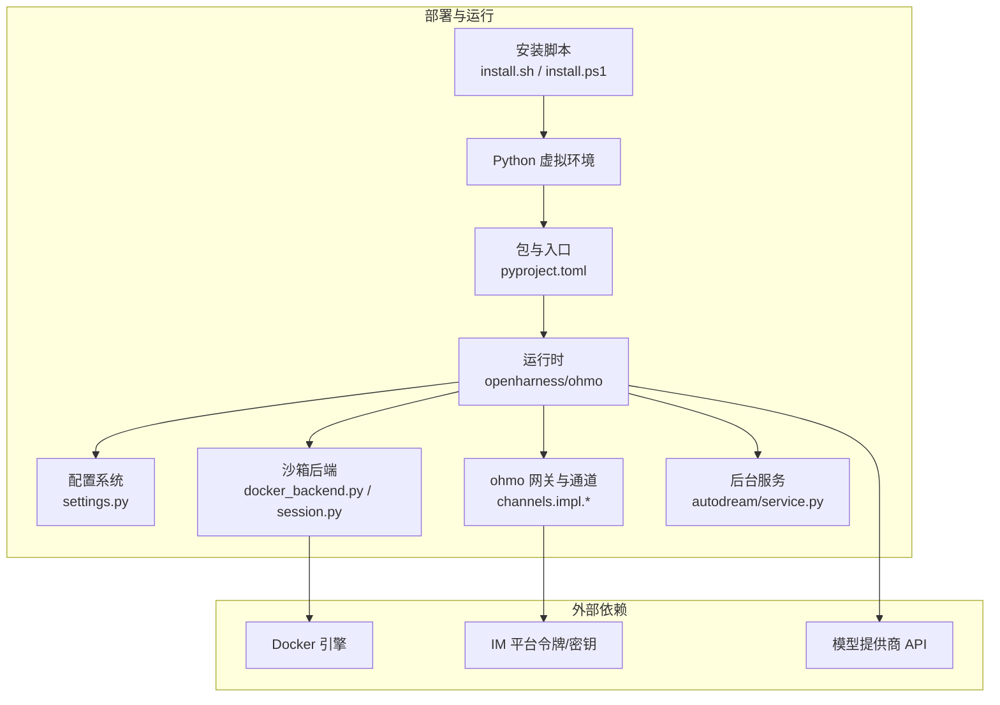
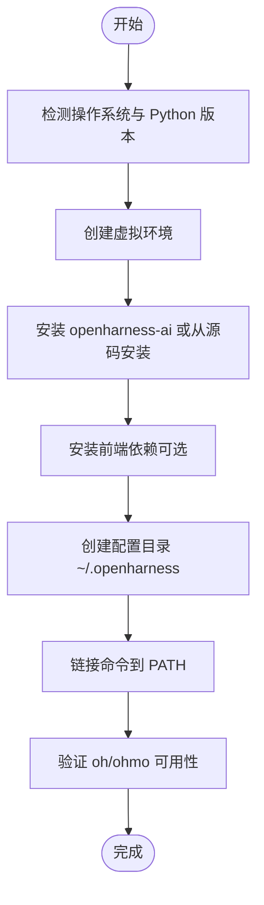
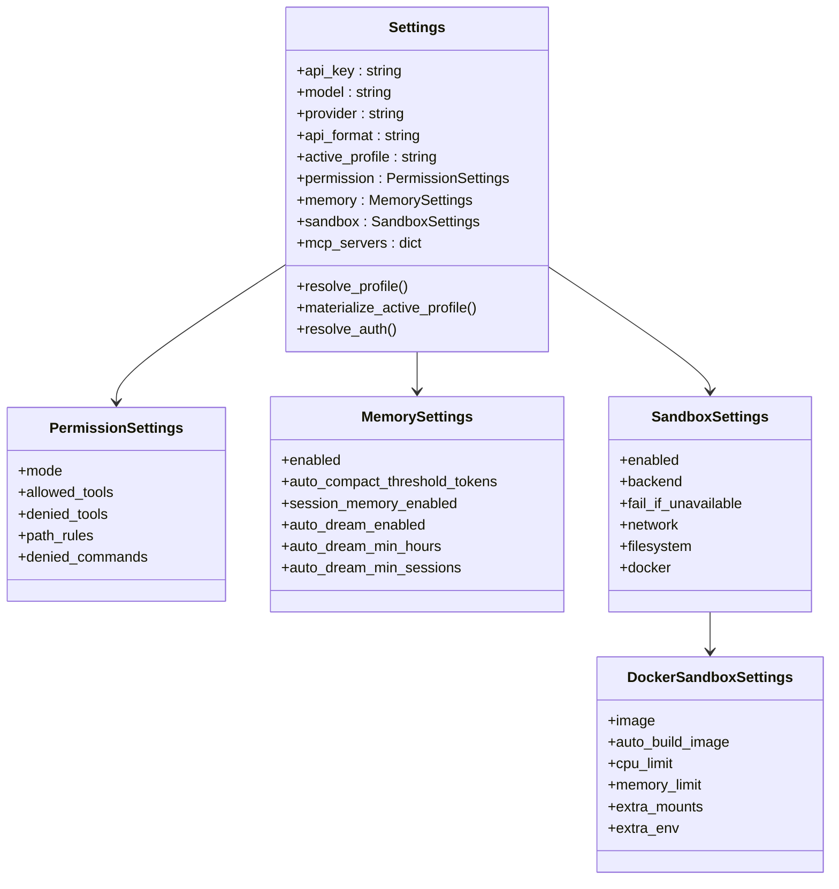
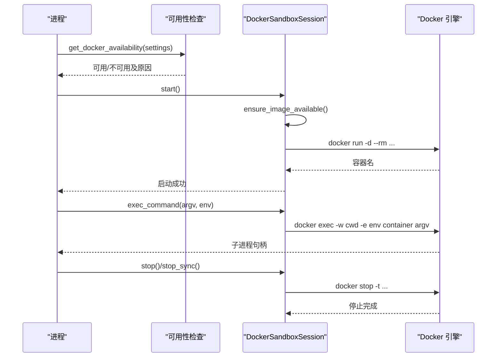
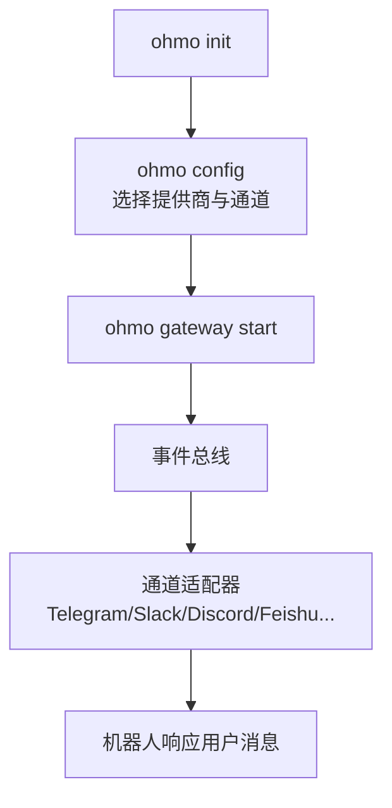
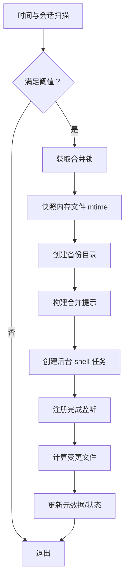
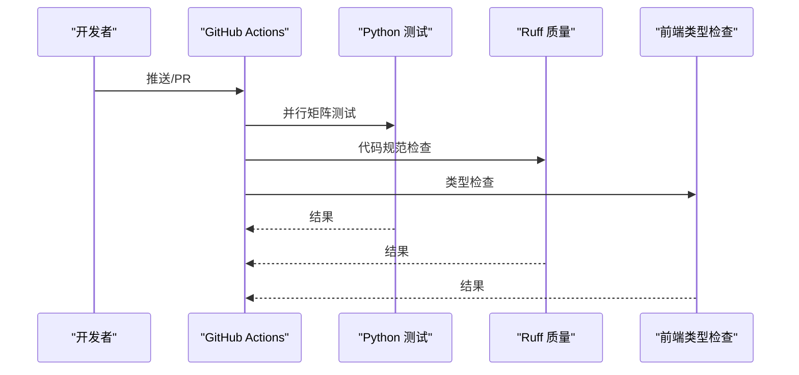
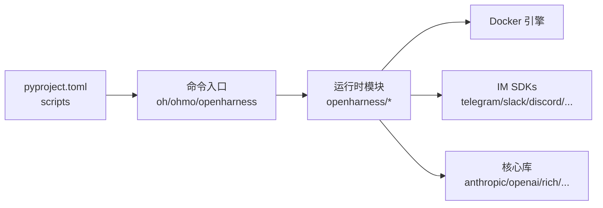

# 部署和运维

<cite>
**本文引用的文件**
- [README.md](file://README.md)
- [pyproject.toml](file://pyproject.toml)
- [scripts/install.sh](file://scripts/install.sh)
- [scripts/install.ps1](file://scripts/install.ps1)
- [src/openharness/config/settings.py](file://src/openharness/config/settings.py)
- [src/openharness/config/schema.py](file://src/openharness/config/schema.py)
- [src/openharness/sandbox/Dockerfile](file://src/openharness/sandbox/Dockerfile)
- [src/openharness/sandbox/docker_backend.py](file://src/openharness/sandbox/docker_backend.py)
- [src/openharness/sandbox/session.py](file://src/openharness/sandbox/session.py)
- [.github/workflows/ci.yml](file://.github/workflows/ci.yml)
- [src/openharness/services/autodream/service.py](file://src/openharness/services/autodream/service.py)
- [src/openharness/memory/migrate.py](file://src/openharness/memory/migrate.py)
</cite>

## 目录
1. [简介](#简介)
2. [项目结构](#项目结构)
3. [核心组件](#核心组件)
4. [架构总览](#架构总览)
5. [详细组件分析](#详细组件分析)
6. [依赖关系分析](#依赖关系分析)
7. [性能考量](#性能考量)
8. [故障排查指南](#故障排查指南)
9. [结论](#结论)
10. [附录](#附录)

## 简介
本指南面向在生产环境中部署与运维 OpenHarness（含 ohmo 个人代理）的工程团队，覆盖安装与升级、容器化沙箱、权限与安全、性能与日志、备份与恢复、灾难恢复、CI/CD 自动化以及运维监控建议。内容基于仓库中的安装脚本、配置模型、沙箱实现与服务模块进行提炼与整合，帮助读者快速建立可重复、可观测、可恢复的生产级运行环境。

## 项目结构
OpenHarness 采用“Python 包 + 可选前端 TUI + 多平台安装脚本”的组织方式；ohmo 作为独立应用与主包打包在一起，通过命令入口区分调用。生产部署通常以系统级 Python 虚拟环境或容器运行，结合 ohmo 的网关通道模块对外提供消息式交互。

图示来源
- [pyproject.toml:48-52](file://pyproject.toml#L48-L52)
- [scripts/install.sh:285-289](file://scripts/install.sh#L285-L289)
- [src/openharness/config/settings.py:534-580](file://src/openharness/config/settings.py#L534-L580)
- [src/openharness/sandbox/docker_backend.py:19-58](file://src/openharness/sandbox/docker_backend.py#L19-L58)
- [src/openharness/services/autodream/service.py:1-30](file://src/openharness/services/autodream/service.py#L1-L30)

章节来源
- [README.md:197-284](file://README.md#L197-L284)
- [pyproject.toml:48-52](file://pyproject.toml#L48-L52)
- [scripts/install.sh:184-238](file://scripts/install.sh#L184-L238)
- [scripts/install.ps1:127-191](file://scripts/install.ps1#L127-L191)

## 核心组件
- 安装与升级：提供一键安装脚本（Linux/macOS/WSL 与 Windows），支持从源码可编辑安装与 pip 安装两种模式，并自动链接命令到用户 PATH。
- 配置系统：集中于 Settings 模型，支持多层优先级（CLI > 环境变量 > 配置文件 > 默认值），包含权限、内存、沙箱、MCP、插件等子系统配置。
- 沙箱与容器：Docker 后端用于隔离工具执行，支持网络禁用、资源限制、挂载与环境注入；提供会话生命周期管理。
- ohmo 个人代理：ohmo 应用与网关，支持多渠道适配器（Telegram、Slack、Discord、Feishu 等），通过配置文件启用与管理。
- 自动整理与备份：AutoDream 服务按阈值触发后台任务，对记忆目录进行合并与备份，支持预览模式与回滚。
- CI/CD：GitHub Actions 执行 Python 测试、质量检查与前端类型检查，便于持续集成与发布。

章节来源
- [scripts/install.sh:184-313](file://scripts/install.sh#L184-L313)
- [scripts/install.ps1:127-305](file://scripts/install.ps1#L127-L305)
- [src/openharness/config/settings.py:534-626](file://src/openharness/config/settings.py#L534-L626)
- [src/openharness/sandbox/docker_backend.py:19-58](file://src/openharness/sandbox/docker_backend.py#L19-L58)
- [src/openharness/services/autodream/service.py:97-245](file://src/openharness/services/autodream/service.py#L97-L245)
- [.github/workflows/ci.yml:9-84](file://.github/workflows/ci.yml#L9-L84)

## 架构总览
下图展示生产部署的关键路径：安装脚本创建虚拟环境并注册命令；运行时读取配置与认证；沙箱后端负责受限执行；ohmo 网关通过通道适配器接入外部 IM 平台；后台服务（如 AutoDream）在满足条件时触发任务。

图示来源
- [scripts/install.sh:184-238](file://scripts/install.sh#L184-L238)
- [pyproject.toml:48-52](file://pyproject.toml#L48-L52)
- [src/openharness/config/settings.py:534-626](file://src/openharness/config/settings.py#L534-L626)
- [src/openharness/sandbox/docker_backend.py:19-58](file://src/openharness/sandbox/docker_backend.py#L19-L58)
- [src/openharness/services/autodream/service.py:248-303](file://src/openharness/services/autodream/service.py#L248-L303)

## 详细组件分析

### 安装与升级（生产环境）
- Linux/macOS/WSL：推荐使用 curl 一键安装脚本，自动创建虚拟环境、安装包、准备前端依赖、创建配置目录并链接命令到 ~/.local/bin。
- Windows：PowerShell 脚本完成相同流程，注意 PATH 更新与终端重启。
- 升级策略：可切换到 --from-source 模式以 editable 方式安装最新代码，或直接 pip 升级包版本。

图示来源
- [scripts/install.sh:69-128](file://scripts/install.sh#L69-L128)
- [scripts/install.sh:184-238](file://scripts/install.sh#L184-L238)
- [scripts/install.sh:251-267](file://scripts/install.sh#L251-L267)
- [scripts/install.sh:272-278](file://scripts/install.sh#L272-L278)
- [scripts/install.sh:285-313](file://scripts/install.sh#L285-L313)
- [scripts/install.ps1:62-96](file://scripts/install.ps1#L62-L96)
- [scripts/install.ps1:127-191](file://scripts/install.ps1#L127-L191)
- [scripts/install.ps1:196-221](file://scripts/install.ps1#L196-L221)
- [scripts/install.ps1:226-236](file://scripts/install.ps1#L226-L236)
- [scripts/install.ps1:243-254](file://scripts/install.ps1#L243-L254)
- [scripts/install.ps1:259-305](file://scripts/install.ps1#L259-L305)

章节来源
- [scripts/install.sh:184-313](file://scripts/install.sh#L184-L313)
- [scripts/install.ps1:127-305](file://scripts/install.ps1#L127-L305)

### 配置系统与认证（生产配置要点）
- 配置优先级：CLI 参数 > 环境变量 > 用户设置文件（~/.openharness/settings.json）> 默认值。
- 关键配置项：
  - 提供商与认证：支持多提供商工作流（Anthropic、OpenAI 兼容、Copilot、Codex、Moonshot、Gemini 等），可通过 profile 管理与切换。
  - 权限与钩子：多级权限模式、路径规则、命令黑名单；支持 PreToolUse/PostToolUse 生命周期钩子。
  - 内存与上下文：持久化记忆、自动压缩阈值、会话记忆开关、自动整理（AutoDream）。
  - 沙箱：启用/禁用、后端选择（srt/docker）、网络与文件系统限制、Docker 镜像与资源限制、额外挂载与环境变量。
  - MCP 服务器：声明式配置与工具发现。
  - UI 与输出风格：主题、输出样式、Effort/Passes 等。
- 认证解析：根据当前活动 profile 解析 API Key 或订阅类令牌，支持第三方 Claude 端点的限制与外部凭据绑定。

图示来源
- [src/openharness/config/settings.py:534-626](file://src/openharness/config/settings.py#L534-L626)
- [src/openharness/config/settings.py:104-114](file://src/openharness/config/settings.py#L104-L114)
- [src/openharness/config/settings.py:93-102](file://src/openharness/config/settings.py#L93-L102)

章节来源
- [src/openharness/config/settings.py:1-800](file://src/openharness/config/settings.py#L1-L800)

### 沙箱执行环境（容器化部署与隔离）
- 后端能力检测：检查是否启用、平台是否支持、Docker CLI 是否存在、守护进程是否运行。
- 容器启动参数：禁用网络、绑定项目目录、工作目录、CPU/内存限制、额外挂载与环境变量、镜像名与自动构建策略。
- 会话管理：全局会话注册、退出清理、同步停止、异步命令执行。
- Dockerfile：基础镜像、常用工具与非特权用户。

图示来源
- [src/openharness/sandbox/docker_backend.py:19-58](file://src/openharness/sandbox/docker_backend.py#L19-L58)
- [src/openharness/sandbox/docker_backend.py:130-159](file://src/openharness/sandbox/docker_backend.py#L130-L159)
- [src/openharness/sandbox/docker_backend.py:198-233](file://src/openharness/sandbox/docker_backend.py#L198-L233)
- [src/openharness/sandbox/session.py:29-56](file://src/openharness/sandbox/session.py#L29-L56)
- [src/openharness/sandbox/Dockerfile:1-7](file://src/openharness/sandbox/Dockerfile#L1-L7)

章节来源
- [src/openharness/sandbox/docker_backend.py:1-233](file://src/openharness/sandbox/docker_backend.py#L1-L233)
- [src/openharness/sandbox/session.py:1-64](file://src/openharness/sandbox/session.py#L1-L64)
- [src/openharness/sandbox/Dockerfile:1-7](file://src/openharness/sandbox/Dockerfile#L1-L7)

### ohmo 个人代理与通道（对外服务）
- ohmo 初始化与配置：初始化工作区、配置提供商与通道、启动网关。
- 通道适配器：支持 Telegram、Slack、Discord、Feishu、Mochat、DingTalk、Email、QQ、WhatsApp、Matrix 等，按需启用并配置鉴权参数。
- 安全默认：启用通道并不自动信任所有发送方，需显式允许特定身份或在开放场景下明确设置通配符。

图示来源
- [README.md:243-251](file://README.md#L243-L251)
- [src/openharness/config/schema.py:18-119](file://src/openharness/config/schema.py#L18-L119)

章节来源
- [README.md:243-251](file://README.md#L243-L251)
- [src/openharness/config/schema.py:18-119](file://src/openharness/config/schema.py#L18-L119)

### 自动整理与备份（AutoDream）
- 触发条件：达到最小小时数与最少会话数阈值；有新的会话或变更信号。
- 运行机制：获取合并锁、快照内存文件时间戳、创建备份、构建合并提示、以 shell 任务形式在后台执行。
- 回滚与监听：任务失败/被杀时回滚合并锁；完成后统计变更文件并记录元数据。
- 预览模式：不实际修改，仅生成提示与差异报告，便于审计。

图示来源
- [src/openharness/services/autodream/service.py:248-303](file://src/openharness/services/autodream/service.py#L248-L303)
- [src/openharness/services/autodream/service.py:97-245](file://src/openharness/services/autodream/service.py#L97-L245)

章节来源
- [src/openharness/services/autodream/service.py:1-314](file://src/openharness/services/autodream/service.py#L1-L314)

### 备份与迁移（生产恢复）
- AutoDream 备份：在执行前创建备份目录，记录新增/变更/删除文件清单，便于回滚与审计。
- 记忆迁移：对历史记忆文件补全元数据，支持 dry-run 预览与 apply 应用，并生成备份目录。

章节来源
- [src/openharness/services/autodream/service.py:144-145](file://src/openharness/services/autodream/service.py#L144-L145)
- [src/openharness/memory/migrate.py:38-93](file://src/openharness/memory/migrate.py#L38-L93)

### CI/CD 流程与自动化
- 测试矩阵：在 Ubuntu 上分别测试 Python 3.10 与 3.11，使用 uv 管理依赖与缓存。
- 质量检查：Ruff 代码规范检查。
- 前端校验：Node.js 20 下对前端项目进行类型检查。
- 建议扩展：可在此基础上增加构建镜像、推送制品、部署到目标环境的作业。

图示来源
- [.github/workflows/ci.yml:9-84](file://.github/workflows/ci.yml#L9-L84)

章节来源
- [.github/workflows/ci.yml:1-84](file://.github/workflows/ci.yml#L1-L84)

## 依赖关系分析
- 入口与命令：pyproject.toml 将 oh/ohmo 映射到各自 CLI 入口，安装脚本确保命令可执行并加入 PATH。
- 运行时依赖：核心库（如 anthropic/openai、rich、textual、typer、pydantic、httpx、websockets、mcp、各 IM SDK）在 pyproject.toml 中声明。
- 沙箱依赖：Docker 引擎由系统提供，运行时通过 docker_backend 检查可用性并启动容器。

图示来源
- [pyproject.toml:48-52](file://pyproject.toml#L48-L52)
- [scripts/install.sh:285-289](file://scripts/install.sh#L285-L289)
- [scripts/install.ps1:243-254](file://scripts/install.ps1#L243-L254)

章节来源
- [pyproject.toml:16-36](file://pyproject.toml#L16-L36)
- [pyproject.toml:48-52](file://pyproject.toml#L48-L52)

## 性能考量
- 沙箱资源限制：通过 Docker 配置 CPU/内存上限，避免单任务占用过多资源；禁用网络降低逃逸风险。
- 记忆与上下文：合理设置自动压缩阈值与会话记忆开关，减少上下文膨胀导致的延迟与成本。
- 并发与重试：工具执行并发化与指数退避重试策略有助于提升吞吐与稳定性。
- 前端体验：React TUI 在 Node.js 18+ 下启用，若无 Node 环境则降级为文本界面，避免阻塞启动。

章节来源
- [src/openharness/sandbox/docker_backend.py:109-114](file://src/openharness/sandbox/docker_backend.py#L109-L114)
- [src/openharness/config/settings.py:60-75](file://src/openharness/config/settings.py#L60-L75)
- [README.md:16-17](file://README.md#L16-L17)

## 故障排查指南
- 安装问题
  - Python 版本过低：脚本会提示安装 3.10+；Windows 使用 winget 或官网安装。
  - Node.js 缺失：React TUI 将被跳过；安装 Node.js 18+ 后重新安装前端依赖。
  - PATH 未更新：脚本会尝试写入 shell 配置；手动添加 ~/.local/bin 到 PATH 并重启终端。
- 运行问题
  - Docker 不可用：检查 docker info 是否可连；确认 Docker Desktop 或 Docker Engine 已安装并运行。
  - 认证失败：确认 ANTHROPIC_API_KEY/OPENAI_API_KEY 或订阅类令牌已正确配置；ohmo 渠道需按适配器要求配置令牌。
  - 权限拒绝：调整权限模式与路径规则；必要时使用交互式批准对话或临时放宽策略。
- AutoDream 失败
  - 任务失败/被杀：自动回滚合并锁；检查备份目录与差异报告定位问题。
  - 阈值不足：适当降低最小小时数或最少会话数，或等待更多会话积累。
- 记忆迁移
  - 使用 --dry-run 预览变更；确认无误后再执行 --apply，并保留备份目录以便回滚。

章节来源
- [scripts/install.sh:88-128](file://scripts/install.sh#L88-L128)
- [scripts/install.sh:150-179](file://scripts/install.sh#L150-L179)
- [scripts/install.ps1:62-96](file://scripts/install.ps1#L62-L96)
- [scripts/install.ps1:100-122](file://scripts/install.ps1#L100-L122)
- [src/openharness/sandbox/docker_backend.py:35-58](file://src/openharness/sandbox/docker_backend.py#L35-L58)
- [src/openharness/services/autodream/service.py:82-84](file://src/openharness/services/autodream/service.py#L82-L84)
- [src/openharness/memory/migrate.py:96-117](file://src/openharness/memory/migrate.py#L96-L117)

## 结论
通过统一的安装脚本、分层配置模型、可插拔的沙箱后端与后台服务，OpenHarness 能够在生产环境中实现安全、可观测与可恢复的长期运行。建议在上线前完成 Docker 能力验证、ohmo 通道配置与权限策略落地，并建立基于 AutoDream 的记忆备份与回滚机制，配合 CI/CD 确保变更可控与可追溯。

## 附录
- 生产部署清单
  - 安装 Python 3.10+ 与 pip；安装 Node.js 18+（可选）。
  - 运行安装脚本，确保命令进入 PATH。
  - 配置提供商与认证（API Key 或订阅令牌）。
  - 启用并配置所需通道（Telegram/Slack/Discord/Feishu 等）。
  - 配置沙箱（Docker 后端、资源限制、挂载）。
  - 启动 ohmo 网关并验证对外连通性。
  - 建立 AutoDream 触发阈值与备份策略。
  - 加入 CI/CD 流水线，覆盖测试、质量检查与前端类型检查。
- 常用运维命令
  - oh setup / oh provider / oh auth / oh mcp / oh plugin
  - ohmo init / ohmo config / ohmo gateway start/status/restart
  - oh --dry-run 预览执行路径与准备状态
  - 记忆迁移：python -m openharness.memory.migrate --dry-run/--apply

章节来源
- [README.md:223-284](file://README.md#L223-L284)
- [src/openharness/memory/migrate.py:96-117](file://src/openharness/memory/migrate.py#L96-L117)