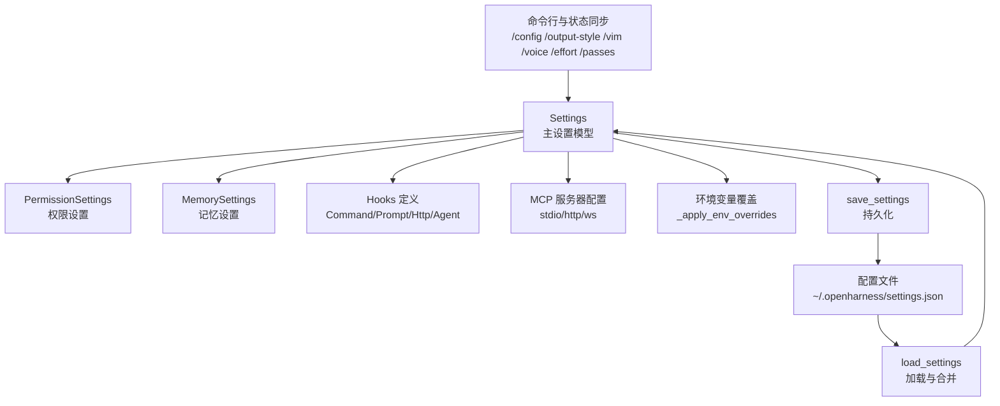
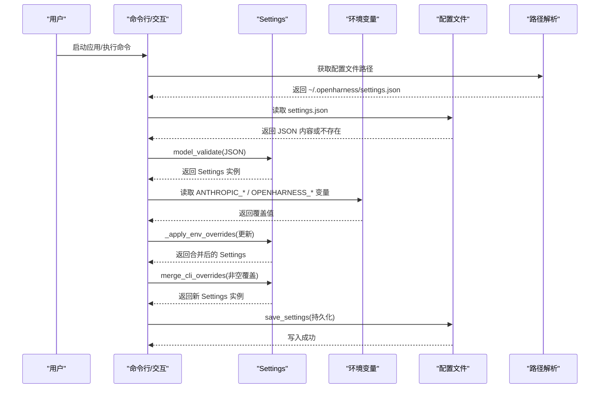
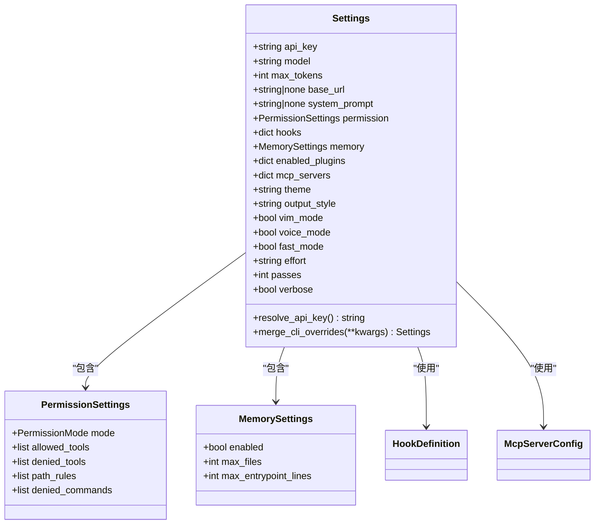
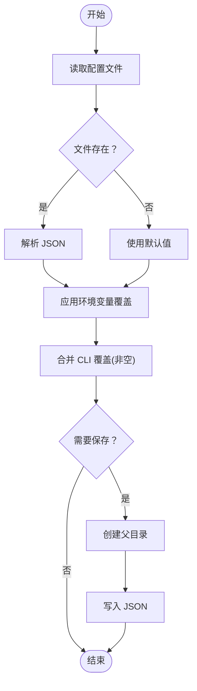
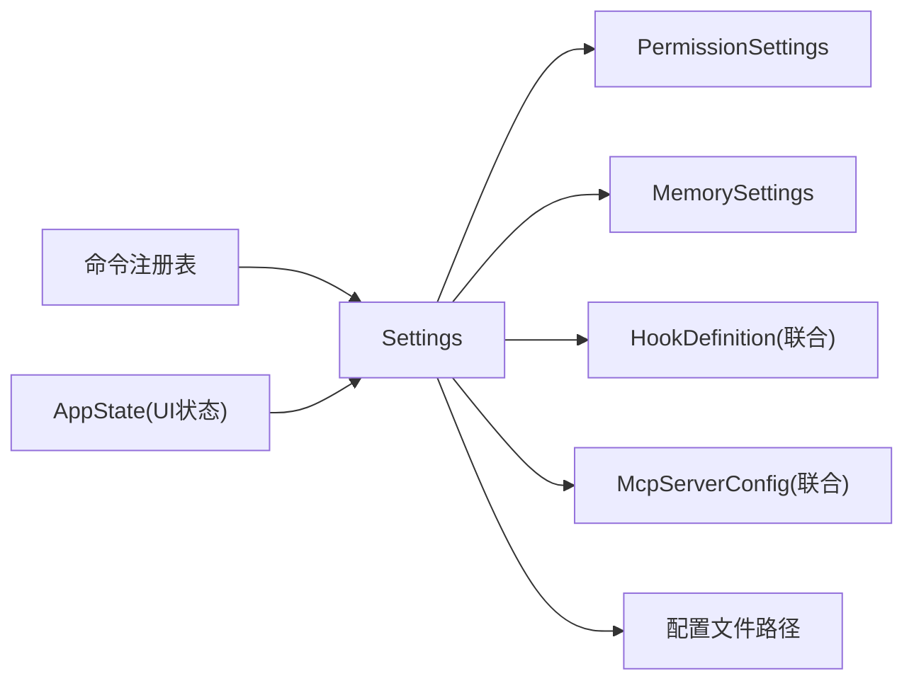

# 设置模型详解

<cite>
**本文引用的文件**
- [settings.py](file://src/openharness/config/settings.py)
- [paths.py](file://src/openharness/config/paths.py)
- [modes.py](file://src/openharness/permissions/modes.py)
- [schemas.py](file://src/openharness/hooks/schemas.py)
- [types.py](file://src/openharness/mcp/types.py)
- [loader.py](file://src/openharness/output_styles/loader.py)
- [app_state.py](file://src/openharness/state/app_state.py)
- [registry.py](file://src/openharness/commands/registry.py)
- [test_settings.py](file://tests/test_config/test_settings.py)
</cite>

## 目录
1. [简介](#简介)
2. [项目结构](#项目结构)
3. [核心组件](#核心组件)
4. [架构总览](#架构总览)
5. [详细组件分析](#详细组件分析)
6. [依赖分析](#依赖分析)
7. [性能考虑](#性能考虑)
8. [故障排查指南](#故障排查指南)
9. [结论](#结论)
10. [附录](#附录)

## 简介
本文件系统性解析 OpenHarness 的设置模型，聚焦 Settings 主模型及其嵌套子模型，涵盖以下方面：
- API 配置：api_key、model、max_tokens、base_url
- 行为设置：system_prompt、permission、hooks、memory、enabled_plugins、mcp_servers
- UI 配置：theme、output_style、vim_mode、voice_mode、fast_mode、effort、passes、verbose
- 数据类型、默认值、取值范围与约束条件
- 嵌套模型结构与相互关系
- 实际应用场景与最佳实践
- 配置加载、合并与持久化流程
- 验证规则与错误处理机制

## 项目结构
设置模型位于配置子系统中，采用 Pydantic 模型进行声明式定义与自动校验；路径解析与持久化由独立模块负责；权限模式、钩子与 MCP 类型在各自子系统中定义并与 Settings 关联。

图表来源
- [settings.py:49-160](file://src/openharness/config/settings.py#L49-L160)
- [paths.py:32-34](file://src/openharness/config/paths.py#L32-L34)
- [registry.py:1033-1086](file://src/openharness/commands/registry.py#L1033-L1086)

章节来源
- [settings.py:1-161](file://src/openharness/config/settings.py#L1-L161)
- [paths.py:1-117](file://src/openharness/config/paths.py#L1-L117)

## 核心组件
本节对 Settings 主模型及其嵌套模型进行逐项说明，包括字段类型、默认值、约束与典型用法。

- API 配置
  - api_key: 字符串，默认空字符串；优先级：实例值 > 环境变量 ANTHROPIC_API_KEY > 文件/默认
  - model: 字符串，默认模型标识；支持通过环境变量 ANTHROPIC_MODEL 或 OPENHARNESS_MODEL 覆盖
  - max_tokens: 整数，默认 16384；可通过环境变量 OPENHARNESS_MAX_TOKENS 覆盖
  - base_url: 字符串或空，默认空；支持通过 ANTHROPIC_BASE_URL 或 OPENHARNESS_BASE_URL 覆盖

- 行为设置
  - system_prompt: 字符串或空；用于注入系统提示词
  - permission: 权限设置对象，默认 mode 为 default，允许工具、拒绝工具、路径规则、拒绝命令等
  - hooks: 事件到钩子列表的映射；支持 command/prompt/http/agent 四类钩子定义
  - memory: 记忆系统开关与容量限制
  - enabled_plugins: 插件启用字典
  - mcp_servers: MCP 服务器配置字典，支持 stdio/http/ws 三类

- UI 配置
  - theme: 字符串，默认 default
  - output_style: 字符串，默认 default；可从自定义目录加载样式
  - vim_mode: 布尔，默认 false
  - voice_mode: 布尔，默认 false
  - fast_mode: 布尔，默认 false
  - effort: 字符串，枚举值 "low"/"medium"/"high"，默认 "medium"
  - passes: 整数，默认 1
  - verbose: 布尔，默认 false

章节来源
- [settings.py:49-74](file://src/openharness/config/settings.py#L49-L74)
- [modes.py:8-14](file://src/openharness/permissions/modes.py#L8-L14)
- [schemas.py:10-58](file://src/openharness/hooks/schemas.py#L10-L58)
- [types.py:11-37](file://src/openharness/mcp/types.py#L11-L37)
- [loader.py:27-41](file://src/openharness/output_styles/loader.py#L27-L41)

## 架构总览
设置模型的加载与应用遵循“文件 > 环境变量 > 默认值”的优先级；CLI 覆盖仅在非空时生效；保存时会创建父目录并写入 JSON。

图表来源
- [settings.py:123-160](file://src/openharness/config/settings.py#L123-L160)
- [paths.py:32-34](file://src/openharness/config/paths.py#L32-L34)

## 详细组件分析

### Settings 主模型
- 字段与默认值
  - API：api_key="", model="claude-sonnet-4-20250514", max_tokens=16384, base_url=None
  - 行为：system_prompt=None, permission=PermissionSettings(), hooks={}, memory=MemorySettings(), enabled_plugins={}, mcp_servers={}
  - UI：theme="default", output_style="default", vim_mode=False, voice_mode=False, fast_mode=False, effort="medium", passes=1, verbose=False
- 加载与覆盖
  - 从文件加载后调用环境变量覆盖函数，再应用 CLI 覆盖
  - 保存时确保父目录存在并以 JSON 序列化写入
- API 密钥解析
  - 优先使用实例值；否则回退到 ANTHROPIC_API_KEY；均失败则抛出异常

图表来源
- [settings.py:49-74](file://src/openharness/config/settings.py#L49-L74)
- [modes.py:8-14](file://src/openharness/permissions/modes.py#L8-L14)
- [schemas.py:53-58](file://src/openharness/hooks/schemas.py#L53-L58)
- [types.py](file://src/openharness/mcp/types.py#L37)

章节来源
- [settings.py:49-160](file://src/openharness/config/settings.py#L49-L160)

### 权限设置 PermissionSettings
- mode: 枚举，支持 default、plan、full_auto
- allowed_tools/denied_tools: 字符串列表，控制工具可用性
- path_rules: PathRuleConfig 列表，基于通配符的路径访问规则
- denied_commands: 字符串列表，禁止执行的命令名

章节来源
- [settings.py:31-39](file://src/openharness/config/settings.py#L31-L39)
- [modes.py:8-14](file://src/openharness/permissions/modes.py#L8-L14)

### 记忆设置 MemorySettings
- enabled: 布尔，是否启用记忆
- max_files: 整数，最大记忆文件数量
- max_entrypoint_lines: 整数，入口文件最大行数

章节来源
- [settings.py:41-47](file://src/openharness/config/settings.py#L41-L47)

### 钩子定义 HookDefinition
- command: 执行 shell 命令，支持超时、匹配器、失败阻断
- prompt: 基于模型的条件验证，支持超时、匹配器、失败阻断
- http: 将事件负载 POST 至 HTTP 端点，支持头与超时
- agent: 更深层的模型验证，支持超时、匹配器、失败阻断
- 共同特性：type 字段标识类型；timeout_seconds 有最小/最大约束

章节来源
- [schemas.py:10-58](file://src/openharness/hooks/schemas.py#L10-L58)

### MCP 服务器配置 McpServerConfig
- stdio: 基于进程通信，支持命令、参数、环境变量、工作目录
- http: 基于 HTTP，支持 URL 与请求头
- ws: 基于 WebSocket，支持 URL 与请求头
- 运行时状态包含连接状态、传输方式、认证配置、工具与资源清单

章节来源
- [types.py:11-37](file://src/openharness/mcp/types.py#L11-L37)
- [types.py:66-76](file://src/openharness/mcp/types.py#L66-L76)

### 输出样式 Output Style
- 支持内置样式 default/minimal
- 用户可扩展：在配置目录下输出样式目录中放置 Markdown 文件，作为自定义样式源
- 加载时优先内置样式，随后扫描用户样式目录

章节来源
- [loader.py:27-41](file://src/openharness/output_styles/loader.py#L27-L41)

### 应用状态 AppState（与 UI 配置对应）
- 与 Settings 中 UI 字段保持一致：theme、output_style、vim_enabled、voice_enabled、fast_mode、effort、passes 等
- 用于运行时状态同步与 UI 渲染

章节来源
- [app_state.py:8-29](file://src/openharness/state/app_state.py#L8-L29)

### 配置加载与持久化流程
- 加载顺序：文件 → 环境变量 → 默认值
- CLI 覆盖：仅当传入非空值时才覆盖
- 保存：确保父目录存在，序列化为 JSON 并写入

图表来源
- [settings.py:123-160](file://src/openharness/config/settings.py#L123-L160)
- [paths.py:32-34](file://src/openharness/config/paths.py#L32-L34)

## 依赖分析
- Settings 对外依赖
  - 权限模式：PermissionMode（枚举）
  - 钩子定义：HookDefinition（联合类型）
  - MCP 配置：McpServerConfig（联合类型）
  - 路径解析：配置文件路径
- 内部耦合
  - PermissionSettings/MemorySettings 作为 Settings 的内嵌对象，降低耦合度
  - Hooks/MCP 通过字典映射与 Settings 解耦，便于扩展
- 外部集成
  - 命令注册表通过 /config、/output-style、/vim、/voice、/effort、/passes 等命令与 Settings 同步

图表来源
- [settings.py:49-74](file://src/openharness/config/settings.py#L49-L74)
- [registry.py:1033-1086](file://src/openharness/commands/registry.py#L1033-L1086)
- [app_state.py:8-29](file://src/openharness/state/app_state.py#L8-L29)

章节来源
- [settings.py:1-161](file://src/openharness/config/settings.py#L1-L161)
- [registry.py:1033-1086](file://src/openharness/commands/registry.py#L1033-L1086)
- [app_state.py:1-30](file://src/openharness/state/app_state.py#L1-L30)

## 性能考虑
- 配置加载为一次性操作，避免频繁 IO；建议在应用启动阶段完成加载
- 环境变量覆盖与 CLI 覆盖均为浅拷贝与字段更新，开销极低
- 输出样式加载仅在初始化时扫描用户样式目录，不参与运行时高频路径
- MCP 与插件配置合并发生在会话建立前，避免重复计算

## 故障排查指南
- API 密钥缺失
  - 现象：resolve_api_key 抛出异常
  - 排查：确认实例值、环境变量 ANTHROPIC_API_KEY 是否设置
  - 参考测试：[test_settings.py:36-40](file://tests/test_config/test_settings.py#L36-L40)
- 配置文件格式错误
  - 现象：JSON 解析失败
  - 排查：检查 settings.json 语法与字段拼写
  - 参考实现：[settings.py:137-139](file://src/openharness/config/settings.py#L137-L139)
- 环境变量覆盖未生效
  - 现象：期望值未被应用
  - 排查：确认环境变量名称与前缀（ANTHROPIC_* / OPENHARNESS_*），以及加载顺序
  - 参考实现：[settings.py:99-120](file://src/openharness/config/settings.py#L99-L120)
- CLI 覆盖无效
  - 现象：传入空值导致未覆盖
  - 排查：merge_cli_overrides 仅接受非空值
  - 参考测试：[test_settings.py:42-54](file://tests/test_config/test_settings.py#L42-L54)
- 输出样式不可用
  - 现象：/output-style 设置后未生效
  - 排查：确认样式名称存在于内置或用户样式目录
  - 参考实现：[loader.py:27-41](file://src/openharness/output_styles/loader.py#L27-L41)
- 努力级别/轮次设置
  - 现象：/effort 与 /passes 参数不合法
  - 排查：/effort 仅允许 low/medium/high；/passes 为正整数
  - 参考实现：[registry.py:766-787](file://src/openharness/commands/registry.py#L766-L787)

章节来源
- [test_settings.py:36-114](file://tests/test_config/test_settings.py#L36-L114)
- [settings.py:76-120](file://src/openharness/config/settings.py#L76-L120)
- [loader.py:27-41](file://src/openharness/output_styles/loader.py#L27-L41)
- [registry.py:766-787](file://src/openharness/commands/registry.py#L766-L787)

## 结论
Settings 模型以清晰的分层设计实现了配置的声明式管理与强类型约束，结合文件、环境变量与 CLI 的多源覆盖策略，满足不同场景下的灵活配置需求。通过嵌套模型与外部集成（钩子、MCP、输出样式），系统在功能扩展与维护性上具备良好弹性。建议在生产环境中优先使用配置文件与环境变量管理敏感信息，并通过命令行工具进行运行时微调。

## 附录

### 字段一览与约束摘要
- API 配置
  - api_key: 字符串；默认 ""；优先级：实例 > ANTHROPIC_API_KEY；缺失时报错
  - model: 字符串；默认模型标识；可由 ANTHROPIC_MODEL/OPENHARNESS_MODEL 覆盖
  - max_tokens: 整数；默认 16384；可由 OPENHARNESS_MAX_TOKENS 覆盖
  - base_url: 字符串或空；默认 None；可由 ANTHROPIC_BASE_URL/OPENHARNESS_BASE_URL 覆盖
- 行为设置
  - system_prompt: 字符串或空；默认 None
  - permission: PermissionSettings；mode 默认 "default"
  - hooks: 字典；键为事件名，值为 HookDefinition 列表
  - memory: MemorySettings；enabled 默认 True
  - enabled_plugins: 字典；键为插件名，值为布尔
  - mcp_servers: 字典；键为服务器名，值为 stdio/http/ws 配置
- UI 配置
  - theme: 字符串；默认 "default"
  - output_style: 字符串；默认 "default"；支持自定义样式
  - vim_mode: 布尔；默认 False
  - voice_mode: 布尔；默认 False
  - fast_mode: 布尔；默认 False
  - effort: 字符串；枚举 "low"/"medium"/"high"；默认 "medium"
  - passes: 整数；默认 1
  - verbose: 布尔；默认 False

### 最佳实践
- 安全性
  - 将 api_key 存放于环境变量或受控配置文件中，避免硬编码
- 可维护性
  - 使用配置文件集中管理非敏感配置；通过环境变量区分开发/生产环境
- 可观测性
  - 开启 verbose 以获取更详细的日志输出；必要时调整 effort 与 passes 提升推理质量
- 可扩展性
  - 使用 hooks 与 mcp_servers 扩展能力；通过 output_styles 自定义输出风格