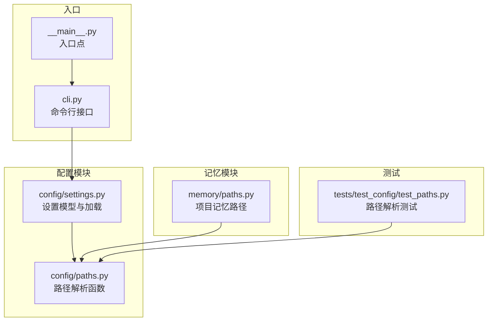
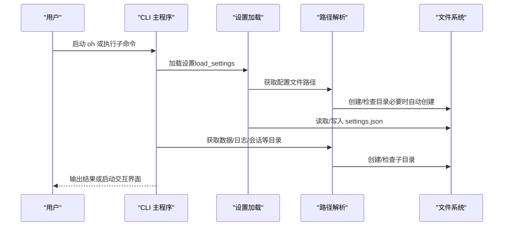
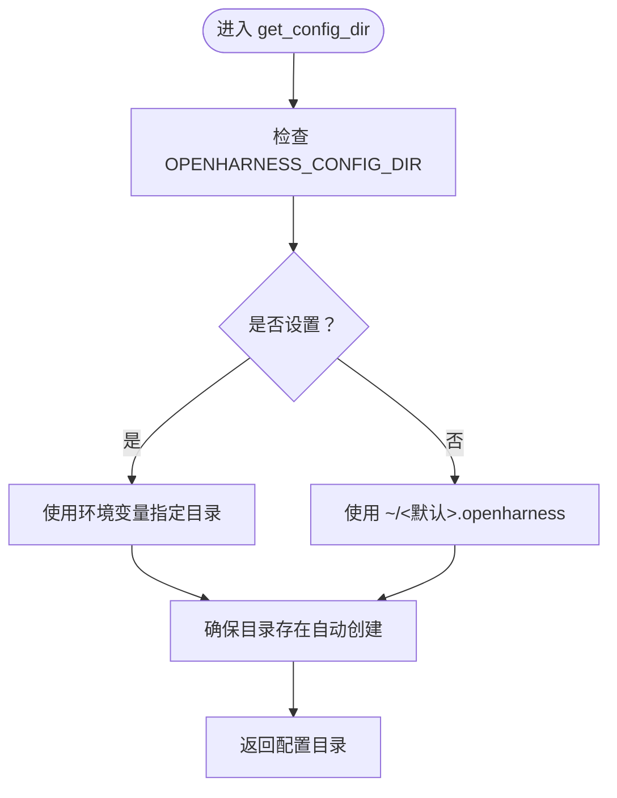
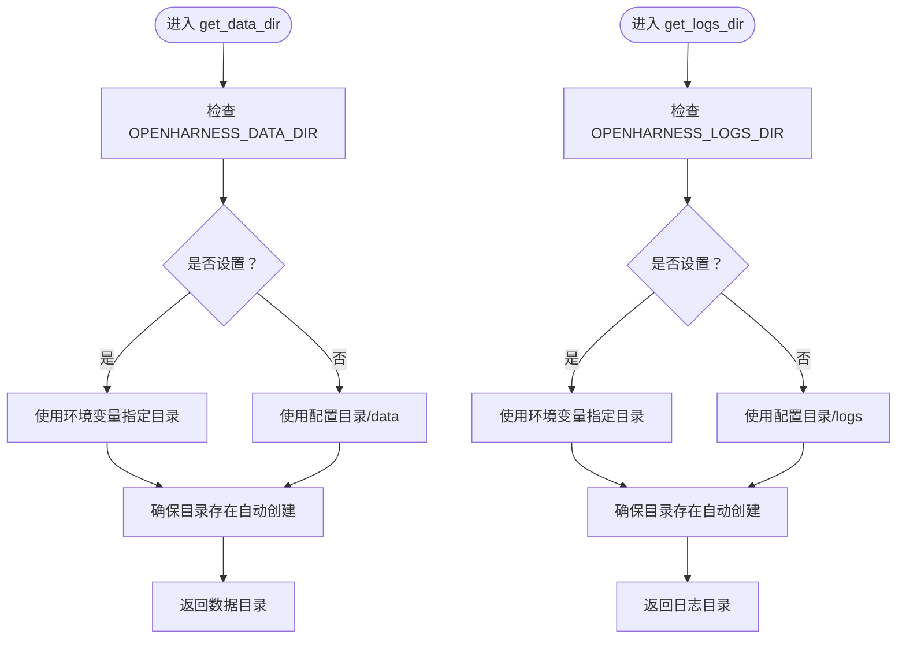
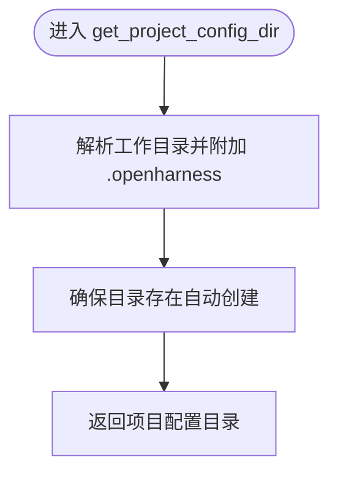
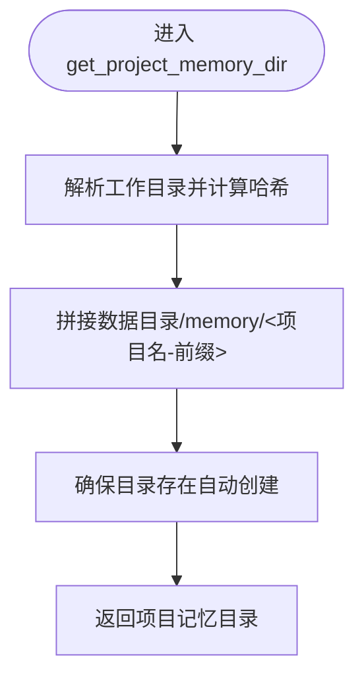
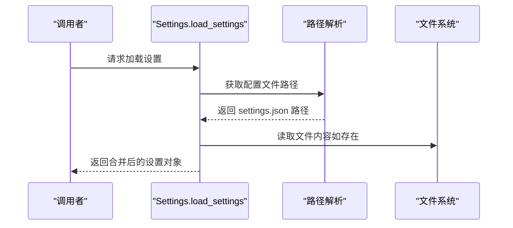
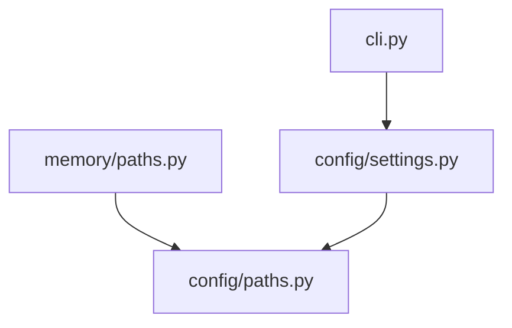

# 路径解析机制

<cite>
**本文档引用的文件**
- [paths.py](file://src/openharness/config/paths.py)
- [settings.py](file://src/openharness/config/settings.py)
- [paths.py](file://src/openharness/memory/paths.py)
- [test_paths.py](file://tests/test_config/test_paths.py)
- [cli.py](file://src/openharness/cli.py)
- [__main__.py](file://src/openharness/__main__.py)
</cite>

## 目录
1. [简介](#简介)
2. [项目结构](#项目结构)
3. [核心组件](#核心组件)
4. [架构总览](#架构总览)
5. [详细组件分析](#详细组件分析)
6. [依赖关系分析](#依赖关系分析)
7. [性能考量](#性能考量)
8. [故障排除指南](#故障排除指南)
9. [结论](#结论)

## 简介
本文件系统性阐述 OpenHarness 的路径解析机制，重点覆盖以下方面：
- 用户目录、配置文件位置、缓存与数据目录的解析规则与优先级
- 关键函数的实现逻辑：get_config_dir、get_config_file_path、get_data_dir、get_logs_dir、get_sessions_dir、get_tasks_dir、get_feedback_dir、get_feedback_log_path、get_cron_registry_path、get_project_config_dir、get_project_issue_file、get_project_pr_comments_file、get_project_memory_dir、get_memory_entrypoint
- 环境变量对路径解析的影响（OPENHARNESS_CONFIG_DIR、OPENHARNESS_DATA_DIR、OPENHARNESS_LOGS_DIR 等）
- 跨平台路径解析差异（Windows、Linux、macOS）在当前实现中的体现
- 路径配置的自定义方法（通过环境变量与配置文件）
- 错误处理与异常情况的处理机制

## 项目结构
OpenHarness 将路径解析集中在配置模块中，核心文件位于：
- 配置路径解析：src/openharness/config/paths.py
- 设置加载与合并：src/openharness/config/settings.py
- 记忆路径解析（基于数据目录）：src/openharness/memory/paths.py
- 路径解析单元测试：tests/test_config/test_paths.py
- CLI 入口与调用链：src/openharness/cli.py、src/openharness/__main__.py

图表来源
- [paths.py:1-117](file://src/openharness/config/paths.py#L1-L117)
- [settings.py:1-161](file://src/openharness/config/settings.py#L1-L161)
- [paths.py:1-23](file://src/openharness/memory/paths.py#L1-L23)
- [test_paths.py:1-70](file://tests/test_config/test_paths.py#L1-L70)
- [cli.py:1-378](file://src/openharness/cli.py#L1-L378)
- [__main__.py:1-7](file://src/openharness/__main__.py#L1-L7)

章节来源
- [paths.py:1-117](file://src/openharness/config/paths.py#L1-L117)
- [settings.py:1-161](file://src/openharness/config/settings.py#L1-L161)
- [paths.py:1-23](file://src/openharness/memory/paths.py#L1-L23)
- [test_paths.py:1-70](file://tests/test_config/test_paths.py#L1-L70)
- [cli.py:1-378](file://src/openharness/cli.py#L1-L378)
- [__main__.py:1-7](file://src/openharness/__main__.py#L1-L7)

## 核心组件
本节概述路径解析的关键函数及其职责：
- get_config_dir：解析并返回配置目录，支持环境变量覆盖
- get_config_file_path：返回主配置文件路径（settings.json）
- get_data_dir：解析并返回数据目录（含缓存、历史等），支持环境变量覆盖
- get_logs_dir：解析并返回日志目录，支持环境变量覆盖
- get_sessions_dir、get_tasks_dir、get_feedback_dir：子目录创建与返回
- get_feedback_log_path、get_cron_registry_path：具体文件路径
- get_project_config_dir、get_project_issue_file、get_project_pr_comments_file：项目级配置目录与上下文文件
- get_project_memory_dir、get_memory_entrypoint：基于数据目录的记忆存储路径

章节来源
- [paths.py:15-117](file://src/openharness/config/paths.py#L15-L117)
- [paths.py:11-23](file://src/openharness/memory/paths.py#L11-L23)

## 架构总览
下图展示路径解析在系统中的位置与调用关系：

图表来源
- [cli.py:39-173](file://src/openharness/cli.py#L39-L173)
- [settings.py:123-161](file://src/openharness/config/settings.py#L123-L161)
- [paths.py:15-117](file://src/openharness/config/paths.py#L15-L117)

## 详细组件分析

### 配置目录与配置文件路径解析
- get_config_dir
  - 解析顺序：OPENHARNESS_CONFIG_DIR 环境变量 > 用户主目录下的 .openharness
  - 行为：若不存在则自动创建
- get_config_file_path
  - 基于配置目录返回 settings.json 文件路径

图表来源
- [paths.py:15-29](file://src/openharness/config/paths.py#L15-L29)

章节来源
- [paths.py:15-34](file://src/openharness/config/paths.py#L15-L34)

### 数据目录与日志目录解析
- get_data_dir
  - 解析顺序：OPENHARNESS_DATA_DIR 环境变量 > 配置目录/data
  - 行为：若不存在则自动创建
- get_logs_dir
  - 解析顺序：OPENHARNESS_LOGS_DIR 环境变量 > 配置目录/logs
  - 行为：若不存在则自动创建
- 子目录
  - get_sessions_dir：数据目录/sessions
  - get_tasks_dir：数据目录/tasks
  - get_feedback_dir：数据目录/feedback
  - get_feedback_log_path：反馈日志文件
  - get_cron_registry_path：定时任务注册表文件

图表来源
- [paths.py:37-68](file://src/openharness/config/paths.py#L37-L68)

章节来源
- [paths.py:37-99](file://src/openharness/config/paths.py#L37-L99)

### 项目级配置与上下文文件
- get_project_config_dir：在工作目录下创建 .openharness 子目录
- get_project_issue_file：项目级 issue 上下文文件
- get_project_pr_comments_file：项目级 PR 评论上下文文件

图表来源
- [paths.py:102-116](file://src/openharness/config/paths.py#L102-L116)

章节来源
- [paths.py:102-116](file://src/openharness/config/paths.py#L102-L116)

### 记忆存储路径解析
- get_project_memory_dir：基于数据目录，结合项目路径哈希生成稳定子目录
- get_memory_entrypoint：项目记忆入口文件

图表来源
- [paths.py:11-23](file://src/openharness/memory/paths.py#L11-L23)

章节来源
- [paths.py:11-23](file://src/openharness/memory/paths.py#L11-L23)

### 设置加载与路径集成
- load_settings：从默认或指定路径加载 settings.json，并应用环境变量覆盖
- save_settings：将设置保存到默认或指定路径

图表来源
- [settings.py:123-161](file://src/openharness/config/settings.py#L123-L161)
- [paths.py:32-34](file://src/openharness/config/paths.py#L32-L34)

章节来源
- [settings.py:123-161](file://src/openharness/config/settings.py#L123-L161)

## 依赖关系分析
- 耦合关系
  - memory/paths.py 依赖 config/paths.py 的 get_data_dir
  - config/settings.py 在加载/保存设置时依赖 config/paths.py 的 get_config_file_path
  - CLI 通过调用设置加载函数间接依赖路径解析
- 内聚性
  - 路径解析集中在 config/paths.py，职责清晰；记忆路径在 memory/paths.py 中复用数据目录
- 外部依赖
  - 使用标准库 os、pathlib 进行环境变量与路径操作
  - 测试通过 monkeypatch 模拟环境变量与 Path.home

图表来源
- [paths.py:1-117](file://src/openharness/config/paths.py#L1-L117)
- [paths.py:1-23](file://src/openharness/memory/paths.py#L1-L23)
- [settings.py:1-161](file://src/openharness/config/settings.py#L1-L161)
- [cli.py:1-378](file://src/openharness/cli.py#L1-L378)

章节来源
- [paths.py:1-117](file://src/openharness/config/paths.py#L1-L117)
- [paths.py:1-23](file://src/openharness/memory/paths.py#L1-L23)
- [settings.py:1-161](file://src/openharness/config/settings.py#L1-L161)
- [cli.py:1-378](file://src/openharness/cli.py#L1-L378)

## 性能考量
- 自动创建目录：所有返回目录的函数均在返回前确保目录存在，避免后续 I/O 异常，但可能带来少量磁盘写入开销
- 路径解析复杂度：均为 O(1)，不随项目规模增长
- 记忆目录哈希：get_project_memory_dir 对项目路径进行哈希，哈希计算成本极低，且仅在首次访问时产生影响

## 故障排除指南
- 环境变量未生效
  - 确认环境变量名称正确：OPENHARNESS_CONFIG_DIR、OPENHARNESS_DATA_DIR、OPENHARNESS_LOGS_DIR
  - 在 Windows 上注意大小写不敏感，但在脚本中仍建议使用一致命名
- 权限不足导致无法创建目录
  - 确保用户主目录或自定义路径具有写权限
  - 可临时切换到可写路径并重试
- 路径解析不符合预期
  - 使用单元测试验证行为：tests/test_config/test_paths.py 提供了针对默认与环境变量覆盖的断言
- 跨平台差异
  - 当前实现统一使用 Path.home() 与 POSIX 风格路径分隔符，Windows 上由 pathlib 正确处理分隔符
  - 若需严格遵循 XDG 目录规范，可在 Linux/macOS 上配合 XDG_CONFIG_HOME/XDG_CACHE_HOME 使用，但当前代码主要依赖 OPENHARNESS_* 环境变量与默认用户目录

章节来源
- [test_paths.py:15-70](file://tests/test_config/test_paths.py#L15-L70)
- [paths.py:15-117](file://src/openharness/config/paths.py#L15-L117)

## 结论
OpenHarness 的路径解析机制以简洁明确的优先级为核心：环境变量优先于默认用户目录，随后自动创建缺失目录。该设计在保证可移植性的同时，提供了灵活的自定义能力。配置文件与数据/日志/记忆等目录的解析逻辑清晰，便于维护与扩展。对于需要严格遵循 XDG 规范的场景，可通过环境变量与默认路径组合满足需求；在 Windows/Linux/macOS 上，pathlib 的跨平台特性确保路径处理的一致性。