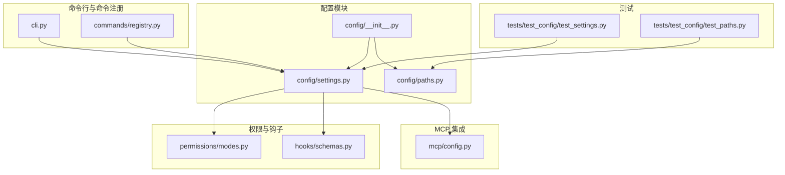
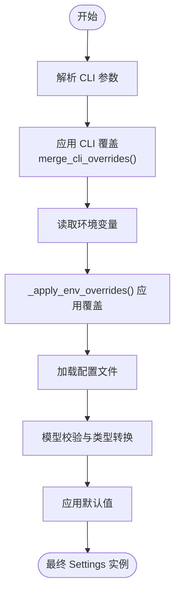
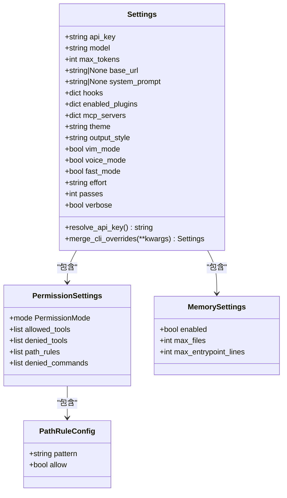
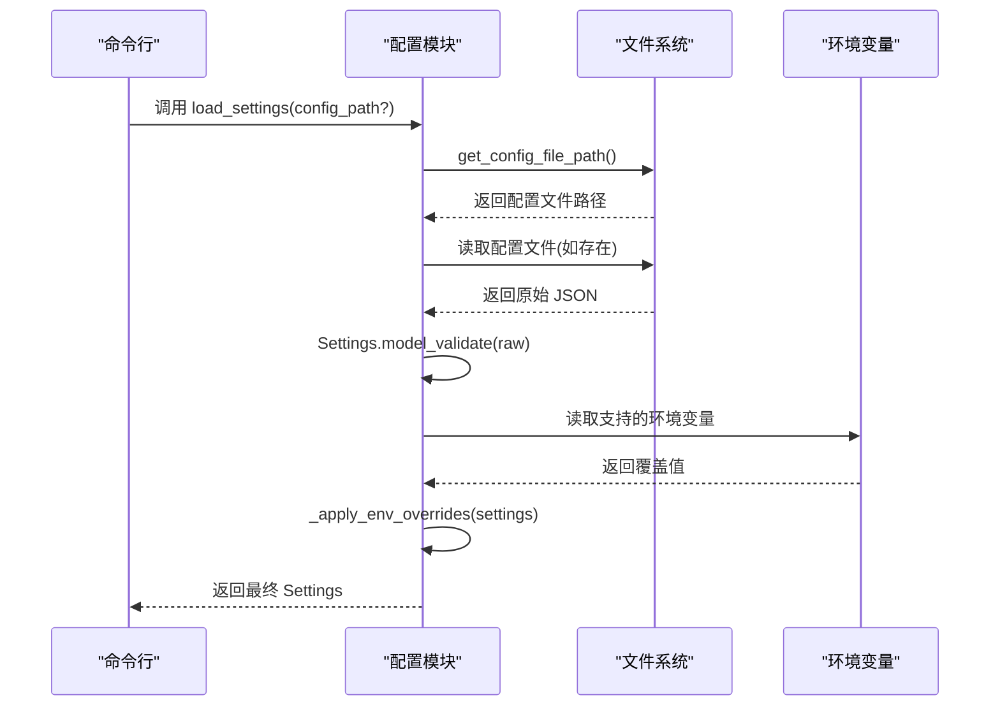
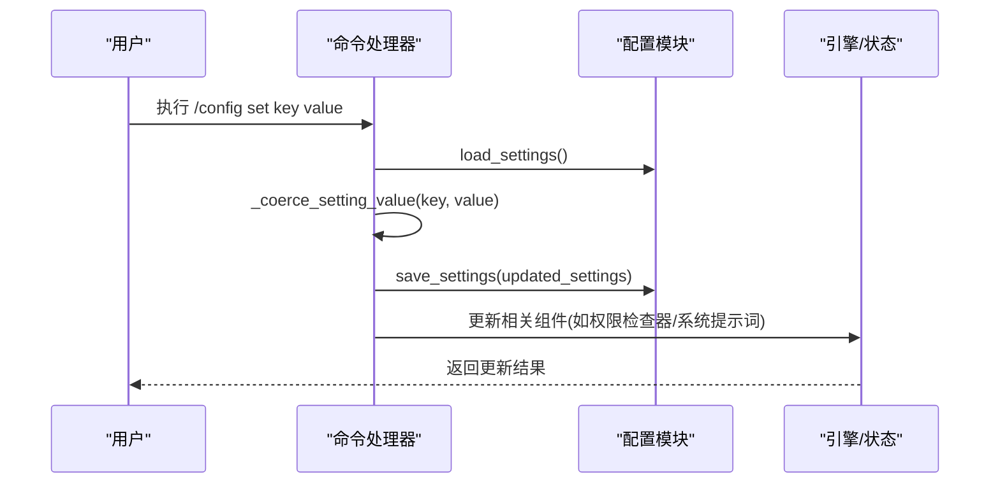
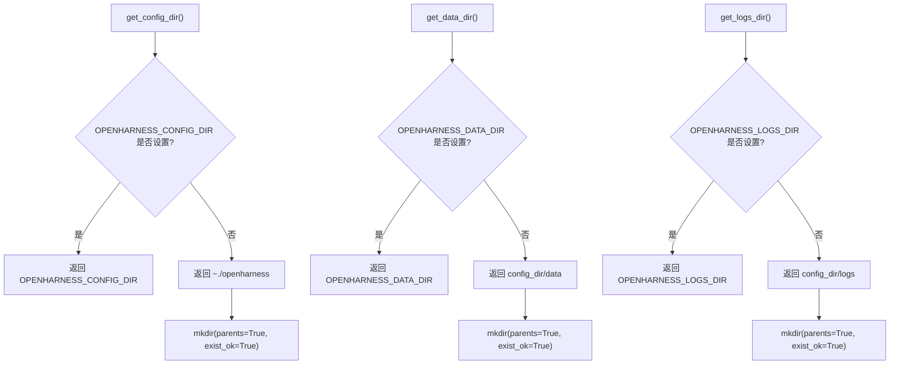
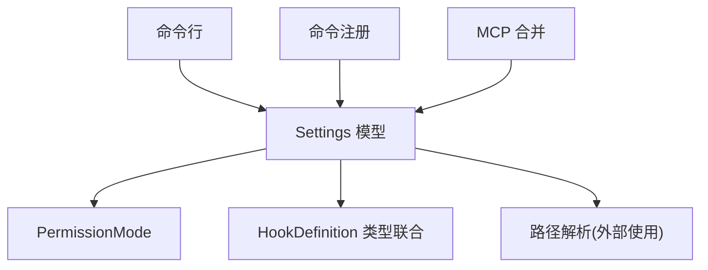

# 配置架构设计

<cite>
**本文引用的文件**
- [settings.py](file://src/openharness/config/settings.py)
- [paths.py](file://src/openharness/config/paths.py)
- [__init__.py](file://src/openharness/config/__init__.py)
- [modes.py](file://src/openharness/permissions/modes.py)
- [schemas.py](file://src/openharness/hooks/schemas.py)
- [config.py](file://src/openharness/mcp/config.py)
- [cli.py](file://src/openharness/cli.py)
- [registry.py](file://src/openharness/commands/registry.py)
- [test_settings.py](file://tests/test_config/test_settings.py)
- [test_paths.py](file://tests/test_config/test_paths.py)
</cite>

## 目录
1. [简介](#简介)
2. [项目结构](#项目结构)
3. [核心组件](#核心组件)
4. [架构总览](#架构总览)
5. [详细组件分析](#详细组件分析)
6. [依赖分析](#依赖分析)
7. [性能考量](#性能考量)
8. [故障排查指南](#故障排查指南)
9. [结论](#结论)
10. [附录：扩展指南](#附录扩展指南)

## 简介
本文件系统化阐述 OpenHarness 的配置架构设计，重点围绕多层配置优先级体系（CLI 参数、环境变量、配置文件、默认值）与分层配置模型（Settings 主模型及其子模型 PermissionSettings、MemorySettings 等）。文档详细解释配置加载与合并算法、类型转换与验证、继承与覆盖规则、配置变更传播机制，并提供扩展新配置项的最佳实践与向后兼容性建议。

## 项目结构
OpenHarness 的配置系统主要位于 src/openharness/config 目录，包含配置模型定义、路径解析与加载保存逻辑；同时在命令行与命令注册表中体现配置的读取与写入行为；测试用例覆盖了路径解析与配置加载的关键场景。

图表来源
- [__init__.py:1-22](file://src/openharness/config/__init__.py#L1-L22)
- [settings.py:1-161](file://src/openharness/config/settings.py#L1-L161)
- [paths.py:1-117](file://src/openharness/config/paths.py#L1-L117)
- [modes.py:1-14](file://src/openharness/permissions/modes.py#L1-L14)
- [schemas.py:1-59](file://src/openharness/hooks/schemas.py#L1-L59)
- [config.py:1-16](file://src/openharness/mcp/config.py#L1-L16)
- [cli.py:1-378](file://src/openharness/cli.py#L1-L378)
- [registry.py:680-879](file://src/openharness/commands/registry.py#L680-L879)
- [test_settings.py:1-114](file://tests/test_config/test_settings.py#L1-L114)
- [test_paths.py:1-70](file://tests/test_config/test_paths.py#L1-L70)

章节来源
- [__init__.py:1-22](file://src/openharness/config/__init__.py#L1-L22)
- [settings.py:1-161](file://src/openharness/config/settings.py#L1-L161)
- [paths.py:1-117](file://src/openharness/config/paths.py#L1-L117)

## 核心组件
- Settings 主模型：集中定义所有可配置项，包含 API 配置、行为控制、UI 设置、子模型字段等。
- PermissionSettings 子模型：封装权限模式、工具白黑名单、路径规则与命令限制。
- MemorySettings 子模型：封装内存系统开关与容量参数。
- 路径解析模块：提供配置目录、数据目录、日志目录与项目上下文目录的解析逻辑。
- 加载与保存函数：从文件加载、应用环境变量覆盖、持久化到文件。
- 命令行与命令注册：暴露配置读取、修改、保存的 CLI 与交互式命令入口。

章节来源
- [settings.py:24-75](file://src/openharness/config/settings.py#L24-L75)
- [paths.py:15-117](file://src/openharness/config/paths.py#L15-L117)
- [__init__.py:6-21](file://src/openharness/config/__init__.py#L6-L21)

## 架构总览
OpenHarness 的配置优先级自上而下为：CLI 参数 > 环境变量 > 配置文件 > 默认值。该优先级在 CLI 解析与配置加载阶段共同作用，确保用户在不同运行环境中可以灵活覆盖配置。

图表来源
- [settings.py:93-121](file://src/openharness/config/settings.py#L93-L121)
- [settings.py:123-141](file://src/openharness/config/settings.py#L123-L141)
- [cli.py:180-377](file://src/openharness/cli.py#L180-L377)

## 详细组件分析

### Settings 主模型与子模型
Settings 是配置的核心数据模型，采用 Pydantic BaseModel 定义，包含以下关键部分：
- API 配置：api_key、model、max_tokens、base_url
- 行为控制：system_prompt、permission（PermissionSettings）、hooks（钩子定义）、memory（MemorySettings）、enabled_plugins、mcp_servers
- UI 设置：theme、output_style、vim_mode、voice_mode、fast_mode、effort、passes、verbose

PermissionSettings 子模型用于权限控制，字段包括：
- mode：权限模式枚举，默认 default
- allowed_tools/denied_tools：工具白名单/黑名单
- path_rules：基于 glob 模式的路径规则列表
- denied_commands：禁止执行的命令列表

MemorySettings 子模型用于内存系统控制，字段包括：
- enabled：是否启用
- max_files：最大文件数
- max_entrypoint_lines：入口点最大行数

图表来源
- [settings.py:24-75](file://src/openharness/config/settings.py#L24-L75)
- [modes.py:8-14](file://src/openharness/permissions/modes.py#L8-L14)
- [schemas.py:10-58](file://src/openharness/hooks/schemas.py#L10-L58)

章节来源
- [settings.py:24-75](file://src/openharness/config/settings.py#L24-L75)
- [modes.py:8-14](file://src/openharness/permissions/modes.py#L8-L14)
- [schemas.py:10-58](file://src/openharness/hooks/schemas.py#L10-L58)

### 配置加载与合并算法
配置加载流程遵循“文件 → 环境变量 → 默认值”的合并策略，并通过 Pydantic 的模型校验完成类型转换与字段验证。具体步骤如下：
- 路径解析：若未指定配置文件路径，则使用 get_config_file_path() 获取默认位置。
- 文件加载：存在时读取 JSON 并进行模型校验；不存在则直接使用默认 Settings。
- 环境变量覆盖：_apply_env_overrides() 将支持的环境变量映射到对应字段，仅在存在时更新。
- CLI 覆盖：merge_cli_overrides() 接收非空 CLI 参数，返回新的 Settings 实例，不改变原实例。

图表来源
- [settings.py:123-141](file://src/openharness/config/settings.py#L123-L141)
- [paths.py:32-34](file://src/openharness/config/paths.py#L32-L34)

章节来源
- [settings.py:99-141](file://src/openharness/config/settings.py#L99-L141)
- [test_settings.py:57-113](file://tests/test_config/test_settings.py#L57-L113)

### 配置验证、类型转换与默认值应用
- 类型转换：Pydantic 在 model_validate 阶段自动进行类型转换与字段校验，确保配置类型正确。
- 默认值：Settings 中为每个字段提供默认值；PermissionSettings、MemorySettings 使用默认工厂构造。
- 环境变量覆盖：仅对已识别的键进行覆盖，且仅在环境变量非空时生效。
- CLI 覆盖：merge_cli_overrides 仅接受非空值，避免无意覆盖。

章节来源
- [settings.py:99-121](file://src/openharness/config/settings.py#L99-L121)
- [settings.py:123-141](file://src/openharness/config/settings.py#L123-L141)

### 配置继承与覆盖规则
- 字段级覆盖：CLI 参数 > 环境变量 > 配置文件 > 默认值，逐层覆盖，最终形成单一 Settings 实例。
- 对象级覆盖：Settings 为不可变复制（model_copy），每次覆盖返回新实例，保证线程安全与状态一致性。
- 列表/字典字段：当前实现按整段替换（如 hooks、enabled_plugins、mcp_servers），未实现深度合并策略。若需增量合并，应在业务层扩展合并逻辑。

章节来源
- [settings.py:93-96](file://src/openharness/config/settings.py#L93-L96)
- [settings.py:123-141](file://src/openharness/config/settings.py#L123-L141)

### 配置变更传播机制
- 命令行与交互命令：/config set、/permissions、/model、/fast、/effort、/passes 等命令均通过 load_settings() 读取当前配置，修改后调用 save_settings() 持久化。
- 引擎与 UI：命令执行后可能更新引擎或应用状态（如权限检查器、系统提示词、输出样式等），确保配置变更即时生效。
- MCP 服务器：通过 /mcp auth 等命令更新 settings.mcp_servers 并持久化，必要时触发重连。

图表来源
- [registry.py:680-689](file://src/openharness/commands/registry.py#L680-L689)
- [settings.py:144-160](file://src/openharness/config/settings.py#L144-L160)

章节来源
- [registry.py:680-689](file://src/openharness/commands/registry.py#L680-L689)
- [cli.py:154-172](file://src/openharness/cli.py#L154-L172)

### 路径解析与配置文件位置
- 配置目录：优先使用 OPENHARNESS_CONFIG_DIR 环境变量，否则使用用户主目录下的 .openharness。
- 数据目录：优先使用 OPENHARNESS_DATA_DIR，否则位于配置目录下的 data。
- 日志目录：优先使用 OPENHARNESS_LOGS_DIR，否则位于配置目录下的 logs。
- 配置文件：默认位于 ~/.openharness/settings.json。

图表来源
- [paths.py:15-68](file://src/openharness/config/paths.py#L15-L68)

章节来源
- [paths.py:15-117](file://src/openharness/config/paths.py#L15-L117)
- [test_paths.py:15-69](file://tests/test_config/test_paths.py#L15-L69)

### API 密钥解析与优先级
- resolve_api_key() 优先返回实例字段中的 api_key；若为空则尝试 ANTHROPIC_API_KEY；若仍为空则抛出异常。
- CLI 与环境变量均可覆盖配置文件中的 api_key，遵循“更高优先级覆盖”的原则。

章节来源
- [settings.py:76-91](file://src/openharness/config/settings.py#L76-L91)
- [test_settings.py:22-40](file://tests/test_config/test_settings.py#L22-L40)

### MCP 服务器配置合并
- load_mcp_server_configs() 将 settings.mcp_servers 与已启用插件的 MCP 配置合并，插件配置以“插件名:服务名”作为键避免冲突。
- 支持在命令行中添加/删除 MCP 服务器配置，并持久化到配置文件。

章节来源
- [config.py:8-16](file://src/openharness/mcp/config.py#L8-L16)
- [cli.py:57-92](file://src/openharness/cli.py#L57-L92)

## 依赖分析
配置模块内部依赖关系清晰，Settings 依赖权限模式与钩子定义类型，路径解析模块独立于配置加载逻辑，命令行与命令注册负责对外暴露配置操作入口。

图表来源
- [settings.py:19-21](file://src/openharness/config/settings.py#L19-L21)
- [modes.py:8-14](file://src/openharness/permissions/modes.py#L8-L14)
- [schemas.py:53-58](file://src/openharness/hooks/schemas.py#L53-L58)
- [cli.py:42-48](file://src/openharness/cli.py#L42-L48)
- [registry.py:927-942](file://src/openharness/commands/registry.py#L927-L942)
- [config.py:8-16](file://src/openharness/mcp/config.py#L8-L16)

章节来源
- [settings.py:19-21](file://src/openharness/config/settings.py#L19-L21)
- [modes.py:8-14](file://src/openharness/permissions/modes.py#L8-L14)
- [schemas.py:53-58](file://src/openharness/hooks/schemas.py#L53-L58)
- [cli.py:42-48](file://src/openharness/cli.py#L42-L48)
- [registry.py:927-942](file://src/openharness/commands/registry.py#L927-L942)
- [config.py:8-16](file://src/openharness/mcp/config.py#L8-L16)

## 性能考量
- 配置加载为一次性 IO 操作，JSON 解析与 Pydantic 校验成本可控，适合启动时加载。
- 环境变量覆盖为常量时间扫描，开销极低。
- CLI 覆盖返回新实例，避免共享状态引发竞态，但会增加对象分配；可通过缓存策略优化频繁读取场景。
- 列表/字典字段整段替换，避免深度合并复杂度，但在需要增量更新时应评估性能与一致性。

## 故障排查指南
- 无法找到 API 密钥：检查 ANTHROPIC_API_KEY 环境变量或配置文件中的 api_key 字段。
- 配置未生效：确认 CLI 参数是否传入非空值；检查环境变量名称是否正确；验证配置文件路径与权限。
- 配置文件损坏：尝试删除或重命名配置文件，重新生成默认配置。
- 命令行修改未持久化：确认 /config set 与 /login 等命令成功返回并检查配置文件写入。

章节来源
- [settings.py:88-91](file://src/openharness/config/settings.py#L88-L91)
- [test_settings.py:102-113](file://tests/test_config/test_settings.py#L102-L113)
- [registry.py:691-715](file://src/openharness/commands/registry.py#L691-L715)

## 结论
OpenHarness 的配置架构以清晰的优先级体系与分层模型为基础，结合命令行与交互命令实现了灵活的配置管理。通过 Pydantic 的类型转换与校验，确保配置的一致性与安全性；通过不可变复制与显式保存，保障并发安全与可观测性。未来可在列表/字典字段的增量合并、更细粒度的覆盖控制等方面进一步增强。

## 附录：扩展指南
- 新增配置项最佳实践
  - 在 Settings 中定义字段并提供合理默认值。
  - 若为子模型，优先拆分为独立子类（如 PermissionSettings/MemorySettings），保持职责单一。
  - 如需环境变量覆盖，扩展 _apply_env_overrides()，确保仅在非空时覆盖。
  - 如需 CLI 覆盖，扩展 CLI 选项并在 merge_cli_overrides() 中处理。
  - 提供命令行与交互命令入口，便于用户查看与修改。
- 向后兼容性考虑
  - 不要删除或重命名现有字段，避免破坏用户配置文件。
  - 新增字段应提供默认值，确保旧配置文件无需修改即可加载。
  - 对于破坏性变更，提供迁移脚本或升级提示。
- 验证与测试
  - 编写单元测试覆盖默认值、环境变量覆盖、CLI 覆盖与文件加载场景。
  - 使用测试夹具模拟不同运行环境（环境变量、配置文件、CLI 参数）组合。