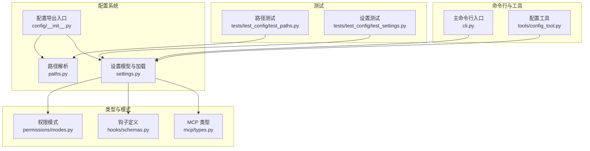
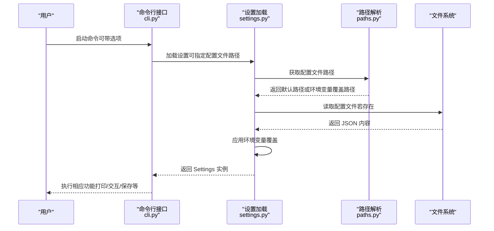
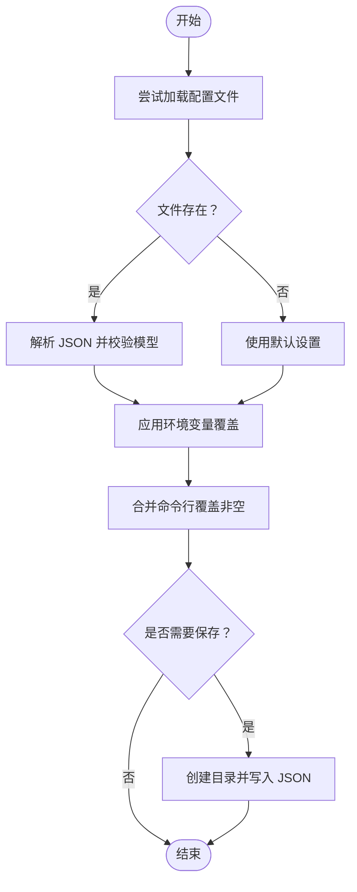
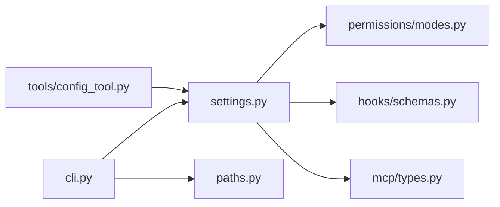

# 配置管理指南

<cite>
**本文档引用的文件**
- [src/openharness/config/__init__.py](file://src/openharness/config/__init__.py)
- [src/openharness/config/settings.py](file://src/openharness/config/settings.py)
- [src/openharness/config/paths.py](file://src/openharness/config/paths.py)
- [src/openharness/cli.py](file://src/openharness/cli.py)
- [src/openharness/tools/config_tool.py](file://src/openharness/tools/config_tool.py)
- [src/openharness/permissions/modes.py](file://src/openharness/permissions/modes.py)
- [src/openharness/hooks/schemas.py](file://src/openharness/hooks/schemas.py)
- [src/openharness/mcp/types.py](file://src/openharness/mcp/types.py)
- [tests/test_config/test_settings.py](file://tests/test_config/test_settings.py)
- [tests/test_config/test_paths.py](file://tests/test_config/test_paths.py)
</cite>

## 目录
1. [简介](#简介)
2. [项目结构](#项目结构)
3. [核心组件](#核心组件)
4. [架构总览](#架构总览)
5. [详细组件分析](#详细组件分析)
6. [依赖关系分析](#依赖关系分析)
7. [性能考虑](#性能考虑)
8. [故障排除指南](#故障排除指南)
9. [结论](#结论)
10. [附录](#附录)

## 简介
本指南面向使用 OpenHarness 的用户与维护者，系统讲解配置管理的完整流程：从默认配置文件位置与格式，到配置项的修改（命令行参数覆盖、环境变量设置、配置文件编辑），再到配置验证与错误处理、常见场景示例、备份与恢复、迁移与版本升级注意事项，以及实用的故障排除技巧。目标是帮助你在不同环境中快速、安全地完成配置管理。

## 项目结构
OpenHarness 的配置系统由以下模块组成：
- 路径解析：负责确定配置目录、数据目录、日志目录及项目级配置路径
- 设置模型与加载：定义 Settings 数据模型，提供加载、合并、保存能力，并支持环境变量与命令行覆盖
- 命令行接口：提供子命令与选项以管理认证、MCP 服务器、插件等配置
- 工具接口：提供“config”工具用于读取或更新设置
- 权限与钩子：为配置项提供类型约束与默认值
- 测试：覆盖路径解析、设置加载/保存、环境变量覆盖等行为

图表来源
- [src/openharness/config/paths.py:1-117](file://src/openharness/config/paths.py#L1-L117)
- [src/openharness/config/settings.py:1-161](file://src/openharness/config/settings.py#L1-L161)
- [src/openharness/config/__init__.py:1-22](file://src/openharness/config/__init__.py#L1-L22)
- [src/openharness/cli.py:1-378](file://src/openharness/cli.py#L1-L378)
- [src/openharness/tools/config_tool.py:1-38](file://src/openharness/tools/config_tool.py#L1-L38)
- [src/openharness/permissions/modes.py:1-14](file://src/openharness/permissions/modes.py#L1-L14)
- [src/openharness/hooks/schemas.py:1-59](file://src/openharness/hooks/schemas.py#L1-L59)
- [src/openharness/mcp/types.py:1-77](file://src/openharness/mcp/types.py#L1-L77)
- [tests/test_config/test_paths.py:1-70](file://tests/test_config/test_paths.py#L1-L70)
- [tests/test_config/test_settings.py:1-114](file://tests/test_config/test_settings.py#L1-L114)

章节来源
- [src/openharness/config/__init__.py:1-22](file://src/openharness/config/__init__.py#L1-L22)
- [src/openharness/config/paths.py:1-117](file://src/openharness/config/paths.py#L1-L117)
- [src/openharness/config/settings.py:1-161](file://src/openharness/config/settings.py#L1-L161)
- [src/openharness/cli.py:1-378](file://src/openharness/cli.py#L1-L378)
- [src/openharness/tools/config_tool.py:1-38](file://src/openharness/tools/config_tool.py#L1-L38)
- [src/openharness/permissions/modes.py:1-14](file://src/openharness/permissions/modes.py#L1-L14)
- [src/openharness/hooks/schemas.py:1-59](file://src/openharness/hooks/schemas.py#L1-L59)
- [src/openharness/mcp/types.py:1-77](file://src/openharness/mcp/types.py#L1-L77)
- [tests/test_config/test_paths.py:1-70](file://tests/test_config/test_paths.py#L1-L70)
- [tests/test_config/test_settings.py:1-114](file://tests/test_config/test_settings.py#L1-L114)

## 核心组件
- 路径解析模块：提供配置目录、数据目录、日志目录、会话与任务输出、反馈与计划任务注册表等路径解析函数；支持通过环境变量覆盖默认路径
- 设置模型与加载模块：定义 Settings 数据模型，包含 API 配置、行为控制、权限、内存、UI、钩子、MCP 服务器等字段；提供加载、应用环境变量覆盖、合并命令行覆盖、保存能力
- 命令行接口：提供认证、MCP 管理、插件管理等子命令，以及大量配置相关的命令行选项，支持直接覆盖配置
- 配置工具：提供“config”工具，允许在运行时读取或更新配置项
- 类型与模式：为权限模式、钩子定义、MCP 服务器配置提供类型约束与默认值

章节来源
- [src/openharness/config/paths.py:15-117](file://src/openharness/config/paths.py#L15-L117)
- [src/openharness/config/settings.py:49-161](file://src/openharness/config/settings.py#L49-L161)
- [src/openharness/cli.py:179-378](file://src/openharness/cli.py#L179-L378)
- [src/openharness/tools/config_tool.py:19-38](file://src/openharness/tools/config_tool.py#L19-L38)
- [src/openharness/permissions/modes.py:8-14](file://src/openharness/permissions/modes.py#L8-L14)
- [src/openharness/hooks/schemas.py:10-59](file://src/openharness/hooks/schemas.py#L10-L59)
- [src/openharness/mcp/types.py:11-77](file://src/openharness/mcp/types.py#L11-L77)

## 架构总览
配置系统遵循“优先级覆盖”的设计原则：命令行参数 > 环境变量 > 配置文件 > 默认值。路径解析模块提供统一的目录定位，设置模型模块负责数据结构与加载逻辑，命令行与工具模块提供交互式配置入口。

图表来源
- [src/openharness/cli.py:179-378](file://src/openharness/cli.py#L179-L378)
- [src/openharness/config/settings.py:123-161](file://src/openharness/config/settings.py#L123-L161)
- [src/openharness/config/paths.py:32-34](file://src/openharness/config/paths.py#L32-L34)

## 详细组件分析

### 路径解析组件
- 功能要点
  - 配置目录：支持通过环境变量覆盖，默认位于用户主目录下的隐藏目录
  - 数据目录：默认位于配置目录下，支持通过环境变量覆盖
  - 日志目录：默认位于配置目录下，支持通过环境变量覆盖
  - 项目级配置：每个工作目录下生成专属的隐藏配置目录
  - 其他专用目录：会话、任务、反馈、计划任务注册表等
- 环境变量覆盖
  - 配置目录：OPENHARNESS_CONFIG_DIR
  - 数据目录：OPENHARNESS_DATA_DIR
  - 日志目录：OPENHARNESS_LOGS_DIR

章节来源
- [src/openharness/config/paths.py:15-117](file://src/openharness/config/paths.py#L15-L117)
- [tests/test_config/test_paths.py:15-70](file://tests/test_config/test_paths.py#L15-L70)

### 设置模型与加载组件
- 数据模型
  - API 配置：API 密钥、模型、最大令牌数、基础 URL
  - 行为控制：系统提示、权限、钩子、内存、启用的插件、MCP 服务器
  - UI 控制：主题、输出样式、Vim 模式、语音模式、快速模式、努力级别、轮次、详细输出
- 加载与覆盖顺序
  - 从配置文件加载（若存在），否则使用默认值
  - 应用环境变量覆盖（模型、基础 URL、最大令牌数、API 密钥）
  - 合并命令行覆盖（仅非空值）
  - 提供保存能力，自动创建父目录并写入 JSON
- 错误处理
  - 当 API 密钥缺失时抛出异常，提示设置环境变量或配置文件中的密钥项

图表来源
- [src/openharness/config/settings.py:123-161](file://src/openharness/config/settings.py#L123-L161)

章节来源
- [src/openharness/config/settings.py:49-161](file://src/openharness/config/settings.py#L49-L161)
- [tests/test_config/test_settings.py:57-114](file://tests/test_config/test_settings.py#L57-L114)

### 命令行接口组件
- 认证管理
  - 登录：交互式输入或通过选项传入 API 密钥，保存至配置文件
  - 登出：清除已存储的认证信息
  - 状态：显示当前检测到的提供商与认证状态
- MCP 管理
  - 列表：列出已配置的 MCP 服务器
  - 添加：通过 JSON 字符串添加新服务器
  - 删除：按名称移除 MCP 服务器
- 插件管理
  - 列表：列出已安装插件
  - 安装：从路径安装插件
  - 卸载：按名称卸载插件
- 配置相关选项
  - 模型、努力级别、详细输出、最大轮次
  - 输出模式、输出格式
  - 权限模式、跳过权限检查、允许/禁止工具列表
  - 系统提示、附加系统提示
  - 设置文件路径、基础 URL、API 密钥
  - 裸模式（最小化）、调试模式
  - MCP 配置文件列表、工作目录、后端模式

章节来源
- [src/openharness/cli.py:179-378](file://src/openharness/cli.py#L179-L378)

### 配置工具组件
- 功能
  - show：输出当前所有配置的 JSON
  - set：设置指定键的值（键需存在于模型中）
- 使用场景
  - 在自动化流程中动态调整配置
  - 在代理执行过程中临时修改配置

章节来源
- [src/openharness/tools/config_tool.py:19-38](file://src/openharness/tools/config_tool.py#L19-L38)

### 权限与钩子类型
- 权限模式
  - default：默认模式
  - plan：规划模式
  - full_auto：完全自动模式
- 钩子定义
  - command：执行 Shell 命令
  - prompt：提示模型进行条件验证
  - http：向 HTTP 端点发送事件
  - agent：基于模型的深度验证
- MCP 服务器配置
  - stdio：本地进程
  - http：HTTP 接口
  - ws：WebSocket 接口

章节来源
- [src/openharness/permissions/modes.py:8-14](file://src/openharness/permissions/modes.py#L8-L14)
- [src/openharness/hooks/schemas.py:10-59](file://src/openharness/hooks/schemas.py#L10-L59)
- [src/openharness/mcp/types.py:11-77](file://src/openharness/mcp/types.py#L11-L77)

## 依赖关系分析
- 组件耦合
  - CLI 依赖设置加载与路径解析模块，用于启动会话、管理认证与 MCP
  - 配置工具依赖设置加载与保存模块，提供运行时配置变更能力
  - 设置模型依赖权限模式、钩子定义、MCP 类型等外部类型
- 外部依赖
  - JSON 解析与序列化
  - 环境变量读取
  - 文件系统操作（读写配置文件）

图表来源
- [src/openharness/cli.py:1-378](file://src/openharness/cli.py#L1-L378)
- [src/openharness/tools/config_tool.py:1-38](file://src/openharness/tools/config_tool.py#L1-L38)
- [src/openharness/config/settings.py:1-161](file://src/openharness/config/settings.py#L1-L161)
- [src/openharness/config/paths.py:1-117](file://src/openharness/config/paths.py#L1-L117)
- [src/openharness/permissions/modes.py:1-14](file://src/openharness/permissions/modes.py#L1-L14)
- [src/openharness/hooks/schemas.py:1-59](file://src/openharness/hooks/schemas.py#L1-L59)
- [src/openharness/mcp/types.py:1-77](file://src/openharness/mcp/types.py#L1-L77)

## 性能考虑
- 配置文件读取与解析：仅在启动或显式调用时进行，通常开销很小
- 环境变量覆盖：在加载阶段一次性应用，避免重复计算
- 保存配置：仅在明确调用保存时写入磁盘，建议批量修改后再保存
- 路径解析：使用缓存友好的策略，避免频繁 IO

## 故障排除指南
- API 密钥未找到
  - 现象：启动时报错，提示缺少 API 密钥
  - 排查：确认环境变量或配置文件中已设置密钥
  - 处理：通过命令行登录保存密钥，或手动编辑配置文件
- 配置文件格式错误
  - 现象：加载失败或字段不生效
  - 排查：检查 JSON 语法与字段类型
  - 处理：使用工具导出当前配置作为参考，修正后重新加载
- 路径无法访问
  - 现象：无法创建配置目录或保存文件
  - 排查：检查目录权限与磁盘空间
  - 处理：使用环境变量覆盖到有权限的目录
- 权限模式导致功能受限
  - 现象：某些工具或命令被拒绝
  - 排查：确认权限模式与工具白名单
  - 处理：调整权限模式或添加允许的工具列表
- MCP 服务器配置无效
  - 现象：MCP 服务不可用或连接失败
  - 排查：核对服务器类型与传输参数
  - 处理：使用 MCP 子命令查看/添加/删除配置

章节来源
- [src/openharness/config/settings.py:76-91](file://src/openharness/config/settings.py#L76-L91)
- [src/openharness/cli.py:136-173](file://src/openharness/cli.py#L136-L173)
- [tests/test_config/test_settings.py:36-41](file://tests/test_config/test_settings.py#L36-L41)

## 结论
OpenHarness 的配置系统以清晰的优先级覆盖机制为核心，结合路径解析、设置模型、命令行与工具接口，提供了灵活且可审计的配置管理能力。遵循本文档的流程与最佳实践，你可以在不同环境中高效地完成配置的创建、编辑、保存、验证与故障排除。

## 附录

### 默认配置文件位置与格式
- 默认位置
  - 配置文件：用户主目录下的隐藏目录中，文件名为 settings.json
  - 可通过环境变量覆盖配置目录、数据目录、日志目录
- 格式
  - JSON 对象，字段与类型由 Settings 模型定义
  - 支持嵌套对象（如权限、钩子、MCP 服务器等）

章节来源
- [src/openharness/config/paths.py:15-68](file://src/openharness/config/paths.py#L15-L68)
- [src/openharness/config/settings.py:49-75](file://src/openharness/config/settings.py#L49-L75)

### 配置项修改方法
- 命令行参数覆盖
  - 适用于启动参数、认证、MCP 管理、插件管理等
  - 优先级最高，仅本次会话有效
- 环境变量设置
  - 支持模型、基础 URL、最大令牌数、API 密钥等
  - 在加载阶段应用，优先级高于配置文件
- 配置文件编辑
  - 编辑 settings.json，重启或重新加载后生效
  - 适合长期稳定的全局配置

章节来源
- [src/openharness/config/settings.py:99-121](file://src/openharness/config/settings.py#L99-L121)
- [src/openharness/cli.py:283-301](file://src/openharness/cli.py#L283-L301)

### 配置验证与错误处理
- 验证
  - 使用 Pydantic 模型校验，确保字段类型与默认值正确
  - 加载时应用环境变量覆盖，再合并命令行覆盖
- 错误处理
  - API 密钥缺失时抛出异常并给出修复建议
  - MCP 配置 JSON 无效时提示错误并退出

章节来源
- [src/openharness/config/settings.py:76-91](file://src/openharness/config/settings.py#L76-L91)
- [src/openharness/cli.py:67-71](file://src/openharness/cli.py#L67-L71)

### 常见配置场景示例
- API 密钥配置
  - 通过命令行登录保存，或在配置文件中设置
- 权限设置
  - 设置权限模式与允许/禁止工具列表
- UI 自定义
  - 主题、输出样式、Vim/语音模式、快速模式、努力级别与轮次

章节来源
- [src/openharness/cli.py:149-173](file://src/openharness/cli.py#L149-L173)
- [src/openharness/config/settings.py:66-75](file://src/openharness/config/settings.py#L66-L75)

### 配置备份与恢复
- 备份
  - 复制配置目录（含 settings.json 与相关子目录）
- 恢复
  - 将备份复制回原位置，或通过环境变量指向新的配置目录
- 迁移与版本升级
  - 升级前先备份
  - 比较新旧版本的设置模型差异，逐步迁移新增字段
  - 使用工具导出当前配置作为迁移对照

章节来源
- [src/openharness/tools/config_tool.py:29-30](file://src/openharness/tools/config_tool.py#L29-L30)
- [tests/test_config/test_settings.py:72-85](file://tests/test_config/test_settings.py#L72-L85)