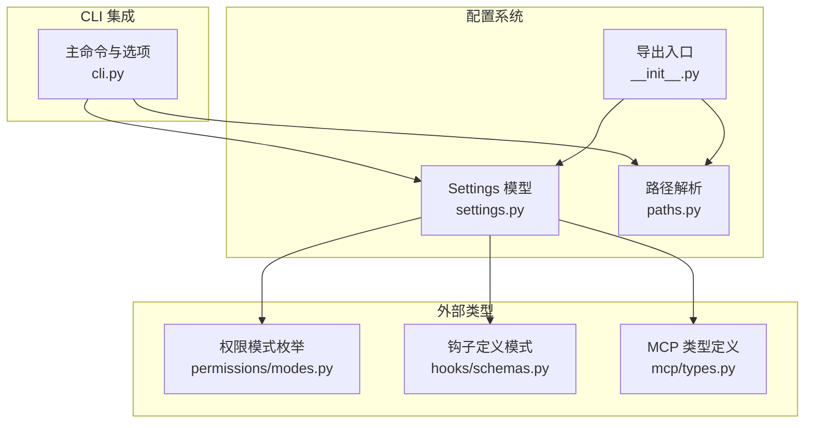
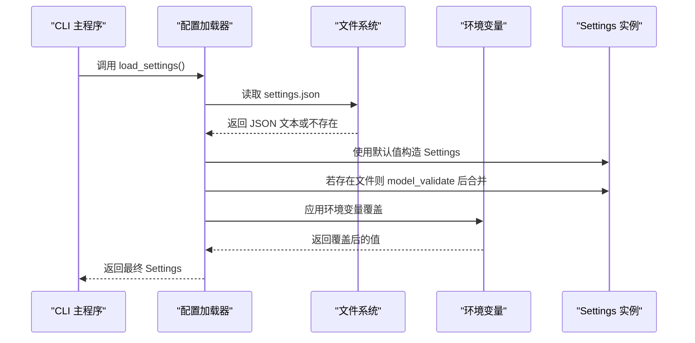
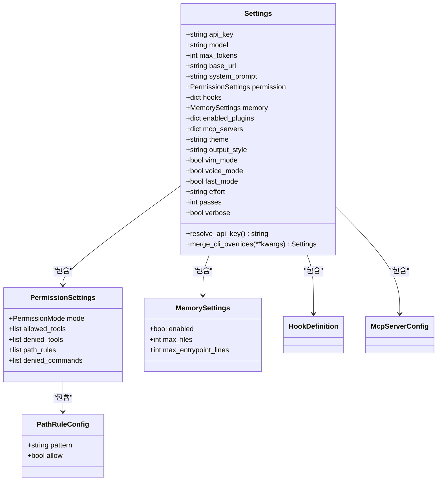
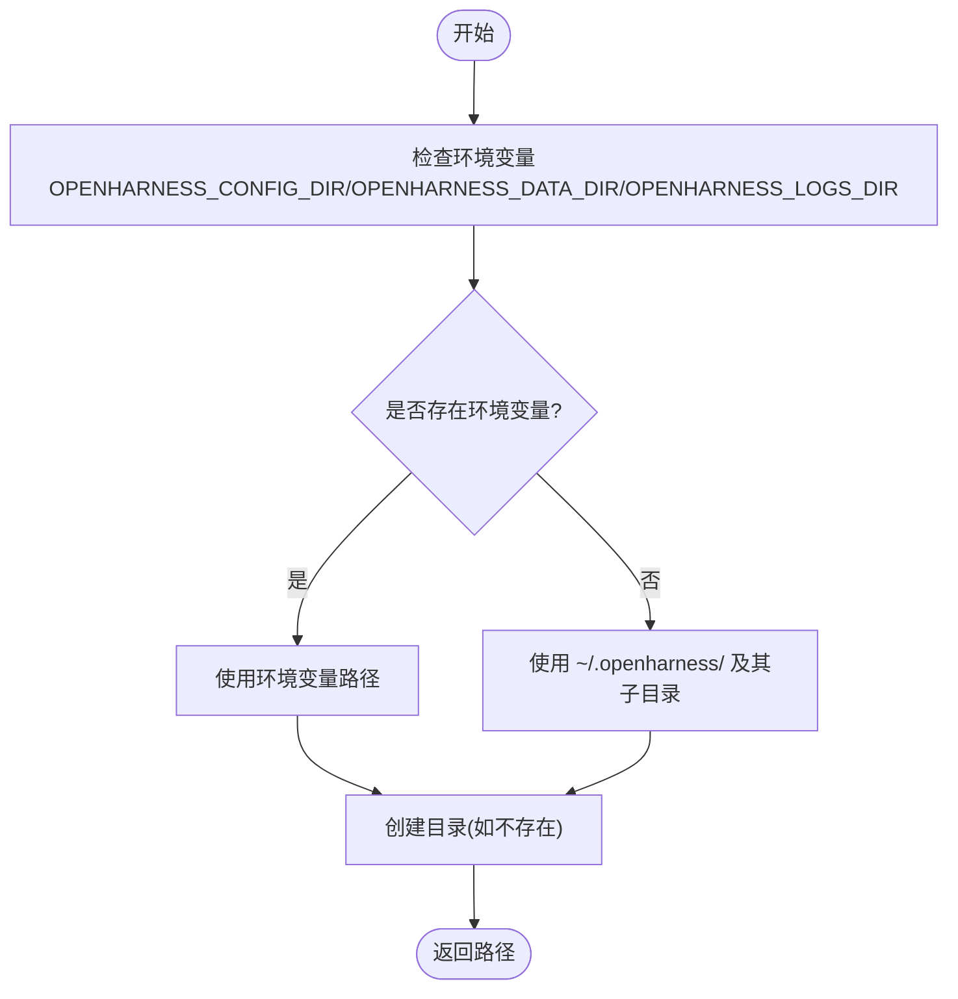
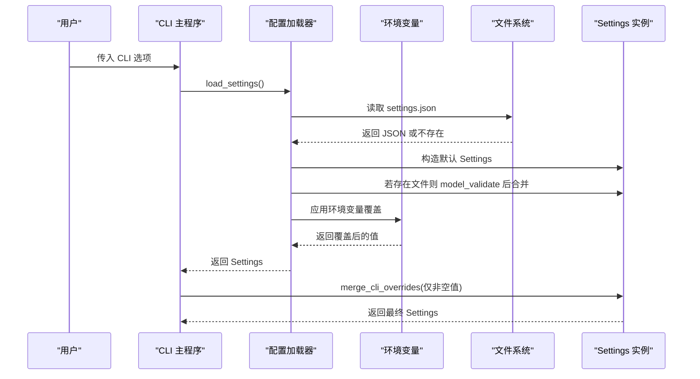
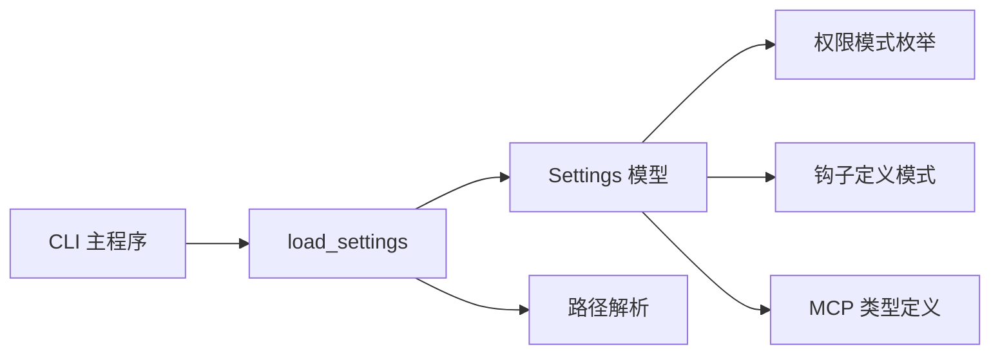

# 配置系统

<cite>
**本文引用的文件**
- [src/openharness/config/__init__.py](file://src/openharness/config/__init__.py)
- [src/openharness/config/settings.py](file://src/openharness/config/settings.py)
- [src/openharness/config/paths.py](file://src/openharness/config/paths.py)
- [src/openharness/permissions/modes.py](file://src/openharness/permissions/modes.py)
- [src/openharness/hooks/schemas.py](file://src/openharness/hooks/schemas.py)
- [src/openharness/mcp/types.py](file://src/openharness/mcp/types.py)
- [src/openharness/cli.py](file://src/openharness/cli.py)
- [tests/test_config/test_settings.py](file://tests/test_config/test_settings.py)
- [tests/test_config/test_paths.py](file://tests/test_config/test_paths.py)
</cite>

## 目录
1. [简介](#简介)
2. [项目结构](#项目结构)
3. [核心组件](#核心组件)
4. [架构总览](#架构总览)
5. [详细组件分析](#详细组件分析)
6. [依赖分析](#依赖分析)
7. [性能考虑](#性能考虑)
8. [故障排除指南](#故障排除指南)
9. [结论](#结论)
10. [附录：配置参考与示例](#附录配置参考与示例)

## 简介
本文件系统化梳理 OpenHarness 的配置系统，重点解释多层配置管理的设计理念（默认配置、用户配置、会话配置的优先级与继承）、设置模型结构（字段含义与默认值）、路径解析机制（用户目录、配置文件位置、环境变量处理）、配置加载与验证流程（含环境变量覆盖与向后兼容）、以及面向系统管理员与高级用户的配置定制指南。文档同时提供常见问题排查方法与配置示例，帮助快速上手并安全地扩展配置。

## 项目结构
OpenHarness 的配置系统由“设置模型”和“路径解析”两大模块组成，并通过 CLI 与内部子系统协同工作：
- 设置模型：定义所有可配置项的数据结构与默认值，并提供加载、保存、合并与校验逻辑。
- 路径解析：遵循类 XDG 约定，解析配置目录、数据目录、日志目录等路径，并支持环境变量覆盖。
- CLI 集成：在启动时加载设置，支持命令行参数覆盖部分设置项，并提供认证、插件、MCP 等子命令对设置进行读写。

图表来源
- [src/openharness/config/settings.py:49-161](file://src/openharness/config/settings.py#L49-L161)
- [src/openharness/config/paths.py:15-117](file://src/openharness/config/paths.py#L15-L117)
- [src/openharness/config/__init__.py:6-21](file://src/openharness/config/__init__.py#L6-L21)
- [src/openharness/cli.py:180-378](file://src/openharness/cli.py#L180-L378)
- [src/openharness/permissions/modes.py:8-14](file://src/openharness/permissions/modes.py#L8-L14)
- [src/openharness/hooks/schemas.py:10-59](file://src/openharness/hooks/schemas.py#L10-L59)
- [src/openharness/mcp/types.py:11-77](file://src/openharness/mcp/types.py#L11-L77)

章节来源
- [src/openharness/config/__init__.py:1-22](file://src/openharness/config/__init__.py#L1-L22)
- [src/openharness/config/settings.py:1-161](file://src/openharness/config/settings.py#L1-L161)
- [src/openharness/config/paths.py:1-117](file://src/openharness/config/paths.py#L1-L117)
- [src/openharness/cli.py:180-378](file://src/openharness/cli.py#L180-L378)

## 核心组件
- 设置模型 Settings：定义全部可配置项，包含 API、行为、UI、权限、内存、钩子、插件启用、MCP 服务器等；提供环境变量覆盖、CLI 覆盖、API 密钥解析与持久化。
- 路径解析模块：提供配置目录、数据目录、日志目录、会话/任务/反馈等子目录的解析与创建逻辑，并支持环境变量覆盖。
- 导出入口：对外暴露 Settings、路径解析函数与设置加载函数，供其他模块调用。

章节来源
- [src/openharness/config/settings.py:49-161](file://src/openharness/config/settings.py#L49-L161)
- [src/openharness/config/paths.py:15-117](file://src/openharness/config/paths.py#L15-L117)
- [src/openharness/config/__init__.py:6-21](file://src/openharness/config/__init__.py#L6-L21)

## 架构总览
配置系统采用“多层优先级 + 结构化模型 + 环境变量覆盖”的设计，确保灵活性与一致性：
- 优先级（从高到低）：CLI 参数 → 环境变量 → 用户配置文件（settings.json） → 默认值。
- 加载流程：先解析默认设置，再从文件加载并校验，随后应用环境变量覆盖，最后返回最终设置实例。
- 路径解析：遵循类 XDG 约定，默认位于用户主目录下的隐藏目录，可通过环境变量覆盖。
- 保存流程：将设置序列化为 JSON 并写入默认或指定路径，自动创建父目录。

图表来源
- [src/openharness/config/settings.py:123-141](file://src/openharness/config/settings.py#L123-L141)

章节来源
- [src/openharness/config/settings.py:3-8](file://src/openharness/config/settings.py#L3-L8)
- [src/openharness/config/settings.py:123-141](file://src/openharness/config/settings.py#L123-L141)

## 详细组件分析

### 设置模型 Settings
- 设计要点
  - 使用 Pydantic 模型定义字段与默认值，保证类型安全与运行时校验。
  - 提供 resolve_api_key 方法，按“实例值 > 环境变量 > 抛错”的顺序解析密钥。
  - 提供 merge_cli_overrides 方法，仅对非空 CLI 值进行覆盖，返回新实例，避免副作用。
  - 支持嵌套模型：权限、内存、钩子、MCP 服务器等。
- 关键字段与默认值（节选）
  - API 配置：api_key（空字符串）、model（默认模型名）、max_tokens（默认令牌数）、base_url（None）。
  - 行为：system_prompt（None）、permission（PermissionSettings 默认）、hooks（字典）、memory（MemorySettings 默认）、enabled_plugins（字典）、mcp_servers（字典）。
  - UI：theme（"default"）、output_style（"default"）、vim_mode（False）、voice_mode（False）、fast_mode（False）、effort（"medium"）、passes（1）、verbose（False）。
- 环境变量覆盖
  - 支持的环境变量：ANTHROPIC_MODEL/OPENHARNESS_MODEL、ANTHROPIC_BASE_URL/OPENHARNESS_BASE_URL、OPENHARNESS_MAX_TOKENS、ANTHROPIC_API_KEY。
  - 覆盖顺序：文件加载后应用环境变量覆盖，CLI 覆盖在更高层级。
- 加载与保存
  - load_settings：若文件存在则解析并校验，否则使用默认设置；随后应用环境变量覆盖。
  - save_settings：序列化为 JSON 并写入配置文件，自动创建父目录。

图表来源
- [src/openharness/config/settings.py:49-161](file://src/openharness/config/settings.py#L49-L161)
- [src/openharness/permissions/modes.py:8-14](file://src/openharness/permissions/modes.py#L8-L14)
- [src/openharness/hooks/schemas.py:10-59](file://src/openharness/hooks/schemas.py#L10-L59)
- [src/openharness/mcp/types.py:11-77](file://src/openharness/mcp/types.py#L11-L77)

章节来源
- [src/openharness/config/settings.py:49-161](file://src/openharness/config/settings.py#L49-L161)
- [src/openharness/permissions/modes.py:8-14](file://src/openharness/permissions/modes.py#L8-L14)
- [src/openharness/hooks/schemas.py:10-59](file://src/openharness/hooks/schemas.py#L10-L59)
- [src/openharness/mcp/types.py:11-77](file://src/openharness/mcp/types.py#L11-L77)

### 路径解析模块
- 目录约定
  - 配置目录：默认 ~/.openharness/，可通过 OPENHARNESS_CONFIG_DIR 覆盖。
  - 数据目录：默认 ~/.openharness/data/，可通过 OPENHARNESS_DATA_DIR 覆盖。
  - 日志目录：默认 ~/.openharness/logs/，可通过 OPENHARNESS_LOGS_DIR 覆盖。
  - 子目录：sessions、tasks、feedback 及其文件路径。
  - 项目级配置：每个工作目录下 .openharness/ 作为项目级配置根。
- 创建策略：解析时如目录不存在则自动创建，确保首次使用无需手动准备。
- 文件路径：settings.json 默认位于配置目录根部。

图表来源
- [src/openharness/config/paths.py:15-117](file://src/openharness/config/paths.py#L15-L117)

章节来源
- [src/openharness/config/paths.py:15-117](file://src/openharness/config/paths.py#L15-L117)
- [tests/test_config/test_paths.py:15-70](file://tests/test_config/test_paths.py#L15-L70)

### CLI 集成与覆盖优先级
- CLI 选项覆盖
  - 支持直接覆盖模型、输出格式、系统提示、权限模式、最大轮次、基础 URL、API 密钥、调试开关、MCP 配置、工作目录等。
  - 对于布尔选项，CLI 与配置文件的语义一致；对于字符串/数值，CLI 优先。
- 加载顺序
  - 先加载默认设置，再从文件加载并校验，随后应用环境变量覆盖，最后应用 CLI 覆盖。
- 认证与插件
  - auth 子命令用于设置/清除 API 密钥。
  - plugin 子命令读取/更新 enabled_plugins 字段，影响后续加载。

图表来源
- [src/openharness/config/settings.py:93-121](file://src/openharness/config/settings.py#L93-L121)
- [src/openharness/config/settings.py:123-141](file://src/openharness/config/settings.py#L123-L141)
- [src/openharness/cli.py:180-378](file://src/openharness/cli.py#L180-L378)

章节来源
- [src/openharness/config/settings.py:3-8](file://src/openharness/config/settings.py#L3-L8)
- [src/openharness/config/settings.py:93-121](file://src/openharness/config/settings.py#L93-L121)
- [src/openharness/config/settings.py:123-141](file://src/openharness/config/settings.py#L123-L141)
- [src/openharness/cli.py:180-378](file://src/openharness/cli.py#L180-L378)

## 依赖分析
- 内部依赖
  - Settings 依赖权限模式枚举、钩子定义模式、MCP 类型定义，确保字段类型正确且可序列化。
  - 路径解析模块不依赖配置模型，但被配置加载器调用以确定文件位置。
- 外部依赖
  - Pydantic 用于模型定义、校验与序列化。
  - 标准库 os/pathlib 用于环境变量与路径操作。
- 耦合与内聚
  - 配置系统模块内聚度高，职责清晰；与 CLI 的耦合通过 load_settings 统一入口实现，便于测试与替换。

图表来源
- [src/openharness/config/settings.py:19-22](file://src/openharness/config/settings.py#L19-L22)
- [src/openharness/permissions/modes.py:8-14](file://src/openharness/permissions/modes.py#L8-L14)
- [src/openharness/hooks/schemas.py:53-59](file://src/openharness/hooks/schemas.py#L53-L59)
- [src/openharness/mcp/types.py:37-44](file://src/openharness/mcp/types.py#L37-L44)
- [src/openharness/config/settings.py:123-141](file://src/openharness/config/settings.py#L123-L141)
- [src/openharness/config/paths.py:15-117](file://src/openharness/config/paths.py#L15-L117)
- [src/openharness/cli.py:180-378](file://src/openharness/cli.py#L180-L378)

章节来源
- [src/openharness/config/settings.py:19-22](file://src/openharness/config/settings.py#L19-L22)
- [src/openharness/permissions/modes.py:8-14](file://src/openharness/permissions/modes.py#L8-L14)
- [src/openharness/hooks/schemas.py:53-59](file://src/openharness/hooks/schemas.py#L53-L59)
- [src/openharness/mcp/types.py:37-44](file://src/openharness/mcp/types.py#L37-L44)
- [src/openharness/config/settings.py:123-141](file://src/openharness/config/settings.py#L123-L141)
- [src/openharness/config/paths.py:15-117](file://src/openharness/config/paths.py#L15-L117)
- [src/openharness/cli.py:180-378](file://src/openharness/cli.py#L180-L378)

## 性能考虑
- 文件读写
  - 配置文件仅在启动时读取一次，保存时也仅在变更时触发，开销极小。
- 序列化与反序列化
  - 使用 Pydantic 的 model_validate 与 model_dump_json，具备良好的性能与类型安全。
- 目录创建
  - 解析路径时自动创建目录，避免重复 IO；建议在批量初始化场景中预先准备目录以减少首次延迟。
- 环境变量覆盖
  - 仅在加载阶段进行一次覆盖，成本低且可缓存。

## 故障排除指南
- API 密钥缺失
  - 现象：resolve_api_key 抛出异常。
  - 排查：确认 ANTHROPIC_API_KEY 是否设置；或在配置文件中设置 api_key；或通过 CLI 选项覆盖。
  - 参考：[src/openharness/config/settings.py:76-91](file://src/openharness/config/settings.py#L76-L91)
- 配置文件格式错误
  - 现象：加载失败或字段未生效。
  - 排查：检查 settings.json 的 JSON 格式；确保字段名称与类型匹配；必要时删除或重命名配置文件以回退到默认。
  - 参考：[tests/test_config/test_settings.py:57-85](file://tests/test_config/test_settings.py#L57-L85)
- 环境变量未生效
  - 现象：CLI 与配置文件中的设置未被覆盖。
  - 排查：确认环境变量名称是否正确（ANTHROPIC_MODEL/OPENHARNESS_MODEL、ANTHROPIC_BASE_URL/OPENHARNESS_BASE_URL、OPENHARNESS_MAX_TOKENS、ANTHROPIC_API_KEY）；注意 CLI 覆盖优先级高于环境变量。
  - 参考：[src/openharness/config/settings.py:99-120](file://src/openharness/config/settings.py#L99-L120)
- 路径解析异常
  - 现象：无法找到配置/数据/日志目录。
  - 排查：检查 OPENHARNESS_CONFIG_DIR/OPENHARNESS_DATA_DIR/OPENHARNESS_LOGS_DIR 是否有效；确认用户主目录可写。
  - 参考：[tests/test_config/test_paths.py:15-70](file://tests/test_config/test_paths.py#L15-L70)
- 插件启用状态未生效
  - 现象：plugin list 显示状态与预期不符。
  - 排查：确认 enabled_plugins 字段已保存；重启会话以重新加载设置。
  - 参考：[tests/test_commands/test_command_flows.py:131-152](file://tests/test_commands/test_command_flows.py#L131-L152)

章节来源
- [src/openharness/config/settings.py:76-91](file://src/openharness/config/settings.py#L76-L91)
- [src/openharness/config/settings.py:99-120](file://src/openharness/config/settings.py#L99-L120)
- [src/openharness/config/settings.py:123-141](file://src/openharness/config/settings.py#L123-L141)
- [tests/test_config/test_settings.py:57-114](file://tests/test_config/test_settings.py#L57-L114)
- [tests/test_config/test_paths.py:15-70](file://tests/test_config/test_paths.py#L15-L70)
- [tests/test_commands/test_command_flows.py:131-152](file://tests/test_commands/test_command_flows.py#L131-L152)

## 结论
OpenHarness 的配置系统以“多层优先级 + 结构化模型 + 环境变量覆盖”为核心，既满足日常使用，又为高级用户提供了灵活的定制能力。通过统一的加载与保存接口、严格的类型校验与清晰的路径约定，系统在易用性与可靠性之间取得了良好平衡。建议在生产环境中结合环境变量与配置文件进行分层管理，并通过 CLI 进行最小化覆盖，以获得最佳的可维护性与安全性。

## 附录：配置参考与示例

### 配置优先级与继承
- 优先级（从高到低）：CLI 参数 → 环境变量 → 用户配置文件（settings.json） → 默认值。
- 继承关系：Settings 默认值为全局基线；文件与环境变量分别覆盖对应字段；CLI 仅覆盖非空值，返回新的 Settings 实例。

章节来源
- [src/openharness/config/settings.py:3-8](file://src/openharness/config/settings.py#L3-L8)
- [src/openharness/config/settings.py:93-121](file://src/openharness/config/settings.py#L93-L121)
- [src/openharness/config/settings.py:123-141](file://src/openharness/config/settings.py#L123-L141)

### 设置模型字段参考
- API 配置
  - api_key：字符串；默认为空字符串；可通过 ANTHROPIC_API_KEY 或配置文件覆盖。
  - model：字符串；默认模型标识；可通过 ANTHROPIC_MODEL/OPENHARNESS_MODEL 或配置文件覆盖。
  - max_tokens：整数；默认令牌数；可通过 OPENHARNESS_MAX_TOKENS 或配置文件覆盖。
  - base_url：字符串或 None；默认 None；可通过 ANTHROPIC_BASE_URL/OPENHARNESS_BASE_URL 或配置文件覆盖。
- 行为
  - system_prompt：字符串或 None；默认 None。
  - permission：PermissionSettings；默认 mode 为 default，其余为空列表/字典。
  - hooks：字典；键为事件名，值为 HookDefinition 列表。
  - memory：MemorySettings；默认启用，限制文件数量与入口点行数。
  - enabled_plugins：字典；键为插件名，值为布尔启用状态。
  - mcp_servers：字典；键为服务器名，值为 McpServerConfig。
- UI
  - theme：字符串；默认 "default"。
  - output_style：字符串；默认 "default"。
  - vim_mode：布尔；默认 False。
  - voice_mode：布尔；默认 False。
  - fast_mode：布尔；默认 False。
  - effort：字符串；默认 "medium"。
  - passes：整数；默认 1。
  - verbose：布尔；默认 False。

章节来源
- [src/openharness/config/settings.py:49-75](file://src/openharness/config/settings.py#L49-L75)
- [src/openharness/permissions/modes.py:8-14](file://src/openharness/permissions/modes.py#L8-L14)
- [src/openharness/hooks/schemas.py:10-59](file://src/openharness/hooks/schemas.py#L10-L59)
- [src/openharness/mcp/types.py:11-77](file://src/openharness/mcp/types.py#L11-L77)

### 路径解析参考
- 配置目录：默认 ~/.openharness/；可通过 OPENHARNESS_CONFIG_DIR 覆盖。
- 数据目录：默认 ~/.openharness/data/；可通过 OPENHARNESS_DATA_DIR 覆盖。
- 日志目录：默认 ~/.openharness/logs/；可通过 OPENHARNESS_LOGS_DIR 覆盖。
- 子目录：sessions、tasks、feedback。
- 项目级配置：工作目录下的 .openharness/。

章节来源
- [src/openharness/config/paths.py:15-117](file://src/openharness/config/paths.py#L15-L117)
- [tests/test_config/test_paths.py:15-70](file://tests/test_config/test_paths.py#L15-L70)

### 配置加载与验证流程
- 加载流程：读取 settings.json → model_validate → 应用环境变量覆盖 → 返回 Settings。
- 保存流程：序列化为 JSON → 写入配置文件 → 自动创建父目录。
- 测试覆盖：包含默认值、文件加载、环境变量覆盖、保存与回读等场景。

章节来源
- [src/openharness/config/settings.py:123-161](file://src/openharness/config/settings.py#L123-L161)
- [tests/test_config/test_settings.py:57-114](file://tests/test_config/test_settings.py#L57-L114)

### 常用配置项修改指南
- 设置 API 密钥
  - 通过 auth 登录命令或直接编辑配置文件；也可通过 ANTHROPIC_API_KEY 环境变量。
  - 参考：[src/openharness/cli.py:136-173](file://src/openharness/cli.py#L136-L173)
- 覆盖模型与基础 URL
  - 通过 ANTHROPIC_MODEL/OPENHARNESS_MODEL、ANTHROPIC_BASE_URL/OPENHARNESS_BASE_URL 或配置文件。
  - 参考：[src/openharness/config/settings.py:99-120](file://src/openharness/config/settings.py#L99-L120)
- 调整 UI 与行为
  - 修改 theme、output_style、vim_mode、voice_mode、fast_mode、effort、passes、verbose。
  - 参考：[src/openharness/config/settings.py:66-75](file://src/openharness/config/settings.py#L66-L75)
- 权限与路径规则
  - 在 permission 中设置 mode、allowed_tools、denied_tools、path_rules、denied_commands。
  - 参考：[src/openharness/config/settings.py:31-39](file://src/openharness/config/settings.py#L31-L39)
- 插件启用
  - 通过 plugin 子命令或 enabled_plugins 字段控制。
  - 参考：[tests/test_commands/test_command_flows.py:131-152](file://tests/test_commands/test_command_flows.py#L131-L152)

### 高级配置选项
- 钩子（hooks）
  - 支持 command、prompt、http、agent 四种类型，可配置超时、匹配器与阻塞策略。
  - 参考：[src/openharness/hooks/schemas.py:10-59](file://src/openharness/hooks/schemas.py#L10-L59)
- MCP 服务器
  - 支持 stdio/http/ws 三种传输方式，可配置命令、URL、头部、工作目录、环境变量等。
  - 参考：[src/openharness/mcp/types.py:11-77](file://src/openharness/mcp/types.py#L11-L77)

### 配置文件示例（结构示意）
- settings.json 示例结构（字段与类型请参考设置模型）
  - api_key、model、max_tokens、base_url
  - permission.mode、permission.allowed_tools、permission.denied_tools、permission.path_rules、permission.denied_commands
  - hooks（事件名到 HookDefinition 列表）
  - memory.enabled、memory.max_files、memory.max_entrypoint_lines
  - enabled_plugins（插件名到启用状态）
  - mcp_servers（服务器名到 McpServerConfig）

章节来源
- [src/openharness/config/settings.py:49-75](file://src/openharness/config/settings.py#L49-L75)
- [src/openharness/hooks/schemas.py:10-59](file://src/openharness/hooks/schemas.py#L10-L59)
- [src/openharness/mcp/types.py:11-77](file://src/openharness/mcp/types.py#L11-L77)