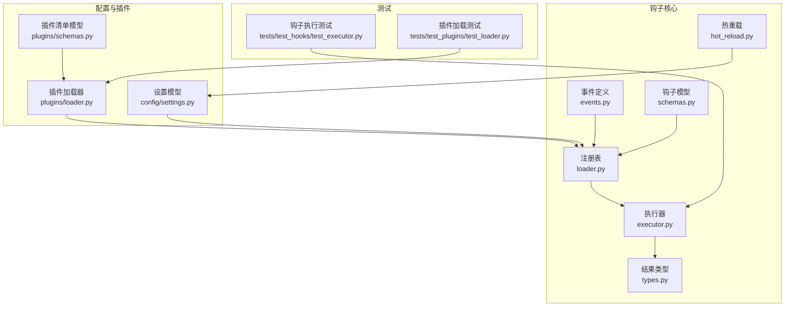
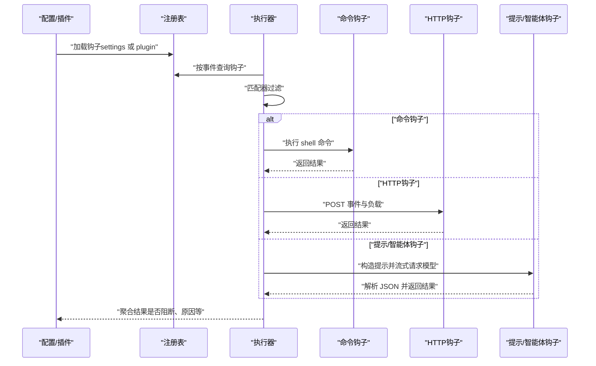
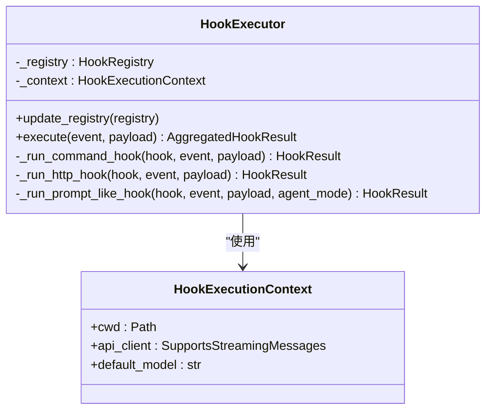
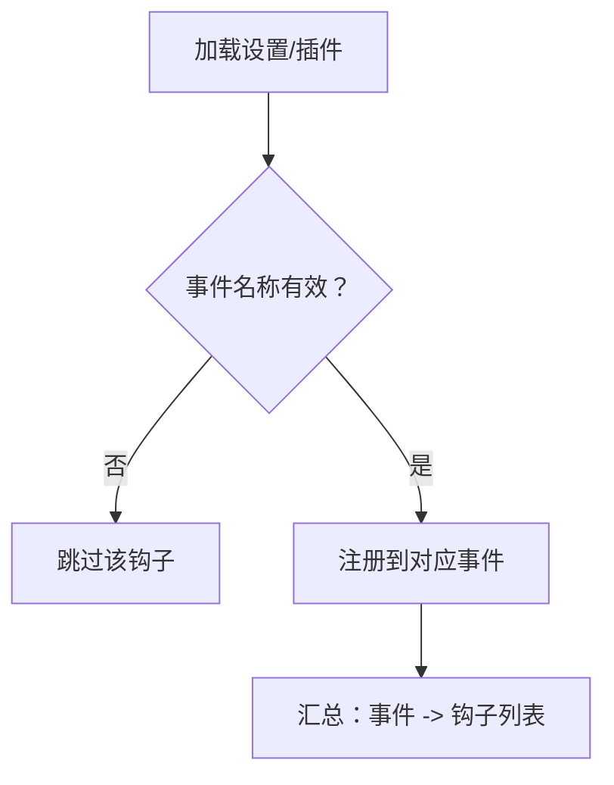
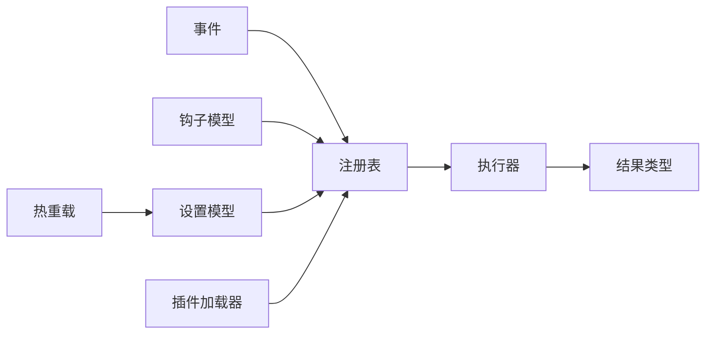

# 钩子开发指南

<cite>
**本文引用的文件**
- [src/openharness/hooks/__init__.py](file://src/openharness/hooks/__init__.py)
- [src/openharness/hooks/events.py](file://src/openharness/hooks/events.py)
- [src/openharness/hooks/types.py](file://src/openharness/hooks/types.py)
- [src/openharness/hooks/schemas.py](file://src/openharness/hooks/schemas.py)
- [src/openharness/hooks/executor.py](file://src/openharness/hooks/executor.py)
- [src/openharness/hooks/loader.py](file://src/openharness/hooks/loader.py)
- [src/openharness/hooks/hot_reload.py](file://src/openharness/hooks/hot_reload.py)
- [src/openharness/config/settings.py](file://src/openharness/config/settings.py)
- [src/openharness/plugins/schemas.py](file://src/openharness/plugins/schemas.py)
- [src/openharness/plugins/loader.py](file://src/openharness/plugins/loader.py)
- [src/openharness/tools/base.py](file://src/openharness/tools/base.py)
- [src/openharness/skills/types.py](file://src/openharness/skills/types.py)
- [tests/test_hooks/test_executor.py](file://tests/test_hooks/test_executor.py)
- [tests/test_plugins/test_loader.py](file://tests/test_plugins/test_loader.py)
</cite>

## 目录
1. [简介](#简介)
2. [项目结构](#项目结构)
3. [核心组件](#核心组件)
4. [架构总览](#架构总览)
5. [详细组件分析](#详细组件分析)
6. [依赖分析](#依赖分析)
7. [性能考虑](#性能考虑)
8. [故障排查指南](#故障排查指南)
9. [结论](#结论)
10. [附录](#附录)

## 简介
本指南面向希望在 OpenHarness 中开发“钩子（Hook）”的开发者，覆盖从需求分析、接口规范、配置文件编写、到实现与部署的全流程。你将学会如何基于 HookDefinition 的不同类型（命令、提示、HTTP、智能体）构建钩子，如何通过匹配器（matcher）精准触发，如何在执行上下文中注入参数，以及如何进行调试、错误处理与性能优化。同时提供常见场景（日志记录、权限验证、数据转换、通知发送）的开发示例与最佳实践。

## 项目结构
OpenHarness 的钩子系统由以下模块协同工作：
- 事件定义：定义可触发钩子的生命周期事件
- 模型定义：描述不同类型的钩子配置
- 注册表：按事件分组管理钩子
- 执行器：根据事件与负载执行钩子，并聚合结果
- 加载器与热重载：从设置或插件加载钩子，并支持配置变更时自动重载
- 配置模型：集中管理钩子配置与环境变量覆盖
- 测试用例：验证钩子行为与边界条件

图表来源
- [src/openharness/hooks/events.py:8-15](file://src/openharness/hooks/events.py#L8-L15)
- [src/openharness/hooks/schemas.py:10-58](file://src/openharness/hooks/schemas.py#L10-L58)
- [src/openharness/hooks/types.py:9-39](file://src/openharness/hooks/types.py#L9-L39)
- [src/openharness/hooks/loader.py:10-61](file://src/openharness/hooks/loader.py#L10-L61)
- [src/openharness/hooks/executor.py:38-217](file://src/openharness/hooks/executor.py#L38-L217)
- [src/openharness/hooks/hot_reload.py:11-31](file://src/openharness/hooks/hot_reload.py#L11-L31)
- [src/openharness/config/settings.py:49-75](file://src/openharness/config/settings.py#L49-L75)
- [src/openharness/plugins/schemas.py:8-24](file://src/openharness/plugins/schemas.py#L8-L24)
- [src/openharness/plugins/loader.py:150-194](file://src/openharness/plugins/loader.py#L150-L194)
- [tests/test_hooks/test_executor.py:1-73](file://tests/test_hooks/test_executor.py#L1-L73)
- [tests/test_plugins/test_loader.py:14-48](file://tests/test_plugins/test_loader.py#L14-L48)

章节来源
- [src/openharness/hooks/__init__.py:13-21](file://src/openharness/hooks/__init__.py#L13-L21)

## 核心组件
- 事件枚举：定义可触发钩子的生命周期事件，如会话开始、结束、工具使用前/后等
- 钩子定义：统一的 HookDefinition 类型别名，包含命令、提示、HTTP、智能体四种类型
- 执行上下文：向钩子注入当前工作目录、消息流客户端、默认模型等
- 注册表：按事件分组存储钩子，支持汇总展示与查询
- 执行器：根据事件与负载匹配钩子，异步执行并返回聚合结果
- 热重载：监听配置文件变更，动态重建钩子注册表

章节来源
- [src/openharness/hooks/events.py:8-15](file://src/openharness/hooks/events.py#L8-L15)
- [src/openharness/hooks/schemas.py:53-58](file://src/openharness/hooks/schemas.py#L53-L58)
- [src/openharness/hooks/executor.py:29-36](file://src/openharness/hooks/executor.py#L29-L36)
- [src/openharness/hooks/loader.py:10-38](file://src/openharness/hooks/loader.py#L10-L38)
- [src/openharness/hooks/executor.py:49-63](file://src/openharness/hooks/executor.py#L49-L63)
- [src/openharness/hooks/hot_reload.py:11-31](file://src/openharness/hooks/hot_reload.py#L11-L31)

## 架构总览
下图展示了钩子从配置到执行的关键路径：配置与插件加载钩子 → 注册表 → 执行器匹配与执行 → 结果聚合。

图表来源
- [src/openharness/hooks/loader.py:40-60](file://src/openharness/hooks/loader.py#L40-L60)
- [src/openharness/hooks/executor.py:49-63](file://src/openharness/hooks/executor.py#L49-L63)
- [src/openharness/hooks/executor.py:65-115](file://src/openharness/hooks/executor.py#L65-L115)
- [src/openharness/hooks/executor.py:117-146](file://src/openharness/hooks/executor.py#L117-L146)
- [src/openharness/hooks/executor.py:148-191](file://src/openharness/hooks/executor.py#L148-L191)

## 详细组件分析

### 事件与生命周期
- 支持的事件包括：会话开始、会话结束、工具使用前、工具使用后
- 事件用于决定何时触发钩子，是钩子匹配与执行的基础

章节来源
- [src/openharness/hooks/events.py:8-15](file://src/openharness/hooks/events.py#L8-L15)

### 钩子定义与数据结构
- 统一类型别名为 HookDefinition，包含四类具体定义：
  - 命令钩子：执行 shell 命令，支持超时、匹配器、失败阻断
  - 提示钩子：调用模型进行条件判断，返回严格 JSON
  - HTTP 钩子：向指定 URL 发送事件负载，支持头与超时
  - 智能体钩子：更深入的模型验证，适合复杂决策
- 字段约束：如超时范围限制、block_on_failure 默认值等

章节来源
- [src/openharness/hooks/schemas.py:10-18](file://src/openharness/hooks/schemas.py#L10-L18)
- [src/openharness/hooks/schemas.py:20-29](file://src/openharness/hooks/schemas.py#L20-L29)
- [src/openharness/hooks/schemas.py:31-40](file://src/openharness/hooks/schemas.py#L31-L40)
- [src/openharness/hooks/schemas.py:42-51](file://src/openharness/hooks/schemas.py#L42-L51)
- [src/openharness/hooks/schemas.py:53-58](file://src/openharness/hooks/schemas.py#L53-L58)

### 执行上下文与执行器
- 执行上下文包含：当前工作目录、消息流客户端、默认模型
- 执行器负责：
  - 匹配钩子（基于 matcher）
  - 异步执行命令、HTTP、提示/智能体钩子
  - 解析提示/智能体返回的 JSON，判定成功与否与阻断原因
  - 聚合结果并判断是否阻断后续流程

图表来源
- [src/openharness/hooks/executor.py:29-36](file://src/openharness/hooks/executor.py#L29-L36)
- [src/openharness/hooks/executor.py:38-48](file://src/openharness/hooks/executor.py#L38-L48)
- [src/openharness/hooks/executor.py:49-63](file://src/openharness/hooks/executor.py#L49-L63)

章节来源
- [src/openharness/hooks/executor.py:49-63](file://src/openharness/hooks/executor.py#L49-L63)
- [src/openharness/hooks/executor.py:194-199](file://src/openharness/hooks/executor.py#L194-L199)
- [src/openharness/hooks/executor.py:202-203](file://src/openharness/hooks/executor.py#L202-L203)
- [src/openharness/hooks/executor.py:206-216](file://src/openharness/hooks/executor.py#L206-L216)

### 注册表与加载
- 注册表按事件分组存储钩子，支持摘要输出
- 加载器从设置与插件中读取钩子，校验事件名称并注册
- 插件可通过 hooks.json 或结构化格式提供钩子

图表来源
- [src/openharness/hooks/loader.py:40-60](file://src/openharness/hooks/loader.py#L40-L60)
- [src/openharness/plugins/loader.py:150-194](file://src/openharness/plugins/loader.py#L150-L194)

章节来源
- [src/openharness/hooks/loader.py:10-38](file://src/openharness/hooks/loader.py#L10-L38)
- [src/openharness/hooks/loader.py:40-60](file://src/openharness/hooks/loader.py#L40-L60)
- [src/openharness/plugins/loader.py:150-194](file://src/openharness/plugins/loader.py#L150-L194)

### 热重载机制
- 监控设置文件修改时间，变更时重新加载并更新注册表
- 适用于本地开发与快速迭代

章节来源
- [src/openharness/hooks/hot_reload.py:11-31](file://src/openharness/hooks/hot_reload.py#L11-L31)

### 结果类型与聚合
- 单个钩子结果包含：类型、成功标志、输出、是否阻断、原因、元数据
- 聚合结果提供 blocked 与 reason 的便捷访问

章节来源
- [src/openharness/hooks/types.py:9-19](file://src/openharness/hooks/types.py#L9-L19)
- [src/openharness/hooks/types.py:21-39](file://src/openharness/hooks/types.py#L21-L39)

### 配置与插件集成
- 设置模型中包含 hooks 字典，键为事件名，值为钩子数组
- 插件清单可声明 hooks 文件名；插件加载器解析 hooks.json 并注入到注册表

章节来源
- [src/openharness/config/settings.py:49-75](file://src/openharness/config/settings.py#L49-L75)
- [src/openharness/plugins/schemas.py:8-24](file://src/openharness/plugins/schemas.py#L8-L24)
- [src/openharness/plugins/loader.py:150-194](file://src/openharness/plugins/loader.py#L150-L194)

## 依赖分析
- 钩子系统内部耦合度低，事件、模型、注册表、执行器职责清晰
- 执行器依赖事件、注册表、模型与结果类型
- 加载器依赖事件与模型
- 热重载依赖配置加载
- 插件加载器与设置模型共同驱动钩子注册

图表来源
- [src/openharness/hooks/events.py:8-15](file://src/openharness/hooks/events.py#L8-L15)
- [src/openharness/hooks/schemas.py:53-58](file://src/openharness/hooks/schemas.py#L53-L58)
- [src/openharness/hooks/loader.py:10-38](file://src/openharness/hooks/loader.py#L10-L38)
- [src/openharness/hooks/executor.py:38-48](file://src/openharness/hooks/executor.py#L38-L48)
- [src/openharness/hooks/types.py:21-39](file://src/openharness/hooks/types.py#L21-L39)
- [src/openharness/config/settings.py:49-75](file://src/openharness/config/settings.py#L49-L75)
- [src/openharness/plugins/loader.py:150-194](file://src/openharness/plugins/loader.py#L150-L194)
- [src/openharness/hooks/hot_reload.py:19-31](file://src/openharness/hooks/hot_reload.py#L19-L31)

## 性能考虑
- 超时控制：命令与 HTTP 钩子均支持超时，避免阻塞主流程
- 异步执行：命令与 HTTP 使用异步方式，提升并发能力
- 流式模型响应：提示/智能体钩子采用流式消息，减少等待时间
- 匹配器过滤：通过匹配器缩小执行范围，降低无效调用
- 热重载：仅在配置变更时重建注册表，避免频繁 IO

章节来源
- [src/openharness/hooks/schemas.py:15-15](file://src/openharness/hooks/schemas.py#L15-L15)
- [src/openharness/hooks/schemas.py:37-37](file://src/openharness/hooks/schemas.py#L37-L37)
- [src/openharness/hooks/executor.py:87-90](file://src/openharness/hooks/executor.py#L87-L90)
- [src/openharness/hooks/executor.py:124-129](file://src/openharness/hooks/executor.py#L124-L129)
- [src/openharness/hooks/executor.py:172-176](file://src/openharness/hooks/executor.py#L172-L176)
- [src/openharness/hooks/hot_reload.py:28-30](file://src/openharness/hooks/hot_reload.py#L28-L30)

## 故障排查指南
- 命令钩子失败
  - 检查超时与退出码，确认环境变量是否正确注入
  - 关注阻断标志与原因字段
- HTTP 钩子异常
  - 捕获异常并根据阻断标志决定是否阻断
  - 校验 URL、头信息与超时设置
- 提示/智能体钩子拒绝
  - 确认返回 JSON 符合规范（包含 ok 字段）
  - 调整提示词与系统前缀，确保模型输出稳定
- 匹配器不生效
  - 检查 payload 中的工具名或提示字段是否与匹配器一致
- 热重载未生效
  - 确认设置文件存在且修改时间被检测到

章节来源
- [src/openharness/hooks/executor.py:91-115](file://src/openharness/hooks/executor.py#L91-L115)
- [src/openharness/hooks/executor.py:140-146](file://src/openharness/hooks/executor.py#L140-L146)
- [src/openharness/hooks/executor.py:182-191](file://src/openharness/hooks/executor.py#L182-L191)
- [src/openharness/hooks/executor.py:194-199](file://src/openharness/hooks/executor.py#L194-L199)
- [src/openharness/hooks/hot_reload.py:21-26](file://src/openharness/hooks/hot_reload.py#L21-L26)

## 结论
OpenHarness 的钩子系统以清晰的事件模型、严格的配置约束与强大的执行器为核心，既支持简单脚本与 HTTP 回调，也能通过提示与智能体实现复杂的策略验证。配合热重载与完善的测试用例，开发者可以高效地完成从需求到上线的全链路开发。

## 附录

### 钩子接口规范与实现要点
- 继承与实现
  - 使用 HookDefinition 类型别名，选择具体定义类型（命令/提示/HTTP/智能体）
  - 在提示/智能体钩子中，确保模型输出符合 JSON 规范
- 匹配器
  - 使用通配符表达式对工具名或提示进行匹配，提高触发精度
- 参数注入
  - 命令钩子可通过环境变量或模板注入 payload
- 阻断策略
  - 根据 block_on_failure 决定失败时是否阻断后续流程

章节来源
- [src/openharness/hooks/schemas.py:53-58](file://src/openharness/hooks/schemas.py#L53-L58)
- [src/openharness/hooks/executor.py:194-199](file://src/openharness/hooks/executor.py#L194-L199)
- [src/openharness/hooks/executor.py:202-203](file://src/openharness/hooks/executor.py#L202-L203)

### 配置文件编写规范（YAML/JSON）
- 设置文件（settings.json）
  - hooks 字段：键为事件名，值为钩子数组
  - 其他字段：模型、令牌数、权限、内存等
- 插件钩子文件（hooks.json）
  - 支持直接 JSON 数组或结构化对象
  - 可使用占位符替换插件根路径
- 插件清单（plugin.json）
  - 可声明 hooks 文件名等扩展字段

章节来源
- [src/openharness/config/settings.py:49-75](file://src/openharness/config/settings.py#L49-L75)
- [src/openharness/plugins/schemas.py:16-16](file://src/openharness/plugins/schemas.py#L16-L16)
- [src/openharness/plugins/loader.py:150-194](file://src/openharness/plugins/loader.py#L150-L194)

### 开发示例（场景与实现思路）
- 日志记录
  - 使用命令钩子在会话开始/结束时写入日志文件
  - 使用 HTTP 钩子上报事件到日志服务
- 权限验证
  - 使用提示钩子对工具调用进行安全检查，必要时阻断
  - 使用智能体钩子进行更深入的上下文推理
- 数据转换
  - 使用命令钩子调用外部工具进行格式转换
  - 将转换结果通过 HTTP 钩子回传给上游系统
- 通知发送
  - 使用 HTTP 钩子向企业 IM 或邮件网关推送消息
  - 在工具使用前后分别发送开始与完成通知

章节来源
- [src/openharness/hooks/schemas.py:10-18](file://src/openharness/hooks/schemas.py#L10-L18)
- [src/openharness/hooks/schemas.py:31-40](file://src/openharness/hooks/schemas.py#L31-L40)
- [src/openharness/hooks/schemas.py:42-51](file://src/openharness/hooks/schemas.py#L42-L51)
- [src/openharness/hooks/executor.py:65-115](file://src/openharness/hooks/executor.py#L65-L115)
- [src/openharness/hooks/executor.py:117-146](file://src/openharness/hooks/executor.py#L117-L146)
- [src/openharness/hooks/executor.py:148-191](file://src/openharness/hooks/executor.py#L148-L191)

### 调试与测试最佳实践
- 单元测试
  - 使用假的流式消息客户端模拟模型响应
  - 验证命令钩子执行与输出、提示钩子阻断逻辑
- 集成测试
  - 通过插件加载器写入 hooks.json，验证钩子注册与执行
- 调试技巧
  - 启用详细日志与超时设置
  - 使用热重载在本地快速迭代
- 自动化测试
  - 在 CI 中运行钩子执行与插件加载测试，确保回归质量

章节来源
- [tests/test_hooks/test_executor.py:17-30](file://tests/test_hooks/test_executor.py#L17-L30)
- [tests/test_hooks/test_executor.py:32-48](file://tests/test_hooks/test_executor.py#L32-L48)
- [tests/test_hooks/test_executor.py:50-72](file://tests/test_hooks/test_executor.py#L50-L72)
- [tests/test_plugins/test_loader.py:14-48](file://tests/test_plugins/test_loader.py#L14-L48)