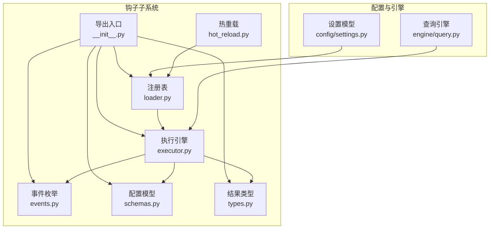
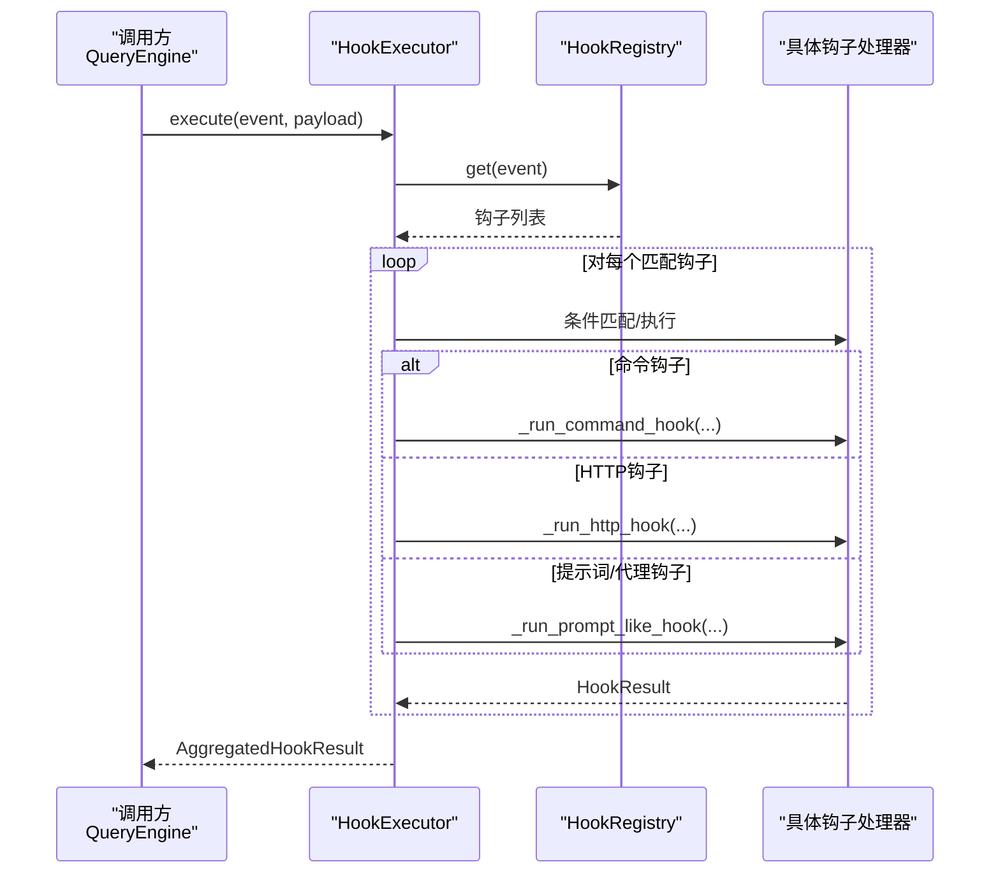
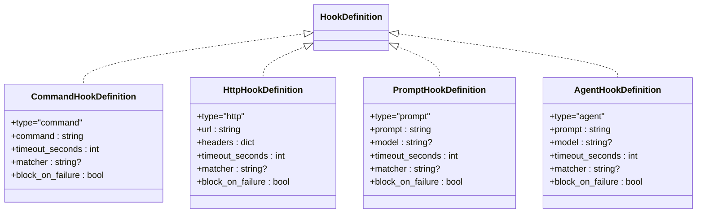
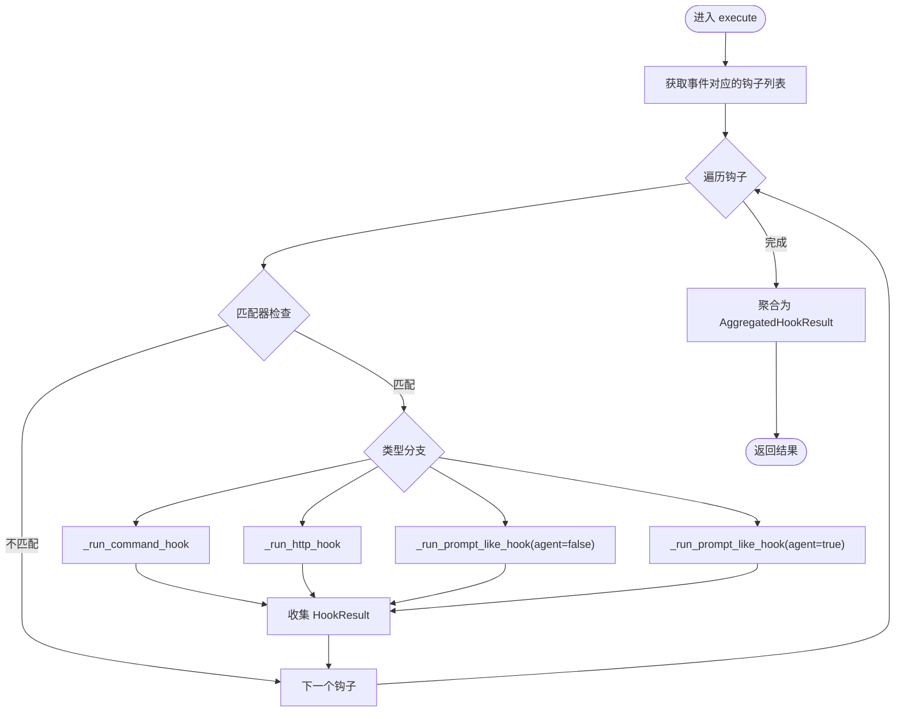
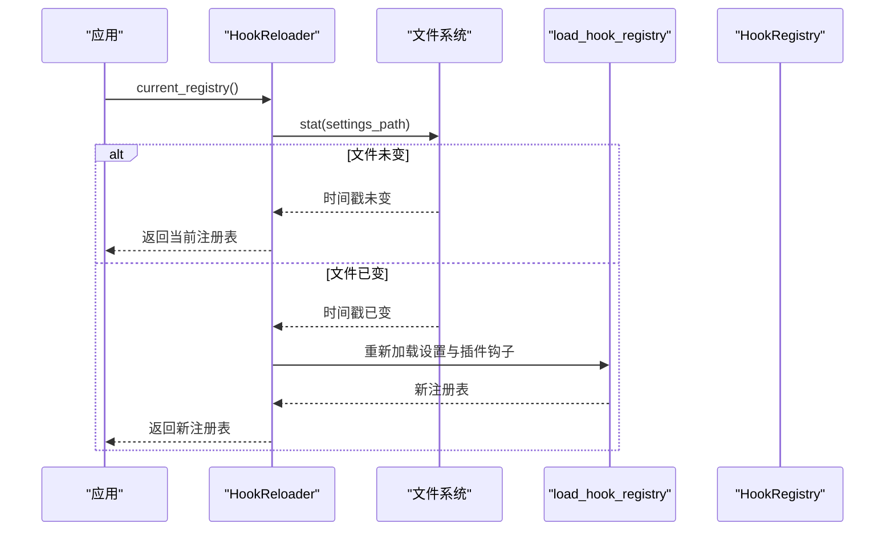
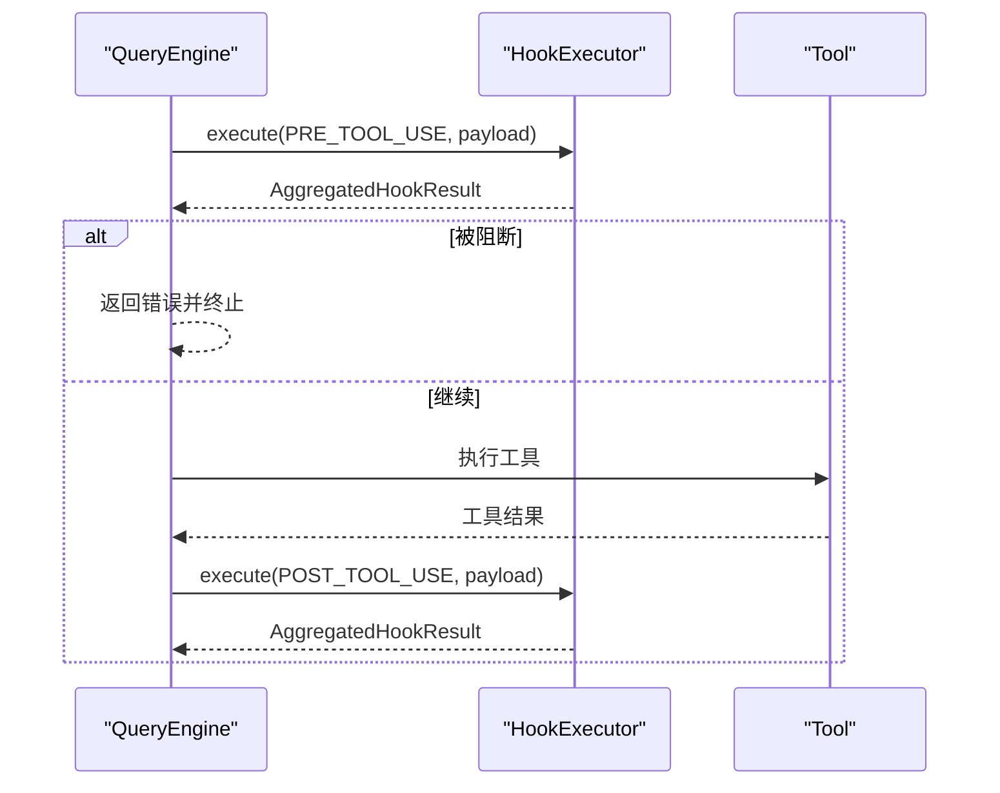
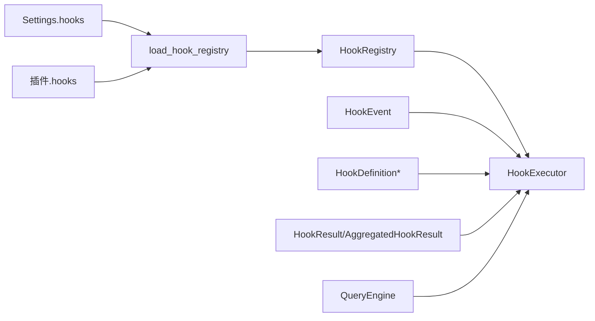

# 钩子架构设计

<cite>
**本文引用的文件**
- [hooks/__init__.py](file://src/openharness/hooks/__init__.py)
- [hooks/events.py](file://src/openharness/hooks/events.py)
- [hooks/executor.py](file://src/openharness/hooks/executor.py)
- [hooks/types.py](file://src/openharness/hooks/types.py)
- [hooks/schemas.py](file://src/openharness/hooks/schemas.py)
- [hooks/loader.py](file://src/openharness/hooks/loader.py)
- [hooks/hot_reload.py](file://src/openharness/hooks/hot_reload.py)
- [config/settings.py](file://src/openharness/config/settings.py)
- [engine/query.py](file://src/openharness/engine/query.py)
- [test_hooks/test_executor.py](file://tests/test_hooks/test_executor.py)
</cite>

## 目录
1. [简介](#简介)
2. [项目结构](#项目结构)
3. [核心组件](#核心组件)
4. [架构总览](#架构总览)
5. [详细组件分析](#详细组件分析)
6. [依赖关系分析](#依赖关系分析)
7. [性能考量](#性能考量)
8. [故障排查指南](#故障排查指南)
9. [结论](#结论)
10. [附录](#附录)

## 简介
本文件面向 OpenHarness 的钩子系统，系统性阐述其设计理念与整体架构模式，重点覆盖生命周期事件扩展机制、HookExecutor 执行引擎的工作原理（事件分发、异步执行、并发控制）、钩子注册表（HookRegistry）的管理方式（注册、查找、匹配算法）、钩子执行上下文（HookExecutionContext）的数据传递机制，以及钩子分类体系与不同类型钩子处理器的职责边界。文档同时提供多类架构图与时序图，帮助读者快速建立对钩子系统的完整认知。

## 项目结构
钩子系统位于 src/openharness/hooks 目录下，围绕“事件枚举、配置模型、执行引擎、结果类型、注册表与热重载”等模块协同工作，并通过配置层（Settings）与运行时引擎（如 QueryEngine）集成。

**图表来源**
- [hooks/__init__.py:1-51](file://src/openharness/hooks/__init__.py#L1-L51)
- [hooks/events.py:1-15](file://src/openharness/hooks/events.py#L1-L15)
- [hooks/schemas.py:1-59](file://src/openharness/hooks/schemas.py#L1-L59)
- [hooks/types.py:1-39](file://src/openharness/hooks/types.py#L1-L39)
- [hooks/loader.py:1-61](file://src/openharness/hooks/loader.py#L1-L61)
- [hooks/hot_reload.py:1-32](file://src/openharness/hooks/hot_reload.py#L1-L32)
- [config/settings.py:1-161](file://src/openharness/config/settings.py#L1-L161)
- [engine/query.py:120-212](file://src/openharness/engine/query.py#L120-L212)

**章节来源**
- [hooks/__init__.py:1-51](file://src/openharness/hooks/__init__.py#L1-L51)
- [hooks/events.py:1-15](file://src/openharness/hooks/events.py#L1-L15)
- [hooks/schemas.py:1-59](file://src/openharness/hooks/schemas.py#L1-L59)
- [hooks/types.py:1-39](file://src/openharness/hooks/types.py#L1-L39)
- [hooks/loader.py:1-61](file://src/openharness/hooks/loader.py#L1-L61)
- [hooks/hot_reload.py:1-32](file://src/openharness/hooks/hot_reload.py#L1-L32)
- [config/settings.py:1-161](file://src/openharness/config/settings.py#L1-L161)
- [engine/query.py:120-212](file://src/openharness/engine/query.py#L120-L212)

## 核心组件
- 事件枚举：定义可触发钩子的生命周期事件集合，确保事件名稳定且语义明确。
- 配置模型：统一描述四类钩子（命令、HTTP、提示词、代理）的结构与约束。
- 结果类型：封装单次钩子执行与聚合结果，提供阻断判定与原因汇总。
- 注册表：按事件分组存储钩子定义，支持汇总展示与动态加载。
- 执行引擎：负责事件分发、条件匹配、异步执行与并发控制，输出标准化结果。
- 热重载：基于配置文件时间戳检测变更，按需重建注册表。
- 导出入口：集中暴露钩子相关类型与工厂方法，便于上层模块按需导入。

**章节来源**
- [hooks/events.py:8-15](file://src/openharness/hooks/events.py#L8-L15)
- [hooks/schemas.py:10-58](file://src/openharness/hooks/schemas.py#L10-L58)
- [hooks/types.py:9-39](file://src/openharness/hooks/types.py#L9-L39)
- [hooks/loader.py:10-38](file://src/openharness/hooks/loader.py#L10-L38)
- [hooks/executor.py:29-63](file://src/openharness/hooks/executor.py#L29-L63)
- [hooks/hot_reload.py:11-32](file://src/openharness/hooks/hot_reload.py#L11-L32)
- [hooks/__init__.py:13-51](file://src/openharness/hooks/__init__.py#L13-L51)

## 架构总览
钩子系统采用“配置驱动 + 执行引擎 + 上下文注入”的架构模式。配置层（Settings）提供 hooks 字典，注册表（HookRegistry）将其解析为事件到钩子列表的映射；执行引擎（HookExecutor）根据当前事件与负载（payload）进行条件匹配与异步执行；结果类型（HookResult/AggregatedHookResult）统一承载成功/失败、阻断与元信息；热重载（HookReloader）在配置文件变化时自动刷新注册表。

**图表来源**
- [hooks/executor.py:49-63](file://src/openharness/hooks/executor.py#L49-L63)
- [hooks/loader.py:20-22](file://src/openharness/hooks/loader.py#L20-L22)
- [engine/query.py:130-210](file://src/openharness/engine/query.py#L130-L210)

## 详细组件分析

### HookEvent 事件枚举
- 定义了会话开始/结束、工具使用前/后四个生命周期事件，作为钩子触发的信号源。
- 事件值用于在环境变量、HTTP 负载与日志中保持一致的标识。

**章节来源**
- [hooks/events.py:8-15](file://src/openharness/hooks/events.py#L8-L15)

### 钩子配置模型（Schema）
- 命令钩子：执行 shell 命令，支持超时、匹配器与失败阻断。
- HTTP 钩子：向指定 URL 发送 JSON 负载，支持超时、请求头与失败阻断。
- 提示词钩子：通过模型判断是否允许继续，失败默认阻断。
- 代理钩子：与提示词钩子类似，但提示更深入，失败默认阻断。
- 共同字段：type、timeout_seconds、matcher、block_on_failure；每类有特定字段（如命令钩子的 command、HTTP 钩子的 url/headers、提示词钩子的 prompt/model）。

**图表来源**
- [hooks/schemas.py:10-58](file://src/openharness/hooks/schemas.py#L10-L58)

**章节来源**
- [hooks/schemas.py:10-58](file://src/openharness/hooks/schemas.py#L10-L58)

### HookExecutionContext 执行上下文
- 持有执行所需的基础信息：工作目录、流式消息客户端、默认模型。
- 作为执行引擎的外部依赖注入点，保证钩子执行的一致性与可测试性。

**章节来源**
- [hooks/executor.py:29-36](file://src/openharness/hooks/executor.py#L29-L36)

### HookExecutor 执行引擎
- 事件分发：按事件从注册表取出钩子列表，逐个执行。
- 条件匹配：通过匹配器（fnmatch）对 payload 中的工具名/提示词/事件进行通配匹配。
- 异步执行与并发控制：各钩子独立异步执行，最终聚合结果；未显式并发池，遵循 Python 异步模型。
- 处理器分支：命令、HTTP、提示词、代理四类处理器分别实现。
- 错误处理：超时、异常、非零退出码、失败阻断等均有明确返回与元信息。

**图表来源**
- [hooks/executor.py:49-63](file://src/openharness/hooks/executor.py#L49-L63)
- [hooks/executor.py:194-199](file://src/openharness/hooks/executor.py#L194-L199)

**章节来源**
- [hooks/executor.py:38-217](file://src/openharness/hooks/executor.py#L38-L217)

### HookRegistry 注册表与热重载
- 注册表：按事件分组存储钩子，提供注册、查询与人类可读摘要。
- 加载：从 Settings 与插件中合并钩子，忽略非法事件值。
- 热重载：基于配置文件修改时间戳检测变更，必要时重新加载并替换当前注册表。

**图表来源**
- [hooks/hot_reload.py:19-31](file://src/openharness/hooks/hot_reload.py#L19-L31)
- [hooks/loader.py:40-60](file://src/openharness/hooks/loader.py#L40-L60)

**章节来源**
- [hooks/loader.py:10-61](file://src/openharness/hooks/loader.py#L10-L61)
- [hooks/hot_reload.py:11-32](file://src/openharness/hooks/hot_reload.py#L11-L32)

### 钩子结果类型
- 单次结果（HookResult）：包含钩子类型、成功标志、输出文本、阻断标志、原因与元信息。
- 聚合结果（AggregatedHookResult）：汇总所有钩子结果，提供阻断判定与首个阻断原因。

**章节来源**
- [hooks/types.py:9-39](file://src/openharness/hooks/types.py#L9-L39)

### 在引擎中的集成点
- 查询引擎在工具调用前后触发钩子：PRE_TOOL_USE 与 POST_TOOL_USE。
- PRE_TOOL_USE：若聚合结果阻断，则直接返回错误；否则继续执行工具。
- POST_TOOL_USE：无论是否阻断，均在工具执行后触发，用于记录与审计。

**图表来源**
- [engine/query.py:130-210](file://src/openharness/engine/query.py#L130-L210)

**章节来源**
- [engine/query.py:124-212](file://src/openharness/engine/query.py#L124-L212)

## 依赖关系分析
- 低耦合：执行引擎仅依赖注册表接口与事件枚举，不关心具体钩子实现细节。
- 配置驱动：注册表与热重载依赖 Settings 与插件钩子，形成“配置即行为”的扩展点。
- 可测试性：执行上下文注入与假客户端（测试中使用）便于隔离验证。

**图表来源**
- [config/settings.py:61-62](file://src/openharness/config/settings.py#L61-L62)
- [hooks/loader.py:40-60](file://src/openharness/hooks/loader.py#L40-L60)
- [hooks/executor.py:17-26](file://src/openharness/hooks/executor.py#L17-L26)
- [engine/query.py:130-210](file://src/openharness/engine/query.py#L130-L210)

**章节来源**
- [config/settings.py:49-75](file://src/openharness/config/settings.py#L49-L75)
- [hooks/loader.py:40-60](file://src/openharness/hooks/loader.py#L40-L60)
- [hooks/executor.py:17-26](file://src/openharness/hooks/executor.py#L17-L26)
- [engine/query.py:130-210](file://src/openharness/engine/query.py#L130-L210)

## 性能考量
- 异步执行：命令与 HTTP 钩子均采用异步等待与超时控制，避免阻塞事件循环。
- 并发策略：钩子之间并发执行，但未引入显式的并发池限制，建议在高并发场景下通过配置合理设置超时与阻断策略。
- 匹配开销：匹配器为通配符匹配，复杂度与匹配串长度线性相关，建议在 matcher 中使用简洁模式。
- I/O 优化：命令钩子通过 shell 执行与管道捕获输出，注意避免过长输出导致内存压力。

## 故障排查指南
- 命令钩子失败：检查返回码、标准输出与错误输出；确认环境变量 OPENHARNESS_HOOK_EVENT 与 OPENHARNESS_HOOK_PAYLOAD 是否正确注入。
- HTTP 钩子失败：检查网络连通性、URL 与请求头；关注状态码与响应体。
- 提示词/代理钩子失败：确认模型可用、JSON 解析结果符合规范；若返回非严格 JSON，将尝试宽松解析。
- 阻断判定：若 block_on_failure 为真且钩子失败，则聚合结果会被标记为阻断；可通过聚合结果的 reason 获取首个阻断原因。
- 热重载无效：确认配置文件路径与权限；检查文件修改时间戳是否更新。

**章节来源**
- [hooks/executor.py:65-115](file://src/openharness/hooks/executor.py#L65-L115)
- [hooks/executor.py:117-146](file://src/openharness/hooks/executor.py#L117-L146)
- [hooks/executor.py:148-191](file://src/openharness/hooks/executor.py#L148-L191)
- [hooks/types.py:27-39](file://src/openharness/hooks/types.py#L27-L39)
- [hooks/hot_reload.py:19-31](file://src/openharness/hooks/hot_reload.py#L19-L31)

## 结论
OpenHarness 的钩子系统以“事件 + 配置 + 执行引擎”为核心，通过清晰的类型体系与严格的生命周期扩展点，实现了对会话与工具调用的灵活控制。执行引擎在异步与超时控制方面表现稳健，注册表与热重载提供了便捷的配置管理能力。建议在生产环境中结合阻断策略与监控指标，持续优化钩子的稳定性与可观测性。

## 附录
- 使用示例参考：测试用例展示了命令钩子与提示词钩子的典型用法与断言逻辑，可作为集成与调试的参考模板。

**章节来源**
- [test_hooks/test_executor.py:32-73](file://tests/test_hooks/test_executor.py#L32-L73)