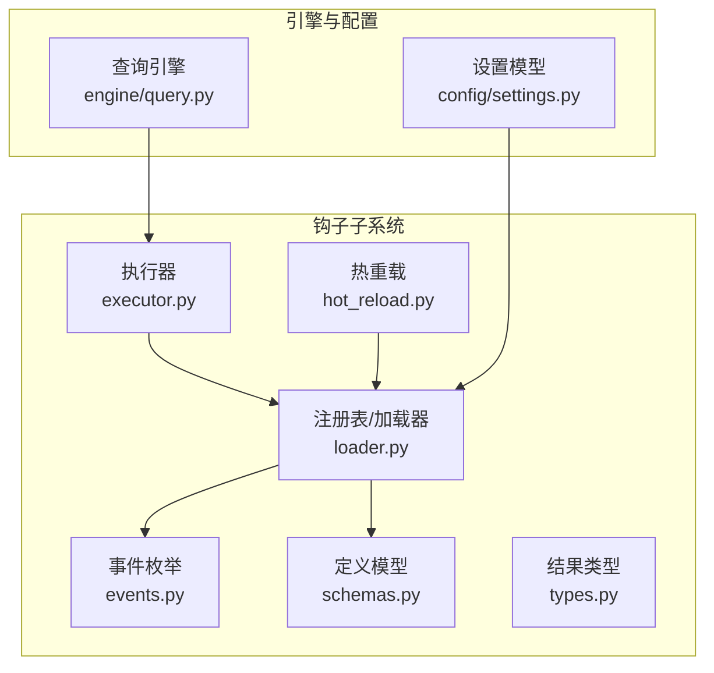
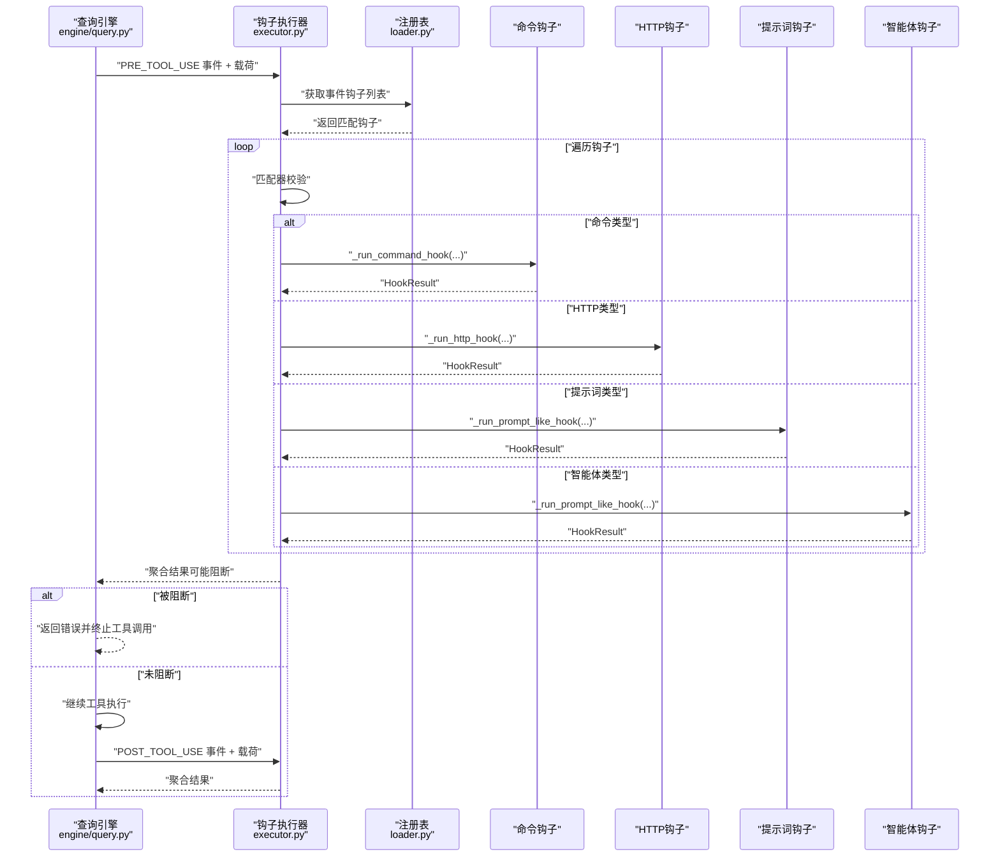
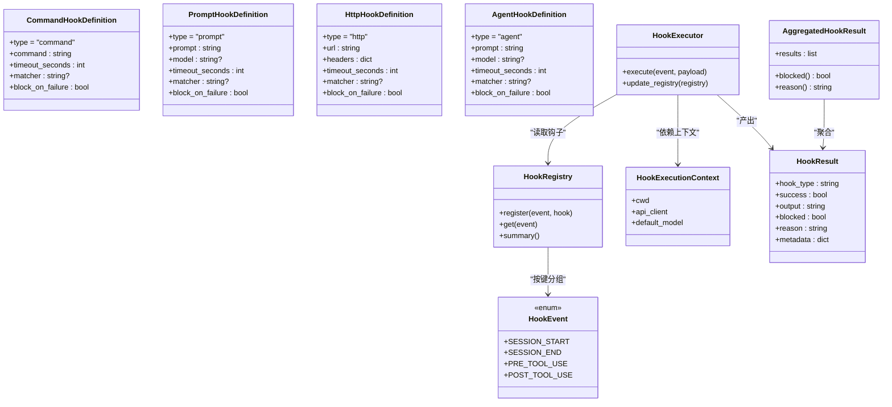
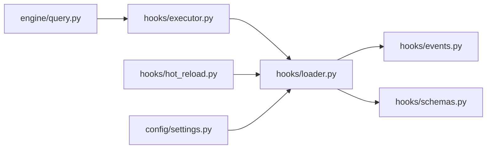

# 钩子类型与事件

<cite>
**本文引用的文件**
- [src/openharness/hooks/__init__.py](file://src/openharness/hooks/__init__.py)
- [src/openharness/hooks/events.py](file://src/openharness/hooks/events.py)
- [src/openharness/hooks/types.py](file://src/openharness/hooks/types.py)
- [src/openharness/hooks/schemas.py](file://src/openharness/hooks/schemas.py)
- [src/openharness/hooks/executor.py](file://src/openharness/hooks/executor.py)
- [src/openharness/hooks/loader.py](file://src/openharness/hooks/loader.py)
- [src/openharness/hooks/hot_reload.py](file://src/openharness/hooks/hot_reload.py)
- [src/openharness/engine/query.py](file://src/openharness/engine/query.py)
- [src/openharness/config/settings.py](file://src/openharness/config/settings.py)
- [tests/test_hooks/test_executor.py](file://tests/test_hooks/test_executor.py)
</cite>

## 目录
1. [简介](#简介)
2. [项目结构](#项目结构)
3. [核心组件](#核心组件)
4. [架构总览](#架构总览)
5. [详细组件分析](#详细组件分析)
6. [依赖分析](#依赖分析)
7. [性能考虑](#性能考虑)
8. [故障排查指南](#故障排查指南)
9. [结论](#结论)
10. [附录](#附录)

## 简介
本文件系统性介绍 OpenHarness 的钩子类型与事件系统，覆盖以下主题：
- 可用的钩子事件类型及其生命周期语义与触发时机
- 钩子定义类型（CommandHookDefinition、HttpHookDefinition、PromptHookDefinition、AgentHookDefinition）的特性与适用场景
- 事件载荷（payload）的数据结构与传递机制
- 钩子匹配器（matcher）的模式匹配与通配符使用
- 各类事件的使用示例与最佳实践

## 项目结构
钩子系统由“事件枚举”“定义模型”“执行器”“注册表/加载器/热重载”“结果类型”等模块组成，贯穿引擎与配置层，形成可配置、可观测、可扩展的安全控制点。

图表来源
- [src/openharness/hooks/events.py:8-15](file://src/openharness/hooks/events.py#L8-L15)
- [src/openharness/hooks/schemas.py:10-58](file://src/openharness/hooks/schemas.py#L10-L58)
- [src/openharness/hooks/types.py:9-39](file://src/openharness/hooks/types.py#L9-L39)
- [src/openharness/hooks/loader.py:10-60](file://src/openharness/hooks/loader.py#L10-L60)
- [src/openharness/hooks/executor.py:38-216](file://src/openharness/hooks/executor.py#L38-L216)
- [src/openharness/hooks/hot_reload.py:11-31](file://src/openharness/hooks/hot_reload.py#L11-L31)
- [src/openharness/engine/query.py:124-211](file://src/openharness/engine/query.py#L124-L211)
- [src/openharness/config/settings.py:49-64](file://src/openharness/config/settings.py#L49-L64)

章节来源
- [src/openharness/hooks/__init__.py:13-21](file://src/openharness/hooks/__init__.py#L13-L21)
- [src/openharness/hooks/events.py:8-15](file://src/openharness/hooks/events.py#L8-L15)
- [src/openharness/hooks/schemas.py:10-58](file://src/openharness/hooks/schemas.py#L10-L58)
- [src/openharness/hooks/types.py:9-39](file://src/openharness/hooks/types.py#L9-L39)
- [src/openharness/hooks/loader.py:10-60](file://src/openharness/hooks/loader.py#L10-L60)
- [src/openharness/hooks/executor.py:38-216](file://src/openharness/hooks/executor.py#L38-L216)
- [src/openharness/hooks/hot_reload.py:11-31](file://src/openharness/hooks/hot_reload.py#L11-L31)
- [src/openharness/engine/query.py:124-211](file://src/openharness/engine/query.py#L124-L211)
- [src/openharness/config/settings.py:49-64](file://src/openharness/config/settings.py#L49-L64)

## 核心组件
- 事件枚举：定义可触发钩子的生命周期事件集合
- 定义模型：描述不同类型的钩子如何执行（命令、HTTP、提示词、智能体）
- 执行器：按事件分发并执行匹配的钩子，收集结果
- 注册表/加载器：从设置与插件中加载钩子，按事件分组管理
- 结果类型：单钩子与聚合结果的结构化输出
- 热重载：基于设置文件变更自动重载钩子定义

章节来源
- [src/openharness/hooks/events.py:8-15](file://src/openharness/hooks/events.py#L8-L15)
- [src/openharness/hooks/schemas.py:10-58](file://src/openharness/hooks/schemas.py#L10-L58)
- [src/openharness/hooks/executor.py:38-63](file://src/openharness/hooks/executor.py#L38-L63)
- [src/openharness/hooks/loader.py:10-38](file://src/openharness/hooks/loader.py#L10-L38)
- [src/openharness/hooks/types.py:9-39](file://src/openharness/hooks/types.py#L9-L39)
- [src/openharness/hooks/hot_reload.py:11-31](file://src/openharness/hooks/hot_reload.py#L11-L31)

## 架构总览
钩子系统在引擎工具调用链路中插入安全检查与可观察能力，支持阻断与日志记录。

图表来源
- [src/openharness/engine/query.py:124-211](file://src/openharness/engine/query.py#L124-L211)
- [src/openharness/hooks/executor.py:49-63](file://src/openharness/hooks/executor.py#L49-L63)
- [src/openharness/hooks/loader.py:20-22](file://src/openharness/hooks/loader.py#L20-L22)

## 详细组件分析

### 事件类型与触发时机
- SESSION_START：会话开始时触发
- SESSION_END：会话结束时触发
- PRE_TOOL_USE：工具调用前触发，用于前置审批或审计
- POST_TOOL_USE：工具调用后触发，用于后置审计或上报

章节来源
- [src/openharness/hooks/events.py:8-15](file://src/openharness/hooks/events.py#L8-L15)
- [src/openharness/engine/query.py:124-211](file://src/openharness/engine/query.py#L124-L211)

### 钩子定义类型与适用场景
- 命令钩子（CommandHookDefinition）
  - 特点：以 shell 命令形式执行，支持超时、阻断失败、通配符匹配
  - 适用：本地脚本审批、审计日志、环境探测
- 提示词钩子（PromptHookDefinition）
  - 特点：通过模型判断是否允许，支持阻断失败
  - 适用：策略校验、合规检查
- HTTP 钩子（HttpHookDefinition）
  - 特点：向远端服务上报事件载荷，支持自定义头部与阻断失败
  - 适用：集中式审计、外部风控
- 智能体钩子（AgentHookDefinition）
  - 特点：更深入的模型推理，适合复杂决策
  - 适用：高风险动作的深度审核

章节来源
- [src/openharness/hooks/schemas.py:10-58](file://src/openharness/hooks/schemas.py#L10-L58)

### 事件载荷（payload）结构与传递机制
- 工具调用前（PRE_TOOL_USE）
  - 字段：工具名、输入参数、事件标识
- 工具调用后（POST_TOOL_USE）
  - 字段：工具名、输入参数、输出内容、是否错误、事件标识
- 匹配器（matcher）依据字段进行模式匹配

章节来源
- [src/openharness/engine/query.py:124-211](file://src/openharness/engine/query.py#L124-L211)
- [src/openharness/hooks/executor.py:194-199](file://src/openharness/hooks/executor.py#L194-L199)

### 钩子匹配器（matcher）与通配符
- 匹配逻辑：若定义了匹配器，则对 subject 进行通配符匹配
- subject 来源：优先取工具名，其次取提示词，再其次取事件值
- 通配符：使用标准通配符规则（如星号、问号）

章节来源
- [src/openharness/hooks/executor.py:194-199](file://src/openharness/hooks/executor.py#L194-L199)

### 执行流程与结果
- 执行器按事件收集匹配钩子，分别执行
- 命令钩子：注入载荷到环境变量，执行后解析返回码与输出
- HTTP 钩子：发送 JSON 载荷，解析响应文本与状态码
- 提示词/智能体钩子：构造系统提示与用户消息，解析模型返回的 JSON 或布尔值
- 聚合结果：任一钩子阻断则整体阻断；聚合结果包含每个钩子的执行情况

章节来源
- [src/openharness/hooks/executor.py:49-63](file://src/openharness/hooks/executor.py#L49-L63)
- [src/openharness/hooks/executor.py:65-115](file://src/openharness/hooks/executor.py#L65-L115)
- [src/openharness/hooks/executor.py:117-146](file://src/openharness/hooks/executor.py#L117-L146)
- [src/openharness/hooks/executor.py:148-191](file://src/openharness/hooks/executor.py#L148-L191)
- [src/openharness/hooks/types.py:21-39](file://src/openharness/hooks/types.py#L21-L39)

### 配置与加载
- 设置模型包含 hooks 字典，键为事件名，值为钩子定义列表
- 加载器从设置与插件合并钩子，转换为事件分组的注册表
- 热重载监听设置文件变更，按需重建注册表

章节来源
- [src/openharness/config/settings.py:49-64](file://src/openharness/config/settings.py#L49-L64)
- [src/openharness/hooks/loader.py:40-60](file://src/openharness/hooks/loader.py#L40-L60)
- [src/openharness/hooks/hot_reload.py:19-31](file://src/openharness/hooks/hot_reload.py#L19-L31)

### 类型与接口概览

图表来源
- [src/openharness/hooks/events.py:8-15](file://src/openharness/hooks/events.py#L8-L15)
- [src/openharness/hooks/schemas.py:10-58](file://src/openharness/hooks/schemas.py#L10-L58)
- [src/openharness/hooks/loader.py:10-38](file://src/openharness/hooks/loader.py#L10-L38)
- [src/openharness/hooks/executor.py:29-36](file://src/openharness/hooks/executor.py#L29-L36)
- [src/openharness/hooks/executor.py:38-63](file://src/openharness/hooks/executor.py#L38-L63)
- [src/openharness/hooks/types.py:9-39](file://src/openharness/hooks/types.py#L9-L39)

## 依赖分析
- 引擎对钩子系统的依赖：在工具调用前后触发事件，传递载荷并处理阻断
- 执行器对注册表与上下文的依赖：按事件检索钩子并执行
- 加载器对设置与插件的依赖：统一构建注册表
- 热重载对设置文件的依赖：基于文件时间戳变更重建注册表

图表来源
- [src/openharness/engine/query.py:124-211](file://src/openharness/engine/query.py#L124-L211)
- [src/openharness/hooks/executor.py:38-63](file://src/openharness/hooks/executor.py#L38-L63)
- [src/openharness/hooks/loader.py:10-60](file://src/openharness/hooks/loader.py#L10-L60)
- [src/openharness/hooks/hot_reload.py:19-31](file://src/openharness/hooks/hot_reload.py#L19-L31)
- [src/openharness/config/settings.py:49-64](file://src/openharness/config/settings.py#L49-L64)

章节来源
- [src/openharness/engine/query.py:124-211](file://src/openharness/engine/query.py#L124-L211)
- [src/openharness/hooks/executor.py:38-63](file://src/openharness/hooks/executor.py#L38-L63)
- [src/openharness/hooks/loader.py:10-60](file://src/openharness/hooks/loader.py#L10-L60)
- [src/openharness/hooks/hot_reload.py:19-31](file://src/openharness/hooks/hot_reload.py#L19-L31)
- [src/openharness/config/settings.py:49-64](file://src/openharness/config/settings.py#L49-L64)

## 性能考虑
- 并发执行：执行器对同事件钩子采用顺序遍历，未并发执行；若存在多个 HTTP 或命令钩子，建议合理设置超时与阻断策略
- 超时控制：命令与 HTTP 钩子均支持超时，避免阻塞主流程
- 模型钩子：提示词与智能体钩子依赖流式消息，注意网络与模型响应延迟
- 匹配开销：通配符匹配成本较低，但应避免过于复杂的匹配模式

## 故障排查指南
- 命令钩子失败
  - 现象：返回非零退出码或超时
  - 排查：检查命令、工作目录、环境变量、超时设置
- HTTP 钩子失败
  - 现象：网络异常或非成功状态码
  - 排查：检查 URL、头部、超时、目标可达性
- 提示词/智能体钩子拒绝
  - 现象：模型返回非预期 JSON 或拒绝
  - 排查：调整提示词、模型、超时；确认输出格式要求
- 钩子未触发
  - 现象：未命中匹配器或事件未发生
  - 排查：核对事件名、匹配器通配符、载荷字段

章节来源
- [src/openharness/hooks/executor.py:65-115](file://src/openharness/hooks/executor.py#L65-L115)
- [src/openharness/hooks/executor.py:117-146](file://src/openharness/hooks/executor.py#L117-L146)
- [src/openharness/hooks/executor.py:148-191](file://src/openharness/hooks/executor.py#L148-L191)
- [src/openharness/hooks/executor.py:194-199](file://src/openharness/hooks/executor.py#L194-L199)

## 结论
OpenHarness 的钩子系统通过清晰的事件模型、可配置的钩子类型与严格的匹配机制，为工具调用提供了强大的安全边界与可观测性。开发者可根据场景选择合适的钩子类型，并结合匹配器与阻断策略实现细粒度的控制。

## 附录

### 使用示例与最佳实践
- 示例：命令钩子在会话开始时执行
  - 场景：启动脚本、环境初始化、审计日志
  - 关键点：设置超时、必要时阻断失败
  - 参考路径：[tests/test_hooks/test_executor.py:32-48](file://tests/test_hooks/test_executor.py#L32-L48)
- 示例：提示词钩子在工具调用前阻断敏感操作
  - 场景：禁止危险命令、限制写入路径
  - 关键点：合理设计提示词、启用阻断失败
  - 参考路径：[tests/test_hooks/test_executor.py:50-73](file://tests/test_hooks/test_executor.py#L50-L73)
- 最佳实践
  - 明确事件边界：仅在 PRE_TOOL_USE 做阻断，在 POST_TOOL_USE 做审计
  - 使用匹配器：以工具名为基础进行通配符匹配，避免误伤
  - 控制超时：为命令与 HTTP 钩子设置合理上限
  - 统一输出格式：提示词/智能体钩子返回严格 JSON，便于解析
  - 配置热重载：开发阶段启用热重载，减少重启成本
  - 参考路径：[src/openharness/hooks/hot_reload.py:19-31](file://src/openharness/hooks/hot_reload.py#L19-L31)