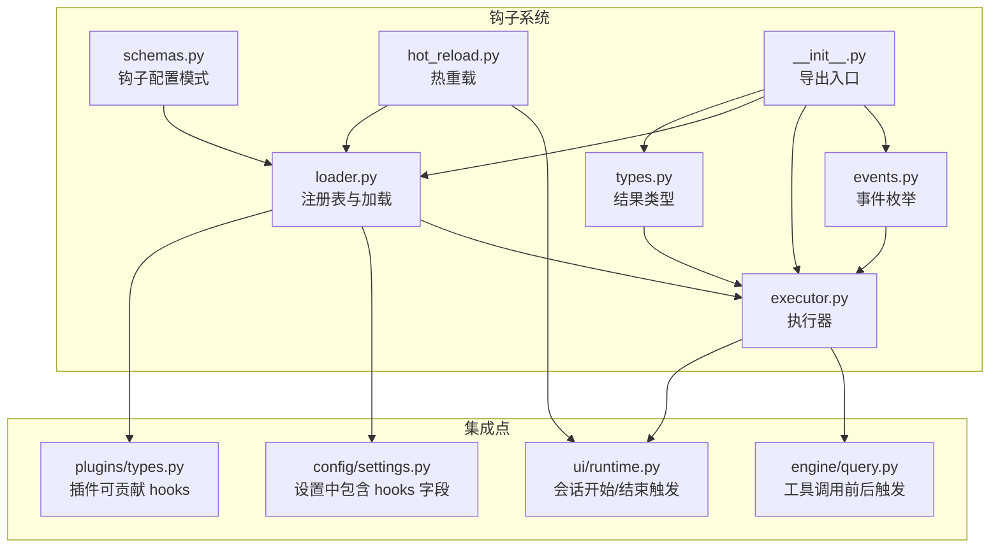
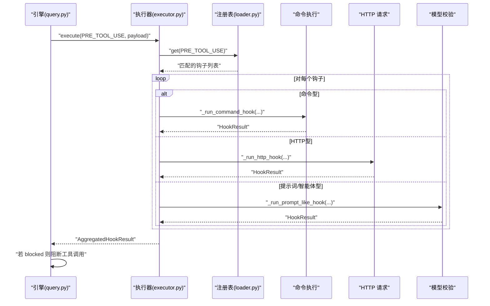
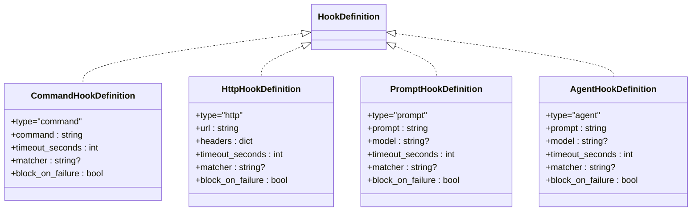
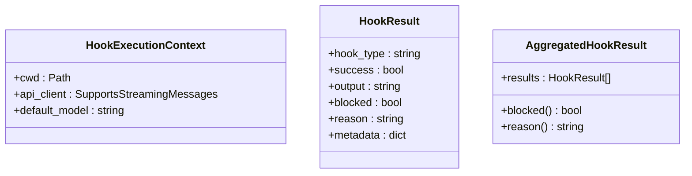
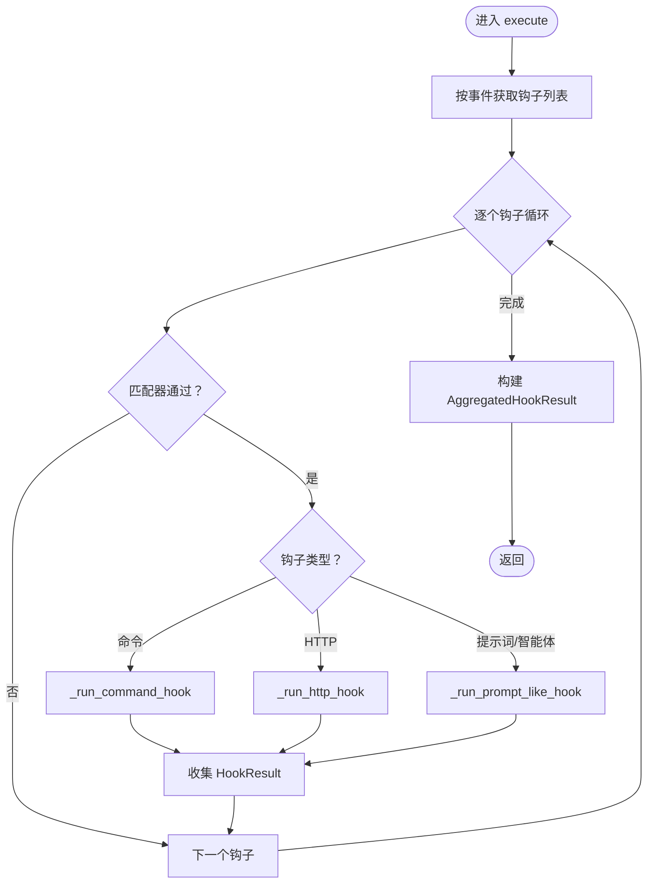
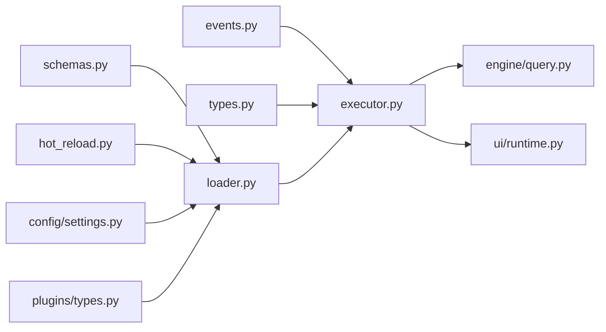

# 钩子系统

<cite>
**本文引用的文件**
- [src/openharness/hooks/__init__.py](file://src/openharness/hooks/__init__.py)
- [src/openharness/hooks/events.py](file://src/openharness/hooks/events.py)
- [src/openharness/hooks/executor.py](file://src/openharness/hooks/executor.py)
- [src/openharness/hooks/loader.py](file://src/openharness/hooks/loader.py)
- [src/openharness/hooks/types.py](file://src/openharness/hooks/types.py)
- [src/openharness/hooks/schemas.py](file://src/openharness/hooks/schemas.py)
- [src/openharness/hooks/hot_reload.py](file://src/openharness/hooks/hot_reload.py)
- [src/openharness/engine/query.py](file://src/openharness/engine/query.py)
- [src/openharness/ui/runtime.py](file://src/openharness/ui/runtime.py)
- [src/openharness/config/settings.py](file://src/openharness/config/settings.py)
- [src/openharness/plugins/types.py](file://src/openharness/plugins/types.py)
- [tests/test_hooks/test_executor.py](file://tests/test_hooks/test_executor.py)
</cite>

## 目录
1. [简介](#简介)
2. [项目结构](#项目结构)
3. [核心组件](#核心组件)
4. [架构总览](#架构总览)
5. [详细组件分析](#详细组件分析)
6. [依赖分析](#依赖分析)
7. [性能考量](#性能考量)
8. [故障排查指南](#故障排查指南)
9. [结论](#结论)
10. [附录：钩子开发指南与示例](#附录钩子开发指南与示例)

## 简介
本文件系统性阐述 OpenHarness 的钩子（Hook）系统设计与实现，重点覆盖以下方面：
- 生命周期事件扩展的重要性与灵活性：通过会话开始/结束、工具调用前/后等事件，将安全策略、审计、通知、策略校验等横切能力注入到系统关键节点。
- 钩子类型分类：命令型、HTTP 型、提示词型、智能体型，分别用于执行外部命令、向远端服务上报、基于模型进行条件判断与阻断。
- 执行机制：事件触发、匹配过滤、顺序执行、超时控制、错误处理与阻断策略。
- 注册与管理：从设置文件与插件动态加载、热重载、汇总展示。
- 开发指南：接口与数据结构、最佳实践、典型场景与示例。

## 项目结构
钩子系统位于 src/openharness/hooks 目录，围绕事件枚举、执行器、注册表、配置模式、结果类型与热重载展开，并在引擎与运行时中被集成使用。

图表来源
- [src/openharness/hooks/events.py:8-15](file://src/openharness/hooks/events.py#L8-L15)
- [src/openharness/hooks/schemas.py:10-58](file://src/openharness/hooks/schemas.py#L10-L58)
- [src/openharness/hooks/types.py:9-39](file://src/openharness/hooks/types.py#L9-L39)
- [src/openharness/hooks/loader.py:10-61](file://src/openharness/hooks/loader.py#L10-L61)
- [src/openharness/hooks/executor.py:38-217](file://src/openharness/hooks/executor.py#L38-L217)
- [src/openharness/hooks/hot_reload.py:11-32](file://src/openharness/hooks/hot_reload.py#L11-L32)
- [src/openharness/engine/query.py:124-212](file://src/openharness/engine/query.py#L124-L212)
- [src/openharness/ui/runtime.py:89-194](file://src/openharness/ui/runtime.py#L89-L194)
- [src/openharness/config/settings.py:49-65](file://src/openharness/config/settings.py#L49-L65)
- [src/openharness/plugins/types.py:14-33](file://src/openharness/plugins/types.py#L14-L33)

章节来源
- [src/openharness/hooks/__init__.py:13-21](file://src/openharness/hooks/__init__.py#L13-L21)
- [src/openharness/hooks/events.py:8-15](file://src/openharness/hooks/events.py#L8-L15)
- [src/openharness/hooks/schemas.py:10-58](file://src/openharness/hooks/schemas.py#L10-L58)
- [src/openharness/hooks/types.py:9-39](file://src/openharness/hooks/types.py#L9-L39)
- [src/openharness/hooks/loader.py:10-61](file://src/openharness/hooks/loader.py#L10-L61)
- [src/openharness/hooks/executor.py:38-217](file://src/openharness/hooks/executor.py#L38-L217)
- [src/openharness/hooks/hot_reload.py:11-32](file://src/openharness/hooks/hot_reload.py#L11-L32)
- [src/openharness/engine/query.py:124-212](file://src/openharness/engine/query.py#L124-L212)
- [src/openharness/ui/runtime.py:89-194](file://src/openharness/ui/runtime.py#L89-L194)
- [src/openharness/config/settings.py:49-65](file://src/openharness/config/settings.py#L49-L65)
- [src/openharness/plugins/types.py:14-33](file://src/openharness/plugins/types.py#L14-L33)

## 核心组件
- 事件枚举：定义可触发的生命周期事件，如会话开始、会话结束、工具调用前、工具调用后。
- 配置模式：定义四类钩子的结构与字段，含超时、匹配器、阻断策略等。
- 执行上下文：传递工作目录、消息流客户端、默认模型等。
- 执行器：按事件遍历匹配钩子，异步执行命令、HTTP、提示词或智能体钩子，聚合结果并支持阻断。
- 注册表：按事件分组存储钩子列表，支持汇总展示。
- 热重载：监听设置文件变更，按需重新加载钩子注册表。
- 集成点：引擎在工具调用前后触发钩子；UI 在会话开始/结束触发钩子；设置与插件提供钩子来源。

章节来源
- [src/openharness/hooks/events.py:8-15](file://src/openharness/hooks/events.py#L8-L15)
- [src/openharness/hooks/schemas.py:10-58](file://src/openharness/hooks/schemas.py#L10-L58)
- [src/openharness/hooks/executor.py:29-39](file://src/openharness/hooks/executor.py#L29-L39)
- [src/openharness/hooks/types.py:9-39](file://src/openharness/hooks/types.py#L9-L39)
- [src/openharness/hooks/loader.py:10-38](file://src/openharness/hooks/loader.py#L10-L38)
- [src/openharness/hooks/hot_reload.py:11-32](file://src/openharness/hooks/hot_reload.py#L11-L32)

## 架构总览
钩子系统以“事件驱动 + 多类型执行器”的方式，将横切逻辑解耦于业务流程。执行器根据事件选择匹配钩子，按类型路由到命令、HTTP、提示词或智能体执行路径，最终返回聚合结果，供上层决定是否阻断后续流程。

图表来源
- [src/openharness/engine/query.py:124-212](file://src/openharness/engine/query.py#L124-L212)
- [src/openharness/hooks/executor.py:49-63](file://src/openharness/hooks/executor.py#L49-L63)
- [src/openharness/hooks/loader.py:20-22](file://src/openharness/hooks/loader.py#L20-L22)

## 详细组件分析

### 事件与生命周期
- 事件类型：会话开始、会话结束、工具调用前、工具调用后。
- 触发时机：UI 层在会话启动与关闭时触发；引擎在工具调用前后触发，确保对工具行为进行前置校验与后置审计。

章节来源
- [src/openharness/hooks/events.py:8-15](file://src/openharness/hooks/events.py#L8-L15)
- [src/openharness/ui/runtime.py:180-193](file://src/openharness/ui/runtime.py#L180-L193)
- [src/openharness/engine/query.py:130-210](file://src/openharness/engine/query.py#L130-L210)

### 钩子类型与配置模式
- 命令型：执行 shell 命令，支持超时、阻断策略与匹配器。
- HTTP 型：POST 事件与负载到远端地址，支持超时、阻断策略与匹配器。
- 提示词型：请求模型判断条件是否满足，严格返回 JSON 结构，失败可阻断。
- 智能体型：更深入的模型推理，失败可阻断，适合复杂策略。

图表来源
- [src/openharness/hooks/schemas.py:10-58](file://src/openharness/hooks/schemas.py#L10-L58)

章节来源
- [src/openharness/hooks/schemas.py:10-58](file://src/openharness/hooks/schemas.py#L10-L58)

### 执行上下文与结果类型
- 执行上下文：包含工作目录、消息流客户端、默认模型，为提示词/智能体钩子提供推理环境。
- 结果类型：单个钩子结果包含成功标志、输出、阻断标记、原因与元数据；聚合结果提供整体阻断状态与首个阻断原因。

图表来源
- [src/openharness/hooks/executor.py:29-39](file://src/openharness/hooks/executor.py#L29-L39)
- [src/openharness/hooks/types.py:9-39](file://src/openharness/hooks/types.py#L9-L39)

章节来源
- [src/openharness/hooks/executor.py:29-39](file://src/openharness/hooks/executor.py#L29-L39)
- [src/openharness/hooks/types.py:9-39](file://src/openharness/hooks/types.py#L9-L39)

### 执行器：事件触发、匹配与执行
- 事件触发：按事件名检索注册表，过滤匹配器，依次执行。
- 匹配器：支持通配符匹配工具名或提示词等主题字段。
- 执行路径：
  - 命令型：注入环境变量（事件名与负载），执行后解析输出与退出码。
  - HTTP 型：构造 JSON 负载，POST 到指定 URL，解析响应文本与状态码。
  - 提示词/智能体型：构造系统提示与用户消息，流式接收文本，解析严格 JSON 或宽松判定。
- 超时控制：统一采用超时秒数，避免阻塞。
- 错误处理：捕获异常、记录原因、必要时阻断后续流程。

图表来源
- [src/openharness/hooks/executor.py:49-63](file://src/openharness/hooks/executor.py#L49-L63)
- [src/openharness/hooks/executor.py:194-217](file://src/openharness/hooks/executor.py#L194-L217)

章节来源
- [src/openharness/hooks/executor.py:49-217](file://src/openharness/hooks/executor.py#L49-L217)

### 注册表与加载：动态加载与汇总
- 注册表：按事件维护钩子列表，支持获取与人类可读摘要。
- 加载：从设置对象与插件对象合并加载钩子，忽略无效事件值。
- 插件贡献：LoadedPlugin 中的 hooks 字典可直接参与注册。

章节来源
- [src/openharness/hooks/loader.py:10-61](file://src/openharness/hooks/loader.py#L10-L61)
- [src/openharness/config/settings.py:49-65](file://src/openharness/config/settings.py#L49-L65)
- [src/openharness/plugins/types.py:14-33](file://src/openharness/plugins/types.py#L14-L33)

### 热重载：设置文件变更自动生效
- HookReloader：监控设置文件修改时间，变更则重新加载钩子注册表。
- 运行时：在构建运行时环境中注入 HookReloader，按需刷新注册表。

章节来源
- [src/openharness/hooks/hot_reload.py:11-32](file://src/openharness/hooks/hot_reload.py#L11-L32)
- [src/openharness/ui/runtime.py:141-149](file://src/openharness/ui/runtime.py#L141-L149)

### 集成点：引擎与 UI 的钩子触发
- 引擎：在工具调用前执行 PRE_TOOL_USE，若阻断则返回错误；工具调用后执行 POST_TOOL_USE，携带输出与错误标记。
- UI：在会话开始与结束分别触发 SESSION_START 与 SESSION_END，便于初始化与收尾任务。

章节来源
- [src/openharness/engine/query.py:124-212](file://src/openharness/engine/query.py#L124-L212)
- [src/openharness/ui/runtime.py:180-193](file://src/openharness/ui/runtime.py#L180-L193)

## 依赖分析
- 组件内聚与耦合：
  - 执行器依赖事件枚举、注册表与配置模式，结果类型为其产物。
  - 注册表与加载器依赖事件枚举与配置模式。
  - 热重载依赖设置加载与注册表加载。
  - 引擎与 UI 作为外部使用者，仅依赖执行器与注册表加载。
- 外部依赖：
  - 异步 HTTP 客户端用于 HTTP 钩子。
  - 子进程执行用于命令钩子。
  - 消息流客户端用于提示词/智能体钩子。

图表来源
- [src/openharness/hooks/events.py:8-15](file://src/openharness/hooks/events.py#L8-L15)
- [src/openharness/hooks/schemas.py:10-58](file://src/openharness/hooks/schemas.py#L10-L58)
- [src/openharness/hooks/types.py:9-39](file://src/openharness/hooks/types.py#L9-L39)
- [src/openharness/hooks/loader.py:10-61](file://src/openharness/hooks/loader.py#L10-L61)
- [src/openharness/hooks/hot_reload.py:11-32](file://src/openharness/hooks/hot_reload.py#L11-L32)
- [src/openharness/config/settings.py:49-65](file://src/openharness/config/settings.py#L49-L65)
- [src/openharness/plugins/types.py:14-33](file://src/openharness/plugins/types.py#L14-L33)
- [src/openharness/engine/query.py:124-212](file://src/openharness/engine/query.py#L124-L212)
- [src/openharness/ui/runtime.py:89-194](file://src/openharness/ui/runtime.py#L89-L194)

## 性能考量
- 并发与超时：各类型钩子均内置超时，避免阻塞主流程；HTTP 钩子使用异步客户端。
- I/O 优化：命令钩子通过子进程执行，输出合并与截断；HTTP 钩子最小化负载。
- 选择性执行：通过匹配器减少不必要的执行；提示词/智能体钩子限制最大令牌数。
- 聚合与短路：聚合结果仅在必要时检查阻断状态，降低重复计算。

## 故障排查指南
- 命令钩子失败：
  - 检查命令是否可执行、工作目录是否正确、环境变量是否包含事件与负载。
  - 关注超时与退出码，结合输出与原因定位问题。
- HTTP 钩子失败：
  - 检查 URL 可达性、认证头、超时设置；关注状态码与响应文本。
- 提示词/智能体钩子被阻断：
  - 检查提示词是否清晰表达“严格 JSON 返回 ok/true/false”；确认模型可用与上下文充足。
- 阻断策略：
  - 若 block_on_failure 为真且钩子失败，则后续流程可能被阻断；可在测试中验证阻断行为。

章节来源
- [src/openharness/hooks/executor.py:65-115](file://src/openharness/hooks/executor.py#L65-L115)
- [src/openharness/hooks/executor.py:117-147](file://src/openharness/hooks/executor.py#L117-L147)
- [src/openharness/hooks/executor.py:148-191](file://src/openharness/hooks/executor.py#L148-L191)
- [tests/test_hooks/test_executor.py:32-73](file://tests/test_hooks/test_executor.py#L32-L73)

## 结论
OpenHarness 的钩子系统通过明确的事件边界、多类型的执行路径与严格的阻断策略，实现了对系统行为的灵活扩展。配合热重载与插件机制，开发者可以在不侵入核心代码的前提下，快速实现策略校验、审计上报、通知联动等横切需求。

## 附录：钩子开发指南与示例

### 钩子接口与数据结构
- 事件枚举：用于标识触发点。
- 配置模式：四类钩子定义，包含 type、matcher、timeout_seconds、block_on_failure 等字段。
- 执行上下文：cwd、api_client、default_model。
- 结果类型：HookResult 与 AggregatedHookResult。

章节来源
- [src/openharness/hooks/events.py:8-15](file://src/openharness/hooks/events.py#L8-L15)
- [src/openharness/hooks/schemas.py:10-58](file://src/openharness/hooks/schemas.py#L10-L58)
- [src/openharness/hooks/executor.py:29-39](file://src/openharness/hooks/executor.py#L29-L39)
- [src/openharness/hooks/types.py:9-39](file://src/openharness/hooks/types.py#L9-L39)

### 注册与管理
- 设置文件：在 settings.hooks 中按事件键入钩子列表。
- 插件贡献：LoadedPlugin.hooks 提供钩子字典，加载时自动合并。
- 动态加载：通过 load_hook_registry 从设置与插件生成注册表。
- 热重载：HookReloader 监控设置文件变更，按需重建注册表。

章节来源
- [src/openharness/config/settings.py:49-65](file://src/openharness/config/settings.py#L49-L65)
- [src/openharness/plugins/types.py:14-33](file://src/openharness/plugins/types.py#L14-L33)
- [src/openharness/hooks/loader.py:40-61](file://src/openharness/hooks/loader.py#L40-L61)
- [src/openharness/hooks/hot_reload.py:11-32](file://src/openharness/hooks/hot_reload.py#L11-L32)

### 执行机制与最佳实践
- 匹配器：使用通配符精确限定工具名或提示词，避免误触发。
- 超时：为命令与 HTTP 钩子设置合理上限，防止阻塞。
- 阻断策略：对安全敏感场景启用 block_on_failure；对非关键流程可允许失败继续。
- 输出与日志：命令钩子输出与 HTTP 钩子响应文本可用于审计与排错。
- 提示词规范：提示词型/智能体型要求模型返回严格 JSON，失败时应给出明确 reason。

章节来源
- [src/openharness/hooks/executor.py:194-217](file://src/openharness/hooks/executor.py#L194-L217)
- [src/openharness/hooks/schemas.py:10-58](file://src/openharness/hooks/schemas.py#L10-L58)

### 典型应用场景
- 安全策略：PRE_TOOL_USE 使用提示词型/智能体型钩子校验工具输入，拒绝高风险命令。
- 审计与通知：POST_TOOL_USE 使用 HTTP 钩子上报工具调用结果，或使用命令钩子写入审计日志。
- 初始化与收尾：SESSION_START/SESSION_END 使用命令钩子执行环境准备与清理任务。

章节来源
- [src/openharness/engine/query.py:124-212](file://src/openharness/engine/query.py#L124-L212)
- [src/openharness/ui/runtime.py:180-193](file://src/openharness/ui/runtime.py#L180-L193)

### 测试参考
- 命令钩子执行与输出验证。
- 提示词钩子阻断行为验证（基于匹配器与模型输出）。

章节来源
- [tests/test_hooks/test_executor.py:32-73](file://tests/test_hooks/test_executor.py#L32-L73)