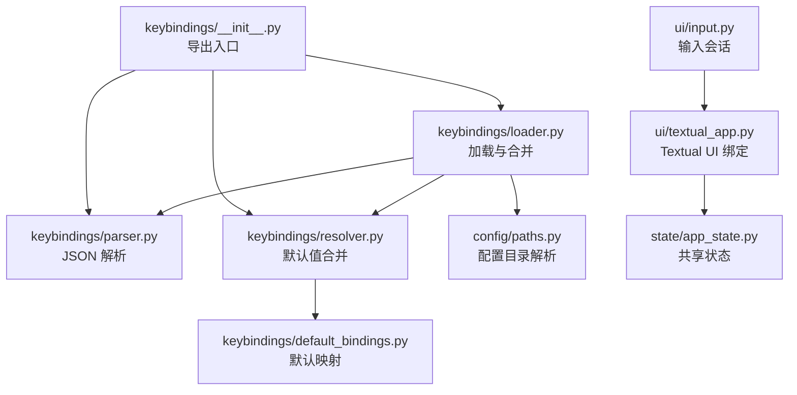
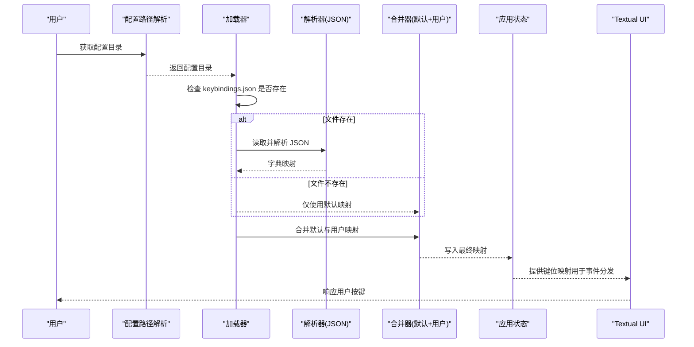
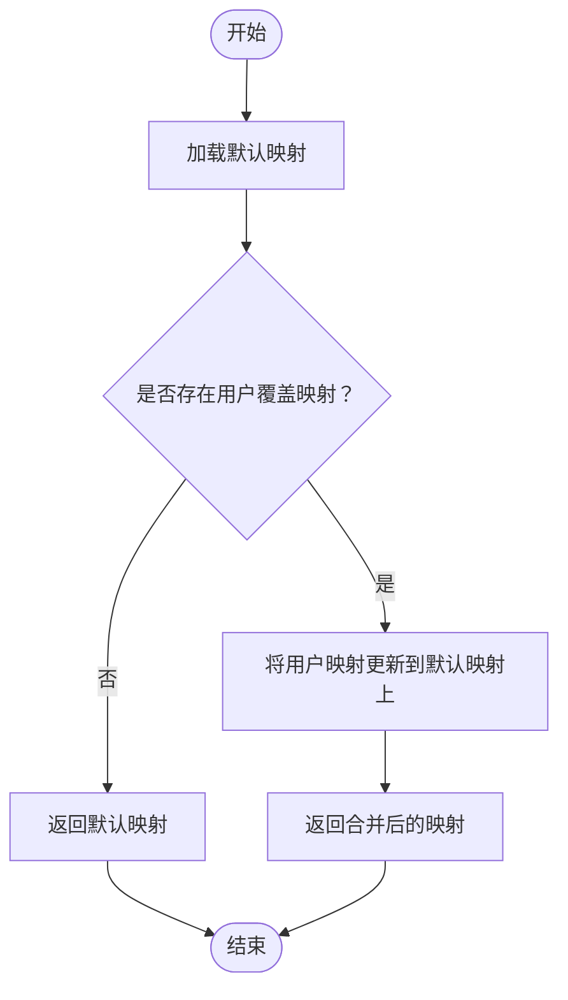
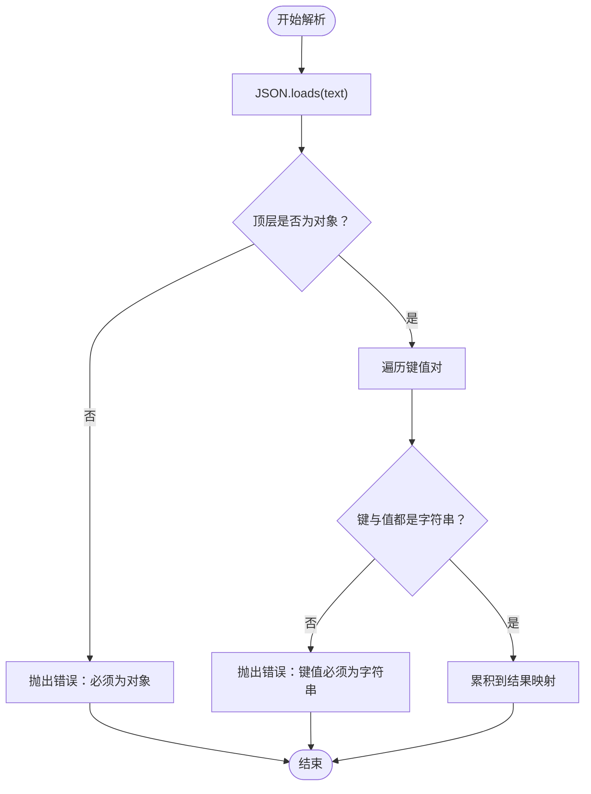
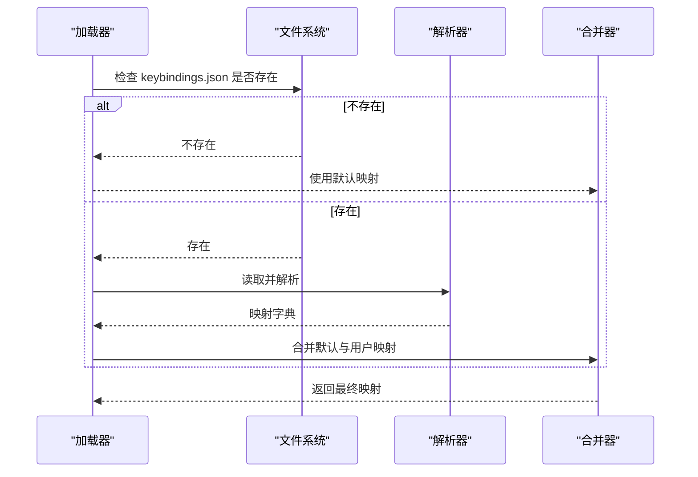
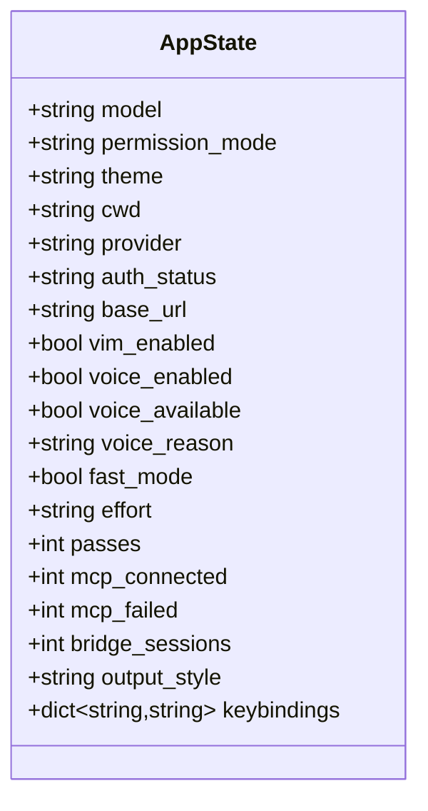
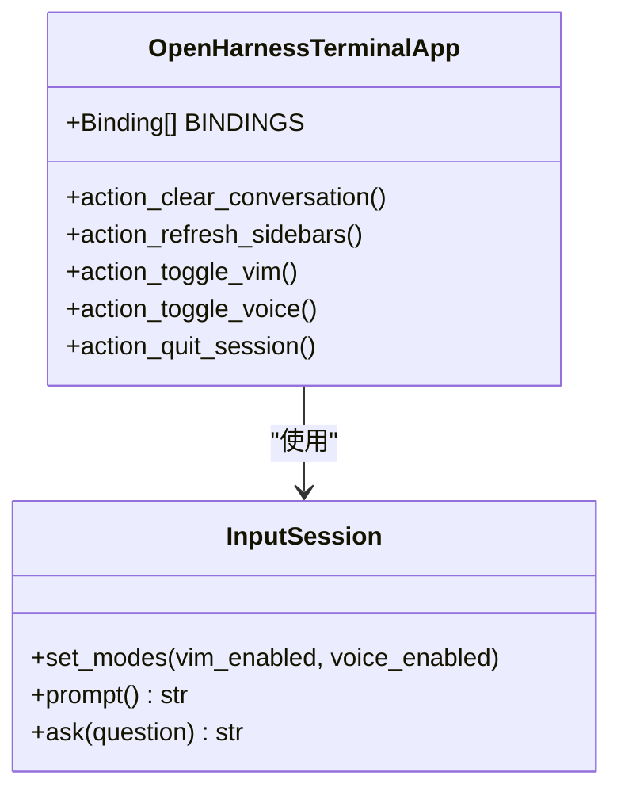
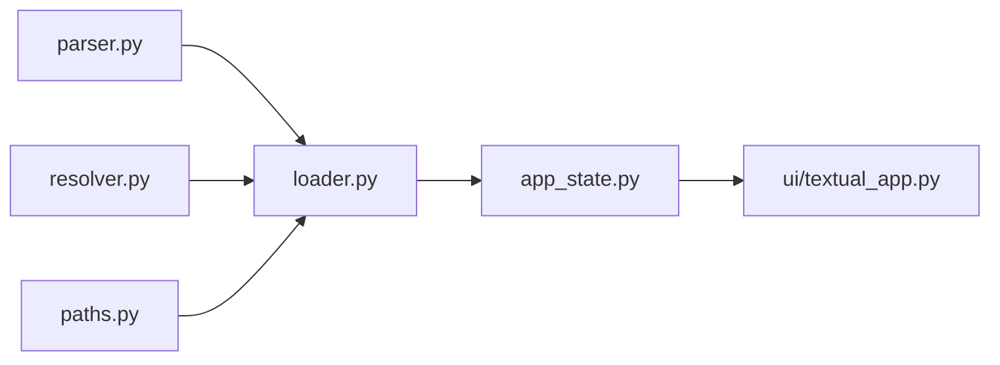

# 自定义绑定指南

<cite>
**本文引用的文件**
- [src/openharness/keybindings/__init__.py](file://src/openharness/keybindings/__init__.py)
- [src/openharness/keybindings/default_bindings.py](file://src/openharness/keybindings/default_bindings.py)
- [src/openharness/keybindings/loader.py](file://src/openharness/keybindings/loader.py)
- [src/openharness/keybindings/parser.py](file://src/openharness/keybindings/parser.py)
- [src/openharness/keybindings/resolver.py](file://src/openharness/keybindings/resolver.py)
- [src/openharness/config/paths.py](file://src/openharness/config/paths.py)
- [src/openharness/state/app_state.py](file://src/openharness/state/app_state.py)
- [src/openharness/ui/textual_app.py](file://src/openharness/ui/textual_app.py)
- [src/openharness/ui/input.py](file://src/openharness/ui/input.py)
- [README.md](file://README.md)
</cite>

## 目录
1. [简介](#简介)
2. [项目结构](#项目结构)
3. [核心组件](#核心组件)
4. [架构总览](#架构总览)
5. [详细组件分析](#详细组件分析)
6. [依赖分析](#依赖分析)
7. [性能考量](#性能考量)
8. [故障排除指南](#故障排除指南)
9. [结论](#结论)
10. [附录：配置与示例](#附录配置与示例)

## 简介
本指南面向需要为 OpenHarness 定制键盘快捷键的用户与开发者。内容覆盖配置文件格式与语法、按键类型支持、加载与解析流程、错误处理与回退机制、最佳实践（冲突规避、用户体验、可访问性），以及丰富的自定义示例与调试方法。目标是帮助你在不修改核心代码的前提下，安全、稳定地扩展或替换默认快捷键映射。

## 项目结构
与“自定义键盘绑定”直接相关的模块位于以下路径：
- 键盘绑定子系统：src/openharness/keybindings/*
- 配置目录解析：src/openharness/config/paths.py
- 应用状态模型：src/openharness/state/app_state.py
- 文本界面应用：src/openharness/ui/textual_app.py
- 输入会话封装：src/openharness/ui/input.py
- README 提供整体背景与特性说明

图表来源
- [src/openharness/keybindings/__init__.py:1-15](file://src/openharness/keybindings/__init__.py#L1-L15)
- [src/openharness/keybindings/loader.py:1-23](file://src/openharness/keybindings/loader.py#L1-L23)
- [src/openharness/keybindings/parser.py:1-19](file://src/openharness/keybindings/parser.py#L1-L19)
- [src/openharness/keybindings/resolver.py:1-14](file://src/openharness/keybindings/resolver.py#L1-L14)
- [src/openharness/keybindings/default_bindings.py:1-12](file://src/openharness/keybindings/default_bindings.py#L1-L12)
- [src/openharness/config/paths.py:1-117](file://src/openharness/config/paths.py#L1-L117)
- [src/openharness/state/app_state.py:1-31](file://src/openharness/state/app_state.py#L1-L31)
- [src/openharness/ui/textual_app.py:1-412](file://src/openharness/ui/textual_app.py#L1-L412)
- [src/openharness/ui/input.py:1-33](file://src/openharness/ui/input.py#L1-L33)

章节来源
- [src/openharness/keybindings/__init__.py:1-15](file://src/openharness/keybindings/__init__.py#L1-L15)
- [src/openharness/config/paths.py:1-117](file://src/openharness/config/paths.py#L1-L117)
- [README.md:127-147](file://README.md#L127-L147)

## 核心组件
- 默认映射：提供一组开箱即用的按键到动作名的映射，作为回退基础。
- 解析器：负责将用户配置文件解析为字典。
- 合并器：将用户覆盖映射与默认映射合并，后者优先级低。
- 加载器：定位配置文件路径、读取文本、解析并合并映射；若文件不存在则仅返回默认映射。
- 配置路径：遵循 XDG 类约定，支持环境变量覆盖配置根目录。
- 应用状态：在运行时持有最终生效的键位映射，供 UI 与引擎使用。
- 文本界面应用：定义部分 UI 层面的快捷键绑定（如清屏、退出、刷新侧栏等）。

章节来源
- [src/openharness/keybindings/default_bindings.py:6-11](file://src/openharness/keybindings/default_bindings.py#L6-L11)
- [src/openharness/keybindings/resolver.py:8-13](file://src/openharness/keybindings/resolver.py#L8-L13)
- [src/openharness/keybindings/loader.py:17-22](file://src/openharness/keybindings/loader.py#L17-L22)
- [src/openharness/config/paths.py:15-34](file://src/openharness/config/paths.py#L15-L34)
- [src/openharness/state/app_state.py:30](file://src/openharness/state/app_state.py#L30)
- [src/openharness/ui/textual_app.py:194-200](file://src/openharness/ui/textual_app.py#L194-L200)

## 架构总览
下图展示了从配置文件到最终生效映射的关键流程，以及与应用状态和 UI 的衔接。

图表来源
- [src/openharness/keybindings/loader.py:17-22](file://src/openharness/keybindings/loader.py#L17-L22)
- [src/openharness/keybindings/parser.py:8-18](file://src/openharness/keybindings/parser.py#L8-L18)
- [src/openharness/keybindings/resolver.py:8-13](file://src/openharness/keybindings/resolver.py#L8-L13)
- [src/openharness/config/paths.py:15-34](file://src/openharness/config/paths.py#L15-L34)
- [src/openharness/state/app_state.py:30](file://src/openharness/state/app_state.py#L30)
- [src/openharness/ui/textual_app.py:194-200](file://src/openharness/ui/textual_app.py#L194-L200)

## 详细组件分析

### 组件一：默认映射与合并逻辑
- 默认映射提供一组基础动作名（如清屏、切换 Vim 模式、语音模式、任务面板等）。
- 合并器以默认映射为基础，再用用户覆盖映射进行更新，实现“用户优先”的策略。
- 这保证了即使用户未提供完整映射，也能获得稳定的默认行为。

图表来源
- [src/openharness/keybindings/default_bindings.py:6-11](file://src/openharness/keybindings/default_bindings.py#L6-L11)
- [src/openharness/keybindings/resolver.py:8-13](file://src/openharness/keybindings/resolver.py#L8-L13)

章节来源
- [src/openharness/keybindings/default_bindings.py:6-11](file://src/openharness/keybindings/default_bindings.py#L6-L11)
- [src/openharness/keybindings/resolver.py:8-13](file://src/openharness/keybindings/resolver.py#L8-L13)

### 组件二：配置文件解析与校验
- 配置文件采用 JSON 对象格式，键与值必须为字符串。
- 若顶层不是对象、或键/值非字符串，将抛出错误。
- 解析失败会导致加载阶段中断，系统回退到默认映射。

图表来源
- [src/openharness/keybindings/parser.py:8-18](file://src/openharness/keybindings/parser.py#L8-L18)

章节来源
- [src/openharness/keybindings/parser.py:8-18](file://src/openharness/keybindings/parser.py#L8-L18)

### 组件三：加载与回退机制
- 加载器根据配置目录解析函数定位 keybindings.json。
- 若文件不存在，直接返回默认映射；若存在，则解析后与默认映射合并。
- 此设计确保用户可以“按需增量覆盖”，无需维护完整映射。

图表来源
- [src/openharness/keybindings/loader.py:17-22](file://src/openharness/keybindings/loader.py#L17-L22)
- [src/openharness/config/paths.py:15-34](file://src/openharness/config/paths.py#L15-L34)
- [src/openharness/keybindings/parser.py:8-18](file://src/openharness/keybindings/parser.py#L8-L18)
- [src/openharness/keybindings/resolver.py:8-13](file://src/openharness/keybindings/resolver.py#L8-L13)

章节来源
- [src/openharness/keybindings/loader.py:17-22](file://src/openharness/keybindings/loader.py#L17-L22)
- [src/openharness/config/paths.py:15-34](file://src/openharness/config/paths.py#L15-L34)

### 组件四：应用状态中的键位映射
- 应用状态包含一个键位映射字段，用于在运行时向 UI 与引擎提供当前生效的映射。
- UI 与引擎通过该映射将按键事件转换为具体动作。

图表来源
- [src/openharness/state/app_state.py:8-31](file://src/openharness/state/app_state.py#L8-L31)

章节来源
- [src/openharness/state/app_state.py:8-31](file://src/openharness/state/app_state.py#L8-L31)

### 组件五：UI 层绑定与按键事件
- 文本界面应用定义了若干 UI 层快捷键（如清屏、刷新侧栏、切换 Vim/语音、退出）。
- 这些绑定与用户自定义的键位映射相互独立，分别服务于 UI 交互与引擎命令映射。
- 输入会话封装了提示符与模式标记，便于在不同模式下识别当前状态。

图表来源
- [src/openharness/ui/textual_app.py:194-200](file://src/openharness/ui/textual_app.py#L194-L200)
- [src/openharness/ui/textual_app.py:333-366](file://src/openharness/ui/textual_app.py#L333-L366)
- [src/openharness/ui/input.py:8-33](file://src/openharness/ui/input.py#L8-L33)

章节来源
- [src/openharness/ui/textual_app.py:194-200](file://src/openharness/ui/textual_app.py#L194-L200)
- [src/openharness/ui/textual_app.py:333-366](file://src/openharness/ui/textual_app.py#L333-L366)
- [src/openharness/ui/input.py:8-33](file://src/openharness/ui/input.py#L8-L33)

## 依赖分析
- 键位子系统内部耦合度低：解析器只负责 JSON 校验与转换；加载器负责 IO 与调用解析器；合并器负责默认与用户映射的融合。
- 配置路径模块提供统一的目录解析能力，被加载器依赖。
- 应用状态持有最终映射，被 UI 与引擎消费。
- UI 层绑定与键位映射解耦，互不影响。

图表来源
- [src/openharness/keybindings/parser.py:8-18](file://src/openharness/keybindings/parser.py#L8-L18)
- [src/openharness/keybindings/loader.py:17-22](file://src/openharness/keybindings/loader.py#L17-L22)
- [src/openharness/keybindings/resolver.py:8-13](file://src/openharness/keybindings/resolver.py#L8-L13)
- [src/openharness/config/paths.py:15-34](file://src/openharness/config/paths.py#L15-L34)
- [src/openharness/state/app_state.py:30](file://src/openharness/state/app_state.py#L30)
- [src/openharness/ui/textual_app.py:194-200](file://src/openharness/ui/textual_app.py#L194-L200)

章节来源
- [src/openharness/keybindings/__init__.py:1-15](file://src/openharness/keybindings/__init__.py#L1-L15)
- [src/openharness/keybindings/loader.py:17-22](file://src/openharness/keybindings/loader.py#L17-L22)
- [src/openharness/config/paths.py:15-34](file://src/openharness/config/paths.py#L15-L34)
- [src/openharness/state/app_state.py:30](file://src/openharness/state/app_state.py#L30)
- [src/openharness/ui/textual_app.py:194-200](file://src/openharness/ui/textual_app.py#L194-L200)

## 性能考量
- 解析与合并均为轻量操作，通常在毫秒级完成，对启动与运行时性能影响可忽略。
- 建议保持映射规模适中，避免冗余条目导致维护成本上升。
- 将常用动作映射到更易触达的组合键，减少误触概率，提升交互效率。

## 故障排除指南
- 配置文件不存在
  - 行为：加载器回退到默认映射。
  - 处理：确认配置目录存在且可写，或设置环境变量覆盖配置根目录。
  - 参考
    - [src/openharness/keybindings/loader.py:20-21](file://src/openharness/keybindings/loader.py#L20-L21)
    - [src/openharness/config/paths.py:15-29](file://src/openharness/config/paths.py#L15-L29)
- 配置文件格式错误
  - 行为：解析器抛出错误，加载失败。
  - 处理：检查 JSON 顶层是否为对象、键值是否为字符串；修正后重试。
  - 参考
    - [src/openharness/keybindings/parser.py:11-16](file://src/openharness/keybindings/parser.py#L11-L16)
- 按键冲突
  - 行为：用户映射覆盖默认映射，可能导致 UI 层绑定与引擎映射冲突。
  - 处理：避免将常用 UI 快捷键（如清屏、退出）映射到相同键位；建议为不同功能域（UI vs 引擎）预留独立键空间。
  - 参考
    - [src/openharness/ui/textual_app.py:194-200](file://src/openharness/ui/textual_app.py#L194-L200)
    - [src/openharness/keybindings/resolver.py:10-12](file://src/openharness/keybindings/resolver.py#L10-L12)
- 生效延迟
  - 行为：应用状态中的映射在加载后生效。
  - 处理：重启应用或触发重新加载流程（如通过状态刷新接口）。
  - 参考
    - [src/openharness/state/app_state.py:30](file://src/openharness/state/app_state.py#L30)

章节来源
- [src/openharness/keybindings/loader.py:20-21](file://src/openharness/keybindings/loader.py#L20-L21)
- [src/openharness/keybindings/parser.py:11-16](file://src/openharness/keybindings/parser.py#L11-L16)
- [src/openharness/ui/textual_app.py:194-200](file://src/openharness/ui/textual_app.py#L194-L200)
- [src/openharness/keybindings/resolver.py:10-12](file://src/openharness/keybindings/resolver.py#L10-L12)
- [src/openharness/state/app_state.py:30](file://src/openharness/state/app_state.py#L30)

## 结论
通过“默认映射 + 用户覆盖映射”的两层策略，OpenHarness 实现了灵活而稳健的键位定制能力。配合清晰的解析与回退机制，用户可以在不破坏默认体验的前提下，按需调整快捷键。建议在实践中遵循冲突规避、用户体验与可访问性原则，并利用内置的错误处理与回退策略保障稳定性。

## 附录：配置与示例

### 配置文件位置与格式
- 文件名：keybindings.json
- 路径：配置目录下的同名文件
- 格式：JSON 对象，键与值均为字符串
- 示例（示意）
  - 键：按键描述（如控制键组合）
  - 值：动作名（与引擎命令或 UI 动作对应）

章节来源
- [src/openharness/keybindings/loader.py:12-14](file://src/openharness/keybindings/loader.py#L12-L14)
- [src/openharness/keybindings/parser.py:8-18](file://src/openharness/keybindings/parser.py#L8-L18)
- [src/openharness/config/paths.py:15-34](file://src/openharness/config/paths.py#L15-L34)

### 支持的按键类型
- 控制键组合：如“ctrl+字母”、“ctrl+特殊键”
- 具体可用键请参考 UI 层绑定定义与平台支持范围
- 示例（示意）
  - 清屏：ctrl+l
  - 切换 Vim 模式：ctrl+k
  - 切换语音模式：ctrl+v
  - 打开任务面板：ctrl+t

章节来源
- [src/openharness/keybindings/default_bindings.py:6-11](file://src/openharness/keybindings/default_bindings.py#L6-L11)
- [src/openharness/ui/textual_app.py:194-200](file://src/openharness/ui/textual_app.py#L194-L200)

### 最佳实践
- 热键冲突避免
  - 避免将常用 UI 快捷键映射到相同键位
  - 为不同功能域（UI 与引擎）预留独立键空间
- 用户体验
  - 将高频操作映射到易触达的组合键
  - 保持键位布局一致，减少学习成本
- 可访问性
  - 提供替代键位或说明，兼顾不同用户习惯
  - 在 UI 中展示当前可用快捷键列表

### 自定义示例（场景化）
- 场景一：快速清屏与退出
  - 将“清屏”映射到“ctrl+l”，与默认一致
  - 将“退出会话”映射到“ctrl+d”，与默认一致
  - 参考
    - [src/openharness/keybindings/default_bindings.py:7-11](file://src/openharness/keybindings/default_bindings.py#L7-L11)
    - [src/openharness/ui/textual_app.py:194-200](file://src/openharness/ui/textual_app.py#L194-L200)
- 场景二：切换模式
  - 将“切换 Vim 模式”映射到“ctrl+k”，与默认一致
  - 将“切换语音模式”映射到“ctrl+v”，与默认一致
  - 参考
    - [src/openharness/keybindings/default_bindings.py:8-10](file://src/openharness/keybindings/default_bindings.py#L8-L10)
    - [src/openharness/ui/textual_app.py:345-363](file://src/openharness/ui/textual_app.py#L345-L363)
- 场景三：任务管理
  - 将“打开任务面板”映射到“ctrl+t”，与默认一致
  - 参考
    - [src/openharness/keybindings/default_bindings.py:10](file://src/openharness/keybindings/default_bindings.py#L10)

### 调试步骤
- 确认配置文件存在且可读
  - 参考
    - [src/openharness/keybindings/loader.py:20-21](file://src/openharness/keybindings/loader.py#L20-L21)
- 验证 JSON 格式与键值类型
  - 参考
    - [src/openharness/keybindings/parser.py:11-16](file://src/openharness/keybindings/parser.py#L11-L16)
- 查看应用状态中的映射是否已更新
  - 参考
    - [src/openharness/state/app_state.py:30](file://src/openharness/state/app_state.py#L30)
- 检查 UI 层绑定是否与期望一致
  - 参考
    - [src/openharness/ui/textual_app.py:194-200](file://src/openharness/ui/textual_app.py#L194-L200)