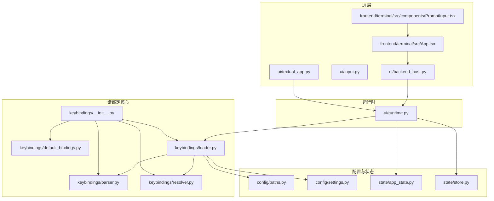
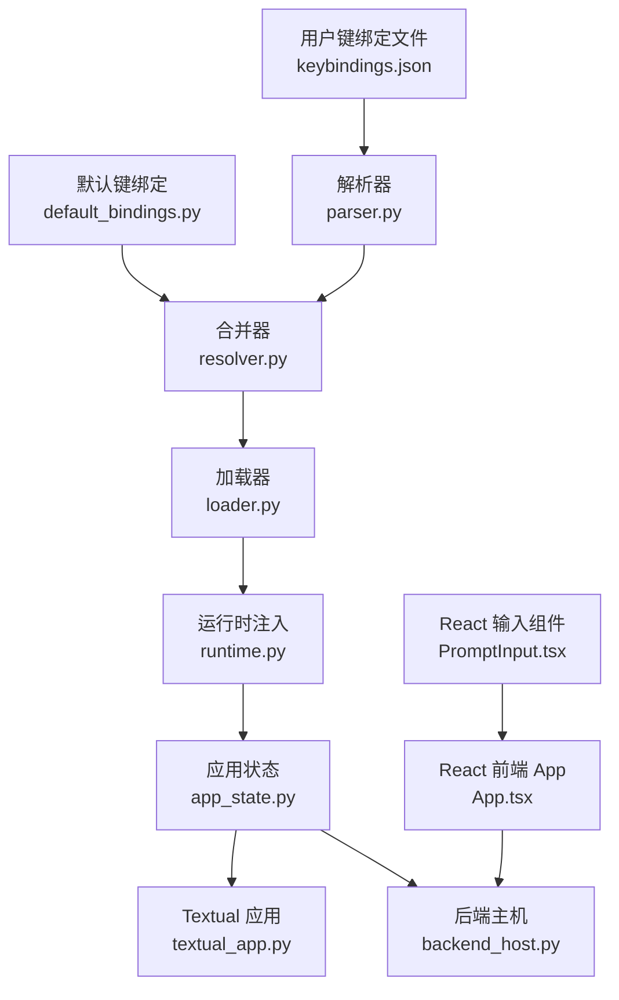
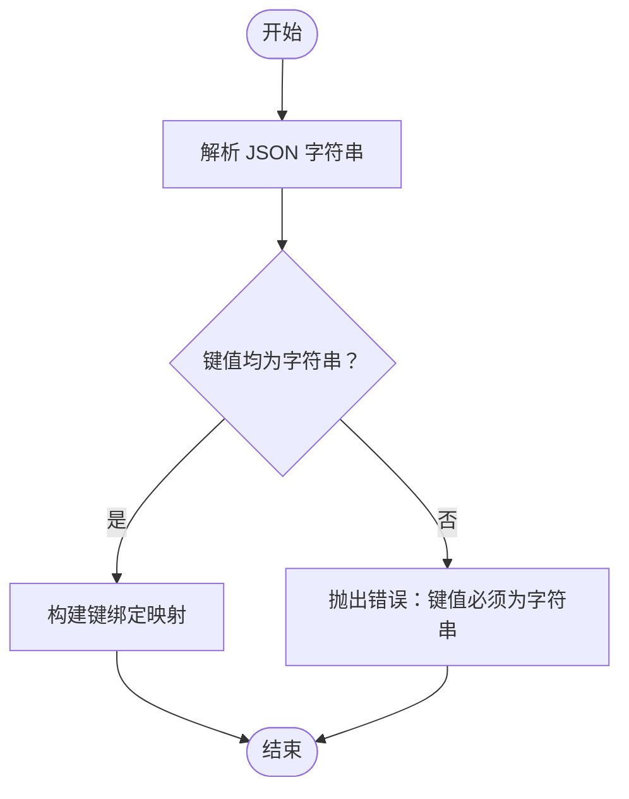
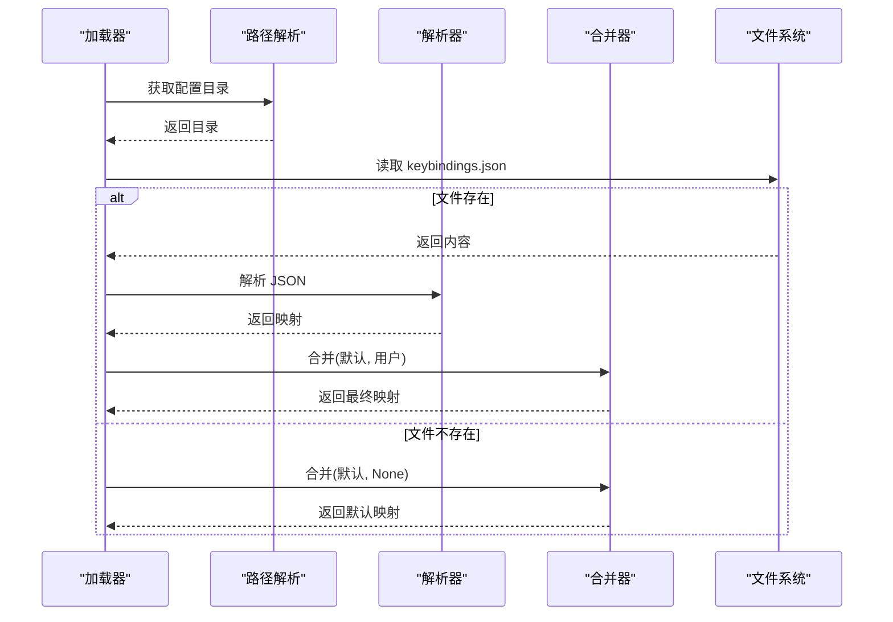
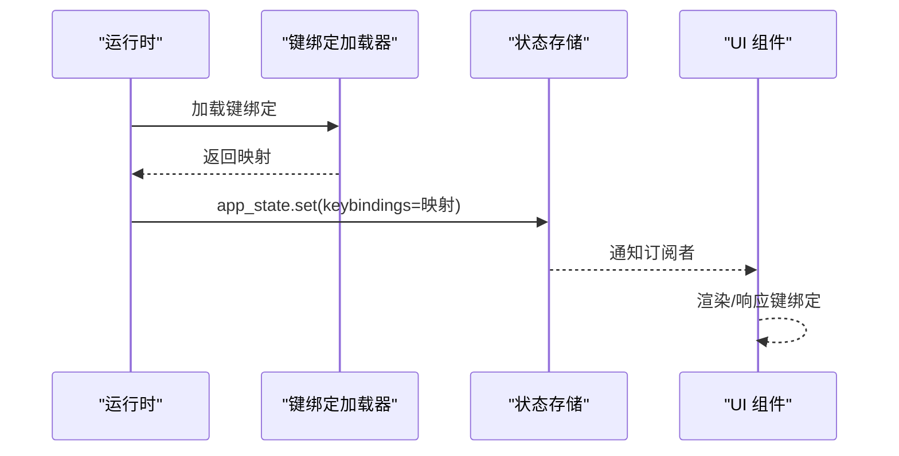
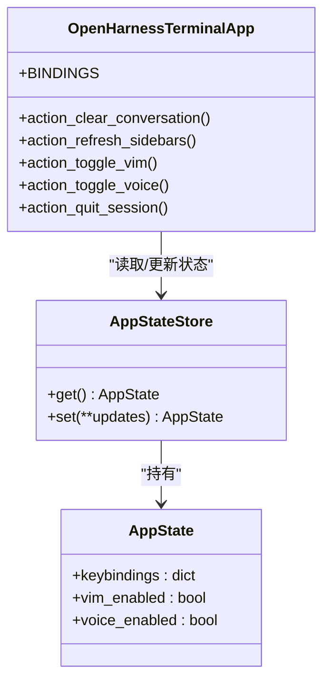
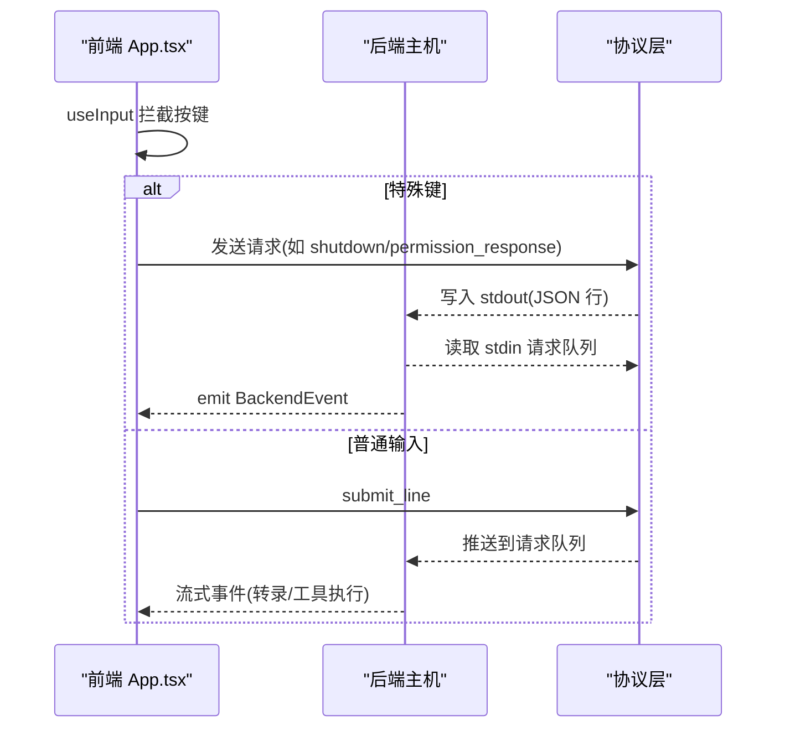
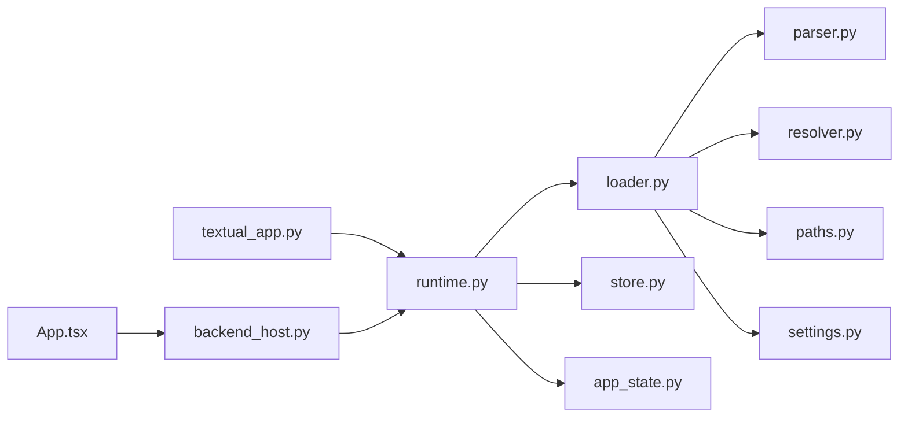

# 键盘绑定架构

<cite>
**本文档引用的文件**
- [src/openharness/keybindings/__init__.py](file://src/openharness/keybindings/__init__.py)
- [src/openharness/keybindings/default_bindings.py](file://src/openharness/keybindings/default_bindings.py)
- [src/openharness/keybindings/parser.py](file://src/openharness/keybindings/parser.py)
- [src/openharness/keybindings/resolver.py](file://src/openharness/keybindings/resolver.py)
- [src/openharness/keybindings/loader.py](file://src/openharness/keybindings/loader.py)
- [src/openharness/ui/textual_app.py](file://src/openharness/ui/textual_app.py)
- [src/openharness/ui/input.py](file://src/openharness/ui/input.py)
- [src/openharness/ui/backend_host.py](file://src/openharness/ui/backend_host.py)
- [src/openharness/frontend/terminal/src/App.tsx](file://src/openharness/frontend/terminal/src/App.tsx)
- [src/openharness/frontend/terminal/src/components/PromptInput.tsx](file://src/openharness/frontend/terminal/src/components/PromptInput.tsx)
- [src/openharness/state/app_state.py](file://src/openharness/state/app_state.py)
- [src/openharness/state/store.py](file://src/openharness/state/store.py)
- [src/openharness/ui/runtime.py](file://src/openharness/ui/runtime.py)
- [src/openharness/config/settings.py](file://src/openharness/config/settings.py)
- [src/openharness/config/paths.py](file://src/openharness/config/paths.py)
</cite>

## 目录
1. [简介](#简介)
2. [项目结构](#项目结构)
3. [核心组件](#核心组件)
4. [架构总览](#架构总览)
5. [详细组件分析](#详细组件分析)
6. [依赖关系分析](#依赖关系分析)
7. [性能考虑](#性能考虑)
8. [故障排除指南](#故障排除指南)
9. [结论](#结论)

## 简介
本文件系统性阐述 OpenHarness 的键盘绑定架构，涵盖设计理念、整体架构、绑定解析器工作原理（按键序列识别、组合键处理、特殊键支持）、绑定查找与冲突解决机制（优先级、上下文感知、动态切换），以及从物理按键到功能操作的完整映射链路（键码转换、事件传播、回调执行）。文档通过架构图与组件交互图帮助开发者快速理解系统内部工作机制。

## 项目结构
键盘绑定相关代码主要分布在以下模块：
- 键盘绑定核心：解析、合并默认与用户覆盖、加载用户配置
- UI 层：Textual 应用绑定定义与动作执行；React 前端输入拦截与协议通信
- 运行时：将键绑定注入应用状态，供 UI 和后端会话使用
- 配置层：设置项与路径解析，支撑键绑定持久化与加载

**图表来源**
- [src/openharness/keybindings/__init__.py:1-15](file://src/openharness/keybindings/__init__.py#L1-L15)
- [src/openharness/keybindings/default_bindings.py:1-12](file://src/openharness/keybindings/default_bindings.py#L1-L12)
- [src/openharness/keybindings/parser.py:1-19](file://src/openharness/keybindings/parser.py#L1-L19)
- [src/openharness/keybindings/resolver.py:1-14](file://src/openharness/keybindings/resolver.py#L1-L14)
- [src/openharness/keybindings/loader.py:1-23](file://src/openharness/keybindings/loader.py#L1-L23)
- [src/openharness/config/paths.py:1-117](file://src/openharness/config/paths.py#L1-L117)
- [src/openharness/config/settings.py:1-161](file://src/openharness/config/settings.py#L1-L161)
- [src/openharness/state/app_state.py:1-31](file://src/openharness/state/app_state.py#L1-L31)
- [src/openharness/state/store.py:1-41](file://src/openharness/state/store.py#L1-L41)
- [src/openharness/ui/textual_app.py:1-412](file://src/openharness/ui/textual_app.py#L1-L412)
- [src/openharness/ui/input.py:1-33](file://src/openharness/ui/input.py#L1-L33)
- [src/openharness/ui/backend_host.py:1-306](file://src/openharness/ui/backend_host.py#L1-L306)
- [src/openharness/frontend/terminal/src/App.tsx:1-400](file://src/openharness/frontend/terminal/src/App.tsx#L1-L400)
- [src/openharness/frontend/terminal/src/components/PromptInput.tsx:1-39](file://src/openharness/frontend/terminal/src/components/PromptInput.tsx#L1-L39)
- [src/openharness/ui/runtime.py:1-297](file://src/openharness/ui/runtime.py#L1-L297)

**章节来源**
- [src/openharness/keybindings/__init__.py:1-15](file://src/openharness/keybindings/__init__.py#L1-L15)
- [src/openharness/keybindings/default_bindings.py:1-12](file://src/openharness/keybindings/default_bindings.py#L1-L12)
- [src/openharness/keybindings/parser.py:1-19](file://src/openharness/keybindings/parser.py#L1-L19)
- [src/openharness/keybindings/resolver.py:1-14](file://src/openharness/keybindings/resolver.py#L1-L14)
- [src/openharness/keybindings/loader.py:1-23](file://src/openharness/keybindings/loader.py#L1-L23)
- [src/openharness/config/paths.py:1-117](file://src/openharness/config/paths.py#L1-L117)
- [src/openharness/config/settings.py:1-161](file://src/openharness/config/settings.py#L1-L161)
- [src/openharness/state/app_state.py:1-31](file://src/openharness/state/app_state.py#L1-L31)
- [src/openharness/state/store.py:1-41](file://src/openharness/state/store.py#L1-L41)
- [src/openharness/ui/textual_app.py:1-412](file://src/openharness/ui/textual_app.py#L1-L412)
- [src/openharness/ui/input.py:1-33](file://src/openharness/ui/input.py#L1-L33)
- [src/openharness/ui/backend_host.py:1-306](file://src/openharness/ui/backend_host.py#L1-L306)
- [src/openharness/frontend/terminal/src/App.tsx:1-400](file://src/openharness/frontend/terminal/src/App.tsx#L1-L400)
- [src/openharness/frontend/terminal/src/components/PromptInput.tsx:1-39](file://src/openharness/frontend/terminal/src/components/PromptInput.tsx#L1-L39)
- [src/openharness/ui/runtime.py:1-297](file://src/openharness/ui/runtime.py#L1-L297)

## 核心组件
- 键绑定解析器：负责将用户提供的 JSON 映射解析为字典，确保键值均为字符串格式。
- 键绑定解析器：负责将用户覆盖与默认映射进行合并，实现“用户覆盖优先”的策略。
- 键绑定加载器：定位并读取用户键绑定文件，若不存在则回退到默认映射。
- 应用状态：在运行时将键绑定注入 AppState，供 UI 动作与后端会话同步使用。
- UI 绑定与动作：Textual 应用定义 BINDINGS，动作方法直接映射到状态与功能。
- 前端输入拦截：React 前端通过 useInput 拦截特殊键，驱动会话请求与模态交互。

**章节来源**
- [src/openharness/keybindings/parser.py:8-19](file://src/openharness/keybindings/parser.py#L8-L19)
- [src/openharness/keybindings/resolver.py:8-14](file://src/openharness/keybindings/resolver.py#L8-L14)
- [src/openharness/keybindings/loader.py:17-23](file://src/openharness/keybindings/loader.py#L17-L23)
- [src/openharness/state/app_state.py](file://src/openharness/state/app_state.py#L30)
- [src/openharness/ui/textual_app.py:194-200](file://src/openharness/ui/textual_app.py#L194-L200)
- [src/openharness/frontend/terminal/src/App.tsx:149-290](file://src/openharness/frontend/terminal/src/App.tsx#L149-L290)

## 架构总览
键盘绑定架构采用“配置驱动 + 运行时注入 + UI 绑定”的分层设计：
- 配置层：默认映射与用户覆盖合并，生成最终键绑定表。
- 运行时层：将键绑定注入应用状态，供 UI 与后端会话共享。
- UI 层：Textual 定义绑定与动作；React 前端拦截输入并发送请求。
- 前端输入层：PromptInput 负责渲染输入提示，App.tsx 拦截特殊键并触发相应行为。

**图表来源**
- [src/openharness/keybindings/default_bindings.py:6-11](file://src/openharness/keybindings/default_bindings.py#L6-L11)
- [src/openharness/keybindings/resolver.py:8-14](file://src/openharness/keybindings/resolver.py#L8-L14)
- [src/openharness/keybindings/parser.py:8-19](file://src/openharness/keybindings/parser.py#L8-L19)
- [src/openharness/keybindings/loader.py:17-23](file://src/openharness/keybindings/loader.py#L17-L23)
- [src/openharness/ui/runtime.py:138-140](file://src/openharness/ui/runtime.py#L138-L140)
- [src/openharness/state/app_state.py](file://src/openharness/state/app_state.py#L30)
- [src/openharness/ui/textual_app.py:194-200](file://src/openharness/ui/textual_app.py#L194-L200)
- [src/openharness/ui/backend_host.py:1-306](file://src/openharness/ui/backend_host.py#L1-L306)
- [src/openharness/frontend/terminal/src/App.tsx:1-400](file://src/openharness/frontend/terminal/src/App.tsx#L1-L400)
- [src/openharness/frontend/terminal/src/components/PromptInput.tsx:1-39](file://src/openharness/frontend/terminal/src/components/PromptInput.tsx#L1-L39)

## 详细组件分析

### 键绑定解析器（键码转换与序列识别）
- JSON 解析：解析用户提供的键绑定 JSON，要求顶层对象且键值均为字符串。
- 键码转换：键名字符串作为“键码标识”，例如 "ctrl+l"、"ctrl+k" 等，由上层 UI 或后端按约定识别。
- 序列识别：当前实现未包含多键序列识别逻辑，键名即为单键或组合键标识。

**图表来源**
- [src/openharness/keybindings/parser.py:8-19](file://src/openharness/keybindings/parser.py#L8-L19)

**章节来源**
- [src/openharness/keybindings/parser.py:8-19](file://src/openharness/keybindings/parser.py#L8-L19)

### 合并与加载（优先级与覆盖）
- 默认映射：提供基础键绑定集合。
- 用户覆盖：从用户配置目录读取 keybindings.json 并解析。
- 合并策略：用户映射覆盖默认映射，未指定键保持默认。

**图表来源**
- [src/openharness/keybindings/loader.py:17-23](file://src/openharness/keybindings/loader.py#L17-L23)
- [src/openharness/keybindings/resolver.py:8-14](file://src/openharness/keybindings/resolver.py#L8-L14)
- [src/openharness/keybindings/parser.py:8-19](file://src/openharness/keybindings/parser.py#L8-L19)
- [src/openharness/config/paths.py:15-29](file://src/openharness/config/paths.py#L15-L29)

**章节来源**
- [src/openharness/keybindings/loader.py:17-23](file://src/openharness/keybindings/loader.py#L17-L23)
- [src/openharness/keybindings/resolver.py:8-14](file://src/openharness/keybindings/resolver.py#L8-L14)
- [src/openharness/keybindings/default_bindings.py:6-11](file://src/openharness/keybindings/default_bindings.py#L6-L11)
- [src/openharness/config/paths.py:15-29](file://src/openharness/config/paths.py#L15-L29)

### 运行时注入与状态同步
- 注入点：构建运行时时将键绑定写入 AppState.keybindings。
- 同步刷新：每次设置变更或键绑定更新时调用 sync_app_state 刷新 UI 状态。
- 共享访问：UI 与后端会话均可读取 AppState 中的键绑定映射。

**图表来源**
- [src/openharness/ui/runtime.py:138-140](file://src/openharness/ui/runtime.py#L138-L140)
- [src/openharness/ui/runtime.py:196-220](file://src/openharness/ui/runtime.py#L196-L220)
- [src/openharness/state/store.py:25-30](file://src/openharness/state/store.py#L25-L30)
- [src/openharness/state/app_state.py](file://src/openharness/state/app_state.py#L30)

**章节来源**
- [src/openharness/ui/runtime.py:138-140](file://src/openharness/ui/runtime.py#L138-L140)
- [src/openharness/ui/runtime.py:196-220](file://src/openharness/ui/runtime.py#L196-L220)
- [src/openharness/state/store.py:25-30](file://src/openharness/state/store.py#L25-L30)
- [src/openharness/state/app_state.py](file://src/openharness/state/app_state.py#L30)

### Textual 应用绑定与动作执行
- 绑定定义：BINDINGS 将键名映射到动作名称。
- 动作执行：每个动作名称对应一个 action_* 方法，方法内读取 AppState 并执行相应业务逻辑（如切换模式、清屏、退出）。
- 上下文感知：动作可读取 AppState 中的 vim_enabled、voice_enabled 等状态，实现上下文相关的功能切换。

**图表来源**
- [src/openharness/ui/textual_app.py:194-200](file://src/openharness/ui/textual_app.py#L194-L200)
- [src/openharness/ui/textual_app.py:333-366](file://src/openharness/ui/textual_app.py#L333-L366)
- [src/openharness/state/store.py:21-30](file://src/openharness/state/store.py#L21-L30)
- [src/openharness/state/app_state.py:19-30](file://src/openharness/state/app_state.py#L19-L30)

**章节来源**
- [src/openharness/ui/textual_app.py:194-200](file://src/openharness/ui/textual_app.py#L194-L200)
- [src/openharness/ui/textual_app.py:333-366](file://src/openharness/ui/textual_app.py#L333-L366)
- [src/openharness/state/store.py:21-30](file://src/openharness/state/store.py#L21-L30)
- [src/openharness/state/app_state.py:19-30](file://src/openharness/state/app_state.py#L19-L30)

### React 前端输入拦截与协议通信
- 输入拦截：App.tsx 使用 useInput 拦截特殊键（如 Ctrl+C、方向键、回车等），并根据当前状态决定行为。
- 协议通信：通过 sendRequest 发送结构化请求到后端，后端以 JSON 行协议响应。
- 模态交互：权限确认、问题回答等模态通过后端事件驱动，前端接收并处理。

**图表来源**
- [src/openharness/frontend/terminal/src/App.tsx:149-290](file://src/openharness/frontend/terminal/src/App.tsx#L149-L290)
- [src/openharness/ui/backend_host.py:54-115](file://src/openharness/ui/backend_host.py#L54-L115)
- [src/openharness/ui/backend_host.py:275-279](file://src/openharness/ui/backend_host.py#L275-L279)

**章节来源**
- [src/openharness/frontend/terminal/src/App.tsx:149-290](file://src/openharness/frontend/terminal/src/App.tsx#L149-L290)
- [src/openharness/ui/backend_host.py:54-115](file://src/openharness/ui/backend_host.py#L54-L115)
- [src/openharness/ui/backend_host.py:275-279](file://src/openharness/ui/backend_host.py#L275-L279)

### 组合键与特殊键支持
- 组合键：键名字符串约定使用 "ctrl+键"、"alt+键" 等形式，解析器不强制验证键名合法性，交由上层 UI/后端识别。
- 特殊键：前端通过 Ink 的 useInput 提供方向键、回车、Escape 等键位检测；Textual 应用通过 Binding 支持标准快捷键。
- 多键序列：当前实现未包含多键序列识别逻辑，序列识别需在上层 UI 或后端扩展。

**章节来源**
- [src/openharness/keybindings/default_bindings.py:6-11](file://src/openharness/keybindings/default_bindings.py#L6-L11)
- [src/openharness/frontend/terminal/src/App.tsx:149-290](file://src/openharness/frontend/terminal/src/App.tsx#L149-L290)
- [src/openharness/ui/textual_app.py:194-200](file://src/openharness/ui/textual_app.py#L194-L200)

### 绑定查找与冲突解决机制
- 查找方式：键名字符串直接作为映射键，在运行时从 AppState.keybindings 中查找对应的动作名称。
- 冲突解决：合并策略为“用户覆盖默认”，若用户未覆盖某键，则沿用默认映射；若用户覆盖为空，则完全使用默认映射。
- 上下文感知：动作方法可读取 AppState 中的状态字段（如 vim_enabled、voice_enabled）实现上下文相关的功能切换。

**章节来源**
- [src/openharness/keybindings/resolver.py:8-14](file://src/openharness/keybindings/resolver.py#L8-L14)
- [src/openharness/ui/textual_app.py:345-363](file://src/openharness/ui/textual_app.py#L345-L363)
- [src/openharness/state/app_state.py:19-30](file://src/openharness/state/app_state.py#L19-L30)

## 依赖关系分析
- 模块耦合：
  - 键绑定核心仅依赖配置路径与设置模型，耦合度低。
  - 运行时对键绑定加载器有直接依赖，用于注入 AppState。
  - UI 层通过运行时共享键绑定映射，避免重复加载。
- 外部依赖：
  - Textual 的 Binding 机制用于定义与识别键绑定。
  - React Ink 的 useInput 用于前端输入拦截。
- 循环依赖：未发现循环导入；键绑定加载器仅向下依赖路径与解析器。

**图表来源**
- [src/openharness/keybindings/loader.py:17-23](file://src/openharness/keybindings/loader.py#L17-L23)
- [src/openharness/keybindings/parser.py:8-19](file://src/openharness/keybindings/parser.py#L8-L19)
- [src/openharness/keybindings/resolver.py:8-14](file://src/openharness/keybindings/resolver.py#L8-L14)
- [src/openharness/config/paths.py:15-29](file://src/openharness/config/paths.py#L15-L29)
- [src/openharness/config/settings.py:123-142](file://src/openharness/config/settings.py#L123-L142)
- [src/openharness/ui/runtime.py:138-140](file://src/openharness/ui/runtime.py#L138-L140)
- [src/openharness/state/store.py:21-30](file://src/openharness/state/store.py#L21-L30)
- [src/openharness/state/app_state.py](file://src/openharness/state/app_state.py#L30)
- [src/openharness/ui/textual_app.py:194-200](file://src/openharness/ui/textual_app.py#L194-L200)
- [src/openharness/ui/backend_host.py:1-306](file://src/openharness/ui/backend_host.py#L1-L306)
- [src/openharness/frontend/terminal/src/App.tsx:1-400](file://src/openharness/frontend/terminal/src/App.tsx#L1-L400)

**章节来源**
- [src/openharness/keybindings/loader.py:17-23](file://src/openharness/keybindings/loader.py#L17-L23)
- [src/openharness/ui/runtime.py:138-140](file://src/openharness/ui/runtime.py#L138-L140)
- [src/openharness/ui/textual_app.py:194-200](file://src/openharness/ui/textual_app.py#L194-L200)
- [src/openharness/ui/backend_host.py:1-306](file://src/openharness/ui/backend_host.py#L1-L306)
- [src/openharness/frontend/terminal/src/App.tsx:1-400](file://src/openharness/frontend/terminal/src/App.tsx#L1-L400)

## 性能考虑
- 解析成本：JSON 解析与字典合并为 O(n) 操作，n 为键绑定条目数，开销极低。
- 加载时机：建议在应用启动阶段一次性加载并注入状态，避免频繁 IO。
- UI 更新：AppStateStore 采用订阅机制，动作执行后仅通知订阅者，避免全量重绘。
- 前端协议：后端以 JSON 行协议传输，避免复杂序列化开销；前端批量处理请求队列。

## 故障排除指南
- 键绑定文件格式错误
  - 现象：解析时报错，提示键值必须为字符串或顶层必须为对象。
  - 排查：检查 keybindings.json 是否为合法 JSON 对象，键值是否均为字符串。
  - 参考
    - [src/openharness/keybindings/parser.py:10-18](file://src/openharness/keybindings/parser.py#L10-L18)
- 用户文件缺失
  - 现象：加载器返回默认映射。
  - 排查：确认配置目录是否存在 keybindings.json；默认路径由配置路径解析模块提供。
  - 参考
    - [src/openharness/keybindings/loader.py:20-22](file://src/openharness/keybindings/loader.py#L20-L22)
    - [src/openharness/config/paths.py:15-29](file://src/openharness/config/paths.py#L15-L29)
- 组合键无效
  - 现象：按键无响应。
  - 排查：确认键名字符串符合约定（如 "ctrl+l"），并在 UI 层正确识别。
  - 参考
    - [src/openharness/keybindings/default_bindings.py:6-11](file://src/openharness/keybindings/default_bindings.py#L6-L11)
    - [src/openharness/ui/textual_app.py:194-200](file://src/openharness/ui/textual_app.py#L194-L200)
- 动作未生效
  - 现象：切换模式或清屏无效。
  - 排查：确认动作方法已定义且读取了正确的 AppState 字段；检查设置保存与状态同步。
  - 参考
    - [src/openharness/ui/textual_app.py:345-363](file://src/openharness/ui/textual_app.py#L345-L363)
    - [src/openharness/ui/runtime.py:196-220](file://src/openharness/ui/runtime.py#L196-L220)
    - [src/openharness/config/settings.py:144-161](file://src/openharness/config/settings.py#L144-L161)

**章节来源**
- [src/openharness/keybindings/parser.py:10-18](file://src/openharness/keybindings/parser.py#L10-L18)
- [src/openharness/keybindings/loader.py:20-22](file://src/openharness/keybindings/loader.py#L20-L22)
- [src/openharness/config/paths.py:15-29](file://src/openharness/config/paths.py#L15-L29)
- [src/openharness/keybindings/default_bindings.py:6-11](file://src/openharness/keybindings/default_bindings.py#L6-L11)
- [src/openharness/ui/textual_app.py:345-363](file://src/openharness/ui/textual_app.py#L345-L363)
- [src/openharness/ui/runtime.py:196-220](file://src/openharness/ui/runtime.py#L196-L220)
- [src/openharness/config/settings.py:144-161](file://src/openharness/config/settings.py#L144-L161)

## 结论
OpenHarness 的键盘绑定架构以“配置驱动 + 运行时注入 + UI 绑定”为核心，通过简洁的 JSON 映射与“用户覆盖默认”的合并策略，实现了灵活、可扩展的键绑定体系。Textual 与 React 前端分别在各自生态内完成输入拦截与动作执行，配合运行时状态同步，形成统一的上下文感知体验。当前实现聚焦于单键与组合键，序列识别等高级特性可在现有架构基础上平滑扩展。