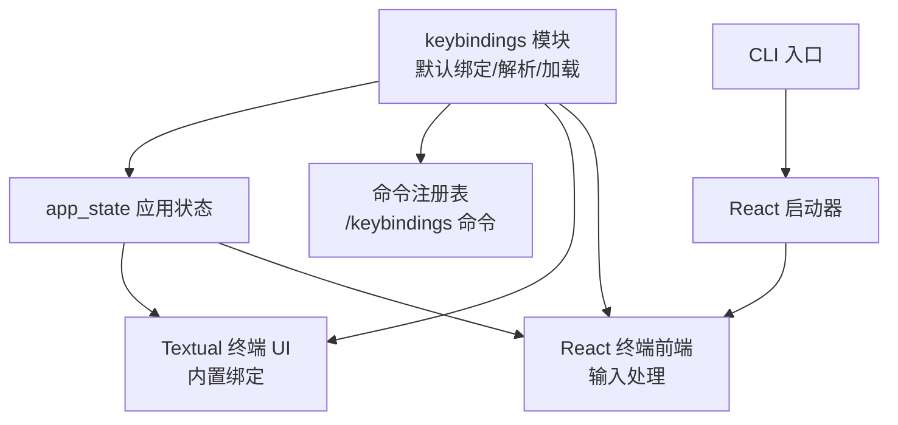
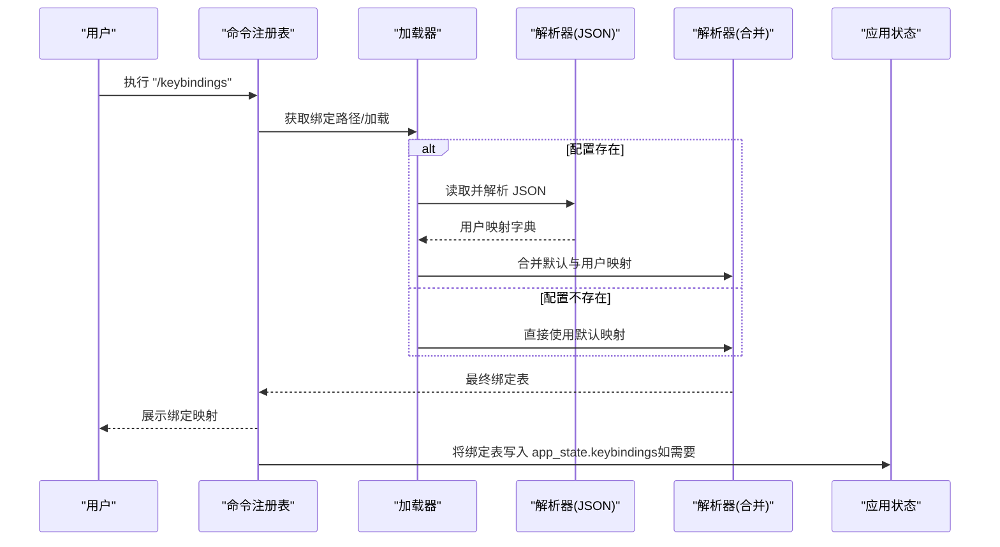
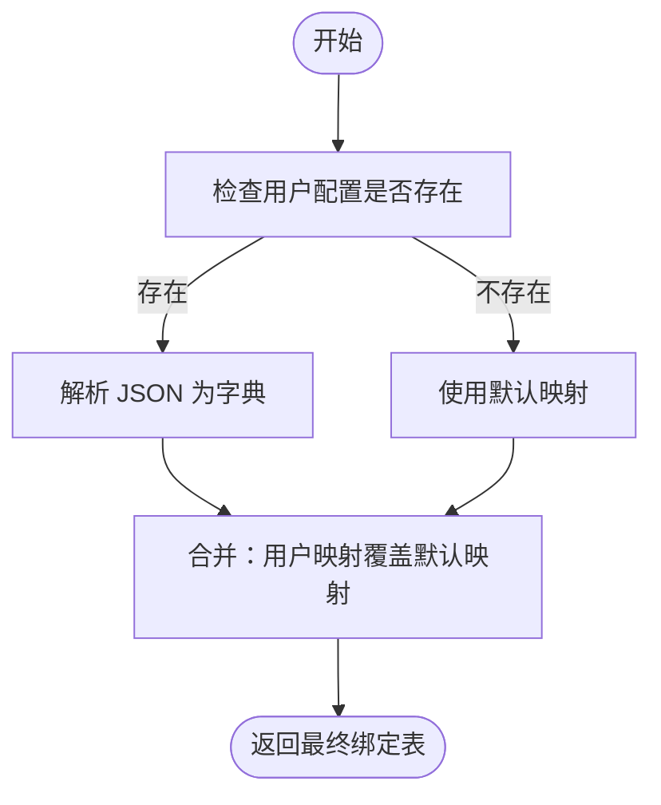
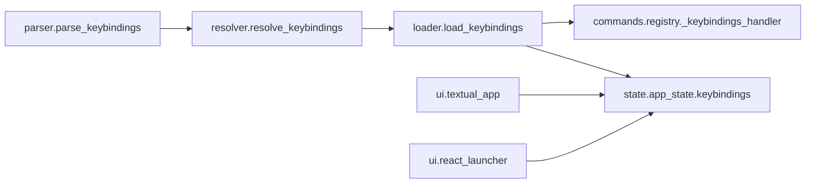

# 键盘绑定系统

<cite>
**本文引用的文件**
- [src/openharness/keybindings/__init__.py](file://src/openharness/keybindings/__init__.py)
- [src/openharness/keybindings/default_bindings.py](file://src/openharness/keybindings/default_bindings.py)
- [src/openharness/keybindings/loader.py](file://src/openharness/keybindings/loader.py)
- [src/openharness/keybindings/parser.py](file://src/openharness/keybindings/parser.py)
- [src/openharness/keybindings/resolver.py](file://src/openharness/keybindings/resolver.py)
- [src/openharness/state/app_state.py](file://src/openharness/state/app_state.py)
- [src/openharness/commands/registry.py](file://src/openharness/commands/registry.py)
- [src/openharness/ui/textual_app.py](file://src/openharness/ui/textual_app.py)
- [src/openharness/ui/input.py](file://src/openharness/ui/input.py)
- [src/openharness/cli.py](file://src/openharness/cli.py)
- [src/openharness/ui/react_launcher.py](file://src/openharness/ui/react_launcher.py)
</cite>

## 目录
1. [简介](#简介)
2. [项目结构](#项目结构)
3. [核心组件](#核心组件)
4. [架构总览](#架构总览)
5. [详细组件分析](#详细组件分析)
6. [依赖分析](#依赖分析)
7. [性能考量](#性能考量)
8. [故障排查指南](#故障排查指南)
9. [结论](#结论)
10. [附录：配置与最佳实践](#附录配置与最佳实践)

## 简介
本文件系统性阐述 OpenHarness 的键盘绑定系统，目标是帮助用户通过可定制的快捷键提升交互效率与体验。文档覆盖设计理念（用户体验与效率）、默认绑定、配置加载与解析流程、冲突与优先级处理、以及自定义绑定的最佳实践与示例路径。

## 项目结构
键盘绑定相关代码位于 openharness/keybindings 子模块，并与应用状态、命令注册、UI 层（Textual 与 React TUI）协同工作。整体采用“默认值 + 用户覆盖”的分层设计，保证开箱即用的同时允许个性化定制。

图表来源
- [src/openharness/keybindings/__init__.py:1-15](file://src/openharness/keybindings/__init__.py#L1-L15)
- [src/openharness/state/app_state.py:1-31](file://src/openharness/state/app_state.py#L1-L31)
- [src/openharness/commands/registry.py:1021-1031](file://src/openharness/commands/registry.py#L1021-L1031)
- [src/openharness/ui/textual_app.py:194-200](file://src/openharness/ui/textual_app.py#L194-L200)
- [src/openharness/ui/react_launcher.py:50-103](file://src/openharness/ui/react_launcher.py#L50-L103)

章节来源
- [src/openharness/keybindings/__init__.py:1-15](file://src/openharness/keybindings/__init__.py#L1-L15)
- [src/openharness/state/app_state.py:1-31](file://src/openharness/state/app_state.py#L1-L31)

## 核心组件
- 默认绑定：提供一组基础快捷键映射，确保新用户即可上手。
- 解析器：负责从 JSON 文件读取并校验用户自定义映射。
- 解析器：将默认映射与用户覆盖合并，形成最终可用的绑定表。
- 加载器：定位用户配置文件路径，按需读取并合并。
- 应用状态：在运行时持有已解析的绑定表，供 UI 使用。
- 命令注册：提供“显示当前解析后绑定”的交互命令。
- UI 集成：Textual 与 React 前端各自维护部分快捷键行为，与全局绑定协同。

章节来源
- [src/openharness/keybindings/default_bindings.py:1-12](file://src/openharness/keybindings/default_bindings.py#L1-L12)
- [src/openharness/keybindings/parser.py:1-19](file://src/openharness/keybindings/parser.py#L1-L19)
- [src/openharness/keybindings/resolver.py:1-14](file://src/openharness/keybindings/resolver.py#L1-L14)
- [src/openharness/keybindings/loader.py:1-23](file://src/openharness/keybindings/loader.py#L1-L23)
- [src/openharness/state/app_state.py:30-31](file://src/openharness/state/app_state.py#L30-L31)
- [src/openharness/commands/registry.py:1021-1031](file://src/openharness/commands/registry.py#L1021-L1031)
- [src/openharness/ui/textual_app.py:194-200](file://src/openharness/ui/textual_app.py#L194-L200)

## 架构总览
键盘绑定系统遵循“默认值 + 用户覆盖”的两层映射策略。启动时优先加载用户配置，若不存在则回退到默认映射；随后将用户映射逐项覆盖默认映射，形成最终绑定表。该表既可用于命令行“/keybindings”展示，也可被 UI 层直接使用。

图表来源
- [src/openharness/commands/registry.py:1021-1031](file://src/openharness/commands/registry.py#L1021-L1031)
- [src/openharness/keybindings/loader.py:17-23](file://src/openharness/keybindings/loader.py#L17-L23)
- [src/openharness/keybindings/parser.py:8-19](file://src/openharness/keybindings/parser.py#L8-L19)
- [src/openharness/keybindings/resolver.py:8-14](file://src/openharness/keybindings/resolver.py#L8-L14)
- [src/openharness/state/app_state.py:30-31](file://src/openharness/state/app_state.py#L30-L31)

## 详细组件分析

### 默认绑定与设计理念
- 设计目标：降低学习成本、提升操作效率、保持一致性。
- 默认绑定覆盖常见场景：清屏、切换 Vim 模式、语音模式、任务管理等。
- 上下文感知：与应用状态中的模式（如 Vim/语音）联动，UI 可据此调整提示或行为。

章节来源
- [src/openharness/keybindings/default_bindings.py:6-11](file://src/openharness/keybindings/default_bindings.py#L6-L11)
- [src/openharness/state/app_state.py:19-22](file://src/openharness/state/app_state.py#L19-L22)
- [src/openharness/ui/input.py:15-23](file://src/openharness/ui/input.py#L15-L23)

### 绑定解析与合并机制
- 解析阶段：从 JSON 字符串解析为字典，严格校验键值均为字符串。
- 合并阶段：以默认映射为基础，用户映射逐项覆盖；未指定的默认项保留。
- 冲突与优先级：用户映射优先于默认映射；未显式覆盖的键保持默认。

图表来源
- [src/openharness/keybindings/loader.py:17-23](file://src/openharness/keybindings/loader.py#L17-L23)
- [src/openharness/keybindings/parser.py:8-19](file://src/openharness/keybindings/parser.py#L8-L19)
- [src/openharness/keybindings/resolver.py:8-14](file://src/openharness/keybindings/resolver.py#L8-L14)

章节来源
- [src/openharness/keybindings/parser.py:8-19](file://src/openharness/keybindings/parser.py#L8-L19)
- [src/openharness/keybindings/resolver.py:8-14](file://src/openharness/keybindings/resolver.py#L8-L14)
- [src/openharness/keybindings/loader.py:17-23](file://src/openharness/keybindings/loader.py#L17-L23)

### 配置文件加载与路径
- 路径规则：位于用户配置目录下的 keybindings.json。
- 加载逻辑：若文件不存在，直接使用解析后的默认映射；否则先解析用户映射再与默认映射合并。

章节来源
- [src/openharness/keybindings/loader.py:12-23](file://src/openharness/keybindings/loader.py#L12-L23)

### UI 层集成与上下文感知
- Textual 终端 UI：内置若干快捷键（如清屏、刷新侧栏、退出等），并与应用状态联动。
- React 终端前端：负责输入渲染与交互，结合应用状态控制模式提示。
- 输入会话：根据模式动态更新提示前缀，增强上下文感知。

章节来源
- [src/openharness/ui/textual_app.py:194-200](file://src/openharness/ui/textual_app.py#L194-L200)
- [src/openharness/ui/textual_app.py:345-363](file://src/openharness/ui/textual_app.py#L345-L363)
- [src/openharness/ui/input.py:15-23](file://src/openharness/ui/input.py#L15-L23)

### 命令注册与“显示绑定”
- 提供“/keybindings”命令，用于打印当前解析后的绑定映射与配置文件路径。
- 若应用状态中已有绑定表，则优先使用；否则现场加载并解析。

章节来源
- [src/openharness/commands/registry.py:1021-1031](file://src/openharness/commands/registry.py#L1021-L1031)
- [src/openharness/commands/registry.py:1305-1305](file://src/openharness/commands/registry.py#L1305-L1305)

### CLI 与前端启动
- CLI 入口：支持多种子命令与选项，作为后端服务入口。
- React 启动器：负责安装前端依赖并启动 React 终端前端，与后端通信。

章节来源
- [src/openharness/cli.py:1-378](file://src/openharness/cli.py#L1-L378)
- [src/openharness/ui/react_launcher.py:50-103](file://src/openharness/ui/react_launcher.py#L50-L103)

## 依赖分析
- 模块内聚：keybindings 子模块内部职责清晰，解析、合并、加载各司其职。
- 外部耦合：UI 层（Textual/React）与应用状态存在弱耦合，通过 app_state.keybindings 传递绑定表。
- 命令层：命令注册表仅负责调用加载器并展示结果，不参与解析细节。

图表来源
- [src/openharness/keybindings/parser.py:8-19](file://src/openharness/keybindings/parser.py#L8-L19)
- [src/openharness/keybindings/resolver.py:8-14](file://src/openharness/keybindings/resolver.py#L8-L14)
- [src/openharness/keybindings/loader.py:17-23](file://src/openharness/keybindings/loader.py#L17-L23)
- [src/openharness/commands/registry.py:1021-1031](file://src/openharness/commands/registry.py#L1021-L1031)
- [src/openharness/state/app_state.py:30-31](file://src/openharness/state/app_state.py#L30-L31)
- [src/openharness/ui/textual_app.py:194-200](file://src/openharness/ui/textual_app.py#L194-L200)
- [src/openharness/ui/react_launcher.py:50-103](file://src/openharness/ui/react_launcher.py#L50-L103)

章节来源
- [src/openharness/keybindings/__init__.py:1-15](file://src/openharness/keybindings/__init__.py#L1-L15)
- [src/openharness/state/app_state.py:30-31](file://src/openharness/state/app_state.py#L30-L31)

## 性能考量
- 解析与合并：JSON 解析与字典合并均为 O(n) 操作，n 为用户映射条目数，开销极低。
- I/O：仅在首次访问绑定时读取配置文件，后续可通过应用状态复用，避免重复 I/O。
- UI 渲染：绑定表规模小，对 UI 渲染影响可忽略。

## 故障排查指南
- 绑定不生效
  - 检查配置文件是否存在且可读：[src/openharness/keybindings/loader.py:17-23](file://src/openharness/keybindings/loader.py#L17-L23)
  - 确认 JSON 结构正确且键值均为字符串：[src/openharness/keybindings/parser.py:8-19](file://src/openharness/keybindings/parser.py#L8-L19)
  - 使用“/keybindings”命令核对最终绑定表：[src/openharness/commands/registry.py:1021-1031](file://src/openharness/commands/registry.py#L1021-L1031)
- 冲突与覆盖
  - 用户映射会覆盖默认映射；若某键未在用户映射中出现，仍使用默认值：[src/openharness/keybindings/resolver.py:8-14](file://src/openharness/keybindings/resolver.py#L8-L14)
- UI 不响应
  - Textual 绑定由 UI 自身定义，与全局绑定不同步：[src/openharness/ui/textual_app.py:194-200](file://src/openharness/ui/textual_app.py#L194-L200)
  - React 前端的输入处理与绑定系统解耦，关注前端交互逻辑：[src/openharness/ui/react_launcher.py:50-103](file://src/openharness/ui/react_launcher.py#L50-L103)

章节来源
- [src/openharness/keybindings/loader.py:17-23](file://src/openharness/keybindings/loader.py#L17-L23)
- [src/openharness/keybindings/parser.py:8-19](file://src/openharness/keybindings/parser.py#L8-L19)
- [src/openharness/keybindings/resolver.py:8-14](file://src/openharness/keybindings/resolver.py#L8-L14)
- [src/openharness/commands/registry.py:1021-1031](file://src/openharness/commands/registry.py#L1021-L1031)
- [src/openharness/ui/textual_app.py:194-200](file://src/openharness/ui/textual_app.py#L194-L200)
- [src/openharness/ui/react_launcher.py:50-103](file://src/openharness/ui/react_launcher.py#L50-L103)

## 结论
OpenHarness 的键盘绑定系统以“默认 + 覆盖”的简洁模型实现了高可定制性与易用性。通过命令行快速查看、UI 层上下文感知与最小化解析开销，用户可以轻松获得个性化的高效交互体验。

## 附录：配置与最佳实践

### 默认绑定概览
- 清屏、切换 Vim 模式、切换语音模式、打开任务面板等常用功能均有快捷键映射。
- 与应用状态联动，确保 UI 提示与实际模式一致。

章节来源
- [src/openharness/keybindings/default_bindings.py:6-11](file://src/openharness/keybindings/default_bindings.py#L6-L11)
- [src/openharness/state/app_state.py:19-22](file://src/openharness/state/app_state.py#L19-L22)
- [src/openharness/ui/input.py:15-23](file://src/openharness/ui/input.py#L15-L23)

### 配置文件位置与格式
- 文件路径：用户配置目录下的 keybindings.json（路径由加载器生成）。
- 格式要求：顶层对象，键与值均为字符串；解析器会进行类型校验。

章节来源
- [src/openharness/keybindings/loader.py:12-14](file://src/openharness/keybindings/loader.py#L12-L14)
- [src/openharness/keybindings/parser.py:8-19](file://src/openharness/keybindings/parser.py#L8-L19)

### 绑定解析与合并流程
- 若配置文件存在：解析 JSON → 合并用户映射覆盖默认映射。
- 若配置文件不存在：直接使用默认映射。
- 最终绑定表可用于命令展示与 UI 使用。

章节来源
- [src/openharness/keybindings/loader.py:17-23](file://src/openharness/keybindings/loader.py#L17-L23)
- [src/openharness/keybindings/resolver.py:8-14](file://src/openharness/keybindings/resolver.py#L8-L14)

### UI 层快捷键与上下文感知
- Textual 终端 UI：内置多组快捷键，与应用状态联动（如切换 Vim/语音）。
- React 终端前端：输入渲染与模式提示，与全局绑定系统解耦。

章节来源
- [src/openharness/ui/textual_app.py:194-200](file://src/openharness/ui/textual_app.py#L194-L200)
- [src/openharness/ui/textual_app.py:345-363](file://src/openharness/ui/textual_app.py#L345-L363)
- [src/openharness/ui/input.py:15-23](file://src/openharness/ui/input.py#L15-L23)

### 自定义绑定指南
- 创建/编辑配置：在用户配置目录下创建或修改 keybindings.json，键为按键字符串，值为命令字符串。
- 冲突避免：仅覆盖需要的键位；未指定的键将沿用默认映射。
- 用户体验考虑：选择与默认键不冲突的组合，保持与 UI 模式提示一致，减少认知负担。
- 校验与验证：使用“/keybindings”命令查看最终绑定表，确认覆盖效果。

章节来源
- [src/openharness/keybindings/loader.py:17-23](file://src/openharness/keybindings/loader.py#L17-L23)
- [src/openharness/keybindings/resolver.py:8-14](file://src/openharness/keybindings/resolver.py#L8-L14)
- [src/openharness/commands/registry.py:1021-1031](file://src/openharness/commands/registry.py#L1021-L1031)