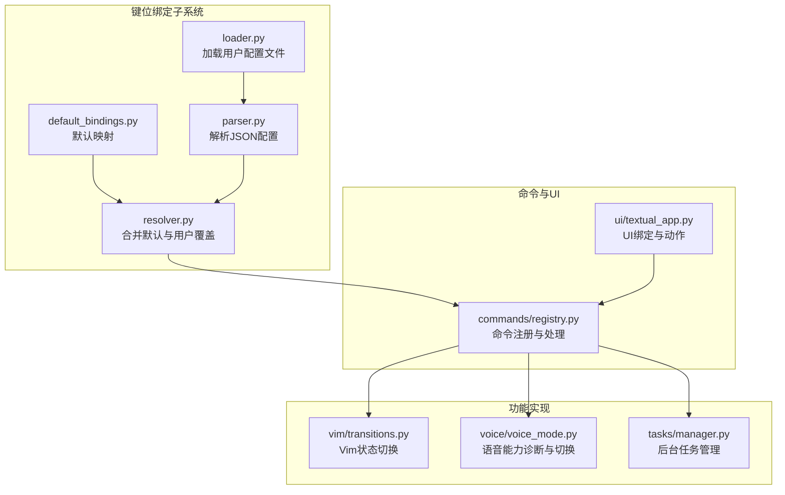
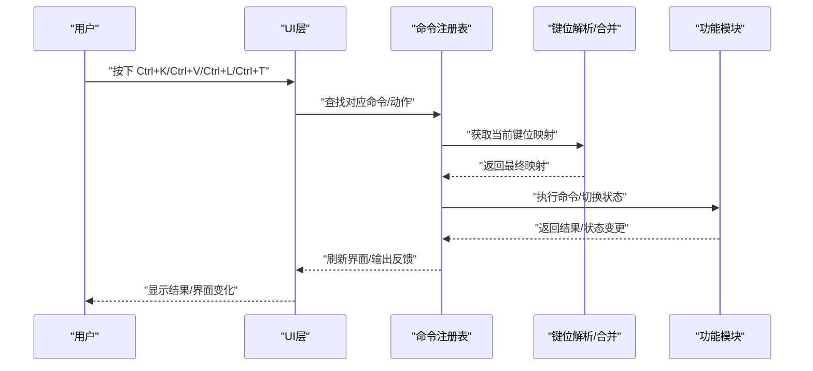
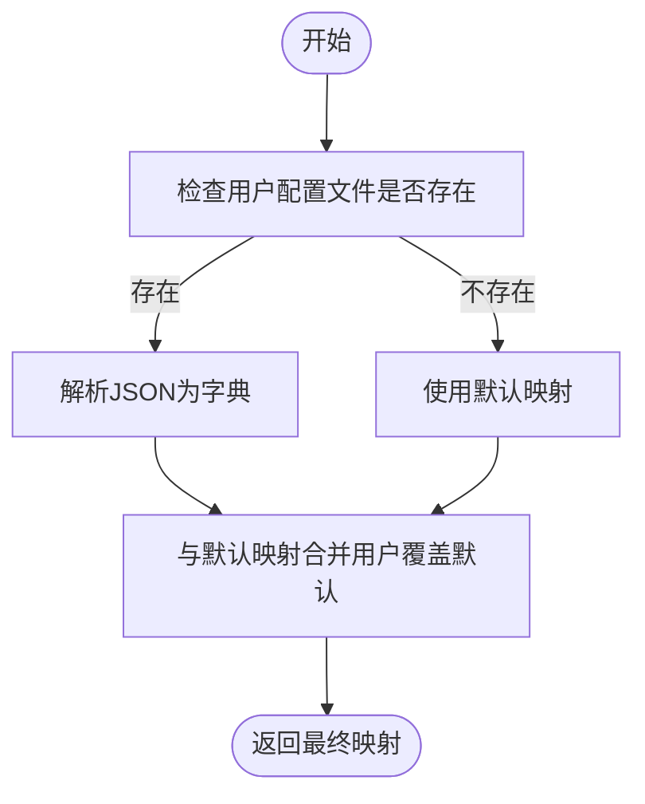
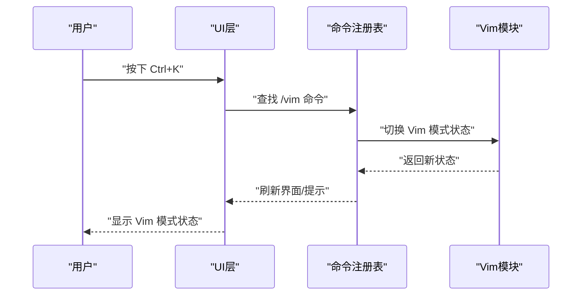
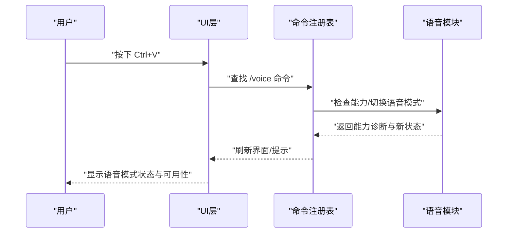
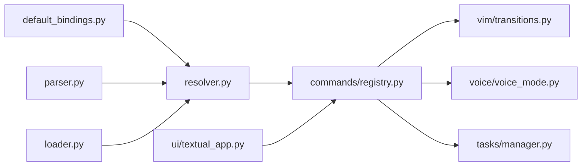

# 默认绑定配置

<cite>
**本文引用的文件**
- [src/openharness/keybindings/default_bindings.py](file://src/openharness/keybindings/default_bindings.py)
- [src/openharness/keybindings/__init__.py](file://src/openharness/keybindings/__init__.py)
- [src/openharness/keybindings/loader.py](file://src/openharness/keybindings/loader.py)
- [src/openharness/keybindings/parser.py](file://src/openharness/keybindings/parser.py)
- [src/openharness/keybindings/resolver.py](file://src/openharness/keybindings/resolver.py)
- [src/openharness/ui/textual_app.py](file://src/openharness/ui/textual_app.py)
- [src/openharness/vim/transitions.py](file://src/openharness/vim/transitions.py)
- [src/openharness/voice/voice_mode.py](file://src/openharness/voice/voice_mode.py)
- [src/openharness/tasks/manager.py](file://src/openharness/tasks/manager.py)
- [src/openharness/commands/registry.py](file://src/openharness/commands/registry.py)
- [tests/test_commands/test_registry.py](file://tests/test_commands/test_registry.py)
</cite>

## 目录
1. [简介](#简介)
2. [项目结构](#项目结构)
3. [核心组件](#核心组件)
4. [架构总览](#架构总览)
5. [详细组件分析](#详细组件分析)
6. [依赖关系分析](#依赖关系分析)
7. [性能考量](#性能考量)
8. [故障排查指南](#故障排查指南)
9. [结论](#结论)
10. [附录](#附录)

## 简介
本文件系统性梳理并解释系统提供的默认键盘绑定配置，重点覆盖以下核心快捷键映射：Ctrl+L 清屏、Ctrl+K 切换 Vim 模式、Ctrl+V 切换语音功能、Ctrl+T 打开任务面板。文档从设计意图、使用场景、用户体验与效率提升角度进行说明，并给出默认配置的完整清单与功能说明；同时提供与主流编辑器和工具的对比，帮助用户快速上手并理解系统在一致性和兼容性方面的考量。

## 项目结构
默认键盘绑定位于 keybindings 子系统中，采用“默认映射 + 用户覆盖”的分层设计，结合命令注册表与 UI 层动作完成最终的功能落地。关键文件与职责如下：
- 默认映射定义：default_bindings.py
- 加载与合并：loader.py、resolver.py、parser.py
- UI 层绑定与动作：ui/textual_app.py
- 功能实现：vim/transitions.py（Vim 模式）、voice/voice_mode.py（语音模式）、tasks/manager.py（任务管理）、commands/registry.py（命令注册与处理）

图表来源
- [src/openharness/keybindings/default_bindings.py:1-12](file://src/openharness/keybindings/default_bindings.py#L1-L12)
- [src/openharness/keybindings/resolver.py:1-14](file://src/openharness/keybindings/resolver.py#L1-L14)
- [src/openharness/keybindings/loader.py:1-23](file://src/openharness/keybindings/loader.py#L1-L23)
- [src/openharness/keybindings/parser.py:1-19](file://src/openharness/keybindings/parser.py#L1-L19)
- [src/openharness/ui/textual_app.py:194-200](file://src/openharness/ui/textual_app.py#L194-L200)
- [src/openharness/commands/registry.py:1025-1101](file://src/openharness/commands/registry.py#L1025-L1101)
- [src/openharness/vim/transitions.py:1-8](file://src/openharness/vim/transitions.py#L1-L8)
- [src/openharness/voice/voice_mode.py:1-45](file://src/openharness/voice/voice_mode.py#L1-L45)
- [src/openharness/tasks/manager.py:1-281](file://src/openharness/tasks/manager.py#L1-L281)

章节来源
- [src/openharness/keybindings/default_bindings.py:1-12](file://src/openharness/keybindings/default_bindings.py#L1-L12)
- [src/openharness/keybindings/__init__.py:1-15](file://src/openharness/keybindings/__init__.py#L1-L15)
- [src/openharness/keybindings/loader.py:1-23](file://src/openharness/keybindings/loader.py#L1-L23)
- [src/openharness/keybindings/parser.py:1-19](file://src/openharness/keybindings/parser.py#L1-L19)
- [src/openharness/keybindings/resolver.py:1-14](file://src/openharness/keybindings/resolver.py#L1-L14)
- [src/openharness/ui/textual_app.py:194-200](file://src/openharness/ui/textual_app.py#L194-L200)

## 核心组件
- 默认键位映射：定义了系统初始可用的快捷键集合，作为所有用户自定义覆盖的基础。
- 解析与合并：读取用户配置文件（若存在），与默认映射进行合并，形成最终生效的键位表。
- 命令注册与处理：将键位映射到具体命令或 UI 动作，执行相应功能。
- UI 绑定：在终端 UI 中直接声明绑定，便于与命令层协同工作。
- 功能实现：各功能模块提供状态切换与能力诊断，确保键位触发后行为可预期。

章节来源
- [src/openharness/keybindings/default_bindings.py:6-11](file://src/openharness/keybindings/default_bindings.py#L6-L11)
- [src/openharness/keybindings/resolver.py:8-13](file://src/openharness/keybindings/resolver.py#L8-L13)
- [src/openharness/keybindings/loader.py:17-22](file://src/openharness/keybindings/loader.py#L17-L22)
- [src/openharness/commands/registry.py:1025-1101](file://src/openharness/commands/registry.py#L1025-L1101)
- [src/openharness/ui/textual_app.py:194-200](file://src/openharness/ui/textual_app.py#L194-L200)

## 架构总览
默认键位从定义到生效的关键流程如下：
- 默认映射被加载为基础集；
- 若存在用户配置文件，则解析为字典并与默认映射合并；
- 最终映射用于命令注册与 UI 绑定；
- 键位触发后，命令处理器或 UI 动作调用对应功能模块，完成状态切换或界面更新。

图表来源
- [src/openharness/keybindings/resolver.py:8-13](file://src/openharness/keybindings/resolver.py#L8-L13)
- [src/openharness/keybindings/loader.py:17-22](file://src/openharness/keybindings/loader.py#L17-L22)
- [src/openharness/commands/registry.py:1025-1101](file://src/openharness/commands/registry.py#L1025-L1101)
- [src/openharness/ui/textual_app.py:194-200](file://src/openharness/ui/textual_app.py#L194-L200)

## 详细组件分析

### 默认键位映射与设计意图
系统提供四组默认键位映射，分别对应清屏、切换 Vim 模式、切换语音功能、打开任务面板。这些键位的选择兼顾了易记性、跨平台一致性与操作效率。

- Ctrl+L → 清屏
  - 设计意图：提供快速清理历史记录的能力，便于聚焦当前对话或输出。
  - 使用场景：长对话后需要重置界面、调试输出时一键清空。
  - 效率提升：避免进入命令模式或菜单导航，直接通过快捷键完成。

- Ctrl+K → 切换 Vim 模式
  - 设计意图：启用/禁用 Vim 风格的输入与导航体验，满足不同用户的输入习惯。
  - 使用场景：偏好 Vi/Vim 的用户希望获得更接近终端编辑器的输入体验。
  - 效率提升：减少上下文切换成本，提高文本编辑与命令输入速度。

- Ctrl+V → 切换语音功能
  - 设计意图：启用/禁用语音交互能力，支持语音输入与关键术语提取。
  - 使用场景：需要语音输入、或在无法打字时进行交互。
  - 效率提升：降低输入门槛，提升多任务环境下的交互效率。

- Ctrl+T → 打开任务面板
  - 设计意图：快速查看与管理后台任务，便于监控与控制异步执行的工作。
  - 使用场景：运行长时间任务、查看任务状态、进行任务管理。
  - 效率提升：无需离开当前界面即可访问任务信息，提升任务可见性与可控性。

章节来源
- [src/openharness/keybindings/default_bindings.py:6-11](file://src/openharness/keybindings/default_bindings.py#L6-L11)
- [src/openharness/ui/textual_app.py:194-200](file://src/openharness/ui/textual_app.py#L194-L200)

### 键位加载与合并机制
- 用户配置文件路径：位于配置目录下的 keybindings.json。
- 加载逻辑：若文件不存在，直接使用默认映射；若存在，则解析为字典并与默认映射合并，后者优先覆盖前者。
- 合并策略：以用户配置为“覆盖层”，默认映射为“基线层”，保证用户自定义始终生效。

图表来源
- [src/openharness/keybindings/loader.py:12-22](file://src/openharness/keybindings/loader.py#L12-L22)
- [src/openharness/keybindings/parser.py:8-18](file://src/openharness/keybindings/parser.py#L8-L18)
- [src/openharness/keybindings/resolver.py:8-13](file://src/openharness/keybindings/resolver.py#L8-L13)

章节来源
- [src/openharness/keybindings/loader.py:12-22](file://src/openharness/keybindings/loader.py#L12-L22)
- [src/openharness/keybindings/parser.py:8-18](file://src/openharness/keybindings/parser.py#L8-L18)
- [src/openharness/keybindings/resolver.py:8-13](file://src/openharness/keybindings/resolver.py#L8-L13)

### 功能实现与状态切换

#### Vim 模式切换
- 命令入口：/vim show/on/off/toggle
- 实现要点：切换状态后同步到设置与应用状态，UI 提示当前状态。
- 状态切换函数：提供纯函数形式的状态翻转，便于在不同层复用。

图表来源
- [src/openharness/ui/textual_app.py:349-363](file://src/openharness/ui/textual_app.py#L349-L363)
- [src/openharness/commands/registry.py:1033-1050](file://src/openharness/commands/registry.py#L1033-L1050)
- [src/openharness/vim/transitions.py:6-8](file://src/openharness/vim/transitions.py#L6-L8)

章节来源
- [src/openharness/commands/registry.py:1033-1050](file://src/openharness/commands/registry.py#L1033-L1050)
- [src/openharness/vim/transitions.py:6-8](file://src/openharness/vim/transitions.py#L6-L8)
- [src/openharness/ui/textual_app.py:349-363](file://src/openharness/ui/textual_app.py#L349-L363)

#### 语音功能切换
- 命令入口：/voice show/on/off/toggle/keyterms
- 能力诊断：检测录音设备与提供商支持情况，决定可用性。
- 状态切换：根据诊断结果与用户指令切换语音模式，并更新 UI 与状态。

图表来源
- [src/openharness/ui/textual_app.py:355-363](file://src/openharness/ui/textual_app.py#L355-L363)
- [src/openharness/commands/registry.py:1052-1086](file://src/openharness/commands/registry.py#L1052-L1086)
- [src/openharness/voice/voice_mode.py:25-43](file://src/openharness/voice/voice_mode.py#L25-L43)

章节来源
- [src/openharness/commands/registry.py:1052-1086](file://src/openharness/commands/registry.py#L1052-L1086)
- [src/openharness/voice/voice_mode.py:25-43](file://src/openharness/voice/voice_mode.py#L25-L43)
- [src/openharness/ui/textual_app.py:355-363](file://src/openharness/ui/textual_app.py#L355-L363)

#### 清屏功能
- 命令入口：/clear 或 UI 动作
- 行为：清空会话输出区域，恢复干净的界面。
- 与 Ctrl+L 的关系：UI 层绑定与命令层均可触发相同行为，保证一致性。

章节来源
- [src/openharness/ui/textual_app.py:372-374](file://src/openharness/ui/textual_app.py#L372-L374)
- [src/openharness/commands/registry.py:1025-1031](file://src/openharness/commands/registry.py#L1025-L1031)

#### 任务面板
- 命令入口：/tasks list/run/stop/show/update/output
- 行为：列出任务、启动任务、停止任务、查看任务详情、更新任务元数据、查看任务输出。
- 与 Ctrl+T 的关系：UI 层绑定用于打开任务面板，命令层提供完整的任务生命周期管理。

章节来源
- [src/openharness/tasks/manager.py:18-281](file://src/openharness/tasks/manager.py#L18-L281)
- [src/openharness/commands/registry.py:1203-1256](file://src/openharness/commands/registry.py#L1203-L1256)

### 与主流编辑器和工具的对比
- Vim 模式：与 Vim/Neovim 的按键风格一致，适合习惯 vi/vim 导航与编辑的用户，提升输入效率。
- 语音功能：与现代语音助手的“激活/切换”概念一致，便于在多模态交互场景下快速切换。
- 清屏：与大多数终端的 Ctrl+L 清屏一致，降低学习成本。
- 任务面板：与 IDE/编辑器的任务面板或侧边栏一致，便于统一操作心智。

章节来源
- [src/openharness/ui/textual_app.py:194-200](file://src/openharness/ui/textual_app.py#L194-L200)

## 依赖关系分析
键位绑定子系统与命令、UI、功能模块之间的依赖关系如下：

图表来源
- [src/openharness/keybindings/default_bindings.py:6-11](file://src/openharness/keybindings/default_bindings.py#L6-L11)
- [src/openharness/keybindings/resolver.py:8-13](file://src/openharness/keybindings/resolver.py#L8-L13)
- [src/openharness/keybindings/loader.py:17-22](file://src/openharness/keybindings/loader.py#L17-L22)
- [src/openharness/keybindings/parser.py:8-18](file://src/openharness/keybindings/parser.py#L8-L18)
- [src/openharness/commands/registry.py:1025-1101](file://src/openharness/commands/registry.py#L1025-L1101)
- [src/openharness/ui/textual_app.py:194-200](file://src/openharness/ui/textual_app.py#L194-L200)
- [src/openharness/vim/transitions.py:6-8](file://src/openharness/vim/transitions.py#L6-L8)
- [src/openharness/voice/voice_mode.py:25-43](file://src/openharness/voice/voice_mode.py#L25-L43)
- [src/openharness/tasks/manager.py:18-281](file://src/openharness/tasks/manager.py#L18-L281)

章节来源
- [src/openharness/keybindings/default_bindings.py:6-11](file://src/openharness/keybindings/default_bindings.py#L6-L11)
- [src/openharness/keybindings/resolver.py:8-13](file://src/openharness/keybindings/resolver.py#L8-L13)
- [src/openharness/keybindings/loader.py:17-22](file://src/openharness/keybindings/loader.py#L17-L22)
- [src/openharness/keybindings/parser.py:8-18](file://src/openharness/keybindings/parser.py#L8-L18)
- [src/openharness/commands/registry.py:1025-1101](file://src/openharness/commands/registry.py#L1025-L1101)
- [src/openharness/ui/textual_app.py:194-200](file://src/openharness/ui/textual_app.py#L194-L200)
- [src/openharness/vim/transitions.py:6-8](file://src/openharness/vim/transitions.py#L6-L8)
- [src/openharness/voice/voice_mode.py:25-43](file://src/openharness/voice/voice_mode.py#L25-L43)
- [src/openharness/tasks/manager.py:18-281](file://src/openharness/tasks/manager.py#L18-L281)

## 性能考量
- 键位解析与合并：默认映射为小规模字典，解析与合并开销极低，对启动与运行时性能影响可忽略。
- UI 刷新：状态切换通常伴随 UI 刷新，建议在批量操作时避免频繁触发导致的重复渲染。
- 语音能力诊断：仅在切换语音模式时进行一次能力检查，避免重复计算带来的额外开销。

## 故障排查指南
- 键位无效或未生效
  - 检查用户配置文件格式是否为合法 JSON 对象，键与值必须为字符串类型。
  - 确认用户配置文件路径是否正确，且文件存在。
  - 确认最终生效映射是否包含目标键位，必要时通过命令查看当前键位映射。
  
  章节来源
  - [src/openharness/keybindings/parser.py:8-18](file://src/openharness/keybindings/parser.py#L8-L18)
  - [src/openharness/keybindings/loader.py:12-22](file://src/openharness/keybindings/loader.py#L12-L22)
  - [src/openharness/commands/registry.py:1025-1031](file://src/openharness/commands/registry.py#L1025-L1031)

- Vim 模式切换失败或状态不一致
  - 确认命令参数是否正确（show/on/off/toggle）。
  - 检查应用状态与设置是否同步更新。
  
  章节来源
  - [src/openharness/commands/registry.py:1033-1050](file://src/openharness/commands/registry.py#L1033-L1050)

- 语音功能不可用
  - 检查提供商是否支持语音，以及系统是否存在录音设备（如 sox/ffmpeg/arecord）。
  - 查看能力诊断输出，确认原因并按提示安装所需工具。
  
  章节来源
  - [src/openharness/commands/registry.py:1052-1086](file://src/openharness/commands/registry.py#L1052-L1086)
  - [src/openharness/voice/voice_mode.py:25-43](file://src/openharness/voice/voice_mode.py#L25-L43)

- 任务面板无法打开或任务异常
  - 使用 /tasks list 查看任务列表，确认任务状态。
  - 使用 /tasks show ID 查看任务详情，定位问题。
  - 使用 /tasks stop ID 停止异常任务。
  
  章节来源
  - [src/openharness/tasks/manager.py:94-146](file://src/openharness/tasks/manager.py#L94-L146)
  - [src/openharness/commands/registry.py:1203-1256](file://src/openharness/commands/registry.py#L1203-L1256)

## 结论
默认键盘绑定以简洁、直观为核心设计原则，配合清晰的加载与合并机制，既保证了用户自定义的灵活性，又提供了高效的操作体验。通过与命令注册表和 UI 层的紧密协作，系统实现了从键位到功能的一致映射，使用户能够在熟悉的快捷键下完成清屏、切换 Vim 模式、语音交互与任务管理等核心操作。同时，与主流编辑器和工具的键位习惯保持一致，有助于降低迁移成本并提升整体效率。

## 附录

### 默认键位映射清单与功能说明
- Ctrl+L → 清屏
  - 触发行为：清空会话输出区域。
  - 适用场景：需要快速清理界面、重新聚焦当前内容。
- Ctrl+K → 切换 Vim 模式
  - 触发行为：启用/禁用 Vim 风格输入与导航。
  - 适用场景：偏好 vi/vim 导航与编辑的用户。
- Ctrl+V → 切换语音功能
  - 触发行为：启用/禁用语音输入与关键术语提取。
  - 适用场景：无法打字或需要多模态交互的场景。
- Ctrl+T → 打开任务面板
  - 触发行为：展示任务列表与管理入口。
  - 适用场景：监控与管理后台任务，提升任务可见性与可控性。

章节来源
- [src/openharness/keybindings/default_bindings.py:6-11](file://src/openharness/keybindings/default_bindings.py#L6-L11)
- [src/openharness/ui/textual_app.py:194-200](file://src/openharness/ui/textual_app.py#L194-L200)