# 项目概述

<cite>
**本文引用的文件**
- [README.md](file://README.md)
- [pyproject.toml](file://pyproject.toml)
- [src/openharness/__main__.py](file://src/openharness/__main__.py)
- [src/openharness/cli.py](file://src/openharness/cli.py)
- [src/openharness/engine/query_engine.py](file://src/openharness/engine/query_engine.py)
- [src/openharness/ui/app.py](file://src/openharness/ui/app.py)
- [src/openharness/tools/base.py](file://src/openharness/tools/base.py)
- [src/openharness/mcp/client.py](file://src/openharness/mcp/client.py)
- [src/openharness/memory/manager.py](file://src/openharness/memory/manager.py)
- [src/openharness/config/settings.py](file://src/openharness/config/settings.py)
- [src/openharness/hooks/executor.py](file://src/openharness/hooks/executor.py)
- [src/openharness/coordinator/coordinator_mode.py](file://src/openharness/coordinator/coordinator_mode.py)
- [src/openharness/tasks/manager.py](file://src/openharness/tasks/manager.py)
- [frontend/terminal/src/App.tsx](file://frontend/terminal/src/App.tsx)
</cite>

## 目录
1. [简介](#简介)
2. [项目结构](#项目结构)
3. [核心组件](#核心组件)
4. [架构总览](#架构总览)
5. [详细组件分析](#详细组件分析)
6. [依赖关系分析](#依赖关系分析)
7. [性能考量](#性能考量)
8. [故障排查指南](#故障排查指南)
9. [结论](#结论)
10. [附录](#附录)

## 简介
OpenHarness 是一个面向研究与社区的轻量级 AI 代理“ Harness”实现，旨在以极简代码（约 Claude Code 的 1/44）提供约 80% 的核心代理能力。它通过纯 Python 实现，聚焦于“模型是智能体，代码是 Harness”的理念，剥离企业级开销（如遥测、OAuth 复杂度），专注于可观察、可扩展、可实验的代理基础设施。

- 核心价值主张
  - 44 倍代码精简：仅 11,733 行代码，却保留约 80% 的关键功能
  - 与 Claude Code 生态兼容：工具集与插件生态高度兼容
  - 纯 Python 架构：便于研究、教学与快速迭代
  - 可观测的代理循环：权限检查、钩子、工具调用、消息流一应俱全

- 与企业级方案的区别
  - 研究导向：强调可理解性与可扩展性，适合探索新范式
  - 社区驱动：开放插件与技能生态，鼓励贡献与协作
  - 轻量化：避免冗余组件与复杂认证流程，降低上手门槛

- 发展历程与未来方向
  - v0.1.0 初始发布，完整实现 Harness 架构，覆盖工具、技能、插件、权限、钩子、命令、MCP、记忆、任务、多智能体协调、提示工程、配置与 UI 等子系统
  - 未来方向：持续扩展多模态与跨协议支持、增强团队协作模式、完善可观测性与调试工具

**章节来源**
- [README.md:1-401](file://README.md#L1-L401)

## 项目结构
OpenHarness 采用按功能域划分的模块化组织方式，核心目录如下：
- engine：代理循环与查询引擎
- tools：43+ 工具（文件、搜索、Web、MCP、任务、模式切换等）
- skills：按需加载的领域知识（.md 技能）
- plugins：插件生态（命令、钩子、代理、MCP 服务器）
- permissions：多级安全策略与路径规则
- hooks：生命周期钩子（PreToolUse/PostToolUse 等）
- commands：交互命令集合（/help、/plan、/resume 等）
- mcp：Model Context Protocol 客户端
- memory：跨会话持久化记忆
- tasks：后台任务管理
- coordinator：多智能体团队与子代理协调
- prompts：系统提示组装与上下文注入
- config：多层配置与设置
- ui：React/TUI 终端界面与后端协议桥接
- frontend/terminal：React Ink 前端应用

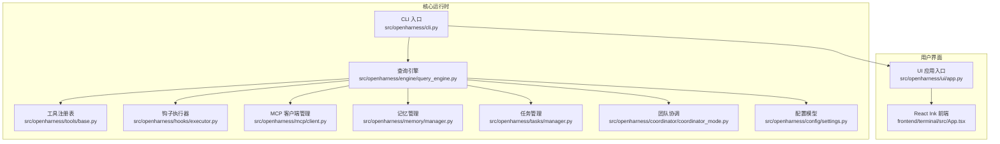

**图表来源**
- [src/openharness/cli.py:1-378](file://src/openharness/cli.py#L1-L378)
- [src/openharness/engine/query_engine.py:1-101](file://src/openharness/engine/query_engine.py#L1-L101)
- [src/openharness/tools/base.py:1-76](file://src/openharness/tools/base.py#L1-L76)
- [src/openharness/hooks/executor.py:1-217](file://src/openharness/hooks/executor.py#L1-L217)
- [src/openharness/mcp/client.py:1-175](file://src/openharness/mcp/client.py#L1-L175)
- [src/openharness/memory/manager.py:1-51](file://src/openharness/memory/manager.py#L1-L51)
- [src/openharness/tasks/manager.py:1-281](file://src/openharness/tasks/manager.py#L1-L281)
- [src/openharness/coordinator/coordinator_mode.py:1-63](file://src/openharness/coordinator/coordinator_mode.py#L1-L63)
- [src/openharness/config/settings.py:1-161](file://src/openharness/config/settings.py#L1-L161)
- [src/openharness/ui/app.py:1-149](file://src/openharness/ui/app.py#L1-L149)
- [frontend/terminal/src/App.tsx:1-400](file://frontend/terminal/src/App.tsx#L1-L400)

**章节来源**
- [README.md:127-170](file://README.md#L127-L170)

## 核心组件
- CLI 与入口
  - 提供 oh/openharness 两个命令入口，支持交互会话与非交互输出模式
  - 子命令：mcp、plugin、auth，覆盖 MCP 管理、插件安装与认证状态
- 查询引擎
  - 封装代理循环：提交用户消息、驱动模型流式响应、处理工具调用、更新成本统计
- 工具体系
  - 统一的工具抽象与注册表；每个工具具备输入校验、自描述 JSON Schema、权限集成与钩子支持
- 钩子系统
  - 支持命令、HTTP、提示类与代理类钩子，统一事件分发与阻断逻辑
- MCP 客户端
  - 管理 MCP 服务器连接、列出工具与资源、调用工具与读取资源
- 记忆与任务
  - 记忆文件索引与增删改查；后台任务的创建、监控、重启与输出采集
- 多智能体协调
  - 团队记录与成员管理，支撑子代理与团队协作
- 配置与 UI
  - 多层设置合并（CLI > 环境变量 > 配置文件 > 默认值）；React/TUI 前后端协议桥接

**章节来源**
- [src/openharness/cli.py:1-378](file://src/openharness/cli.py#L1-L378)
- [src/openharness/engine/query_engine.py:1-101](file://src/openharness/engine/query_engine.py#L1-L101)
- [src/openharness/tools/base.py:1-76](file://src/openharness/tools/base.py#L1-L76)
- [src/openharness/hooks/executor.py:1-217](file://src/openharness/hooks/executor.py#L1-L217)
- [src/openharness/mcp/client.py:1-175](file://src/openharness/mcp/client.py#L1-L175)
- [src/openharness/memory/manager.py:1-51](file://src/openharness/memory/manager.py#L1-L51)
- [src/openharness/tasks/manager.py:1-281](file://src/openharness/tasks/manager.py#L1-L281)
- [src/openharness/coordinator/coordinator_mode.py:1-63](file://src/openharness/coordinator/coordinator_mode.py#L1-L63)
- [src/openharness/config/settings.py:1-161](file://src/openharness/config/settings.py#L1-L161)
- [src/openharness/ui/app.py:1-149](file://src/openharness/ui/app.py#L1-L149)

## 架构总览
OpenHarness 的核心是“代理循环”，模型决定做什么，Harness 决定怎么做——安全、高效且可观测。

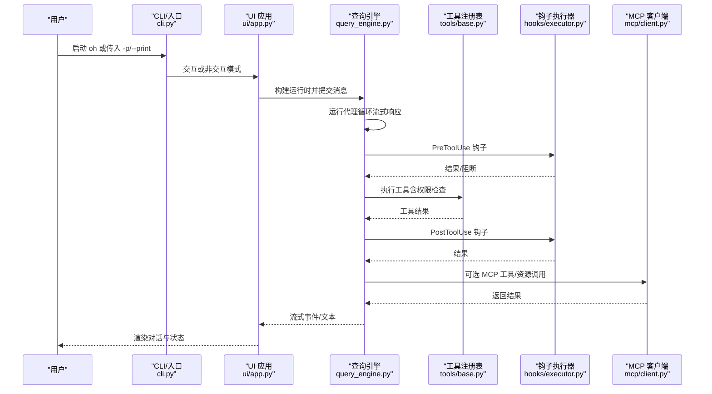

**图表来源**
- [src/openharness/cli.py:334-378](file://src/openharness/cli.py#L334-L378)
- [src/openharness/ui/app.py:50-149](file://src/openharness/ui/app.py#L50-L149)
- [src/openharness/engine/query_engine.py:81-101](file://src/openharness/engine/query_engine.py#L81-L101)
- [src/openharness/hooks/executor.py:49-63](file://src/openharness/hooks/executor.py#L49-L63)
- [src/openharness/mcp/client.py:92-120](file://src/openharness/mcp/client.py#L92-L120)

## 详细组件分析

### CLI 与命令行接口
- 主要职责
  - 解析参数与选项（会话、模型、输出格式、权限、系统提示、设置、MCP 配置等）
  - 分发到 REPL 或打印模式
  - 子命令：mcp（列表/添加/移除）、plugin（列表/安装/卸载）、auth（状态/登录/登出）
- 设计要点
  - 使用 Typer 构建富交互帮助面板与分组选项
  - 支持“最小模式”跳过钩子、插件、MCP 自动发现，便于测试与隔离问题

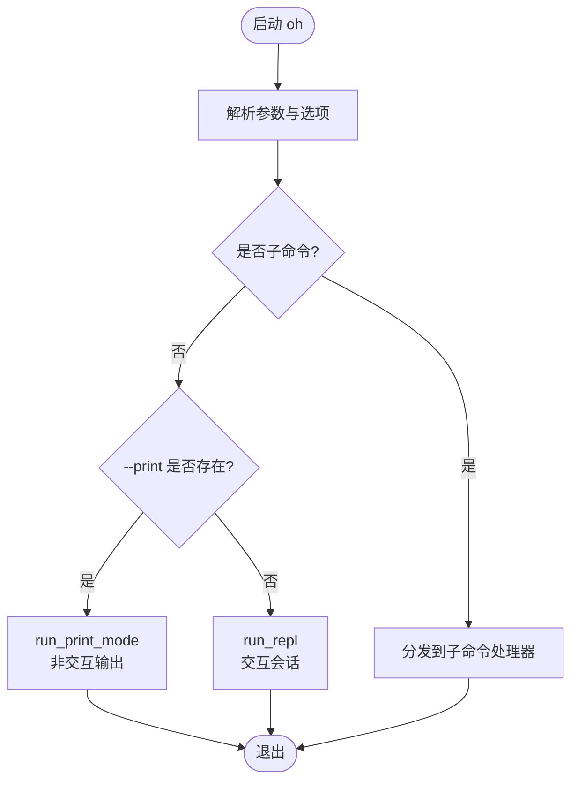

**图表来源**
- [src/openharness/cli.py:179-378](file://src/openharness/cli.py#L179-L378)
- [src/openharness/ui/app.py:15-48](file://src/openharness/ui/app.py#L15-L48)

**章节来源**
- [src/openharness/cli.py:1-378](file://src/openharness/cli.py#L1-L378)
- [src/openharness/ui/app.py:1-149](file://src/openharness/ui/app.py#L1-L149)

### 查询引擎与代理循环
- 主要职责
  - 维护对话历史与成本统计
  - 将用户消息加入历史，构建 QueryContext 并驱动 run_query 循环
  - 在每次工具调用前后触发钩子，确保可观测与可审计
- 关键流程
  - 流式接收模型响应，若为工具调用则逐个执行
  - 更新消息历史与成本，产出流式事件

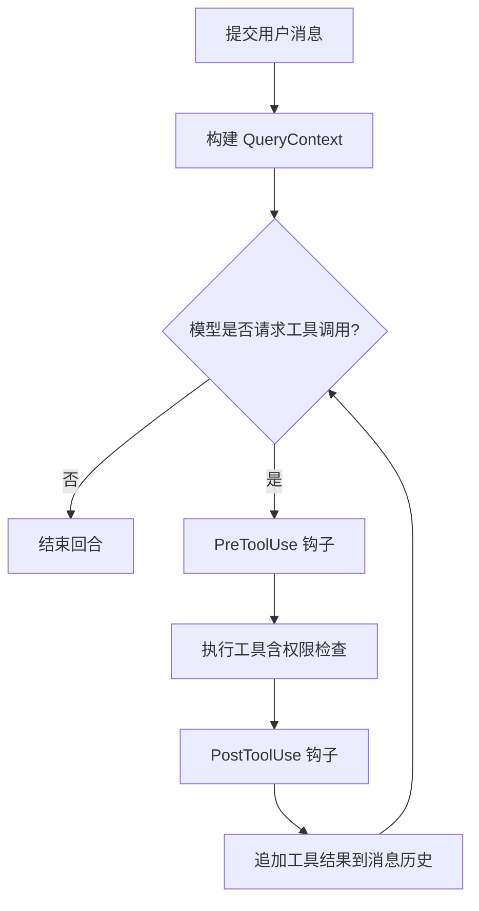

**图表来源**
- [src/openharness/engine/query_engine.py:81-101](file://src/openharness/engine/query_engine.py#L81-L101)
- [src/openharness/hooks/executor.py:49-63](file://src/openharness/hooks/executor.py#L49-L63)

**章节来源**
- [src/openharness/engine/query_engine.py:1-101](file://src/openharness/engine/query_engine.py#L1-L101)
- [src/openharness/hooks/executor.py:1-217](file://src/openharness/hooks/executor.py#L1-L217)

### 工具系统与注册表
- 设计模式
  - BaseTool 抽象定义工具名称、描述、输入模型与执行方法
  - ToolRegistry 提供注册、查找与 API Schema 导出
- 数据结构与复杂度
  - 注册表为字典映射，查找与导出均为 O(n)（n 为已注册工具数）
- 集成点
  - 与权限检查、钩子执行、API Schema 生成紧密耦合

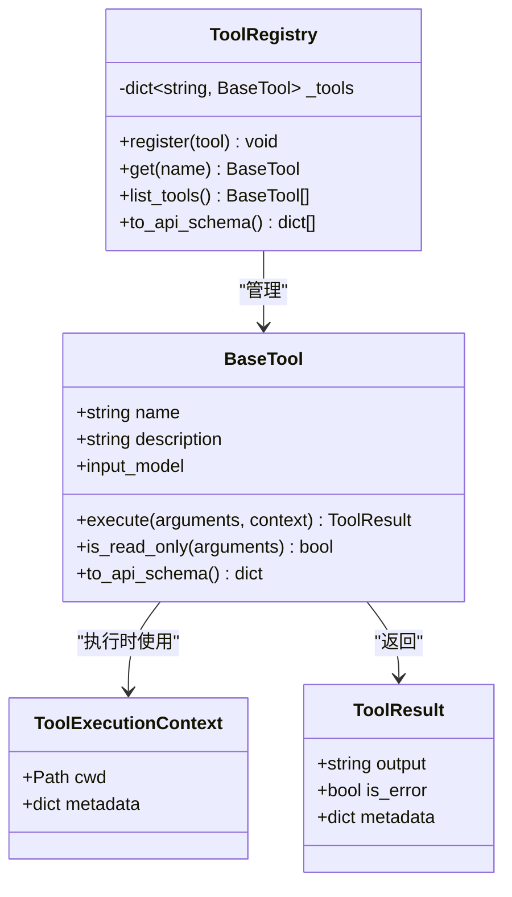

**图表来源**
- [src/openharness/tools/base.py:13-76](file://src/openharness/tools/base.py#L13-L76)

**章节来源**
- [src/openharness/tools/base.py:1-76](file://src/openharness/tools/base.py#L1-L76)

### 钩子系统与生命周期
- 类型与执行
  - 命令钩子：通过 bash 执行外部命令，注入环境变量与超时控制
  - HTTP 钩子：向远端服务发送事件负载
  - 提示类/代理类钩子：通过模型判断条件是否满足，严格 JSON 输出
- 执行策略
  - 匹配器支持通配符匹配；失败可选择阻断后续流程
  - 统一聚合结果，便于上层决策

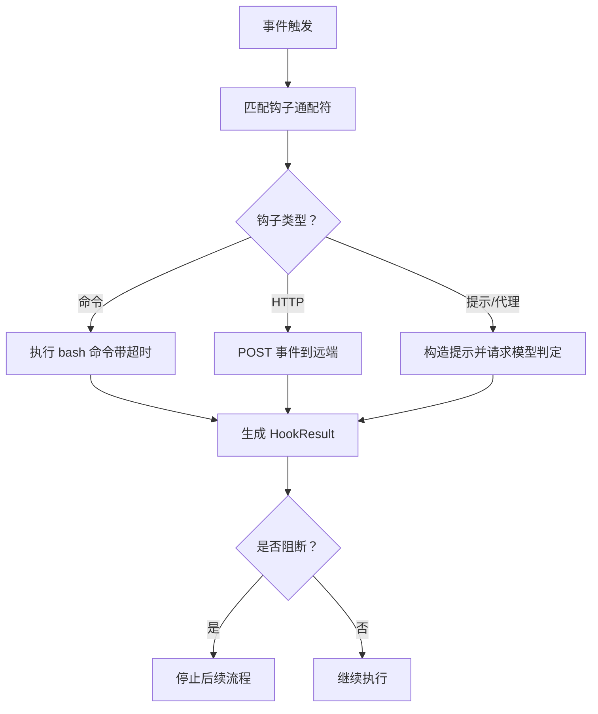

**图表来源**
- [src/openharness/hooks/executor.py:49-191](file://src/openharness/hooks/executor.py#L49-L191)

**章节来源**
- [src/openharness/hooks/executor.py:1-217](file://src/openharness/hooks/executor.py#L1-L217)

### MCP 客户端与资源工具
- 能力
  - 连接 stdio MCP 服务器，列举工具与资源
  - 调用工具与读取资源，统一结果字符串化
  - 状态跟踪与重连机制
- 集成点
  - 与工具注册表结合，将 MCP 工具暴露给模型与工具调用链

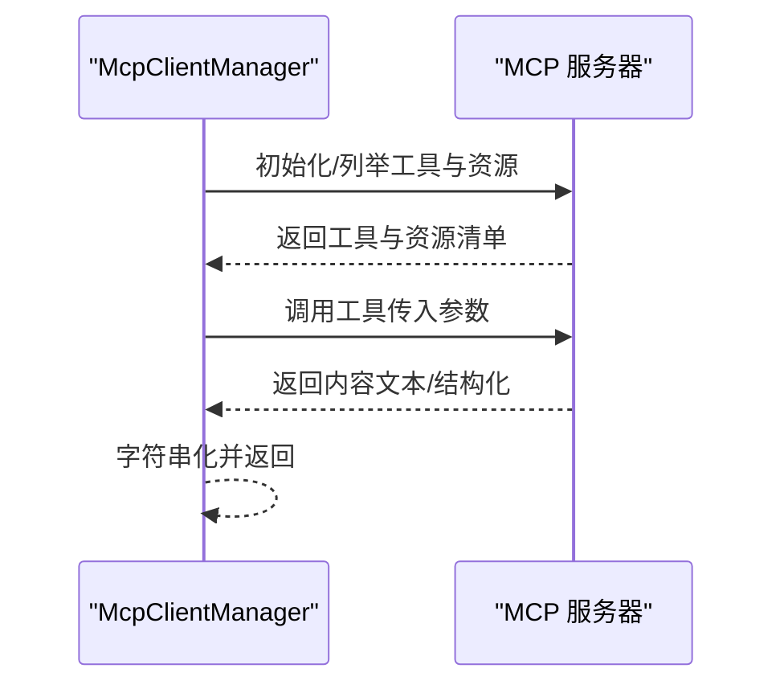

**图表来源**
- [src/openharness/mcp/client.py:36-120](file://src/openharness/mcp/client.py#L36-L120)

**章节来源**
- [src/openharness/mcp/client.py:1-175](file://src/openharness/mcp/client.py#L1-L175)

### 记忆与任务管理
- 记忆
  - 项目级记忆文件索引与增删改查，自动维护索引文件
- 任务
  - 后台任务创建（本地 Shell 与本地/远程/进程内代理任务）
  - 进程监控、输出采集、重启与停止
  - 任务元数据用于 UI 展示与协调

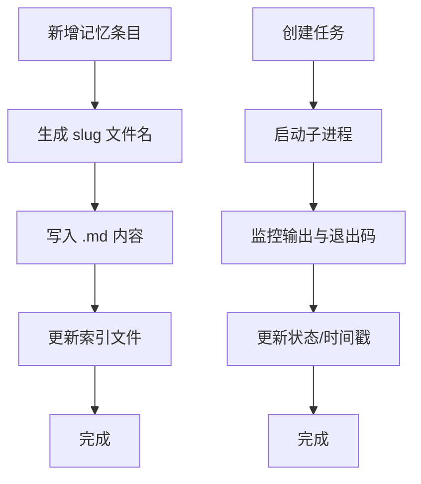

**图表来源**
- [src/openharness/memory/manager.py:17-30](file://src/openharness/memory/manager.py#L17-L30)
- [src/openharness/tasks/manager.py:29-92](file://src/openharness/tasks/manager.py#L29-L92)

**章节来源**
- [src/openharness/memory/manager.py:1-51](file://src/openharness/memory/manager.py#L1-L51)
- [src/openharness/tasks/manager.py:1-281](file://src/openharness/tasks/manager.py#L1-L281)

### 多智能体协调
- 团队记录
  - 创建/删除团队、添加代理、发送消息、列出团队
- 单例注册表
  - 全局共享，简化跨模块协作

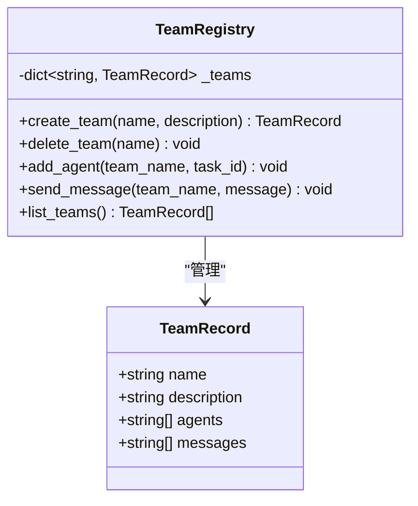

**图表来源**
- [src/openharness/coordinator/coordinator_mode.py:8-63](file://src/openharness/coordinator/coordinator_mode.py#L8-L63)

**章节来源**
- [src/openharness/coordinator/coordinator_mode.py:1-63](file://src/openharness/coordinator/coordinator_mode.py#L1-L63)

### 配置与设置
- 设置模型
  - API 配置、行为开关、权限、钩子、内存、插件启用、MCP 服务器、UI 主题与输出样式等
- 加载策略
  - CLI > 环境变量 > 配置文件 > 默认值，支持运行时覆盖
- 保存与迁移
  - 提供保存函数，便于持久化用户偏好

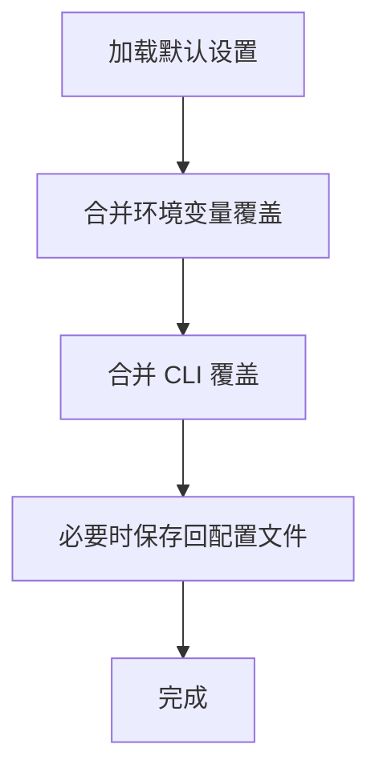

**图表来源**
- [src/openharness/config/settings.py:123-161](file://src/openharness/config/settings.py#L123-L161)

**章节来源**
- [src/openharness/config/settings.py:1-161](file://src/openharness/config/settings.py#L1-L161)

### 用户界面与交互
- React/TUI 前端
  - Ink 组件驱动命令拾取、权限弹窗、模式切换、会话恢复、状态栏与输入框
  - 支持脚本化自动化与键盘快捷键
- 后端桥接
  - 与后端会话通信，处理选择请求、权限确认、问题回答等

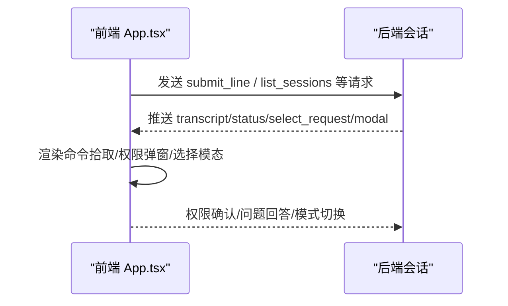

**图表来源**
- [frontend/terminal/src/App.tsx:39-147](file://frontend/terminal/src/App.tsx#L39-L147)
- [src/openharness/ui/app.py:15-48](file://src/openharness/ui/app.py#L15-L48)

**章节来源**
- [frontend/terminal/src/App.tsx:1-400](file://frontend/terminal/src/App.tsx#L1-L400)
- [src/openharness/ui/app.py:1-149](file://src/openharness/ui/app.py#L1-L149)

## 依赖关系分析
- 语言与工具链
  - Python 3.11+，依赖 rich、prompt-toolkit、textual、typer、pydantic、httpx、websockets、mcp、pyyaml、watchfiles 等
  - 可选开发依赖：pytest、ruff、mypy、pexpect 等
- 命令入口
  - 通过脚本 oh/openharness 直接调用 Typer 应用

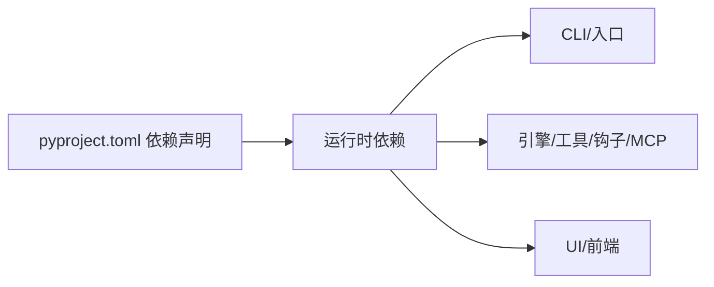

**图表来源**
- [pyproject.toml:15-28](file://pyproject.toml#L15-L28)
- [pyproject.toml:40-43](file://pyproject.toml#L40-L43)

**章节来源**
- [pyproject.toml:1-58](file://pyproject.toml#L1-L58)
- [src/openharness/__main__.py:1-7](file://src/openharness/__main__.py#L1-L7)

## 性能考量
- 代码体量与运行效率
  - 通过纯 Python 与模块化设计，减少运行时开销与启动时间
- IO 与并发
  - 任务管理采用异步子进程与锁同步，避免竞态并限制输出大小
- 观察性与成本
  - 查询引擎内置成本追踪，便于评估与优化

[本节为通用建议，不直接分析具体文件]

## 故障排查指南
- 常见问题定位
  - API 认证：检查环境变量或配置文件中的 API Key 与模型设置
  - 权限模式：确认当前权限模式与路径规则，必要时使用最小模式进行隔离
  - MCP 连接：查看 MCP 服务器状态与传输类型，确认 stdio 参数正确
  - 钩子失败：查看命令钩子超时、HTTP 钩子状态码与提示类钩子的 JSON 输出
- 调试建议
  - 使用 --debug 开启调试日志
  - 使用 --bare 最小化运行，逐步排除插件/钩子/MCP 影响
  - 非交互模式下使用 --output-format stream-json 获取实时事件流

**章节来源**
- [src/openharness/config/settings.py:76-96](file://src/openharness/config/settings.py#L76-L96)
- [src/openharness/mcp/client.py:36-58](file://src/openharness/mcp/client.py#L36-L58)
- [src/openharness/hooks/executor.py:86-115](file://src/openharness/hooks/executor.py#L86-L115)

## 结论
OpenHarness 以极简代码实现了 Claude Code 的核心代理能力，强调可理解性、可扩展性与可观测性。通过模块化的子系统与清晰的代理循环，它既适合初学者快速上手，也为高级用户提供深入定制的空间。未来将持续完善多模态与跨协议支持，并进一步强化团队协作与可观测性能力。

[本节为总结性内容，不直接分析具体文件]

## 附录
- 快速开始
  - 安装与运行：克隆仓库、使用 uv 同步依赖、设置后端环境变量、运行 oh
  - 非交互模式：-p/--print、--output-format 文本/JSON/流式 JSON
- 开发与贡献
  - 新增工具：遵循 BaseTool 接口与输入模型规范
  - 新增技能：在 ~/.openharness/skills 下放置 .md 文件
  - 新增插件：遵循 claude-code 插件规范，提供命令/钩子/代理等

**章节来源**
- [README.md:82-125](file://README.md#L82-L125)
- [README.md:302-356](file://README.md#L302-L356)