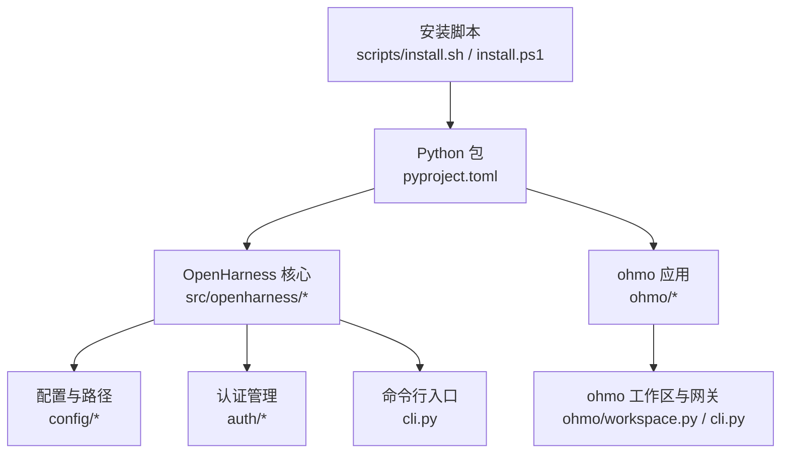
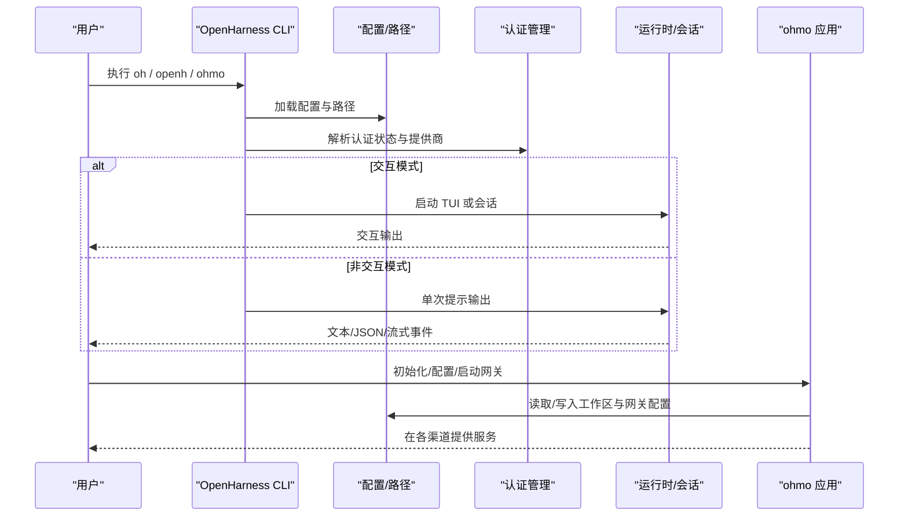
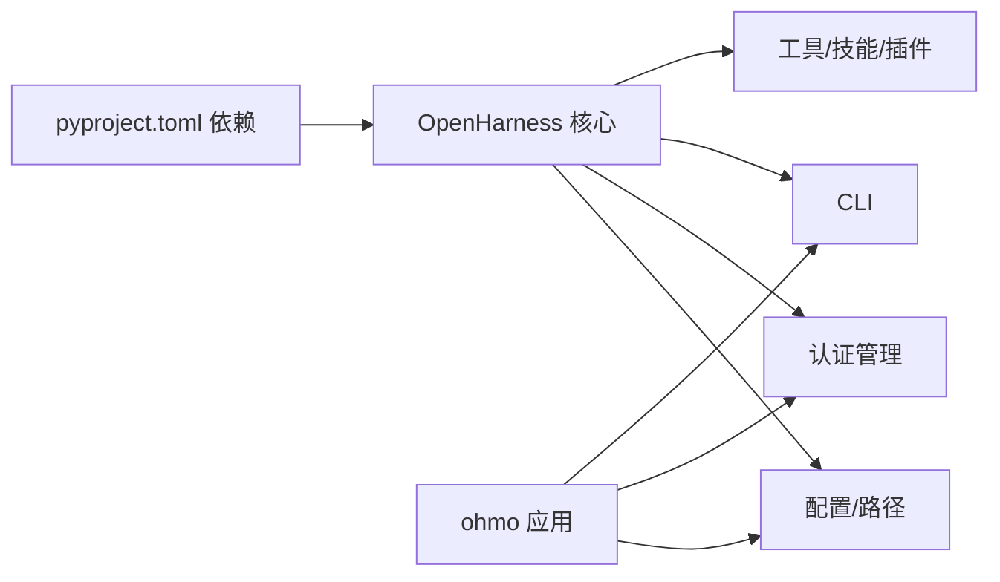

# 快速开始

<cite>
**本文引用的文件**
- [README.md](file://README.md)
- [scripts/install.sh](file://scripts/install.sh)
- [scripts/install.ps1](file://scripts/install.ps1)
- [pyproject.toml](file://pyproject.toml)
- [src/openharness/cli.py](file://src/openharness/cli.py)
- [src/openharness/config/settings.py](file://src/openharness/config/settings.py)
- [src/openharness/config/paths.py](file://src/openharness/config/paths.py)
- [src/openharness/auth/manager.py](file://src/openharness/auth/manager.py)
- [src/openharness/auth/storage.py](file://src/openharness/auth/storage.py)
- [ohmo/cli.py](file://ohmo/cli.py)
- [ohmo/workspace.py](file://ohmo/workspace.py)
</cite>

## 目录
1. [简介](#简介)
2. [项目结构](#项目结构)
3. [核心组件](#核心组件)
4. [架构总览](#架构总览)
5. [详细组件分析](#详细组件分析)
6. [依赖关系分析](#依赖关系分析)
7. [性能与可用性建议](#性能与可用性建议)
8. [常见问题与故障排除](#常见问题与故障排除)
9. [结论](#结论)
10. [附录：安装与配置清单](#附录安装与配置清单)

## 简介
本指南面向首次接触 OpenHarness 的用户，目标是在 5 分钟内完成安装、配置并运行第一个交互式会话；同时覆盖非交互模式、dry-run 安全预览、ohmo 个人代理的初始化与配置流程，并提供常见问题排查建议。OpenHarness 是一个开源的轻量级“智能体夹具（Agent Harness）”，提供工具调用、技能加载、记忆与多智能体协作能力；ohmo 则是基于 OpenHarness 构建的个人代理应用，可在多种即时通讯渠道中与你协同工作。

## 项目结构
- 根目录包含安装脚本、README、前端终端、ohmo 应用、核心 Python 包与测试等。
- 安装脚本针对 Linux/macOS/WSL 与 Windows 提供一键安装路径。
- OpenHarness 核心位于 src/openharness，ohmo 应用位于 ohmo 子目录。
- 前端终端位于 frontend/terminal，用于 React TUI（可选）。

图表来源
- [scripts/install.sh:1-388](file://scripts/install.sh#L1-L388)
- [scripts/install.ps1:1-330](file://scripts/install.ps1#L1-L330)
- [pyproject.toml:1-86](file://pyproject.toml#L1-L86)
- [src/openharness/cli.py:1-800](file://src/openharness/cli.py#L1-L800)
- [ohmo/cli.py:1-676](file://ohmo/cli.py#L1-L676)

章节来源
- [README.md:197-284](file://README.md#L197-L284)
- [scripts/install.sh:1-388](file://scripts/install.sh#L1-L388)
- [scripts/install.ps1:1-330](file://scripts/install.ps1#L1-L330)
- [pyproject.toml:1-86](file://pyproject.toml#L1-L86)

## 核心组件
- 命令行入口与子命令：OpenHarness 通过 typer 提供统一 CLI，支持 setup、provider、auth、plugin、mcp 等子命令；ohmo 提供 init、config、gateway 等子命令。
- 配置系统：支持环境变量、配置文件与命令行参数的多层合并，内置多提供商工作流与模型别名解析。
- 认证管理：集中管理 API Key、订阅桥接与 OAuth 凭据，支持文件与系统钥匙串后端。
- ohmo 工作区：提供个人代理的持久化工作区、模板文件与网关配置。

章节来源
- [src/openharness/cli.py:751-800](file://src/openharness/cli.py#L751-L800)
- [src/openharness/config/settings.py:534-626](file://src/openharness/config/settings.py#L534-L626)
- [src/openharness/auth/manager.py:71-115](file://src/openharness/auth/manager.py#L71-L115)
- [ohmo/cli.py:37-51](file://ohmo/cli.py#L37-L51)
- [ohmo/workspace.py:163-301](file://ohmo/workspace.py#L163-L301)

## 架构总览
下图展示了从命令行到运行时的关键路径：CLI 解析参数与配置，构建运行时设置，解析认证状态与提供商，最终进入交互或非交互执行路径。

图表来源
- [src/openharness/cli.py:751-800](file://src/openharness/cli.py#L751-L800)
- [src/openharness/config/paths.py:15-68](file://src/openharness/config/paths.py#L15-L68)
- [src/openharness/auth/manager.py:186-289](file://src/openharness/auth/manager.py#L186-L289)
- [ohmo/cli.py:414-490](file://ohmo/cli.py#L414-L490)
- [ohmo/workspace.py:252-301](file://ohmo/workspace.py#L252-L301)

## 详细组件分析

### 安装与平台差异
- Linux/macOS/WSL：推荐使用一键脚本安装，自动创建虚拟环境、链接命令、设置 PATH；也可直接 pip 安装包。
- Windows：推荐使用 PowerShell 一键脚本；若使用旧版本，可能需要使用 openharness 或以 oh.exe 方式调用。

章节来源
- [README.md:199-222](file://README.md#L199-L222)
- [scripts/install.sh:1-388](file://scripts/install.sh#L1-L388)
- [scripts/install.ps1:1-330](file://scripts/install.ps1#L1-L330)
- [pyproject.toml:48-52](file://pyproject.toml#L48-L52)

### 配置与提供商选择
- 使用交互式 setup 流程选择提供商、认证与模型；支持多提供商工作流与按配置文件切换。
- 支持的提供商包括 Anthropic 兼容、OpenAI 兼容、Copilot、Codex、Moonshot/Kimi、Gemini、MiniMax、NVIDIA NIM、DashScope、ModelScope 等。
- 可通过环境变量或配置文件覆盖默认设置；支持 profile 级别的凭据隔离。

章节来源
- [README.md:223-230](file://README.md#L223-L230)
- [src/openharness/config/settings.py:188-274](file://src/openharness/config/settings.py#L188-L274)
- [src/openharness/auth/manager.py:291-318](file://src/openharness/auth/manager.py#L291-L318)

### 认证与凭据存储
- 支持 API Key（文件或系统钥匙串）、订阅桥接（Claude/Codex）与 Copilot OAuth。
- 凭据存储采用安全策略：优先系统钥匙串，否则使用受权限保护的本地 JSON 文件。
- 可通过 auth 子命令查看状态、登录/登出与清理凭据。

章节来源
- [src/openharness/auth/storage.py:1-270](file://src/openharness/auth/storage.py#L1-L270)
- [src/openharness/auth/manager.py:116-184](file://src/openharness/auth/manager.py#L116-L184)

### 交互与非交互模式
- 交互模式：启动 TUI 或等待输入，适合探索与调试。
- 非交互模式：通过 -p/--print 获取一次性输出，支持 text/json/stream-json 输出格式。
- dry-run：在不实际调用模型/工具的情况下，预览设置、认证、技能、命令与 MCP 配置，给出 ready/warning/blocked 的就绪等级与下一步建议。

章节来源
- [README.md:255-284](file://README.md#L255-L284)
- [src/openharness/cli.py:396-597](file://src/openharness/cli.py#L396-L597)
- [src/openharness/cli.py:600-742](file://src/openharness/cli.py#L600-L742)

### ohmo 个人代理初始化与配置
- 初始化工作区：生成 soul.md、user.md、memory 等模板文件与默认 gateway.json。
- 配置提供商与频道：支持 Telegram、Slack、Discord、Feishu；可选择是否允许远程管理员命令。
- 启动网关：前台运行或后台进程管理；支持重启与状态查询。

章节来源
- [README.md:243-251](file://README.md#L243-L251)
- [ohmo/cli.py:493-534](file://ohmo/cli.py#L493-L534)
- [ohmo/cli.py:628-676](file://ohmo/cli.py#L628-L676)
- [ohmo/workspace.py:252-301](file://ohmo/workspace.py#L252-L301)

## 依赖关系分析
- 安装脚本与包元数据定义了 Python 版本要求与依赖项，确保在不同平台具备一致的运行环境。
- CLI 与配置模块之间存在强耦合：CLI 依赖配置加载与路径解析；认证模块为运行时提供凭据解析。
- ohmo 依赖 OpenHarness 的配置与认证能力，并在其工作区内维护独立的网关配置。

图表来源
- [pyproject.toml:16-36](file://pyproject.toml#L16-L36)
- [src/openharness/config/paths.py:15-68](file://src/openharness/config/paths.py#L15-L68)
- [src/openharness/auth/manager.py:71-115](file://src/openharness/auth/manager.py#L71-L115)
- [src/openharness/cli.py:751-800](file://src/openharness/cli.py#L751-L800)
- [ohmo/cli.py:37-51](file://ohmo/cli.py#L37-L51)

章节来源
- [pyproject.toml:16-36](file://pyproject.toml#L16-L36)
- [src/openharness/config/paths.py:15-68](file://src/openharness/config/paths.py#L15-L68)
- [src/openharness/auth/manager.py:71-115](file://src/openharness/auth/manager.py#L71-L115)
- [src/openharness/cli.py:751-800](file://src/openharness/cli.py#L751-L800)
- [ohmo/cli.py:37-51](file://ohmo/cli.py#L37-L51)

## 性能与可用性建议
- React TUI 需要 Node.js >= 18；若未安装，将跳过前端依赖安装但仍可使用 CLI。
- 在长会话场景中启用内存自动压缩与会话历史持久化，有助于减少上下文膨胀。
- 使用 dry-run 在执行前进行静态检查，避免不必要的 API 调用与工具执行。

章节来源
- [scripts/install.sh:150-179](file://scripts/install.sh#L150-L179)
- [README.md:468-486](file://README.md#L468-L486)

## 常见问题与故障排除
- Windows 终端别名冲突：在 PowerShell 中使用 openharness 或以 oh.exe 显式调用。
- PATH 未更新：安装脚本会尝试将命令链接到用户 PATH，若未生效需手动添加或重启终端。
- 缺少 API Key：根据所选提供商设置对应环境变量或在配置中保存；ohmo 使用现有订阅时无需额外 Key。
- Node.js 不满足要求：React TUI 将被跳过，不影响 CLI 使用。
- ohmo 网关未启动：检查 gateway.json 配置与频道令牌；使用 status/restart 控制进程。

章节来源
- [README.md:221-222](file://README.md#L221-L222)
- [scripts/install.sh:318-367](file://scripts/install.sh#L318-L367)
- [scripts/install.ps1:240-254](file://scripts/install.ps1#L240-L254)
- [src/openharness/auth/storage.py:1-270](file://src/openharness/auth/storage.py#L1-L270)
- [ohmo/cli.py:669-676](file://ohmo/cli.py#L669-L676)

## 结论
通过本快速开始指南，你可以在 5 分钟内完成 OpenHarness 的安装与基础配置，并运行第一个交互式会话；同时掌握非交互模式、dry-run 预览与 ohmo 个人代理的初始化流程。建议在后续实践中逐步引入技能、插件与频道集成，以满足更复杂的开发与协作需求。

## 附录：安装与配置清单
- 安装
  - Linux/macOS/WSL：使用一键脚本或 pip 安装包；脚本会创建虚拟环境并链接命令。
  - Windows：使用 PowerShell 一键脚本；注意别名冲突时改用 openharness 或 oh.exe。
- 配置
  - 运行 oh setup 选择提供商与认证；或通过环境变量/配置文件覆盖。
  - ohmo init 初始化工作区；ohmo config 配置提供商与频道；ohmo gateway start 启动网关。
- 使用
  - 交互：直接运行 oh 或 openh。
  - 非交互：oh -p "你的提示"；指定 --output-format 获取 JSON/流式事件。
  - 安全预览：oh --dry-run 查看设置、认证、技能、命令与 MCP 配置，获得 ready/warning/blocked 评估与下一步建议。

章节来源
- [README.md:199-284](file://README.md#L199-L284)
- [scripts/install.sh:184-313](file://scripts/install.sh#L184-L313)
- [scripts/install.ps1:127-305](file://scripts/install.ps1#L127-L305)
- [ohmo/cli.py:493-534](file://ohmo/cli.py#L493-L534)