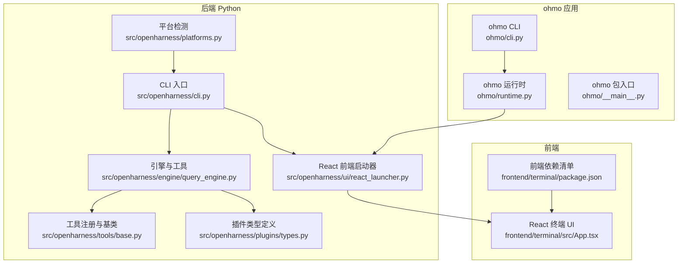
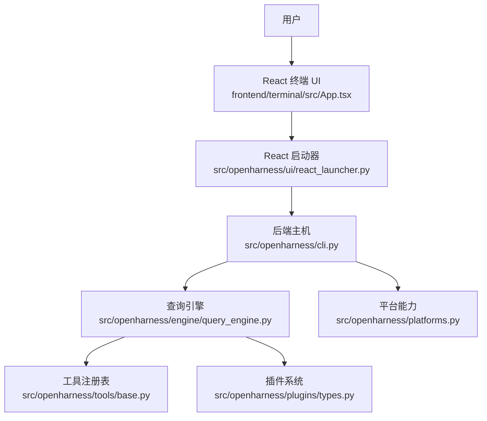
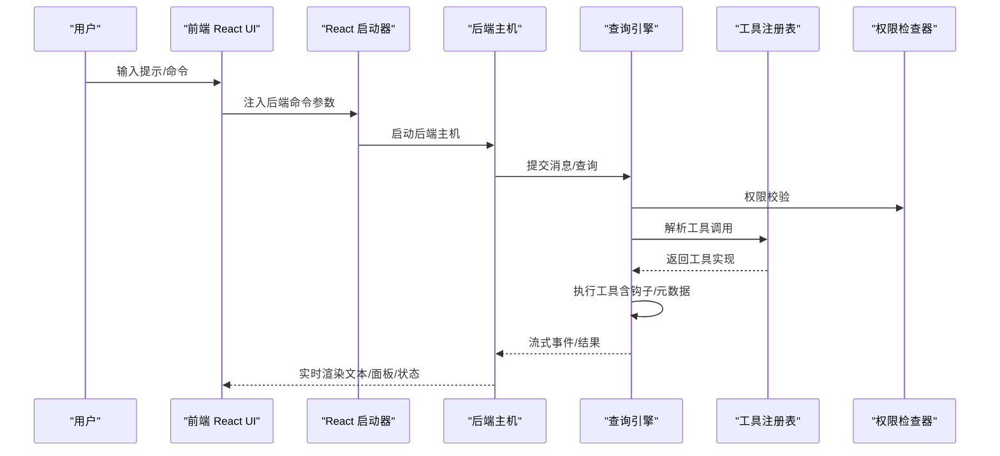
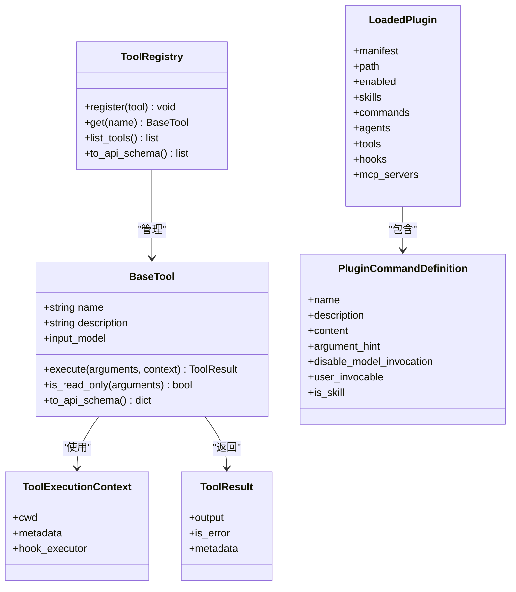
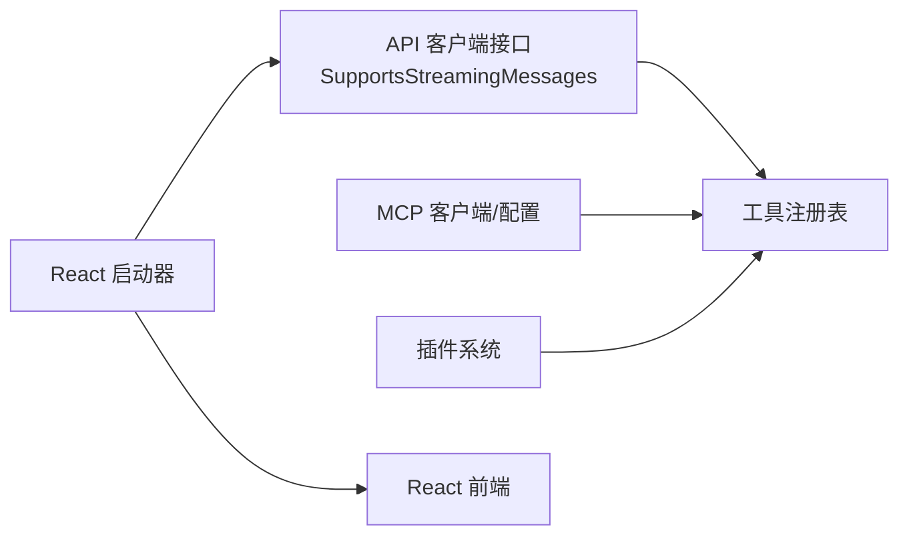

# 技术栈

<cite>
**本文引用的文件**
- [README.md](file://README.md)
- [pyproject.toml](file://pyproject.toml)
- [frontend/terminal/package.json](file://frontend/terminal/package.json)
- [autopilot-dashboard/package.json](file://autopilot-dashboard/package.json)
- [src/openharness/ui/react_launcher.py](file://src/openharness/ui/react_launcher.py)
- [src/openharness/cli.py](file://src/openharness/cli.py)
- [ohmo/cli.py](file://ohmo/cli.py)
- [ohmo/runtime.py](file://ohmo/runtime.py)
- [src/openharness/platforms.py](file://src/openharness/platforms.py)
- [scripts/install.sh](file://scripts/install.sh)
- [src/openharness/engine/query_engine.py](file://src/openharness/engine/query_engine.py)
- [src/openharness/tools/base.py](file://src/openharness/tools/base.py)
- [src/openharness/plugins/types.py](file://src/openharness/plugins/types.py)
- [frontend/terminal/src/App.tsx](file://frontend/terminal/src/App.tsx)
- [ohmo/__main__.py](file://ohmo/__main__.py)
</cite>

## 目录
1. [简介](#简介)
2. [项目结构](#项目结构)
3. [核心组件](#核心组件)
4. [架构总览](#架构总览)
5. [详细组件分析](#详细组件分析)
6. [依赖关系分析](#依赖关系分析)
7. [性能考量](#性能考量)
8. [故障排查指南](#故障排查指南)
9. [结论](#结论)
10. [附录](#附录)

## 简介
本文件面向开发者与技术决策者，系统化梳理 OpenHarness 的技术栈与架构设计，覆盖 Python 后端核心依赖、React/TUI 前端技术栈、ohmo 个人代理实现方式，并解释关键选型原因、版本要求、兼容性与多平台支持策略。文档同时提供架构图与流程图，帮助快速理解前后端分离、插件系统、多平台适配与安全权限控制等关键能力。

## 项目结构
OpenHarness 采用“后端 Python + 前端 React/TUI”的分层架构：后端以可复用的 Agent Harness 子系统为核心，前端通过共享的 React 终端 UI 提供交互体验；ohmo 作为基于 OpenHarness 的个人代理应用，复用后端运行时并通过独立的网关与多渠道（IM）对接。

图表来源
- [src/openharness/cli.py](file://src/openharness/cli.py)
- [src/openharness/engine/query_engine.py](file://src/openharness/engine/query_engine.py)
- [src/openharness/tools/base.py](file://src/openharness/tools/base.py)
- [src/openharness/plugins/types.py](file://src/openharness/plugins/types.py)
- [src/openharness/ui/react_launcher.py](file://src/openharness/ui/react_launcher.py)
- [src/openharness/platforms.py](file://src/openharness/platforms.py)
- [frontend/terminal/src/App.tsx](file://frontend/terminal/src/App.tsx)
- [frontend/terminal/package.json](file://frontend/terminal/package.json)
- [ohmo/cli.py](file://ohmo/cli.py)
- [ohmo/runtime.py](file://ohmo/runtime.py)
- [ohmo/__main__.py](file://ohmo/__main__.py)

章节来源
- [README.md](file://README.md)
- [pyproject.toml](file://pyproject.toml)
- [src/openharness/cli.py](file://src/openharness/cli.py)
- [src/openharness/ui/react_launcher.py](file://src/openharness/ui/react_launcher.py)
- [frontend/terminal/package.json](file://frontend/terminal/package.json)
- [frontend/terminal/src/App.tsx](file://frontend/terminal/src/App.tsx)
- [ohmo/cli.py](file://ohmo/cli.py)
- [ohmo/runtime.py](file://ohmo/runtime.py)
- [src/openharness/platforms.py](file://src/openharness/platforms.py)

## 核心组件
- 后端核心子系统
  - 引擎与对话循环：QueryEngine 负责消息构建、工具调用循环、权限校验、钩子执行与成本统计。
  - 工具体系：统一的 BaseTool 抽象与 ToolRegistry，支持输入模型验证、API Schema 导出与只读判定。
  - 插件系统：LoadedPlugin 与 PluginCommandDefinition 定义插件贡献的技能、命令、代理、工具与 MCP 服务器。
  - 平台能力：按操作系统与环境检测能力矩阵，驱动子进程、沙箱与会话行为。
- 前端交互
  - React 终端 UI：基于 Ink 的 TUI，支持命令补全、权限弹窗、任务面板、群友面板与状态栏。
  - 启动器：自动解析 Node/tsx、安装依赖、注入后端命令参数并启动前端。
- ohmo 个人代理
  - 独立 CLI 与运行时：封装 ohmo 特定的工作区、记忆与会话后端，复用共享的 React 后端主机。
  - 网关与通道：支持 Telegram、Slack、Discord、飞书等 IM 渠道配置与运行。

章节来源
- [src/openharness/engine/query_engine.py](file://src/openharness/engine/query_engine.py)
- [src/openharness/tools/base.py](file://src/openharness/tools/base.py)
- [src/openharness/plugins/types.py](file://src/openharness/plugins/types.py)
- [src/openharness/platforms.py](file://src/openharness/platforms.py)
- [frontend/terminal/src/App.tsx](file://frontend/terminal/src/App.tsx)
- [src/openharness/ui/react_launcher.py](file://src/openharness/ui/react_launcher.py)
- [ohmo/cli.py](file://ohmo/cli.py)
- [ohmo/runtime.py](file://ohmo/runtime.py)

## 架构总览
OpenHarness 采用“后端引擎 + 前端 UI”双进程模式：后端负责推理、工具执行与权限控制，前端负责渲染与用户交互。ohmo 在此基础上增加个人工作区与网关通道管理。

图表来源
- [frontend/terminal/src/App.tsx](file://frontend/terminal/src/App.tsx)
- [src/openharness/ui/react_launcher.py](file://src/openharness/ui/react_launcher.py)
- [src/openharness/cli.py](file://src/openharness/cli.py)
- [src/openharness/engine/query_engine.py](file://src/openharness/engine/query_engine.py)
- [src/openharness/tools/base.py](file://src/openharness/tools/base.py)
- [src/openharness/plugins/types.py](file://src/openharness/plugins/types.py)
- [src/openharness/platforms.py](file://src/openharness/platforms.py)

## 详细组件分析

### Python 后端技术栈与依赖
- 语言与打包
  - Python ≥ 3.10，打包与脚本入口由 pyproject.toml 配置，提供 openharness/oh/ohmo 等命令。
- 核心依赖
  - 推理客户端：anthropic、openai（支持多种兼容 API）
  - 交互与终端：rich、prompt-toolkit、textual（TUI）、websockets
  - MCP 协议：mcp
  - 配置与网络：httpx、pyyaml、questionary、watchfiles
  - 计划与调度：croniter
  - 通信 SDK：slack-sdk、python-telegram-bot、discord.py、lark-oapi
- 开发与质量
  - 测试：pytest 及 asyncio 支持
  - 规范：ruff（代码风格）、mypy（类型检查）

章节来源
- [pyproject.toml](file://pyproject.toml)
- [README.md](file://README.md)

### React/TUI 前端技术栈
- 框架与生态
  - React 18/19、Ink（终端渲染）、marked（Markdown 渲染）、tsx（TypeScript 运行）
- 功能特性
  - 命令补全、权限弹窗、任务/群友面板、状态栏、键盘提示、剪贴板图片附件
- 启动与集成
  - 通过 react_launcher 解析 Node/tsx、安装依赖、注入后端命令参数并启动前端

章节来源
- [frontend/terminal/package.json](file://frontend/terminal/package.json)
- [frontend/terminal/src/App.tsx](file://frontend/terminal/src/App.tsx)
- [src/openharness/ui/react_launcher.py](file://src/openharness/ui/react_launcher.py)

### ohmo 个人代理实现
- 运行时与工作区
  - 独立的 ohmo CLI 与运行时，初始化个人工作区，加载 ohmo 特定的技能/插件根目录与会话后端
- 网关与通道
  - 支持 Telegram、Slack、Discord、飞书等，提供配置向导与前台/后台运行模式
- 与后端的协作
  - 复用共享的 React 后端主机，注入 ohmo 系统提示与记忆后端

章节来源
- [ohmo/cli.py](file://ohmo/cli.py)
- [ohmo/runtime.py](file://ohmo/runtime.py)
- [ohmo/__main__.py](file://ohmo/__main__.py)

### 关键流程：前后端交互与工具调用

图表来源
- [src/openharness/ui/react_launcher.py](file://src/openharness/ui/react_launcher.py)
- [src/openharness/cli.py](file://src/openharness/cli.py)
- [src/openharness/engine/query_engine.py](file://src/openharness/engine/query_engine.py)
- [src/openharness/tools/base.py](file://src/openharness/tools/base.py)

### 类型与数据结构：工具与插件

图表来源
- [src/openharness/tools/base.py](file://src/openharness/tools/base.py)
- [src/openharness/plugins/types.py](file://src/openharness/plugins/types.py)

## 依赖关系分析
- 后端对第三方服务的抽象
  - API 客户端：统一 SupportsStreamingMessages 接口，屏蔽不同提供商差异
  - MCP：统一的协议客户端与配置类型，支持 HTTP/WS/STDIO 传输
- 前后端耦合点
  - React 启动器通过环境变量传递后端命令参数，前端仅负责渲染与交互
- 插件生态
  - 插件可贡献命令、技能、代理、工具与 MCP 服务器，增强后端能力

图表来源
- [src/openharness/engine/query_engine.py](file://src/openharness/engine/query_engine.py)
- [src/openharness/tools/base.py](file://src/openharness/tools/base.py)
- [src/openharness/plugins/types.py](file://src/openharness/plugins/types.py)
- [src/openharness/ui/react_launcher.py](file://src/openharness/ui/react_launcher.py)

章节来源
- [src/openharness/engine/query_engine.py](file://src/openharness/engine/query_engine.py)
- [src/openharness/tools/base.py](file://src/openharness/tools/base.py)
- [src/openharness/plugins/types.py](file://src/openharness/plugins/types.py)
- [src/openharness/ui/react_launcher.py](file://src/openharness/ui/react_launcher.py)

## 性能考量
- 上下文压缩与自动整理
  - 查询引擎支持自动压缩阈值与持久化会话内存，减少长对话上下文开销
- 并行与重试
  - 工具执行支持并发，API 调用具备指数退避重试机制
- 前端渲染优化
  - 使用 useDeferredValue 分离低优先级渲染，提升交互流畅度
- 平台差异
  - 不同平台启用不同的能力矩阵（如 POSIX shell、tmux、Docker 沙箱），避免在不支持的环境中执行高风险操作

章节来源
- [src/openharness/engine/query_engine.py](file://src/openharness/engine/query_engine.py)
- [frontend/terminal/src/App.tsx](file://frontend/terminal/src/App.tsx)
- [src/openharness/platforms.py](file://src/openharness/platforms.py)

## 故障排查指南
- 安装与环境
  - Python ≥ 3.10、Node.js ≥ 18（可选，用于 React TUI）
  - 一键安装脚本会创建虚拟环境、链接命令并安装前端依赖
- 前端无法启动
  - 检查 Node/tsx 是否可用；若通过 npm exec 启动导致 TTY 继承问题，可直接使用本地 tsx 二进制
- ohmo 渠道配置
  - 使用配置向导设置各渠道的令牌与策略；确认 allow_from 白名单已正确配置
- 权限与安全
  - 使用权限模式与路径规则限制危险操作；必要时开启交互式权限弹窗
- 干运行预览
  - 使用 --dry-run 预览设置解析、认证状态、工具/技能/命令发现与 MCP 配置问题，获得 ready/warning/blocked 三态与下一步建议

章节来源
- [scripts/install.sh](file://scripts/install.sh)
- [src/openharness/ui/react_launcher.py](file://src/openharness/ui/react_launcher.py)
- [ohmo/cli.py](file://ohmo/cli.py)
- [src/openharness/cli.py](file://src/openharness/cli.py)

## 结论
OpenHarness 以清晰的后端子系统与可复用的 React 终端 UI 构建 Agent Harness，具备强大的工具与插件生态、完善的权限与安全控制、跨平台适配与多渠道接入能力。ohmo 在此之上提供了个人代理的完整工作流与网关通道管理。该技术栈适合研究、实验与生产级扩展，便于在统一架构上进行定制与二次开发。

## 附录

### 版本与兼容性要点
- Python：≥ 3.10
- Node.js：≥ 18（用于 React TUI）
- 操作系统：Linux、macOS、Windows（含 WSL），平台能力矩阵自动适配
- 安装方式：pip 安装或源码安装（editable），一键脚本自动处理虚拟环境与 PATH

章节来源
- [pyproject.toml](file://pyproject.toml)
- [scripts/install.sh](file://scripts/install.sh)
- [src/openharness/platforms.py](file://src/openharness/platforms.py)