# 架构概览

<cite>
**本文引用的文件**
- [README.md](file://README.md)
- [pyproject.toml](file://pyproject.toml)
- [src/openharness/__main__.py](file://src/openharness/__main__.py)
- [src/openharness/cli.py](file://src/openharness/cli.py)
- [src/openharness/ui/runtime.py](file://src/openharness/ui/runtime.py)
- [src/openharness/engine/query_engine.py](file://src/openharness/engine/query_engine.py)
- [src/openharness/tools/base.py](file://src/openharness/tools/base.py)
- [src/openharness/memory/manager.py](file://src/openharness/memory/manager.py)
- [src/openharness/permissions/checker.py](file://src/openharness/permissions/checker.py)
- [src/openharness/hooks/executor.py](file://src/openharness/hooks/executor.py)
- [src/openharness/swarm/registry.py](file://src/openharness/swarm/registry.py)
- [src/openharness/api/client.py](file://src/openharness/api/client.py)
- [src/openharness/mcp/client.py](file://src/openharness/mcp/client.py)
- [src/openharness/channels/adapter.py](file://src/openharness/channels/adapter.py)
- [src/openharness/plugins/loader.py](file://src/openharness/plugins/loader.py)
- [src/openharness/config/settings.py](file://src/openharness/config/settings.py)
- [src/openharness/prompts/context.py](file://src/openharness/prompts/context.py)
- [src/openharness/tasks/manager.py](file://src/openharness/tasks/manager.py)
</cite>

## 目录
1. [简介](#简介)
2. [项目结构](#项目结构)
3. [核心组件](#核心组件)
4. [架构总览](#架构总览)
5. [详细组件分析](#详细组件分析)
6. [依赖分析](#依赖分析)
7. [性能考虑](#性能考虑)
8. [故障排查指南](#故障排查指南)
9. [结论](#结论)
10. [附录](#附录)

## 简介
OpenHarness 是一个开源的“智能体 harness”（工具与知识的基础设施），围绕大模型构建可组合、可观测、可扩展的代理系统。其目标是让 LLM 具备“手、眼、记忆与安全边界”，从而在长会话中可靠地完成复杂任务。

- 支持多提供商与多格式：Anthropic、OpenAI 兼容、Copilot、Codex、Moonshot/Kimi 等。
- 提供 43+ 工具、技能系统、权限治理、钩子生命周期、MCP 协议、多代理编排、内存持久化与自动压缩、任务后台执行等能力。
- 通过命令行与 React/TUI 两种入口接入，支持非交互式脚本模式与实时对话体验。

## 项目结构
OpenHarness 的代码以功能域划分的模块化结构组织，核心目录如下：
- engine：代理循环与消息流引擎
- tools：43+ 工具集合（文件、搜索、Web、MCP、任务、模式切换等）
- skills：按需加载的技能（.md 文件）
- plugins：插件生态（命令、钩子、代理、MCP 服务器）
- permissions：多级权限与路径规则
- hooks：生命周期钩子（PreToolUse/PostToolUse 等）
- commands：54+ 指令（/help、/commit、/plan、/resume 等）
- mcp：Model Context Protocol 客户端与管理器
- memory：跨会话持久化记忆
- tasks：后台任务管理
- coordinator：多代理协调与子代理编排
- prompts：系统提示词装配（含 CLAUDE.md、技能注入、项目上下文）
- config：多层配置合并与解析
- ui：React/TUI 前端与后端协议桥接
- api：统一的 API 客户端封装与重试逻辑
- channels：消息总线与通道适配器（用于 ohmo 网关）
- sandbox：沙箱运行时（可选）
- services：自动梦（AutoDream）、LSP、会话存储等服务

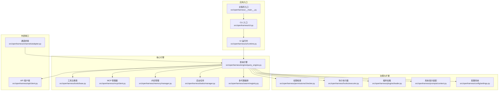

图示来源
- [src/openharness/__main__.py](file://src/openharness/__main__.py)
- [src/openharness/cli.py](file://src/openharness/cli.py)
- [src/openharness/ui/runtime.py](file://src/openharness/ui/runtime.py)
- [src/openharness/engine/query_engine.py](file://src/openharness/engine/query_engine.py)
- [src/openharness/tools/base.py](file://src/openharness/tools/base.py)
- [src/openharness/mcp/client.py](file://src/openharness/mcp/client.py)
- [src/openharness/memory/manager.py](file://src/openharness/memory/manager.py)
- [src/openharness/tasks/manager.py](file://src/openharness/tasks/manager.py)
- [src/openharness/swarm/registry.py](file://src/openharness/swarm/registry.py)
- [src/openharness/permissions/checker.py](file://src/openharness/permissions/checker.py)
- [src/openharness/hooks/executor.py](file://src/openharness/hooks/executor.py)
- [src/openharness/plugins/loader.py](file://src/openharness/plugins/loader.py)
- [src/openharness/prompts/context.py](file://src/openharness/prompts/context.py)
- [src/openharness/config/settings.py](file://src/openharness/config/settings.py)
- [src/openharness/api/client.py](file://src/openharness/api/client.py)
- [src/openharness/channels/adapter.py](file://src/openharness/channels/adapter.py)

章节来源
- [README.md](file://README.md)
- [pyproject.toml](file://pyproject.toml)

## 核心组件
- 查询引擎（QueryEngine）：承载对话历史、工具感知的代理循环，负责消息组装、令牌计数与成本跟踪、自动压缩与会话记忆持久化。
- 工具系统（ToolRegistry/BaseTool）：标准化工具输入/输出、JSON Schema 描述、只读判定与注册。
- 权限系统（PermissionChecker）：多级模式（默认/自动/计划模式）、路径规则、命令拒绝列表、敏感路径保护。
- 钩子系统（HookExecutor）：命令/HTTP/Prompt/Agent 四类钩子，支持超时、阻断失败、事件注入。
- MCP 管理器（McpClientManager）：支持 STDIO/HTTP/WebSocket 传输，动态连接、工具与资源发现、错误处理。
- 多代理编排（BackendRegistry）：检测并选择 in_process/tmux/subprocess 后端，支持 iTerm2/WSL 等环境。
- 内存系统（MemoryManager）：Markdown 记忆文件索引与增删改、签名去重、原子写入与并发锁。
- 后台任务（BackgroundTaskManager）：本地/远程/进程内代理任务、输出日志轮转、重启与监听回调。
- 系统提示装配（build_runtime_system_prompt）：技能清单、委托说明、CLAUDE.md、项目上下文、相关记忆。
- 配置系统（Settings）：多层优先级（CLI > 环境变量 > 配置文件 > 默认值）、提供商档案、模型别名解析、沙箱/视觉/图像生成配置。
- API 客户端（AnthropicApiClient/OpenAICompatibleClient/CopilotClient/CodexApiClient）：统一流式消息协议、指数退避重试、OAuth/Attribution 头注入。
- 通道桥接（ChannelBridge）：消息总线与 QueryEngine 的异步桥接，支持回压与错误恢复。

章节来源
- [src/openharness/engine/query_engine.py](file://src/openharness/engine/query_engine.py)
- [src/openharness/tools/base.py](file://src/openharness/tools/base.py)
- [src/openharness/permissions/checker.py](file://src/openharness/permissions/checker.py)
- [src/openharness/hooks/executor.py](file://src/openharness/hooks/executor.py)
- [src/openharness/mcp/client.py](file://src/openharness/mcp/client.py)
- [src/openharness/swarm/registry.py](file://src/openharness/swarm/registry.py)
- [src/openharness/memory/manager.py](file://src/openharness/memory/manager.py)
- [src/openharness/tasks/manager.py](file://src/openharness/tasks/manager.py)
- [src/openharness/prompts/context.py](file://src/openharness/prompts/context.py)
- [src/openharness/config/settings.py](file://src/openharness/config/settings.py)
- [src/openharness/api/client.py](file://src/openharness/api/client.py)
- [src/openharness/channels/adapter.py](file://src/openharness/channels/adapter.py)

## 架构总览
OpenHarness 的总体架构遵循“事件驱动 + 模块化 + 插件化”的设计原则，核心数据流自上而下为：用户输入 → CLI/TUI → RuntimeBundle → QueryEngine → API 客户端 → 工具执行 → 钩子/权限 → 结果回传；同时通过 MCP、通道桥接、后台任务与多代理编排实现横向扩展。

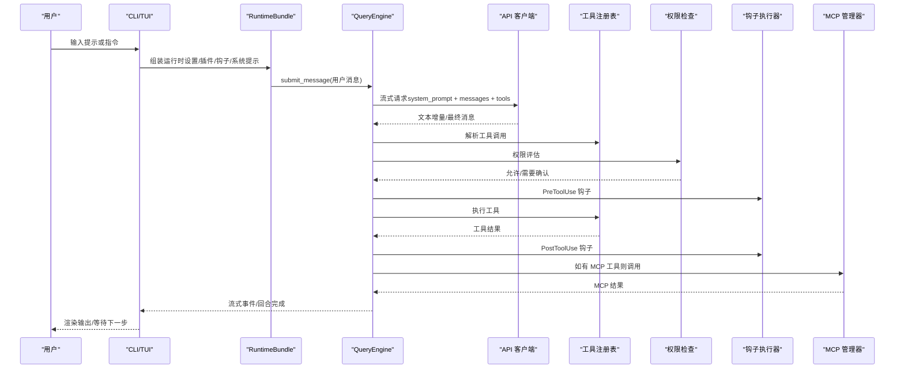

图示来源
- [src/openharness/ui/runtime.py](file://src/openharness/ui/runtime.py)
- [src/openharness/engine/query_engine.py](file://src/openharness/engine/query_engine.py)
- [src/openharness/api/client.py](file://src/openharness/api/client.py)
- [src/openharness/tools/base.py](file://src/openharness/tools/base.py)
- [src/openharness/permissions/checker.py](file://src/openharness/permissions/checker.py)
- [src/openharness/hooks/executor.py](file://src/openharness/hooks/executor.py)
- [src/openharness/mcp/client.py](file://src/openharness/mcp/client.py)

## 详细组件分析

### 代理循环（Agent Loop）
- 循环控制：每轮根据 stop_reason 判断是否继续；若为 tool_use，则进入工具执行阶段。
- 并行与串行：工具调用可并行执行，但模型下一轮会话基于上一轮工具结果进行决策。
- 成本与令牌：使用 CostTracker 跟踪输入/输出令牌，支持 max_tokens 与上下文窗口限制。
- 自动压缩：当接近阈值时触发自动压缩，保留任务状态与通道日志。
- 会话记忆：在用户回合后持久化会话快照，并尝试抽取持久记忆。

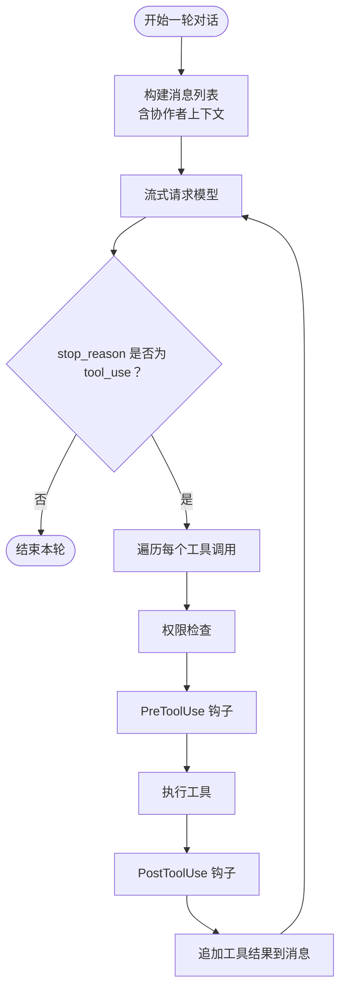

图示来源
- [src/openharness/engine/query_engine.py](file://src/openharness/engine/query_engine.py)
- [src/openharness/permissions/checker.py](file://src/openharness/permissions/checker.py)
- [src/openharness/hooks/executor.py](file://src/openharness/hooks/executor.py)
- [src/openharness/tools/base.py](file://src/openharness/tools/base.py)

章节来源
- [src/openharness/engine/query_engine.py](file://src/openharness/engine/query_engine.py)
- [src/openharness/api/client.py](file://src/openharness/api/client.py)

### 工具系统（ToolRegistry/BaseTool）
- 规范化：所有工具继承 BaseTool，提供 name/description/input_schema 与 execute 方法。
- 注册与发现：默认工具集由 create_default_tool_registry 构建，插件可动态注册自定义工具。
- 只读判定：is_read_only 用于权限策略与交互提示。
- 结果归一：ToolResult 输出文本、错误标记与元数据，便于上层消费。

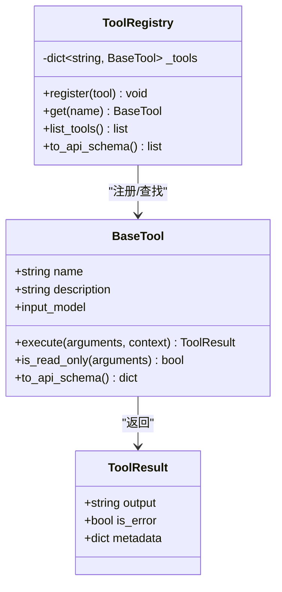

图示来源
- [src/openharness/tools/base.py](file://src/openharness/tools/base.py)

章节来源
- [src/openharness/tools/base.py](file://src/openharness/tools/base.py)

### 权限与钩子（PermissionChecker/HookExecutor）
- 权限策略：内置敏感路径白名单、路径规则、命令拒绝列表、工具允许/禁止列表；支持默认/自动/计划三种模式。
- 钩子类型：命令、HTTP、Prompt、Agent 四类，支持超时、阻断失败、事件注入与 JSON 结果解析。
- 事件匹配：支持通配符匹配 payload 字段，按条件触发。

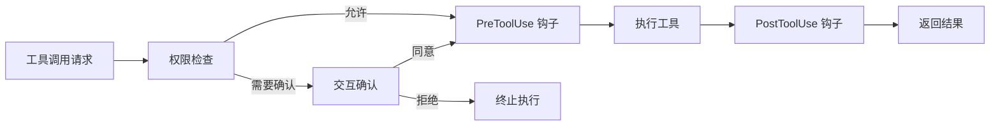

图示来源
- [src/openharness/permissions/checker.py](file://src/openharness/permissions/checker.py)
- [src/openharness/hooks/executor.py](file://src/openharness/hooks/executor.py)

章节来源
- [src/openharness/permissions/checker.py](file://src/openharness/permissions/checker.py)
- [src/openharness/hooks/executor.py](file://src/openharness/hooks/executor.py)

### MCP 管理（McpClientManager）
- 连接管理：支持 STDIO/HTTP/WebSocket 传输，自动初始化、列出工具与资源、记录连接状态。
- 错误处理：对未连接/会话丢失抛出明确异常，避免上游崩溃。
- 结果归一：将结构化/文本内容统一为字符串输出。

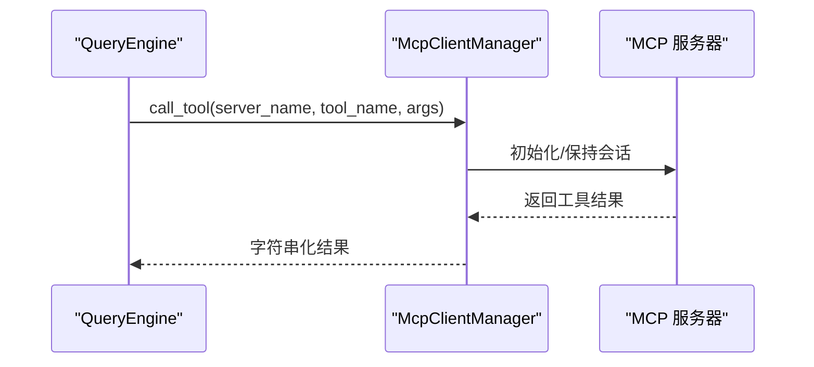

图示来源
- [src/openharness/mcp/client.py](file://src/openharness/mcp/client.py)

章节来源
- [src/openharness/mcp/client.py](file://src/openharness/mcp/client.py)

### 多代理与后台任务（BackendRegistry/BackgroundTaskManager）
- 后端选择：优先 tmux/iTerm2 原生面板，其次 subprocess，最后 in_process 回退。
- 任务生命周期：创建、写入输入、监控输出、重启与完成通知，支持本地/远程/进程内代理模式。
- 平台适配：Windows/Git Bash 的直接 exec 避免路径转义问题。

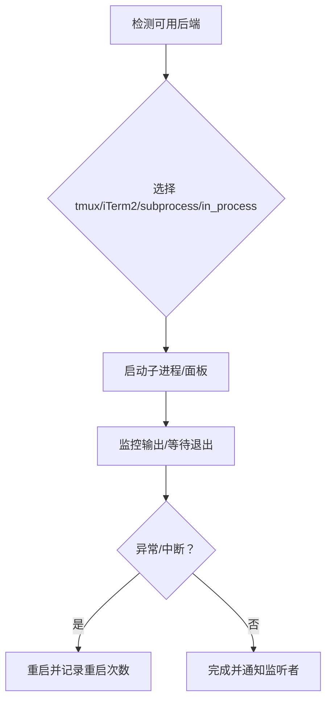

图示来源
- [src/openharness/swarm/registry.py](file://src/openharness/swarm/registry.py)
- [src/openharness/tasks/manager.py](file://src/openharness/tasks/manager.py)

章节来源
- [src/openharness/swarm/registry.py](file://src/openharness/swarm/registry.py)
- [src/openharness/tasks/manager.py](file://src/openharness/tasks/manager.py)

### 系统提示装配（build_runtime_system_prompt）
- 动态拼装：系统提示 + 技能清单 + 委托说明 + CLAUDE.md + 项目上下文 + 相关记忆。
- 最新记忆：根据用户最新提示检索相关记忆并标记已使用。
- 协作者模式：在协调者模式下替换为专门系统提示。

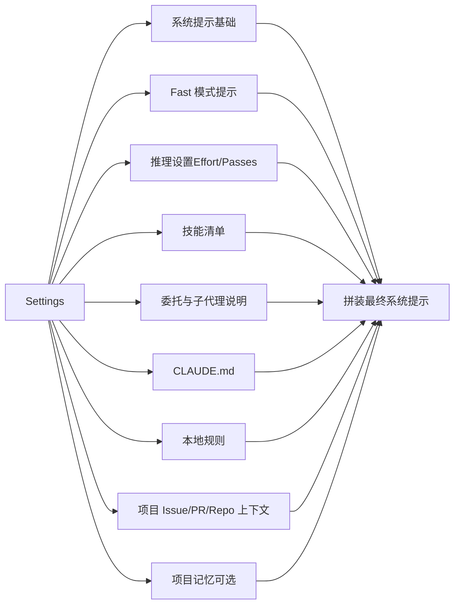

图示来源
- [src/openharness/prompts/context.py](file://src/openharness/prompts/context.py)

章节来源
- [src/openharness/prompts/context.py](file://src/openharness/prompts/context.py)

### 配置与运行时（Settings/RuntimeBundle）
- 配置优先级：CLI 参数 > 环境变量 > 配置文件（~/.openharness/settings.json）> 默认值。
- 提供商档案：内置多提供商工作流，支持模型别名解析与上下文窗口覆盖。
- 运行时装配：构建 API 客户端、MCP 管理器、工具注册表、钩子执行器、QueryEngine、命令注册表、应用状态等。

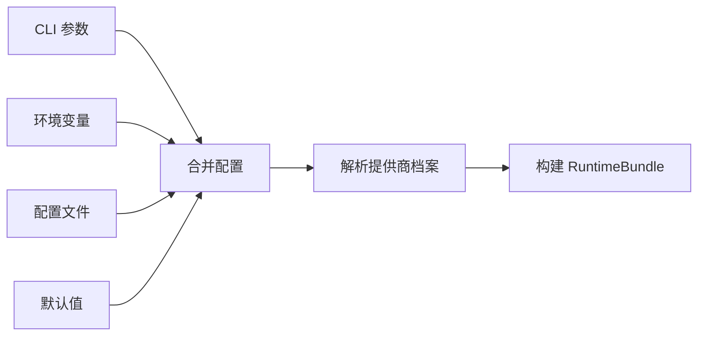

图示来源
- [src/openharness/config/settings.py](file://src/openharness/config/settings.py)
- [src/openharness/ui/runtime.py](file://src/openharness/ui/runtime.py)

章节来源
- [src/openharness/config/settings.py](file://src/openharness/config/settings.py)
- [src/openharness/ui/runtime.py](file://src/openharness/ui/runtime.py)

### 通道桥接（ChannelBridge）
- 消息总线：InboundMessage → QueryEngine.submit_message → OutboundMessage。
- 异常处理：捕获引擎错误并返回统一错误消息，避免中断通道。
- 回压与日志：通过队列与超时控制背压，记录调试信息。

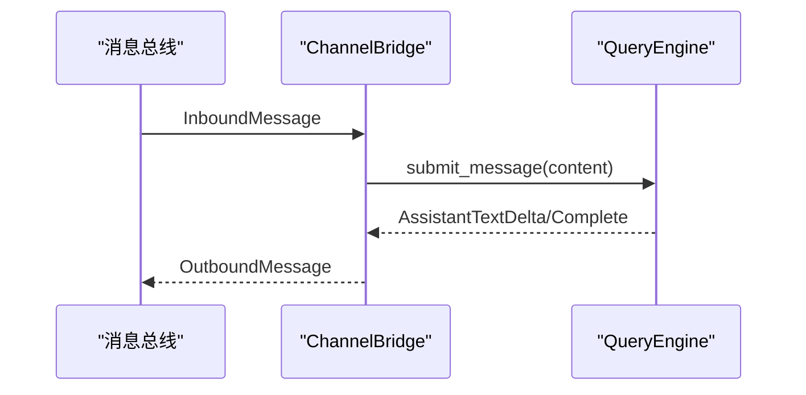

图示来源
- [src/openharness/channels/adapter.py](file://src/openharness/channels/adapter.py)
- [src/openharness/engine/query_engine.py](file://src/openharness/engine/query_engine.py)

章节来源
- [src/openharness/channels/adapter.py](file://src/openharness/channels/adapter.py)

## 依赖分析
- 外部依赖：anthropic、openai、rich、prompt-toolkit、textual、typer、pydantic、httpx、websockets、mcp、pyperclip、pyyaml、questionary、watchfiles、croniter、各平台 SDK（Slack/Telegram/Discord/飞书）。
- 内部耦合：RuntimeBundle 将 API 客户端、工具注册表、权限检查器、钩子执行器、QueryEngine 等核心组件整合；QueryEngine 与工具、MCP、权限、钩子形成强耦合；通道桥接与消息总线解耦 UI 与引擎。
- 可能的循环依赖：当前模块间通过接口与工厂函数解耦，未见直接循环导入。

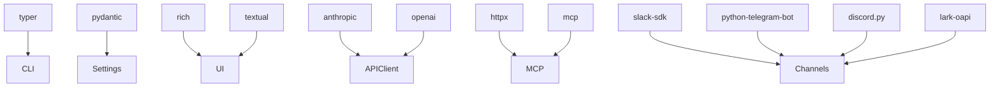

图示来源
- [pyproject.toml](file://pyproject.toml)

章节来源
- [pyproject.toml](file://pyproject.toml)

## 性能考虑
- 重试与退避：API 客户端采用指数退避与抖动，避免雪崩；最大重试次数与最大延迟可控。
- 并行工具：工具调用可并行执行，缩短总耗时；注意令牌与成本统计的准确性。
- 自动压缩：在接近上下文阈值时压缩，减少后续请求成本与延迟。
- 会话记忆：仅在必要时持久化与抽取记忆，避免频繁 IO。
- 任务重启：代理任务重启会丢失交互上下文，应尽量避免频繁重启。

## 故障排查指南
- 权限相关
  - 症状：工具调用被拒绝或需要确认。
  - 排查：检查权限模式、路径规则、命令拒绝列表；确认是否命中敏感路径保护。
- API 客户端
  - 症状：网络错误、速率限制、认证失败。
  - 排查：查看重试事件与错误码；确认 API Key/OAuth 令牌；检查 base_url 与超时设置。
- MCP 服务
  - 症状：工具不可用或调用失败。
  - 排查：确认 MCP 服务器连接状态、传输类型（stdio/http/ws）、认证头；检查工具/资源列表。
- 通道与 UI
  - 症状：消息不回传或报错。
  - 排查：检查消息总线队列与超时；查看 ChannelBridge 日志；确认会话键与聊天 ID。
- 任务与多代理
  - 症状：任务卡住或输出为空。
  - 排查：检查进程状态、输出文件、重启次数；确认后端可用性（tmux/iTerm2）。

章节来源
- [src/openharness/permissions/checker.py](file://src/openharness/permissions/checker.py)
- [src/openharness/api/client.py](file://src/openharness/api/client.py)
- [src/openharness/mcp/client.py](file://src/openharness/mcp/client.py)
- [src/openharness/channels/adapter.py](file://src/openharness/channels/adapter.py)
- [src/openharness/tasks/manager.py](file://src/openharness/tasks/manager.py)

## 结论
OpenHarness 通过清晰的模块化与事件驱动架构，将工具、知识、权限、钩子、MCP、多代理与后台任务有机整合，形成可扩展、可观测、可治理的智能体基础设施。其 10 个主要子系统协同工作，既满足研究与实验需求，也为生产级 Agent 应用提供了坚实基础。

## 附录
- 系统边界
  - 外部接口：API 提供商（Anthropic/OpenAI/Copilot/Codex/Moonshot 等）、各平台通道（Telegram/Slack/Discord/飞书）、MCP 服务器。
  - 内部边界：CLI/TUI、RuntimeBundle、QueryEngine、工具注册表、权限/钩子/MCP/内存/任务/编排等子系统。
- 集成模式
  - 插件生态：命令、钩子、代理、MCP 服务器、工具的发现与加载。
  - 通道网关：通过 ChannelBridge 将外部消息接入 QueryEngine。
- 扩展点
  - 自定义工具：实现 BaseTool 并注册。
  - 自定义钩子：命令/HTTP/Prompt/Agent 钩子。
  - 自定义提供商：新增 ProviderProfile 与客户端适配。
  - 自定义后端：实现 TeammateExecutor 并注册到 BackendRegistry。