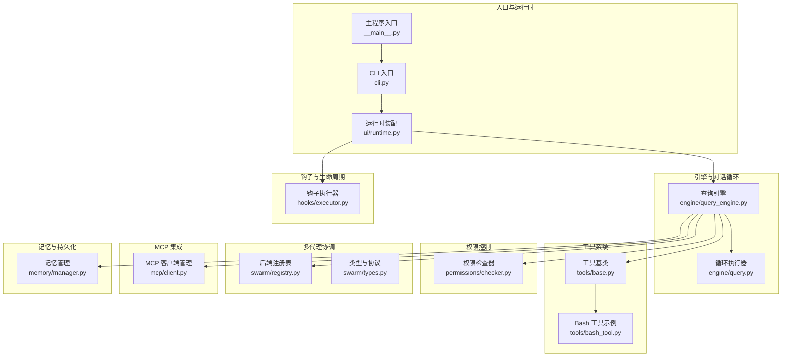
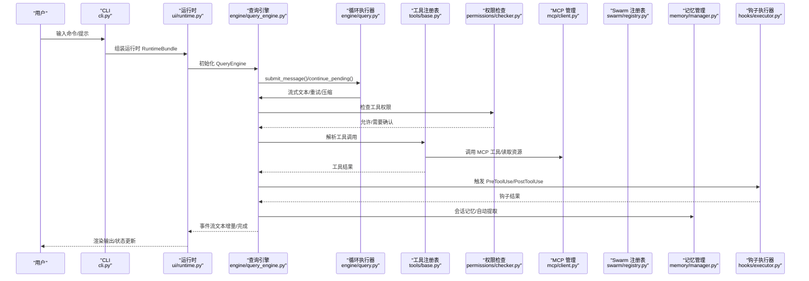
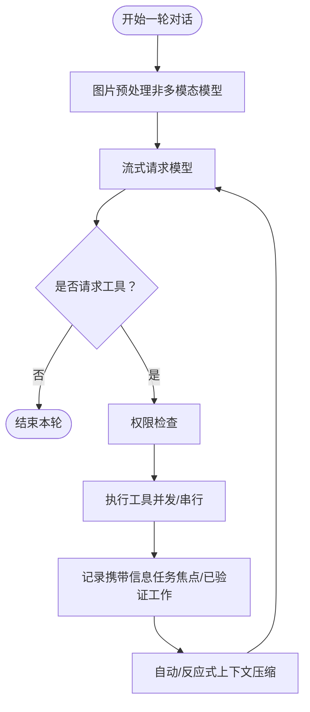
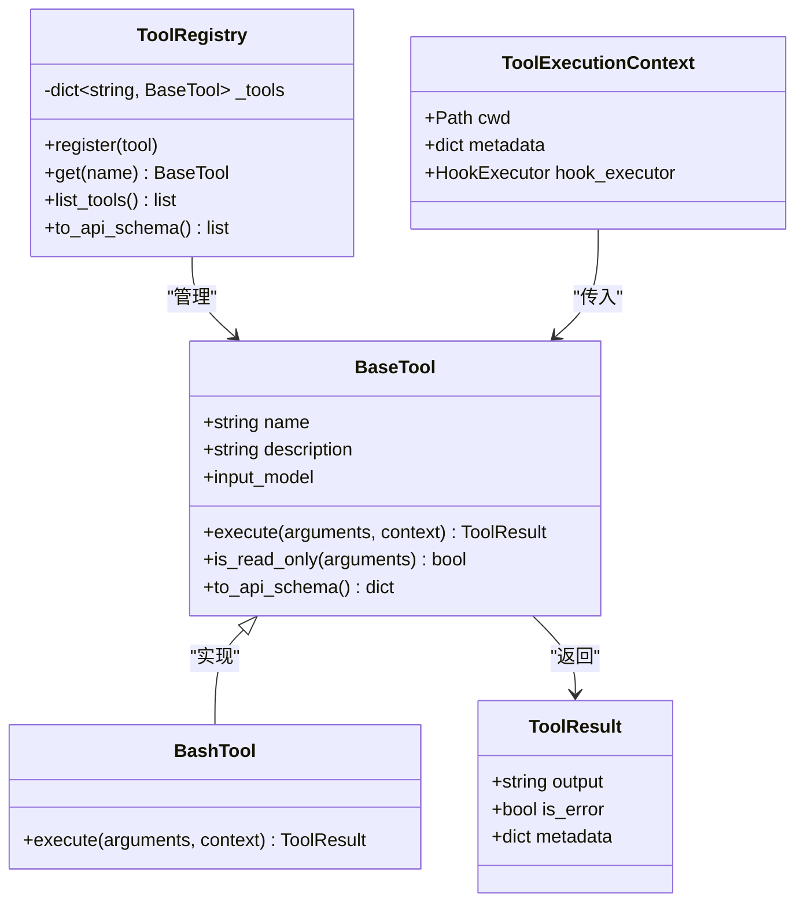
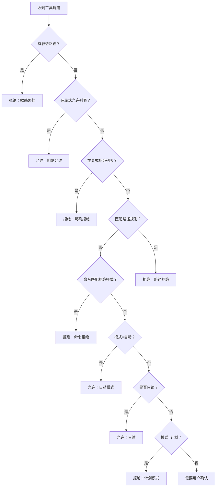
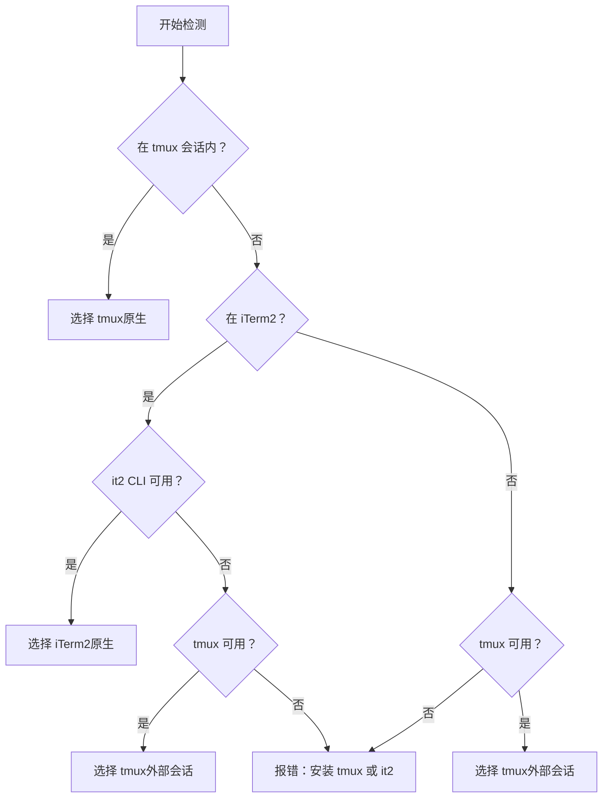
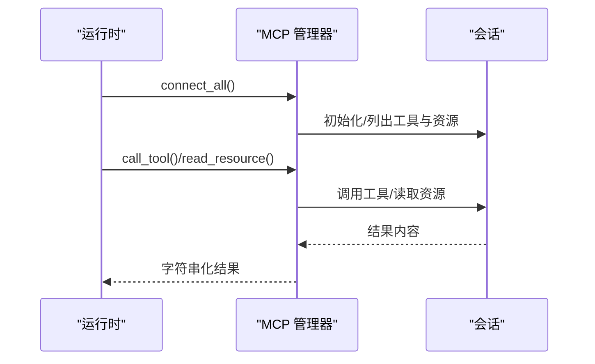
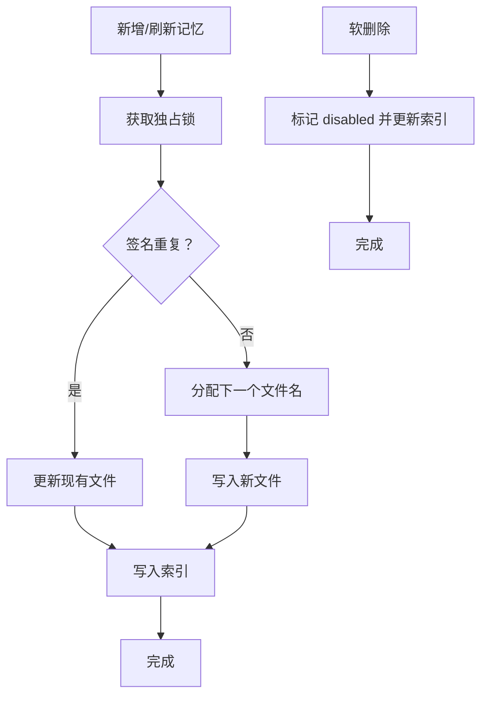
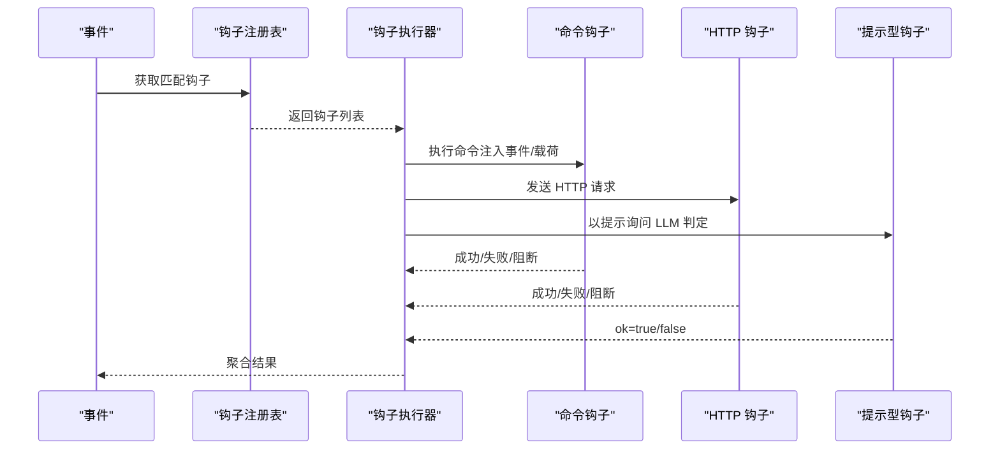
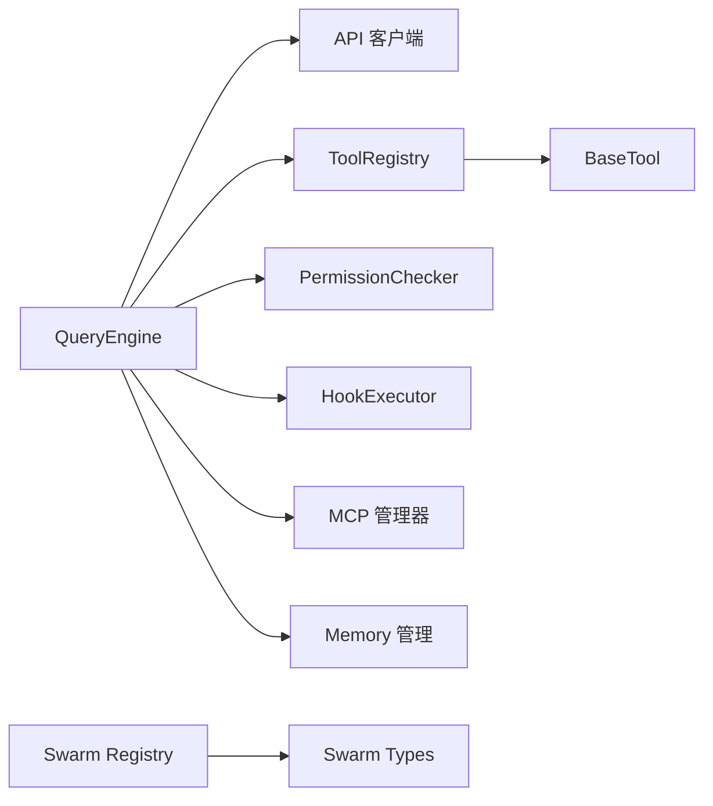

# 核心特性

<cite>
**本文引用的文件**
- [README.md](file://README.md)
- [__main__.py](file://src/openharness/__main__.py)
- [cli.py](file://src/openharness/cli.py)
- [query_engine.py](file://src/openharness/engine/query_engine.py)
- [query.py](file://src/openharness/engine/query.py)
- [base.py](file://src/openharness/tools/base.py)
- [bash_tool.py](file://src/openharness/tools/bash_tool.py)
- [checker.py](file://src/openharness/permissions/checker.py)
- [registry.py](file://src/openharness/swarm/registry.py)
- [types.py](file://src/openharness/swarm/types.py)
- [client.py](file://src/openharness/mcp/client.py)
- [manager.py](file://src/openharness/memory/manager.py)
- [runtime.py](file://src/openharness/ui/runtime.py)
- [executor.py](file://src/openharness/hooks/executor.py)
- [commit.md](file://src/openharness/skills/bundled/content/commit.md)
</cite>

## 目录
1. [简介](#简介)
2. [项目结构](#项目结构)
3. [核心组件](#核心组件)
4. [架构总览](#架构总览)
5. [详细组件分析](#详细组件分析)
6. [依赖分析](#依赖分析)
7. [性能考虑](#性能考虑)
8. [故障排查指南](#故障排查指南)
9. [结论](#结论)
10. [附录](#附录)

## 简介
本文件系统化阐述 OpenHarness 的核心特性：代理循环、工具系统、技能系统、权限控制、多代理协调（Swarm），并解释它们如何协同工作以构建一个可扩展、可观测、安全可控的智能体基础设施。文档兼顾概念与实现细节，帮助不同经验水平的读者快速上手并深入理解。

## 项目结构
OpenHarness 采用模块化分层设计，围绕“引擎-工具-技能-权限-多代理”五大支柱展开，并通过 UI、命令行、钩子、MCP、内存等子系统提供端到端体验。

图表来源
- [cli.py:751-780](file://src/openharness/cli.py#L751-L780)
- [__main__.py:1-7](file://src/openharness/__main__.py#L1-L7)
- [runtime.py:246-443](file://src/openharness/ui/runtime.py#L246-L443)
- [query_engine.py:21-120](file://src/openharness/engine/query_engine.py#L21-L120)
- [query.py:633-800](file://src/openharness/engine/query.py#L633-L800)
- [base.py:35-81](file://src/openharness/tools/base.py#L35-L81)
- [bash_tool.py:27-86](file://src/openharness/tools/bash_tool.py#L27-L86)
- [checker.py:57-156](file://src/openharness/permissions/checker.py#L57-L156)
- [registry.py:97-183](file://src/openharness/swarm/registry.py#L97-L183)
- [types.py:35-230](file://src/openharness/swarm/types.py#L35-L230)
- [client.py:29-120](file://src/openharness/mcp/client.py#L29-L120)
- [manager.py:34-121](file://src/openharness/memory/manager.py#L34-L121)
- [executor.py:41-79](file://src/openharness/hooks/executor.py#L41-L79)

章节来源
- [README.md:446-502](file://README.md#L446-L502)
- [cli.py:751-780](file://src/openharness/cli.py#L751-L780)
- [__main__.py:1-7](file://src/openharness/__main__.py#L1-L7)
- [runtime.py:246-443](file://src/openharness/ui/runtime.py#L246-L443)

## 核心组件
- 代理循环（Query Engine + Query Runner）：负责模型请求、流式输出、工具调用、上下文压缩与重试机制。
- 工具系统（Tool Registry + BaseTool）：统一的工具抽象、输入校验、权限集成与钩子支持。
- 技能系统（On-demand skill loading）：按需加载 Markdown 技能，注入系统提示，支持插件与项目级技能。
- 权限控制（PermissionChecker）：多模式权限、路径规则、命令拒绝、交互确认。
- 多代理协调（Swarm Registry + Types）：后端自动检测与选择（in_process/tmux/subprocess）、面板后端（tmux/iTerm2）、同伴执行器协议。
- MCP 集成：HTTP/STDIO 连接、工具与资源发现、错误处理与重连。
- 记忆与持久化：项目记忆文件管理、索引维护、会话记忆与自动提取。
- 钩子系统：命令/HTTP/提示型钩子，事件驱动的生命周期扩展。
- UI 运行时：命令解析、系统提示组装、会话快照、状态同步。

章节来源
- [query_engine.py:21-120](file://src/openharness/engine/query_engine.py#L21-L120)
- [query.py:633-800](file://src/openharness/engine/query.py#L633-L800)
- [base.py:35-81](file://src/openharness/tools/base.py#L35-L81)
- [checker.py:57-156](file://src/openharness/permissions/checker.py#L57-L156)
- [registry.py:97-183](file://src/openharness/swarm/registry.py#L97-L183)
- [types.py:35-230](file://src/openharness/swarm/types.py#L35-L230)
- [client.py:29-120](file://src/openharness/mcp/client.py#L29-L120)
- [manager.py:34-121](file://src/openharness/memory/manager.py#L34-L121)
- [executor.py:41-79](file://src/openharness/hooks/executor.py#L41-L79)
- [runtime.py:246-443](file://src/openharness/ui/runtime.py#L246-L443)

## 架构总览
下图展示从 CLI 到引擎、工具、权限、MCP、Swarm、记忆与钩子的整体协作流程。

图表来源
- [cli.py:751-780](file://src/openharness/cli.py#L751-L780)
- [runtime.py:246-443](file://src/openharness/ui/runtime.py#L246-L443)
- [query_engine.py:227-307](file://src/openharness/engine/query_engine.py#L227-L307)
- [query.py:633-800](file://src/openharness/engine/query.py#L633-L800)
- [base.py:60-81](file://src/openharness/tools/base.py#L60-L81)
- [checker.py:75-156](file://src/openharness/permissions/checker.py#L75-L156)
- [client.py:129-178](file://src/openharness/mcp/client.py#L129-L178)
- [manager.py:39-121](file://src/openharness/memory/manager.py#L39-L121)
- [executor.py:64-78](file://src/openharness/hooks/executor.py#L64-L78)

## 详细组件分析

### 代理循环（Agent Loop）
- 设计要点
  - 流式文本增量输出，支持网络异常与超时重试。
  - 自动上下文压缩（Auto-Compact）与反应式压缩（Reactive Compact）。
  - 最大轮次限制（max_turns）防止无限循环。
  - 支持图片预处理（非多模态模型转换为文本）。
- 关键流程

图表来源
- [query.py:633-800](file://src/openharness/engine/query.py#L633-L800)
- [query_engine.py:227-307](file://src/openharness/engine/query_engine.py#L227-L307)

章节来源
- [query_engine.py:21-120](file://src/openharness/engine/query_engine.py#L21-L120)
- [query.py:633-800](file://src/openharness/engine/query.py#L633-L800)

使用场景与配置
- 使用场景：长对话、多轮调试、跨工具组合、上下文超长时的自动压缩。
- 配置项：max_tokens、context_window_tokens、auto_compact_threshold_tokens、max_turns、effort、passes。
- 实战建议：对长文档检索/生成任务开启自动压缩；在受限环境设置较小 max_turns 防止资源耗尽。

### 工具系统（Tool Registry + BaseTool）
- 设计要点
  - 统一的 BaseTool 抽象，Pydantic 输入校验，JSON Schema 描述。
  - ToolExecutionContext 提供 cwd、metadata、钩子执行上下文。
  - ToolRegistry 提供注册、查找、导出 API Schema。
- 示例：Bash 工具
  - 非交互式执行，超时与输出截断处理，返回码与元数据。
  - 对可能需要交互的脚手架命令给出提示，避免阻塞。

图表来源
- [base.py:17-81](file://src/openharness/tools/base.py#L17-L81)
- [bash_tool.py:19-86](file://src/openharness/tools/bash_tool.py#L19-L86)

章节来源
- [base.py:17-81](file://src/openharness/tools/base.py#L17-L81)
- [bash_tool.py:27-86](file://src/openharness/tools/bash_tool.py#L27-L86)

使用场景与配置
- 使用场景：本地 Shell 执行、文件读写、Web 搜索、MCP 工具调用。
- 配置项：工具超时、工作目录、只读标记（影响权限策略）。
- 实战建议：为高风险命令设置更短超时；对交互式命令添加非交互标志或外部先行执行。

### 技能系统（On-demand Skill Loading）
- 设计要点
  - 技能以 Markdown 文件形式存在，按需加载，注入系统提示。
  - 支持用户/项目/插件/ohmo 等多来源路径。
  - 可通过 Slash 命令直接触发用户可调用技能。
- 示例：commit 技能
  - 明确使用时机、工作流步骤与规则，指导生成规范提交信息。

章节来源
- [commit.md:1-26](file://src/openharness/skills/bundled/content/commit.md#L1-L26)

使用场景与配置
- 使用场景：代码审查、重构建议、测试编写、提交信息生成。
- 配置项：允许项目技能开关、技能目录优先级。
- 实战建议：在不受信任仓库禁用项目技能；为团队定制技能并集中管理。

### 权限控制（PermissionChecker）
- 设计要点
  - 多模式：默认（交互确认）、自动（无限制）、计划模式（禁止写操作）。
  - 路径规则（glob 匹配）、命令拒绝模式、敏感路径保护（SSH/Credentials 等）。
  - 读写区分：只读工具始终允许，写操作需确认或满足条件。
- 决策流程

图表来源
- [checker.py:75-156](file://src/openharness/permissions/checker.py#L75-L156)

章节来源
- [checker.py:57-156](file://src/openharness/permissions/checker.py#L57-L156)

使用场景与配置
- 使用场景：CI/CD、生产环境、多人协作空间。
- 配置项：mode、path_rules、denied_tools、denied_commands。
- 实战建议：生产默认使用默认模式并开启交互确认；对可信路径放宽规则。

### 多代理协调（Swarm）
- 设计要点
  - 后端自动检测优先级：in_process（回退）> tmux（会话内）> subprocess（默认）。
  - 面板后端（tmux/iTerm2）：创建/管理同伴终端，支持隐藏/显示、标题/颜色、布局重平衡。
  - TeammateExecutor 协议：spawn/send_message/shutdown。
- 后端检测流程

图表来源
- [registry.py:185-268](file://src/openharness/swarm/registry.py#L185-L268)

章节来源
- [registry.py:97-183](file://src/openharness/swarm/registry.py#L97-L183)
- [types.py:35-230](file://src/openharness/swarm/types.py#L35-L230)

使用场景与配置
- 使用场景：多角色分工（研究员/测试/审阅）、并行任务编排、可视化协作。
- 配置项：OPENHARNESS_TEAMMATE_MODE、pane 后端可用性、颜色/标题、订阅主题。
- 实战建议：在 iTerm2 优先安装 it2；tmux 外部会话用于远程协作；合理设置同伴数量与权限。

### MCP 集成
- 设计要点
  - 支持 STDIO 与 HTTP（含可流式 HTTP）两种传输。
  - 连接失败不影响整体流程，提供连接状态与工具/资源清单。
  - 工具调用与资源读取统一封装，异常转为明确错误。
- 连接与调用序列

图表来源
- [client.py:45-178](file://src/openharness/mcp/client.py#L45-L178)

章节来源
- [client.py:29-120](file://src/openharness/mcp/client.py#L29-L120)

使用场景与配置
- 使用场景：外部工具生态接入、知识库资源读取、第三方服务桥接。
- 配置项：服务器类型（stdio/http/ws）、命令/URL、认证头、工作目录。
- 实战建议：HTTP 服务器启用可流式传输；为敏感服务器配置鉴权头；关注连接状态与工具清单。

### 记忆与持久化
- 设计要点
  - 项目记忆文件（MEMORY.md 索引）与知识条目，支持去重、软删除、TTL。
  - 会话记忆与自动提取：在每轮结束后持久化快照，必要时触发记忆抽取。
- 文件管理流程

图表来源
- [manager.py:39-121](file://src/openharness/memory/manager.py#L39-L121)

章节来源
- [manager.py:34-184](file://src/openharness/memory/manager.py#L34-L184)

使用场景与配置
- 使用场景：长期任务知识沉淀、团队共享知识库、会话历史恢复。
- 配置项：记忆类型/范围、重要度、标签、TTL。
- 实战建议：为团队机密内容设置严格签名与权限；定期清理过期记忆。

### 钩子系统（Hooks）
- 设计要点
  - 支持命令钩子（子进程）、HTTP 钩子、提示型钩子（LLM 判定）、Agent 钩子。
  - 事件匹配与参数注入，支持超时、阻断失败、元数据回传。
- 执行流程

图表来源
- [executor.py:64-212](file://src/openharness/hooks/executor.py#L64-L212)

章节来源
- [executor.py:41-243](file://src/openharness/hooks/executor.py#L41-L243)

使用场景与配置
- 使用场景：审计日志、合规检查、外部通知、动态策略决策。
- 配置项：命令模板、HTTP 地址/头、超时、阻断策略。
- 实战建议：命令钩子启用 shell 转义；HTTP 钩子设置合理超时；提示型钩子提供清晰判定指令。

## 依赖分析
- 组件耦合
  - QueryEngine 依赖 API 客户端、工具注册表、权限检查器、钩子执行器、MCP 管理器、记忆服务。
  - ToolRegistry 与 BaseTool 解耦具体工具实现，便于扩展。
  - Swarm Registry 与 Types 定义后端抽象，降低平台差异。
- 外部依赖
  - MCP SDK、HTTP 客户端、终端后端（tmux/it2）。
- 潜在环路
  - 运行时装配与引擎之间为单向依赖，避免循环导入。

图表来源
- [query_engine.py:21-120](file://src/openharness/engine/query_engine.py#L21-L120)
- [base.py:60-81](file://src/openharness/tools/base.py#L60-L81)
- [registry.py:97-183](file://src/openharness/swarm/registry.py#L97-L183)
- [types.py:35-230](file://src/openharness/swarm/types.py#L35-L230)
- [client.py:29-120](file://src/openharness/mcp/client.py#L29-L120)
- [manager.py:34-121](file://src/openharness/memory/manager.py#L34-L121)
- [executor.py:41-79](file://src/openharness/hooks/executor.py#L41-L79)

章节来源
- [runtime.py:246-443](file://src/openharness/ui/runtime.py#L246-L443)

## 性能考虑
- 上下文压缩
  - 自动压缩阈值与触发策略减少 token 使用，提升稳定性与速度。
- 并发与重试
  - 工具执行并发化（由调用方控制），模型请求具备指数退避重试。
- 输出截断
  - 工具输出超过阈值时落盘并返回内联摘要，避免消息过大。
- 资源隔离
  - Docker 沙箱按需启动，会话结束后回收资源。
- UI 与渲染
  - 文本增量流式渲染，避免全量缓存。

章节来源
- [query.py:633-800](file://src/openharness/engine/query.py#L633-L800)
- [query_engine.py:141-211](file://src/openharness/engine/query_engine.py#L141-L211)
- [runtime.py:411-416](file://src/openharness/ui/runtime.py#L411-L416)

## 故障排查指南
- 干跑（Dry-run）
  - 通过 CLI 的 dry-run 子命令预览设置、插件、技能、工具、MCP 配置与入口点，评估 ready/warning/blocked 状态与下一步建议。
- 常见问题定位
  - 权限：检查模式、路径规则、命令拒绝列表；只读工具与写操作的区别。
  - MCP：查看连接状态、工具/资源清单、认证配置；STDIO 命令/路径、HTTP URL 与头。
  - 引擎：最大轮次限制、上下文长度、模型拒绝原因（如 max_tokens 过大）。
  - Swarm：面板后端可用性（tmux/it2）、外部会话、安装指引。
- 日志与状态
  - 使用运行时状态同步与会话快照保存，结合钩子与系统提示辅助诊断。

章节来源
- [cli.py:396-597](file://src/openharness/cli.py#L396-L597)
- [checker.py:75-156](file://src/openharness/permissions/checker.py#L75-L156)
- [client.py:111-178](file://src/openharness/mcp/client.py#L111-L178)
- [query.py:753-782](file://src/openharness/engine/query.py#L753-L782)
- [registry.py:61-89](file://src/openharness/swarm/registry.py#L61-L89)

## 结论
OpenHarness 将“工具+技能+记忆+权限+多代理”整合为统一的 Agent Harness，通过可观察、可扩展、可治理的设计，支撑从个人开发到团队协作的多样化场景。依托 CLI、UI、钩子、MCP、Swarm 等子系统，用户可以按需组合能力，实现安全、高效、可持续的智能体工作流。

## 附录
- 快速参考
  - CLI 入口：python -m openharness 或可执行 oh/openh
  - 运行时装配：ui/runtime.py 提供 build_runtime/start_runtime/close_runtime
  - 干跑：oh --dry-run 预览执行路径与准备状态
  - 权限模式：默认/自动/计划；路径规则与命令拒绝
  - Swarm：后端自动检测、tmux/iTerm2 面板管理
  - MCP：STDIO/HTTP 连接、工具与资源发现
  - 记忆：项目记忆文件与索引、会话记忆与自动提取

章节来源
- [__main__.py:1-7](file://src/openharness/__main__.py#L1-L7)
- [runtime.py:246-443](file://src/openharness/ui/runtime.py#L246-L443)
- [cli.py:396-597](file://src/openharness/cli.py#L396-L597)
- [checker.py:75-156](file://src/openharness/permissions/checker.py#L75-L156)
- [registry.py:97-183](file://src/openharness/swarm/registry.py#L97-L183)
- [client.py:111-178](file://src/openharness/mcp/client.py#L111-L178)
- [manager.py:34-121](file://src/openharness/memory/manager.py#L34-L121)