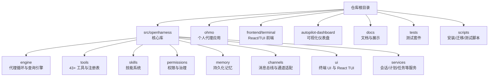
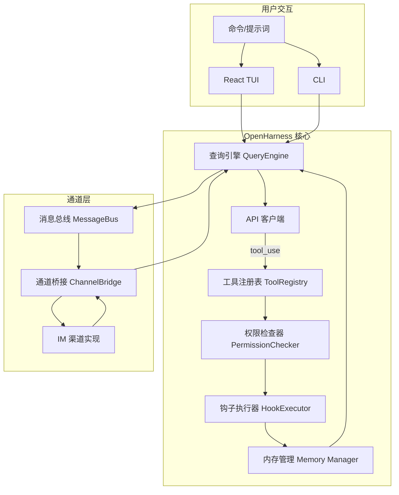
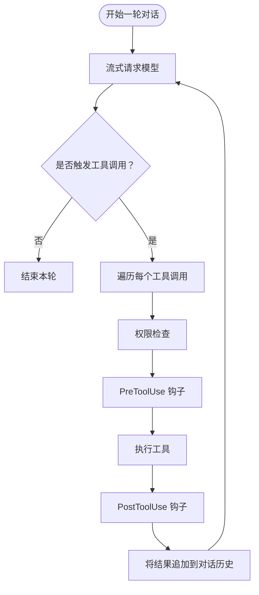
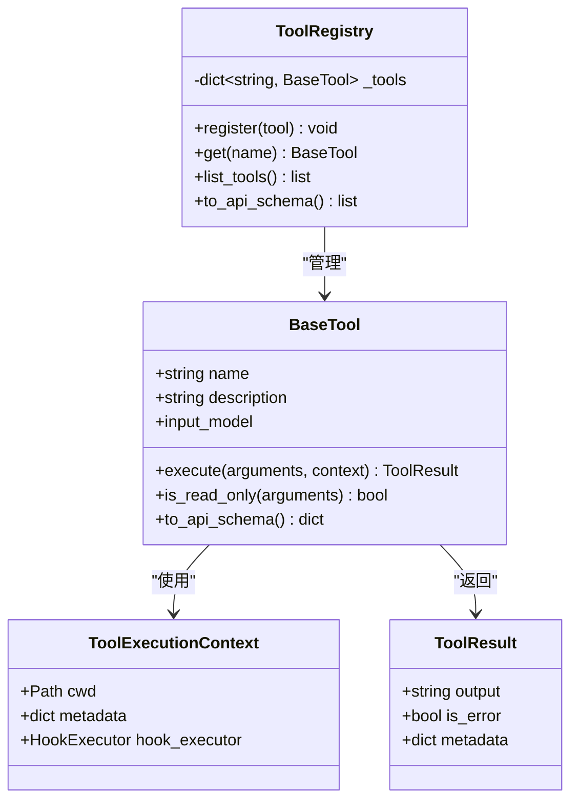
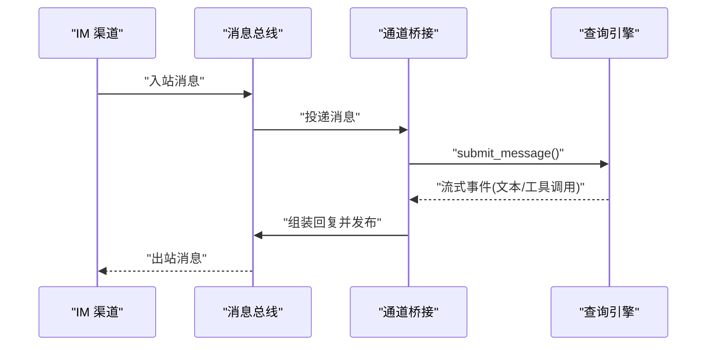
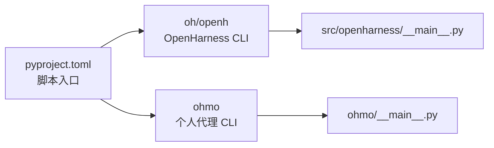

# 项目介绍

<cite>
**本文引用的文件**
- [README.md](file://README.md)
- [README.zh-CN.md](file://README.zh-CN.md)
- [CONTRIBUTING.md](file://CONTRIBUTING.md)
- [RELEASE_NOTES_v0.1.8.md](file://RELEASE_NOTES_v0.1.8.md)
- [RELEASE_NOTES_v0.1.9.md](file://RELEASE_NOTES_v0.1.9.md)
- [pyproject.toml](file://pyproject.toml)
- [src/openharness/__main__.py](file://src/openharness/__main__.py)
- [ohmo/__main__.py](file://ohmo/__main__.py)
- [src/openharness/engine/query_engine.py](file://src/openharness/engine/query_engine.py)
- [src/openharness/tools/base.py](file://src/openharness/tools/base.py)
- [src/openharness/memory/manager.py](file://src/openharness/memory/manager.py)
- [src/openharness/permissions/modes.py](file://src/openharness/permissions/modes.py)
- [src/openharness/channels/adapter.py](file://src/openharness/channels/adapter.py)
</cite>

## 目录
1. [引言](#引言)
2. [项目结构](#项目结构)
3. [核心组件](#核心组件)
4. [架构总览](#架构总览)
5. [详细组件分析](#详细组件分析)
6. [依赖分析](#依赖分析)
7. [性能考虑](#性能考虑)
8. [故障排查指南](#故障排查指南)
9. [结论](#结论)
10. [附录](#附录)

## 引言
OpenHarness 是一个开源的 AI 代理基础设施，专注于提供轻量、可扩展、可观察的 Agent Harness。其核心价值在于将“模型智能”与“可操作的工具、知识、记忆与安全边界”解耦，使研究者、构建者与社区能够理解并实验生产级智能体的工作原理，同时以最小成本扩展到定制化场景。

ohmo 是基于 OpenHarness 构建的“个人代理应用”，并非通用模式，而是一个可长期工作的 AI 助手。它通过多平台即时通讯渠道（如飞书、Slack、Telegram、Discord）与用户持续交互，能够在长会话中分叉分支、编写代码、运行测试并自动提交 PR，且复用用户的 Claude Code 或 Codex 订阅，无需额外 API 密钥。

OpenHarness 的设计理念强调：
- 可观测与可观测性：流式输出、事件驱动、成本追踪、令牌计数
- 安全与治理：多级权限模式、路径规则、命令拒绝、交互式审批
- 可组合与可扩展：工具系统、技能系统、插件生态、MCP 协议
- 多提供商支持：Anthropic 风格、OpenAI 风格、Copilot、订阅桥接等
- 多代理协作：子代理孵化、团队注册表、后台任务生命周期

面向初学者，OpenHarness 提供了清晰的“代理循环”“工具系统”“权限控制”等概念入口；对于有经验的开发者，项目提供了完整的子系统、数据结构与扩展点，便于二次开发与集成。

章节来源
- [README.md:14-16](file://README.md#L14-L16)
- [README.md:446-487](file://README.md#L446-L487)
- [README.zh-CN.md:8-17](file://README.zh-CN.md#L8-L17)

## 项目结构
仓库采用按功能域划分的模块化组织方式，核心目录与职责如下：
- src/openharness：OpenHarness 核心库，包含引擎、工具、技能、权限、内存、通道、UI、服务等子系统
- ohmo：个人代理应用，独立入口与工作区，复用 OpenHarness 能力
- frontend/terminal：React/TUI 前端
- autopilot-dashboard：可视化仪表盘（示例）
- docs：展示与文档素材
- tests：覆盖单元、集成与端到端测试
- scripts：安装、迁移、测试等辅助脚本

图示来源
- [pyproject.toml:54-55](file://pyproject.toml#L54-L55)
- [README.md:446-466](file://README.md#L446-L466)

章节来源
- [README.md:446-466](file://README.md#L446-L466)
- [pyproject.toml:48-52](file://pyproject.toml#L48-L52)

## 核心组件
- 代理循环（Agent Loop）：围绕模型流式响应与工具调用的可组合循环，支持重试、并发工具执行、令牌统计与成本追踪
- 工具系统（Tools）：43+ 工具，涵盖文件 I/O、搜索、Web、MCP、任务、模式切换、定时调度、元工具等
- 技能系统（Skills）：按需加载的 Markdown 技能，兼容 anthropics/skills 与 Claude-style 插件
- 内存与会话（Memory/Session）：CLAUDE.md 发现与注入、MEMORY.md 持久化、会话恢复与自动压缩
- 权限与治理（Permissions/Governance）：多级权限模式、路径规则、命令拒绝、交互式审批与钩子
- 多代理协作（Swarm Coordination）：子代理孵化、团队注册表、任务生命周期与后台执行
- 通道与网关（Channels/Gateway）：消息总线桥接、多 IM 渠道接入、ohmo 网关
- 提供商与认证（Providers/Auth）：工作流化的提供商配置，支持多后端与凭据隔离
- UI 与 CLI（UI/CLI）：React/Ink TUI、命令行交互、非交互模式与结构化输出

章节来源
- [README.md:48-133](file://README.md#L48-L133)
- [README.md:505-570](file://README.md#L505-L570)
- [README.md:616-647](file://README.md#L616-L647)
- [README.md:663-719](file://README.md#L663-L719)

## 架构总览
OpenHarness 将“用户输入/命令”转化为“查询引擎”的一次对话回合，模型以流式方式生成文本与工具调用；工具执行前经过权限检查与钩子，结果回注入对话历史，驱动下一轮决策。通道层将外部消息桥接到查询引擎，并将回复发布回消息总线。

图示来源
- [README.md:489-501](file://README.md#L489-L501)
- [src/openharness/engine/query_engine.py:21-120](file://src/openharness/engine/query_engine.py#L21-L120)
- [src/openharness/tools/base.py:60-81](file://src/openharness/tools/base.py#L60-L81)
- [src/openharness/channels/adapter.py:29-132](file://src/openharness/channels/adapter.py#L29-L132)

## 详细组件分析

### 代理循环（Agent Loop）
代理循环是 OpenHarness 的核心：模型流式生成文本与工具调用，工具执行前后通过权限与钩子，最终将结果注入对话历史，驱动下一轮决策。循环具备重试、并发工具执行、令牌统计与成本追踪能力。

图示来源
- [README.md:468-487](file://README.md#L468-L487)
- [src/openharness/engine/query_engine.py:21-120](file://src/openharness/engine/query_engine.py#L21-L120)

章节来源
- [README.md:468-487](file://README.md#L468-L487)
- [src/openharness/engine/query_engine.py:21-120](file://src/openharness/engine/query_engine.py#L21-L120)

### 工具系统（Tools）
工具系统提供统一抽象与注册表，所有工具具备：
- Pydantic 输入校验与 JSON Schema 描述
- 权限集成与钩子支持
- 并发执行与可观测性

图示来源
- [src/openharness/tools/base.py:35-81](file://src/openharness/tools/base.py#L35-L81)

章节来源
- [src/openharness/tools/base.py:35-81](file://src/openharness/tools/base.py#L35-L81)

### 权限与治理（Permissions）
OpenHarness 提供多级权限模式与细粒度控制：
- 默认模式：写入/执行前询问
- 全自动模式：沙箱环境
- 计划模式：禁止一切写入，适合大型重构前置审查

支持路径规则、命令拒绝、交互式审批与钩子。

章节来源
- [README.md:616-647](file://README.md#L616-L647)
- [src/openharness/permissions/modes.py:8-14](file://src/openharness/permissions/modes.py#L8-L14)

### 内存与会话（Memory/Session）
- CLAUDE.md 自动发现与注入
- MEMORY.md 持久化记忆
- 会话恢复与自动压缩（Auto-Compact）
- 团队级记忆与机密保护

章节来源
- [README.md:86-98](file://README.md#L86-L98)
- [src/openharness/memory/manager.py:39-121](file://src/openharness/memory/manager.py#L39-L121)

### 通道与网关（Channels/Gateway）
通道桥接将消息总线与查询引擎连接，持续消费入站消息，调用查询引擎并发布出站回复。ohmo 个人代理通过网关接入多平台 IM 渠道，支持文件附件与多模态消息。

图示来源
- [src/openharness/channels/adapter.py:94-132](file://src/openharness/channels/adapter.py#L94-L132)

章节来源
- [README.md:663-719](file://README.md#L663-L719)
- [src/openharness/channels/adapter.py:29-132](file://src/openharness/channels/adapter.py#L29-L132)

### 提供商与认证（Providers/Auth）
OpenHarness 将提供商抽象为“工作流 + 配置档案”，支持：
- Anthropic 风格 API
- OpenAI 风格 API
- Claude/Codex 订阅桥接
- GitHub Copilot OAuth
- 多后端与凭据隔离（按档案绑定）

章节来源
- [README.md:305-443](file://README.md#L305-L443)
- [README.zh-CN.md:69-150](file://README.zh-CN.md#L69-L150)

### UI 与 CLI
- React/Ink TUI：命令选择器、权限对话框、模式切换、会话恢复、动画加载
- CLI：会话控制、模型参数、输出格式、权限模式、调试开关、子命令

章节来源
- [README.md:637-662](file://README.md#L637-L662)
- [README.zh-CN.md:153-215](file://README.zh-CN.md#L153-L215)

## 依赖分析
OpenHarness 通过脚本入口与包配置暴露统一的命令：
- oh/openh 作为 OpenHarness 主入口
- ohmo 作为个人代理入口

图示来源
- [pyproject.toml:48-52](file://pyproject.toml#L48-L52)
- [src/openharness/__main__.py:1-7](file://src/openharness/__main__.py#L1-L7)
- [ohmo/__main__.py:1-9](file://ohmo/__main__.py#L1-L9)

章节来源
- [pyproject.toml:48-52](file://pyproject.toml#L48-L52)
- [src/openharness/__main__.py:1-7](file://src/openharness/__main__.py#L1-L7)
- [ohmo/__main__.py:1-9](file://ohmo/__main__.py#L1-L9)

## 性能考虑
- 令牌统计与成本追踪：贯穿代理循环，便于预算控制与成本优化
- 自动压缩（Auto-Compact）：在上下文膨胀时保留任务状态与通道日志，支持多日会话
- 并行工具执行：提升工具链吞吐，降低整体等待时间
- 流式输出与事件驱动：减少延迟，增强实时反馈
- Windows 与子进程稳定性：修复 spawn、stderr 管道死锁、浏览器安全等

章节来源
- [README.md:64-66](file://README.md#L64-L66)
- [README.md:164-168](file://README.md#L164-L168)
- [RELEASE_NOTES_v0.1.8.md:25-35](file://RELEASE_NOTES_v0.1.8.md#L25-L35)

## 故障排查指南
- Dry-run 安全预览：在不执行模型、工具或子代理的前提下，预览配置、认证状态、技能、命令、工具与 MCP 配置，给出 ready/warning/blocked 结论与下一步建议
- 通道与远程安全：默认限制敏感命令仅本地可用，强化远程通道安全性
- Windows 与 Shell 可靠性：修复 agent/spawn、shell 解析、网关生命周期与浏览器安全
- MCP 与工具稳定性：隔离失败服务器、修复 subprocess stderr 死锁、优化大结果与视觉上下文下的压缩

章节来源
- [README.md:268-304](file://README.md#L268-L304)
- [RELEASE_NOTES_v0.1.8.md:19-35](file://RELEASE_NOTES_v0.1.8.md#L19-L35)
- [RELEASE_NOTES_v0.1.9.md:15-18](file://RELEASE_NOTES_v0.1.9.md#L15-L18)

## 结论
OpenHarness 以“代理循环 + 工具系统 + 技能 + 权限 + 记忆 + 多提供商 + 多通道”的完整基建，为构建可观察、可治理、可持续的智能体提供了坚实基础。ohmo 作为个人代理应用，将这套能力带到多平台即时通讯场景，成为用户长期工作的 AI 助手。项目在稳定性、安全性与可扩展性方面持续演进，适合从入门到进阶的各类用户与团队。

## 附录

### 版本与社区
- 当前版本：0.1.9
- 近期亮点：技能工作流与提供商密钥更新、Feishu 群组支持、安全加固、Windows 与 MCP 可靠性改进
- 社区支持：贡献指南、问题模板、展示案例与更新日志

章节来源
- [pyproject.toml:7](file://pyproject.toml#L7)
- [RELEASE_NOTES_v0.1.8.md:1-41](file://RELEASE_NOTES_v0.1.8.md#L1-L41)
- [RELEASE_NOTES_v0.1.9.md:1-33](file://RELEASE_NOTES_v0.1.9.md#L1-L33)
- [CONTRIBUTING.md:1-69](file://CONTRIBUTING.md#L1-L69)