# 项目概述

<cite>
**本文引用的文件**
- [README.md](file://README.md)
- [CONTRIBUTING.md](file://CONTRIBUTING.md)
- [RELEASE_NOTES_v0.1.9.md](file://RELEASE_NOTES_v0.1.9.md)
- [RELEASE_NOTES_v0.1.8.md](file://RELEASE_NOTES_v0.1.8.md)
- [pyproject.toml](file://pyproject.toml)
- [src/openharness/engine/query_engine.py](file://src/openharness/engine/query_engine.py)
- [src/openharness/tools/base.py](file://src/openharness/tools/base.py)
- [src/openharness/memory/manager.py](file://src/openharness/memory/manager.py)
- [src/openharness/permissions/checker.py](file://src/openharness/permissions/checker.py)
- [ohmo/runtime.py](file://ohmo/runtime.py)
- [src/openharness/channels/adapter.py](file://src/openharness/channels/adapter.py)
- [src/openharness/api/provider.py](file://src/openharness/api/provider.py)
- [src/openharness/hooks/executor.py](file://src/openharness/hooks/executor.py)
- [src/openharness/plugins/loader.py](file://src/openharness/plugins/loader.py)
- [docs/SHOWCASE.md](file://docs/SHOWCASE.md)
</cite>

## 目录
1. [引言](#引言)
2. [项目结构](#项目结构)
3. [核心组件](#核心组件)
4. [架构总览](#架构总览)
5. [详细组件分析](#详细组件分析)
6. [依赖关系分析](#依赖关系分析)
7. [性能考量](#性能考量)
8. [故障排查指南](#故障排查指南)
9. [结论](#结论)
10. [附录](#附录)

## 引言
OpenHarness 是一个开源的轻量级“代理夹具”（Agent Harness）实现，旨在为大模型提供“双手、眼睛、记忆与安全边界”。它不是聊天机器人，而是一个可长期工作的智能代理基础设施：具备工具调用、技能加载、上下文与记忆持久化、权限控制、多代理协作与通道桥接等能力。项目同时发布 ohmo 个人代理应用，可在飞书、Slack、Telegram、Discord 等渠道中运行，基于现有 Claude Code 或 Codex 订阅即可使用。

OpenHarness 的核心价值主张：
- 可观测、可观测、可扩展的代理循环与工具系统
- 多提供商兼容与认证工作流
- 安全的权限模式与细粒度路径/命令规则
- 持久化记忆与会话恢复
- 插件生态与钩子系统，便于扩展
- 面向研究者、构建者与社区的开放协作

**章节来源**
- [README.md:14-16](file://README.md#L14-L16)
- [README.md:446-466](file://README.md#L446-L466)
- [README.md:663-719](file://README.md#L663-L719)

## 项目结构
仓库采用按领域分层的组织方式，核心模块围绕“引擎-工具-权限-记忆-插件-通道-UI”展开，并通过命令行入口统一调度。ohmo 作为独立应用与 OpenHarness 共享运行时与前端。

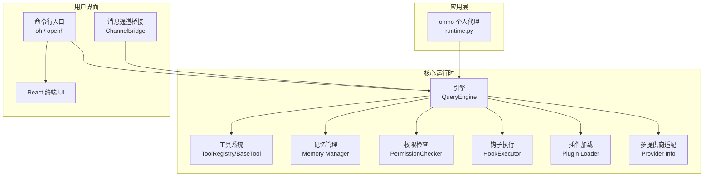

**图表来源**
- [src/openharness/engine/query_engine.py:21-307](file://src/openharness/engine/query_engine.py#L21-L307)
- [src/openharness/tools/base.py:35-81](file://src/openharness/tools/base.py#L35-L81)
- [src/openharness/memory/manager.py:1-184](file://src/openharness/memory/manager.py#L1-L184)
- [src/openharness/permissions/checker.py:57-201](file://src/openharness/permissions/checker.py#L57-L201)
- [src/openharness/hooks/executor.py:41-243](file://src/openharness/hooks/executor.py#L41-L243)
- [src/openharness/plugins/loader.py:107-162](file://src/openharness/plugins/loader.py#L107-L162)
- [src/openharness/api/provider.py:42-187](file://src/openharness/api/provider.py#L42-L187)
- [src/openharness/channels/adapter.py:29-132](file://src/openharness/channels/adapter.py#L29-L132)
- [ohmo/runtime.py:28-66](file://ohmo/runtime.py#L28-L66)

**章节来源**
- [README.md:446-466](file://README.md#L446-L466)
- [pyproject.toml:48-52](file://pyproject.toml#L48-L52)

## 核心组件
- 代理循环引擎（QueryEngine）
  - 负责会话历史管理、工具感知的模型循环、令牌计数与成本追踪、自动压缩与记忆抽取、会话内存持久化与自动梦（AutoDream）调度。
- 工具系统（ToolRegistry/BaseTool）
  - 统一的工具抽象与注册表，支持输入校验、自描述 JSON Schema、只读判定、生命周期钩子集成。
- 权限系统（PermissionChecker）
  - 多级模式（默认/自动/计划模式）、路径规则、命令拒绝列表、敏感路径保护、交互式确认。
- 记忆系统（Memory Manager）
  - 支持项目与团队级知识库、签名去重、原子写入、软删除与索引维护。
- 钩子系统（HookExecutor）
  - 命令/HTTP/提示类/代理类钩子，事件驱动的生命周期扩展点。
- 插件系统（Plugin Loader）
  - 发现与加载技能、命令、代理、工具、钩子、MCP 配置，兼容 Claude Code 插件布局。
- 多提供商适配（Provider Info）
  - 推断活跃提供商、认证类型、语音/多模态能力检测、企业环境与外部绑定状态。
- 渠道桥接（ChannelBridge）
  - 将消息总线与查询引擎连接，处理入站消息并回传出站回复。
- ohmo 个人代理运行时
  - 专用工作区、系统提示构建、会话后端、记忆后端与前端命令封装。

**章节来源**
- [src/openharness/engine/query_engine.py:21-307](file://src/openharness/engine/query_engine.py#L21-L307)
- [src/openharness/tools/base.py:35-81](file://src/openharness/tools/base.py#L35-L81)
- [src/openharness/permissions/checker.py:57-201](file://src/openharness/permissions/checker.py#L57-L201)
- [src/openharness/memory/manager.py:1-184](file://src/openharness/memory/manager.py#L1-184)
- [src/openharness/hooks/executor.py:41-243](file://src/openharness/hooks/executor.py#L41-L243)
- [src/openharness/plugins/loader.py:107-162](file://src/openharness/plugins/loader.py#L107-L162)
- [src/openharness/api/provider.py:42-187](file://src/openharness/api/provider.py#L42-L187)
- [src/openharness/channels/adapter.py:29-132](file://src/openharness/channels/adapter.py#L29-L132)
- [ohmo/runtime.py:28-66](file://ohmo/runtime.py#L28-L66)

## 架构总览
OpenHarness 的代理循环遵循“请求→流式响应→工具调用→循环”的模式，结合权限与钩子确保安全与可观测性；通过插件与技能扩展知识与行为；通过渠道桥接实现多平台接入；通过记忆与会话持久化支撑长程任务。

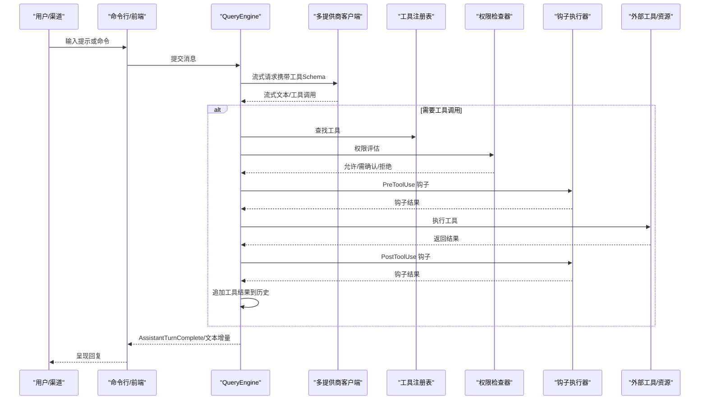

**图表来源**
- [src/openharness/engine/query_engine.py:227-307](file://src/openharness/engine/query_engine.py#L227-L307)
- [src/openharness/tools/base.py:60-81](file://src/openharness/tools/base.py#L60-L81)
- [src/openharness/permissions/checker.py:75-156](file://src/openharness/permissions/checker.py#L75-L156)
- [src/openharness/hooks/executor.py:64-78](file://src/openharness/hooks/executor.py#L64-L78)

**章节来源**
- [README.md:468-487](file://README.md#L468-L487)

## 详细组件分析

### 代理循环引擎（QueryEngine）
- 职责：维护会话历史、构建上下文、驱动模型流式输出、处理工具调用、成本统计、自动压缩与记忆抽取、会话内存持久化。
- 关键特性：
  - 最大轮次限制与“挂起续跑”能力
  - 自动记忆抽取与 AutoDream 调度
  - 会话内存元数据准备与更新
  - 协调者上下文注入（用于多代理协作）

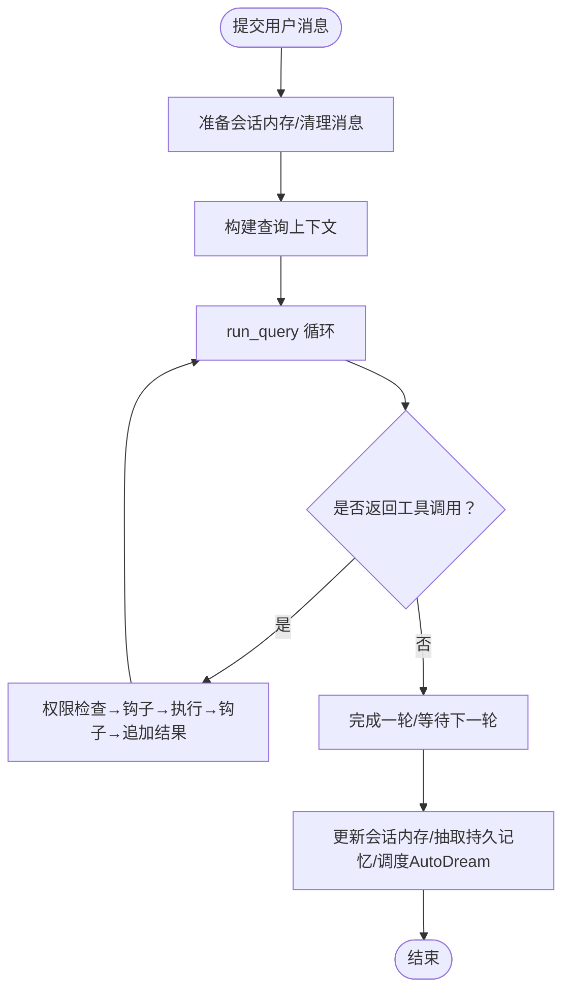

**图表来源**
- [src/openharness/engine/query_engine.py:227-307](file://src/openharness/engine/query_engine.py#L227-L307)

**章节来源**
- [src/openharness/engine/query_engine.py:21-307](file://src/openharness/engine/query_engine.py#L21-L307)

### 工具系统（ToolRegistry/BaseTool）
- 抽象：统一的 BaseTool 接口，支持只读判定、输入模型（JSON Schema）、标准化结果结构。
- 注册表：集中管理工具名称到实现的映射，导出 API Schema 供模型选择工具。
- 生命周期：与钩子系统配合，在执行前后触发事件，便于审计与扩展。

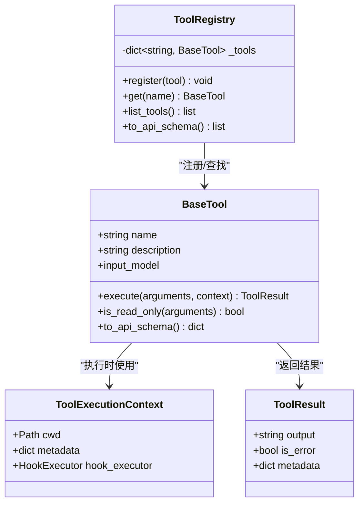

**图表来源**
- [src/openharness/tools/base.py:17-81](file://src/openharness/tools/base.py#L17-L81)

**章节来源**
- [src/openharness/tools/base.py:35-81](file://src/openharness/tools/base.py#L35-L81)

### 权限系统（PermissionChecker）
- 多级模式：默认（需确认）、自动（允许一切）、计划模式（阻断变更型操作）。
- 规则体系：路径规则（glob 匹配）、命令拒绝模式、内置敏感路径白名单。
- 交互提示：针对高风险命令给出明确提示，避免误操作。

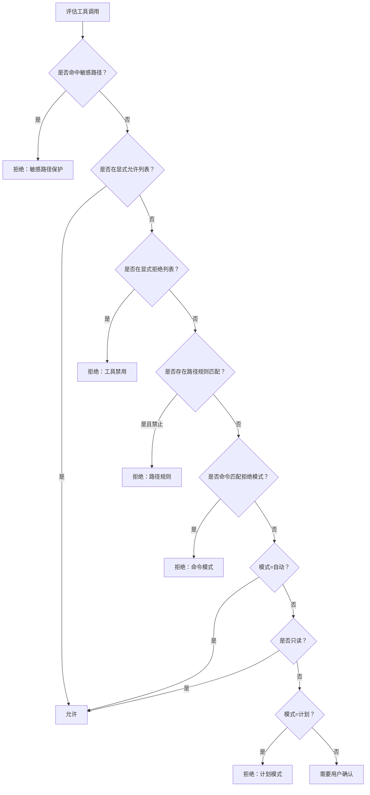

**图表来源**
- [src/openharness/permissions/checker.py:75-156](file://src/openharness/permissions/checker.py#L75-L156)

**章节来源**
- [src/openharness/permissions/checker.py:57-201](file://src/openharness/permissions/checker.py#L57-L201)

### 记忆系统（Memory Manager）
- 功能：项目/团队级知识库管理、去重与签名、原子写入、软删除与索引同步。
- 设计：通过锁与原子写保证并发一致性，支持 TTL、标签、重要性等元数据。

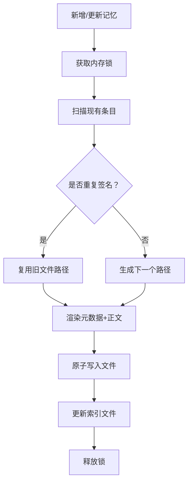

**图表来源**
- [src/openharness/memory/manager.py:39-121](file://src/openharness/memory/manager.py#L39-L121)

**章节来源**
- [src/openharness/memory/manager.py:1-184](file://src/openharness/memory/manager.py#L1-L184)

### 钩子系统（HookExecutor）
- 类型：命令钩子、HTTP 钩子、提示类钩子、代理类钩子。
- 行为：事件匹配、参数注入、超时控制、失败阻断策略、结果聚合。

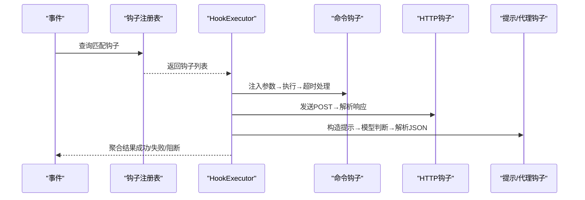

**图表来源**
- [src/openharness/hooks/executor.py:64-212](file://src/openharness/hooks/executor.py#L64-L212)

**章节来源**
- [src/openharness/hooks/executor.py:41-243](file://src/openharness/hooks/executor.py#L41-L243)

### 插件系统（Plugin Loader）
- 能力：发现与加载技能、命令、代理、工具、钩子、MCP 配置；兼容 Claude Code 插件布局。
- 安全：受设置控制是否启用项目本地插件；对工具模块动态导入并实例化。

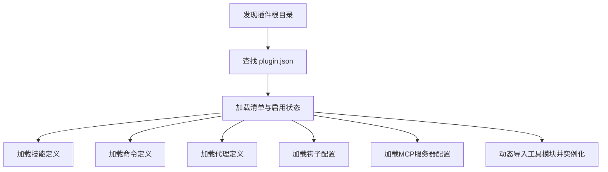

**图表来源**
- [src/openharness/plugins/loader.py:107-162](file://src/openharness/plugins/loader.py#L107-L162)
- [src/openharness/plugins/loader.py:691-731](file://src/openharness/plugins/loader.py#L691-L731)

**章节来源**
- [src/openharness/plugins/loader.py:107-162](file://src/openharness/plugins/loader.py#L107-L162)
- [src/openharness/plugins/loader.py:691-731](file://src/openharness/plugins/loader.py#L691-L731)

### 多提供商适配（Provider Info）
- 能力：根据配置推断提供商、认证方式、语音/多模态支持；提供认证状态诊断。
- 兼容：支持 Anthropic、OpenAI 兼容、Copilot、Codex、Claude 订阅、Moonshot/Kimi 等。

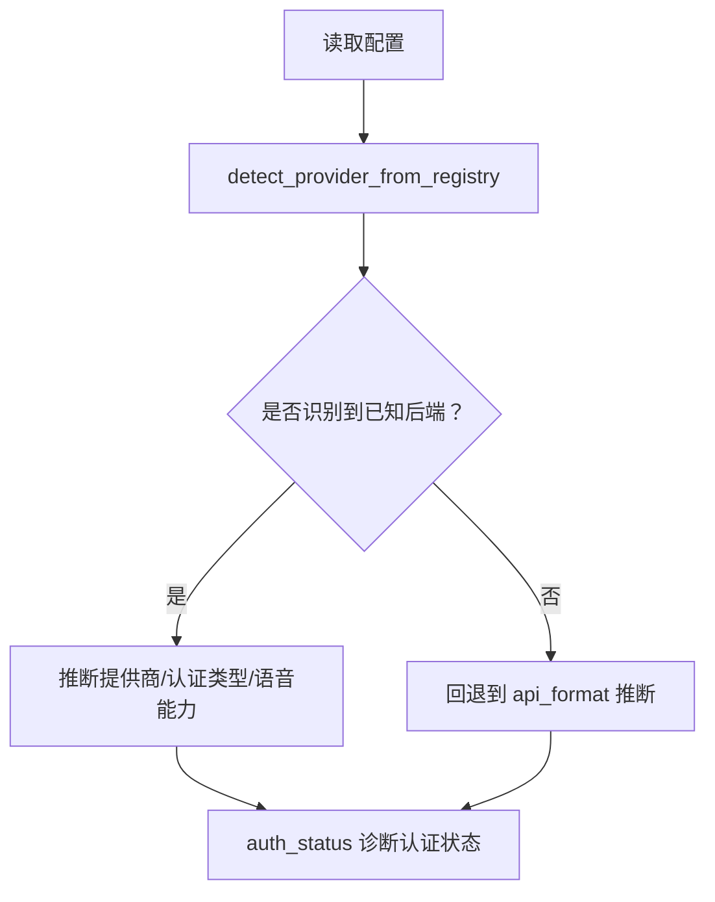

**图表来源**
- [src/openharness/api/provider.py:42-187](file://src/openharness/api/provider.py#L42-L187)

**章节来源**
- [src/openharness/api/provider.py:13-187](file://src/openharness/api/provider.py#L13-L187)

### 渠道桥接（ChannelBridge）
- 职责：消费消息总线中的入站消息，交给 QueryEngine 处理，再将回复发布到总线。
- 特性：异步循环、背压处理、错误日志记录、空回复跳过。

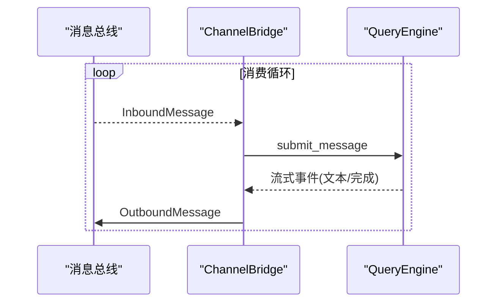

**图表来源**
- [src/openharness/channels/adapter.py:78-132](file://src/openharness/channels/adapter.py#L78-L132)

**章节来源**
- [src/openharness/channels/adapter.py:29-132](file://src/openharness/channels/adapter.py#L29-L132)

### ohmo 个人代理运行时
- 工作区：专属工作区、技能/插件根目录、会话与记忆后端。
- 启动：构建系统提示、启动后端、可选 React TUI；支持打印模式单次输出。
- 集成：与 OpenHarness 共享运行时与前端资源。

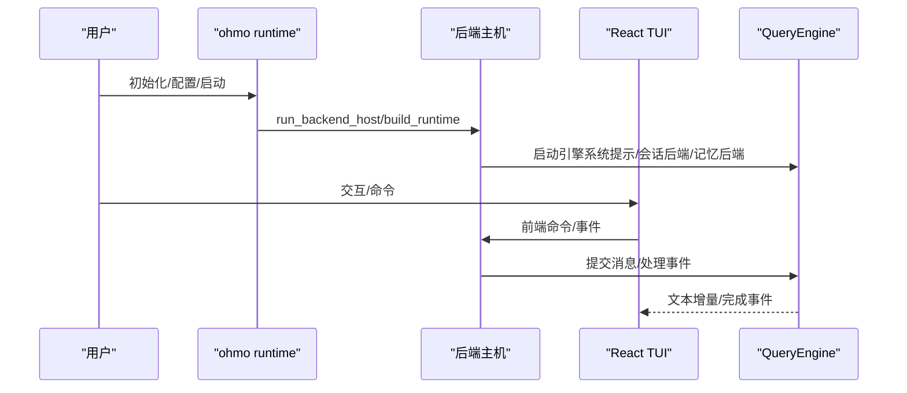

**图表来源**
- [ohmo/runtime.py:28-66](file://ohmo/runtime.py#L28-L66)
- [ohmo/runtime.py:92-144](file://ohmo/runtime.py#L92-L144)
- [ohmo/runtime.py:147-219](file://ohmo/runtime.py#L147-L219)

**章节来源**
- [ohmo/runtime.py:1-219](file://ohmo/runtime.py#L1-L219)

## 依赖关系分析
- 运行时依赖：Python ≥3.10，核心库包括 anthropic、openai、rich、prompt-toolkit、textual、typer、pydantic、httpx、websockets、mcp、yaml、questionary、watchfiles、croniter、各类渠道 SDK。
- 可选开发依赖：pytest、ruff、mypy 等。
- 命令入口：oh/openharness、ohmo 三个脚本入口。

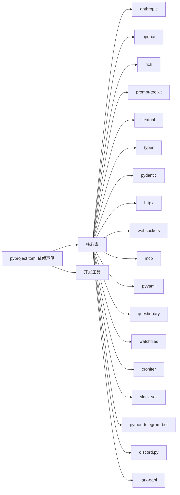

**图表来源**
- [pyproject.toml:16-36](file://pyproject.toml#L16-L36)
- [pyproject.toml:38-46](file://pyproject.toml#L38-L46)
- [pyproject.toml:48-52](file://pyproject.toml#L48-L52)

**章节来源**
- [pyproject.toml:1-86](file://pyproject.toml#L1-L86)

## 性能考量
- 代理循环
  - 流式响应减少等待时间，工具调用可并行执行（由具体实现决定），并进行令牌计数与成本追踪。
  - 自动压缩与会话内存持久化降低上下文膨胀带来的开销。
- 工具系统
  - 输入模型与 JSON Schema 有助于模型更准确地选择工具，减少无效调用。
- 权限与钩子
  - 在工具执行前进行权限评估与钩子预处理，避免昂贵的失败调用。
- 记忆与插件
  - 原子写入与锁机制保障并发一致性，插件启用受设置控制，避免不必要的加载。

[本节为通用指导，不直接分析具体文件]

## 故障排查指南
- 干运行（Dry-run）
  - 使用 --dry-run 预览设置解析、认证状态、提示组装、技能/命令/工具解析与 MCP 配置问题，不实际调用模型或执行工具。
  - 输出包含 ready/warning/blocked 三态与下一步建议。
- 认证状态
  - 通过 provider 与 auth 子命令检查与修复认证；Copilot 使用 OAuth 设备流程，Claude/Codex 使用外部绑定。
- 渠道与网关
  - ChannelBridge 记录未处理异常日志；远程渠道默认限制敏感命令与桥接命令，注意安全策略。
- 版本与变更
  - v0.1.9 新增技能创建器与用户可触发技能；v0.1.8 增强 Feishu 群组体验、Windows 可靠性、MCP 启动隔离与 TUI 修复。

**章节来源**
- [README.md:268-304](file://README.md#L268-L304)
- [src/openharness/api/provider.py:97-127](file://src/openharness/api/provider.py#L97-L127)
- [src/openharness/channels/adapter.py:91-93](file://src/openharness/channels/adapter.py#L91-L93)
- [RELEASE_NOTES_v0.1.9.md:1-33](file://RELEASE_NOTES_v0.1.9.md#L1-L33)
- [RELEASE_NOTES_v0.1.8.md:1-67](file://RELEASE_NOTES_v0.1.8.md#L1-L67)

## 结论
OpenHarness 以清晰的模块化设计与强大的扩展能力，为构建可观察、可治理、可持续的智能代理提供了坚实基础。其代理循环、工具系统、权限与记忆、插件与钩子、多提供商适配与渠道桥接共同构成完整的“夹具”能力集。ohmo 个人代理进一步验证了该夹具在真实场景中的可用性与价值。对于初学者，建议从命令行与 React TUI 入手，逐步理解代理循环与工具系统；对于有经验的开发者，可深入插件、钩子与多提供商适配，定制化扩展以满足复杂工作流。

[本节为总结性内容，不直接分析具体文件]

## 附录
- 快速开始与安装
  - Linux/macOS/WSL 与 Windows（原生）均提供一键安装脚本与 pip 安装方式；ohmo 初始化与配置流程见 README。
- 展示案例
  - 仓库提供可复现实战示例，涵盖本地编码助手、脚本自动化、技能/插件实验、多代理与后台任务、提供商兼容测试等。
- 社区与贡献
  - 提供贡献指南、开发环境搭建、本地检查与 PR 期望说明；欢迎报告问题与提出功能建议。

**章节来源**
- [README.md:197-284](file://README.md#L197-L284)
- [docs/SHOWCASE.md:1-81](file://docs/SHOWCASE.md#L1-L81)
- [CONTRIBUTING.md:1-69](file://CONTRIBUTING.md#L1-L69)