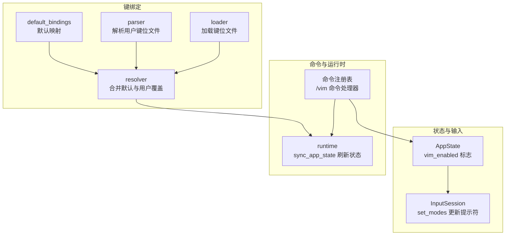
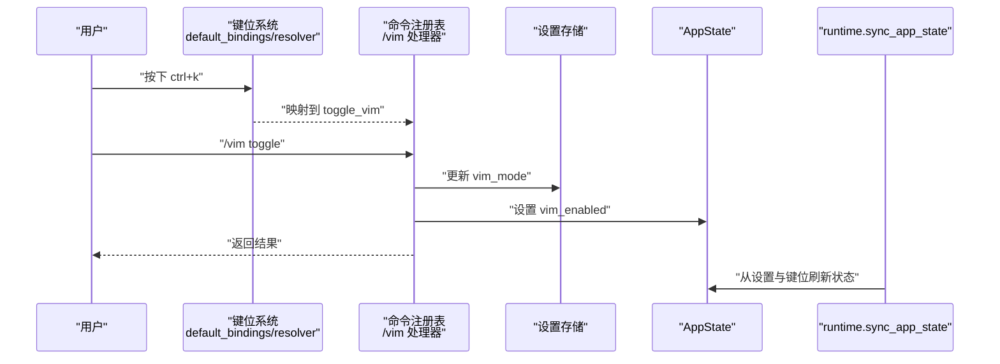
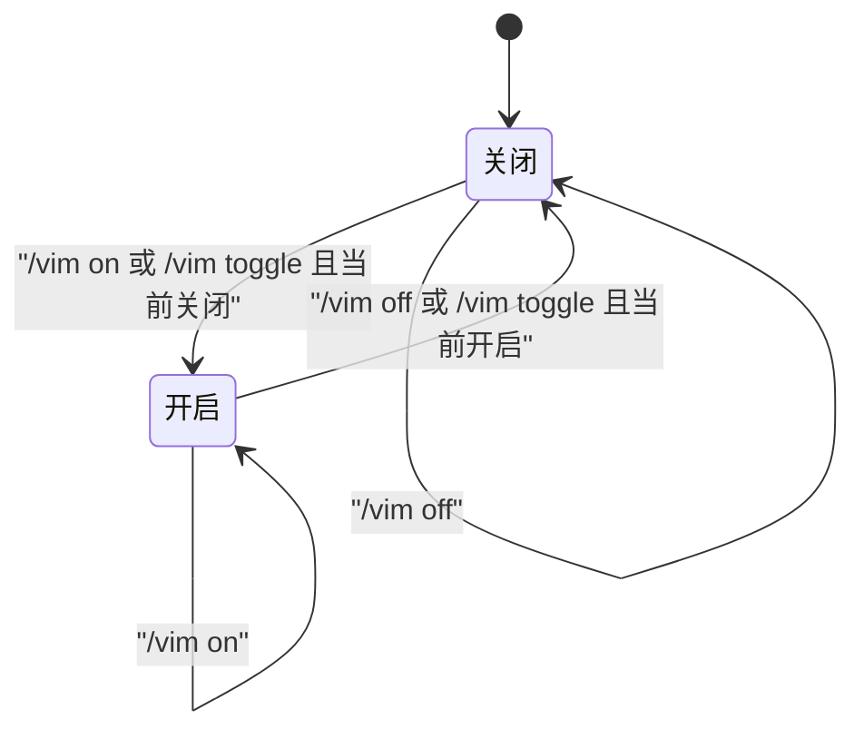
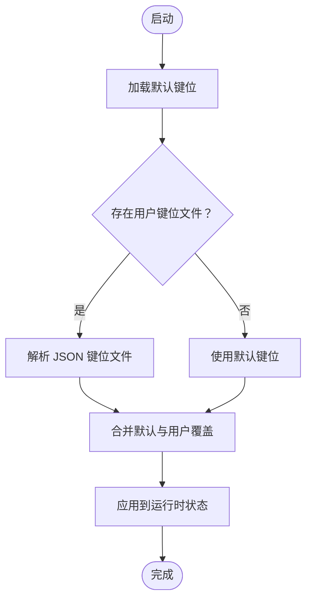
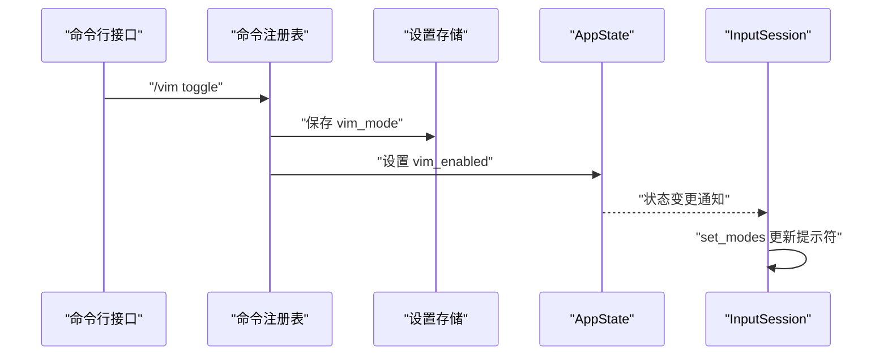
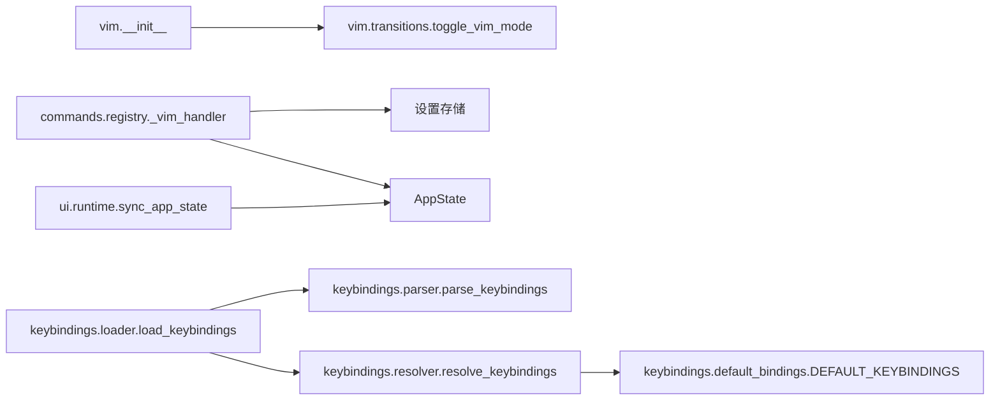

# Vim 集成功能

<cite>
**本文引用的文件**
- [src/openharness/vim/__init__.py](file://src/openharness/vim/__init__.py)
- [src/openharness/vim/transitions.py](file://src/openharness/vim/transitions.py)
- [src/openharness/state/app_state.py](file://src/openharness/state/app_state.py)
- [src/openharness/ui/input.py](file://src/openharness/ui/input.py)
- [src/openharness/keybindings/default_bindings.py](file://src/openharness/keybindings/default_bindings.py)
- [src/openharness/keybindings/loader.py](file://src/openharness/keybindings/loader.py)
- [src/openharness/keybindings/parser.py](file://src/openharness/keybindings/parser.py)
- [src/openharness/keybindings/resolver.py](file://src/openharness/keybindings/resolver.py)
- [src/openharness/commands/registry.py](file://src/openharness/commands/registry.py)
- [src/openharness/ui/runtime.py](file://src/openharness/ui/runtime.py)
- [tests/test_ui/test_modes.py](file://tests/test_ui/test_modes.py)
- [tests/test_commands/test_registry.py](file://tests/test_commands/test_registry.py)
</cite>

## 目录
1. [简介](#简介)
2. [项目结构](#项目结构)
3. [核心组件](#核心组件)
4. [架构总览](#架构总览)
5. [详细组件分析](#详细组件分析)
6. [依赖关系分析](#依赖关系分析)
7. [性能考量](#性能考量)
8. [故障排除指南](#故障排除指南)
9. [结论](#结论)
10. [附录](#附录)

## 简介
本文件系统性阐述 OpenHarness 中的 Vim 集成功能，覆盖设计理念、实现架构、状态转换机制、键盘映射与快捷键配置、与主应用的交互方式（命令传递、状态同步），以及面向终端用户的使用指南、示例与故障排除建议。当前实现以“最小可用”为目标：通过命令切换 Vim 模式，并在输入提示符中反映模式状态；键绑定层支持将特定按键映射到“切换 Vim 模式”的动作。

## 项目结构
围绕 Vim 集成的相关模块分布于以下子系统：
- 状态模型：共享应用状态，包含是否启用 Vim 模式的布尔标志
- 输入层：基于 prompt_toolkit 的输入会话，根据模式动态更新提示符
- 键盘映射：默认键位映射、解析与合并用户覆盖
- 命令注册表：提供 /vim 命令及其行为（显示、开启、关闭、切换）
- 运行时同步：从设置与动态键位映射刷新应用状态
- 测试：验证模式提示符更新与命令持久化与状态更新

**图表来源**
- [src/openharness/state/app_state.py:1-31](file://src/openharness/state/app_state.py#L1-L31)
- [src/openharness/ui/input.py:1-33](file://src/openharness/ui/input.py#L1-L33)
- [src/openharness/keybindings/default_bindings.py:1-12](file://src/openharness/keybindings/default_bindings.py#L1-L12)
- [src/openharness/keybindings/resolver.py:1-14](file://src/openharness/keybindings/resolver.py#L1-L14)
- [src/openharness/keybindings/parser.py:1-19](file://src/openharness/keybindings/parser.py#L1-L19)
- [src/openharness/keybindings/loader.py:1-23](file://src/openharness/keybindings/loader.py#L1-L23)
- [src/openharness/commands/registry.py:1033-1050](file://src/openharness/commands/registry.py#L1033-L1050)
- [src/openharness/ui/runtime.py:196-220](file://src/openharness/ui/runtime.py#L196-L220)

**章节来源**
- [src/openharness/state/app_state.py:1-31](file://src/openharness/state/app_state.py#L1-L31)
- [src/openharness/ui/input.py:1-33](file://src/openharness/ui/input.py#L1-L33)
- [src/openharness/keybindings/default_bindings.py:1-12](file://src/openharness/keybindings/default_bindings.py#L1-L12)
- [src/openharness/keybindings/resolver.py:1-14](file://src/openharness/keybindings/resolver.py#L1-L14)
- [src/openharness/keybindings/parser.py:1-19](file://src/openharness/keybindings/parser.py#L1-L19)
- [src/openharness/keybindings/loader.py:1-23](file://src/openharness/keybindings/loader.py#L1-L23)
- [src/openharness/commands/registry.py:1033-1050](file://src/openharness/commands/registry.py#L1033-L1050)
- [src/openharness/ui/runtime.py:196-220](file://src/openharness/ui/runtime.py#L196-L220)

## 核心组件
- Vim 状态切换工具：提供一个简单的布尔反转函数，用于切换 Vim 模式状态
- 应用状态模型：包含 vim_enabled 字段，作为全局可见的状态标志
- 输入会话：根据 vim_enabled 动态更新提示符前缀
- 键位映射：默认将 ctrl+k 映射到“切换 Vim”，支持用户覆盖
- 命令注册表：提供 /vim 命令，支持 show/on/off/toggle，并持久化到设置与应用状态
- 运行时同步：从设置与动态键位映射刷新 AppState

**章节来源**
- [src/openharness/vim/transitions.py:1-9](file://src/openharness/vim/transitions.py#L1-L9)
- [src/openharness/state/app_state.py:1-31](file://src/openharness/state/app_state.py#L1-L31)
- [src/openharness/ui/input.py:1-33](file://src/openharness/ui/input.py#L1-L33)
- [src/openharness/keybindings/default_bindings.py:1-12](file://src/openharness/keybindings/default_bindings.py#L1-L12)
- [src/openharness/commands/registry.py:1033-1050](file://src/openharness/commands/registry.py#L1033-L1050)
- [src/openharness/ui/runtime.py:196-220](file://src/openharness/ui/runtime.py#L196-L220)

## 架构总览
下图展示 Vim 集成在系统中的关键交互路径：用户通过命令或键位触发状态切换，命令处理器更新设置与应用状态，运行时同步刷新全局状态，输入层据此更新提示符。

**图表来源**
- [src/openharness/keybindings/default_bindings.py:6-11](file://src/openharness/keybindings/default_bindings.py#L6-L11)
- [src/openharness/keybindings/resolver.py:8-13](file://src/openharness/keybindings/resolver.py#L8-L13)
- [src/openharness/commands/registry.py:1033-1050](file://src/openharness/commands/registry.py#L1033-L1050)
- [src/openharness/ui/runtime.py:196-220](file://src/openharness/ui/runtime.py#L196-L220)

## 详细组件分析

### 状态转换机制
- 初始状态：AppState.vim_enabled 默认为 False
- 切换逻辑：命令处理器根据参数选择“显示/开启/关闭/切换”，并将新值写入设置与 AppState
- 提示符更新：InputSession.set_modes 根据 vim_enabled 组合提示符装饰，体现当前模式
- 运行时同步：runtime.sync_app_state 将设置中的 vim_mode 同步到 AppState，确保 UI 与设置一致

**图表来源**
- [src/openharness/commands/registry.py:1033-1050](file://src/openharness/commands/registry.py#L1033-L1050)
- [src/openharness/state/app_state.py](file://src/openharness/state/app_state.py#L19)
- [src/openharness/ui/input.py:15-23](file://src/openharness/ui/input.py#L15-L23)

**章节来源**
- [src/openharness/state/app_state.py](file://src/openharness/state/app_state.py#L19)
- [src/openharness/ui/input.py:15-23](file://src/openharness/ui/input.py#L15-L23)
- [src/openharness/commands/registry.py:1033-1050](file://src/openharness/commands/registry.py#L1033-L1050)
- [src/openharness/ui/runtime.py](file://src/openharness/ui/runtime.py#L208)

### 键盘映射与快捷键配置
- 默认映射：ctrl+k -> toggle_vim
- 解析与合并：用户可在 JSON 文件中覆盖默认映射，解析器校验键值类型，解析器将用户覆盖与默认映射合并
- 加载流程：运行时从配置目录读取键位文件，若不存在则仅使用默认映射
- 使用方式：当用户按下 ctrl+k 时，键位解析器将其映射到 toggle_vim，进而由命令处理器执行切换

**图表来源**
- [src/openharness/keybindings/default_bindings.py:6-11](file://src/openharness/keybindings/default_bindings.py#L6-L11)
- [src/openharness/keybindings/parser.py:8-18](file://src/openharness/keybindings/parser.py#L8-L18)
- [src/openharness/keybindings/resolver.py:8-13](file://src/openharness/keybindings/resolver.py#L8-L13)
- [src/openharness/keybindings/loader.py:17-22](file://src/openharness/keybindings/loader.py#L17-L22)
- [src/openharness/ui/runtime.py](file://src/openharness/ui/runtime.py#L219)

**章节来源**
- [src/openharness/keybindings/default_bindings.py:6-11](file://src/openharness/keybindings/default_bindings.py#L6-L11)
- [src/openharness/keybindings/parser.py:8-18](file://src/openharness/keybindings/parser.py#L8-L18)
- [src/openharness/keybindings/resolver.py:8-13](file://src/openharness/keybindings/resolver.py#L8-L13)
- [src/openharness/keybindings/loader.py:17-22](file://src/openharness/keybindings/loader.py#L17-L22)

### 与主应用的交互方式
- 命令传递：/vim 命令由命令注册表解析，调用处理器后更新设置与 AppState
- 状态同步：runtime.sync_app_state 将设置与动态键位映射刷新到 AppState，保证 UI 与后台一致
- 提示符联动：InputSession.set_modes 根据 AppState.vim_enabled 更新提示符装饰，直观反馈当前模式

**图表来源**
- [src/openharness/commands/registry.py:1033-1050](file://src/openharness/commands/registry.py#L1033-L1050)
- [src/openharness/ui/runtime.py](file://src/openharness/ui/runtime.py#L208)
- [src/openharness/ui/input.py:15-23](file://src/openharness/ui/input.py#L15-L23)

**章节来源**
- [src/openharness/commands/registry.py:1033-1050](file://src/openharness/commands/registry.py#L1033-L1050)
- [src/openharness/ui/runtime.py](file://src/openharness/ui/runtime.py#L208)
- [src/openharness/ui/input.py:15-23](file://src/openharness/ui/input.py#L15-L23)

### 使用指南
- 基本操作
  - 在终端中输入 /vim show 查看当前模式状态
  - 输入 /vim on 开启 Vim 模式
  - 输入 /vim off 关闭 Vim 模式
  - 输入 /vim toggle 切换模式
- 快捷键
  - 默认：按下 ctrl+k 切换 Vim 模式
  - 自定义：在用户键位文件中添加或修改映射条目，重启或重新加载配置后生效
- 提示符
  - 当 Vim 模式开启时，提示符会包含 [vim] 前缀，帮助快速识别当前模式
- 配置选项
  - 设置持久化：/vim 命令会更新设置文件，重启后仍保持
  - 键位持久化：用户键位文件位于配置目录，可随时编辑

**章节来源**
- [src/openharness/commands/registry.py:1033-1050](file://src/openharness/commands/registry.py#L1033-L1050)
- [src/openharness/keybindings/default_bindings.py:6-11](file://src/openharness/keybindings/default_bindings.py#L6-L11)
- [src/openharness/keybindings/loader.py:12-22](file://src/openharness/keybindings/loader.py#L12-L22)
- [src/openharness/ui/input.py:15-23](file://src/openharness/ui/input.py#L15-L23)

## 依赖关系分析
- Vim 模块导出：对外仅暴露 toggle_vim_mode 工具函数
- 命令处理器依赖：/vim 命令处理器依赖设置加载/保存与 AppState
- 键位系统依赖：默认映射、解析器与加载器共同构成键位体系
- 运行时依赖：runtime.sync_app_state 负责将设置与键位映射同步到 AppState

**图表来源**
- [src/openharness/vim/__init__.py:1-6](file://src/openharness/vim/__init__.py#L1-L6)
- [src/openharness/vim/transitions.py:6-8](file://src/openharness/vim/transitions.py#L6-L8)
- [src/openharness/commands/registry.py:1033-1050](file://src/openharness/commands/registry.py#L1033-L1050)
- [src/openharness/keybindings/loader.py:17-22](file://src/openharness/keybindings/loader.py#L17-L22)
- [src/openharness/keybindings/parser.py:8-18](file://src/openharness/keybindings/parser.py#L8-L18)
- [src/openharness/keybindings/resolver.py:8-13](file://src/openharness/keybindings/resolver.py#L8-L13)
- [src/openharness/keybindings/default_bindings.py:6-11](file://src/openharness/keybindings/default_bindings.py#L6-L11)
- [src/openharness/ui/runtime.py:196-220](file://src/openharness/ui/runtime.py#L196-L220)

**章节来源**
- [src/openharness/vim/__init__.py:1-6](file://src/openharness/vim/__init__.py#L1-L6)
- [src/openharness/commands/registry.py:1033-1050](file://src/openharness/commands/registry.py#L1033-L1050)
- [src/openharness/keybindings/loader.py:17-22](file://src/openharness/keybindings/loader.py#L17-L22)
- [src/openharness/keybindings/parser.py:8-18](file://src/openharness/keybindings/parser.py#L8-L18)
- [src/openharness/keybindings/resolver.py:8-13](file://src/openharness/keybindings/resolver.py#L8-L13)
- [src/openharness/keybindings/default_bindings.py:6-11](file://src/openharness/keybindings/default_bindings.py#L6-L11)
- [src/openharness/ui/runtime.py:196-220](file://src/openharness/ui/runtime.py#L196-L220)

## 性能考量
- 状态切换为纯内存操作，开销极低
- 键位解析仅在加载配置时进行，通常为一次性成本
- 提示符更新为字符串拼接，复杂度 O(n)，n 为装饰片段数量
- 建议：避免频繁重载键位文件；在批量命令场景中，优先使用 /vim 命令而非重复键位触发

## 故障排除指南
- 问题：按下 ctrl+k 无反应
  - 检查键位文件是否存在语法错误或键值非字符串
  - 确认用户键位未覆盖掉 toggle_vim 映射
  - 参考：键位解析与合并逻辑
- 问题：/vim 命令无效或状态未更新
  - 确认命令参数为 show/on/off/toggle 之一
  - 检查设置文件是否可写
  - 参考：命令处理器与设置持久化
- 问题：提示符未显示 [vim]
  - 确认 AppState.vim_enabled 已被同步
  - 参考：运行时同步与输入层提示符更新
- 问题：重启后 Vim 模式未保持
  - 检查设置文件中 vim_mode 是否正确写入
  - 参考：设置加载与保存

**章节来源**
- [src/openharness/keybindings/parser.py:8-18](file://src/openharness/keybindings/parser.py#L8-L18)
- [src/openharness/keybindings/resolver.py:8-13](file://src/openharness/keybindings/resolver.py#L8-L13)
- [src/openharness/commands/registry.py:1033-1050](file://src/openharness/commands/registry.py#L1033-L1050)
- [src/openharness/ui/runtime.py](file://src/openharness/ui/runtime.py#L208)
- [src/openharness/ui/input.py:15-23](file://src/openharness/ui/input.py#L15-L23)

## 结论
OpenHarness 的 Vim 集成采用“最小可用”设计：通过 /vim 命令与默认键位映射实现模式切换，结合 AppState 与 InputSession 实现状态保持与提示符联动。该方案简洁可靠，易于扩展，为终端用户提供接近 Vim 的交互体验。未来可在此基础上引入更丰富的键位映射与模式内行为，但需保持与现有状态与命令系统的兼容。

## 附录
- 示例：使用 /vim 命令
  - 查看状态：/vim show
  - 开启模式：/vim on
  - 关闭模式：/vim off
  - 切换模式：/vim toggle
- 示例：自定义键位
  - 在用户键位文件中添加条目，例如将某个按键映射到 toggle_vim
  - 重启或重新加载配置后生效
- 测试参考
  - 模式提示符更新测试
  - 命令持久化与状态更新测试

**章节来源**
- [tests/test_ui/test_modes.py:9-18](file://tests/test_ui/test_modes.py#L9-L18)
- [tests/test_commands/test_registry.py:187-190](file://tests/test_commands/test_registry.py#L187-L190)
- [src/openharness/commands/registry.py:1033-1050](file://src/openharness/commands/registry.py#L1033-L1050)
- [src/openharness/keybindings/loader.py:17-22](file://src/openharness/keybindings/loader.py#L17-L22)