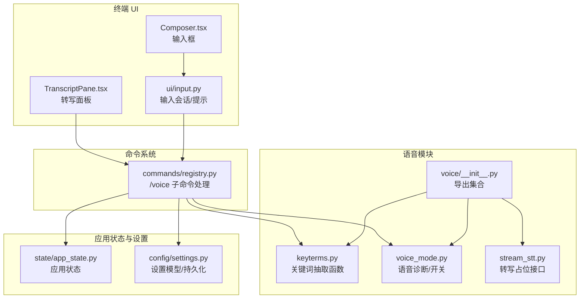
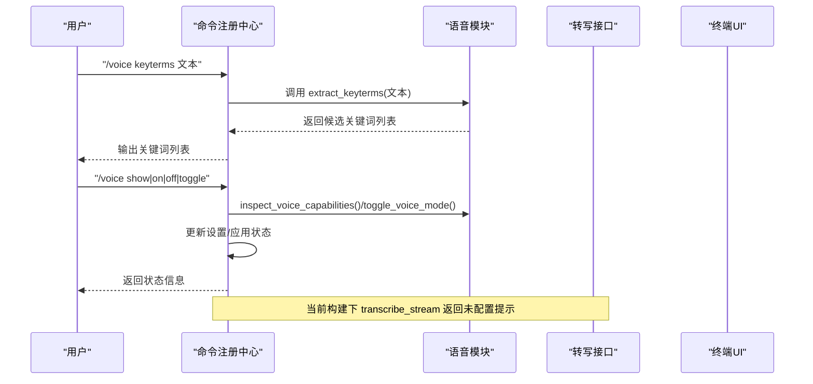
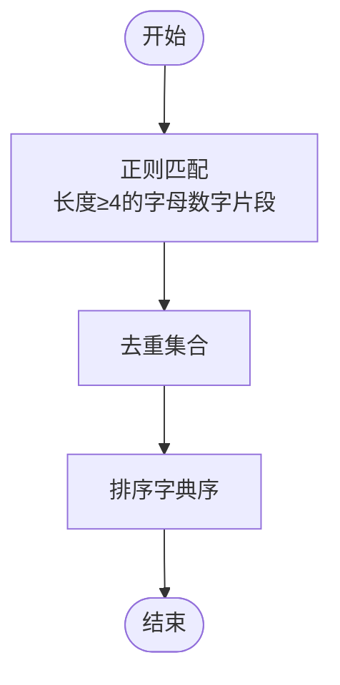
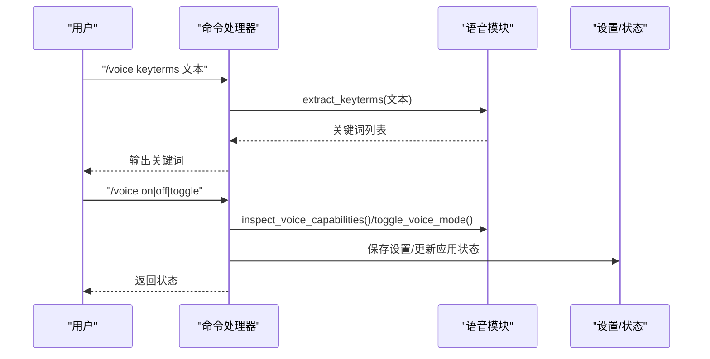
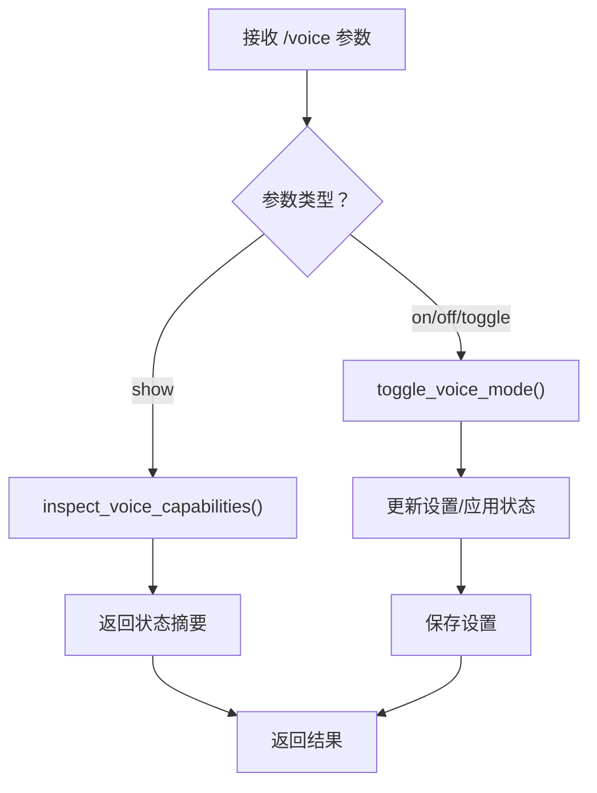
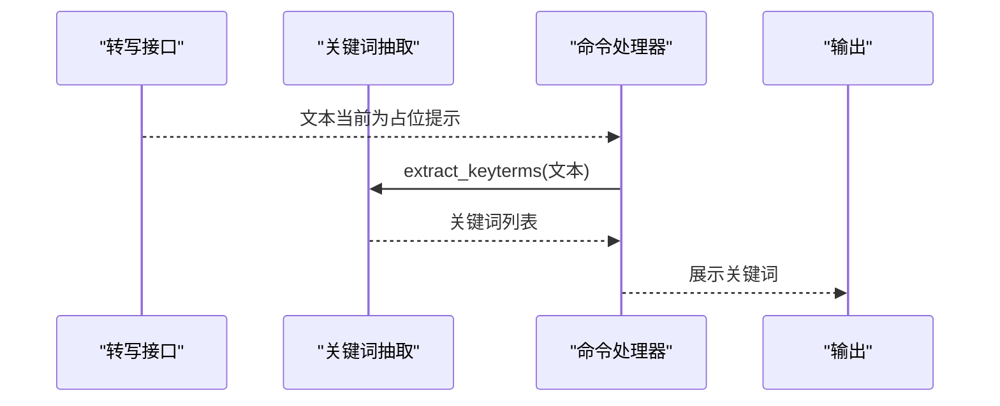
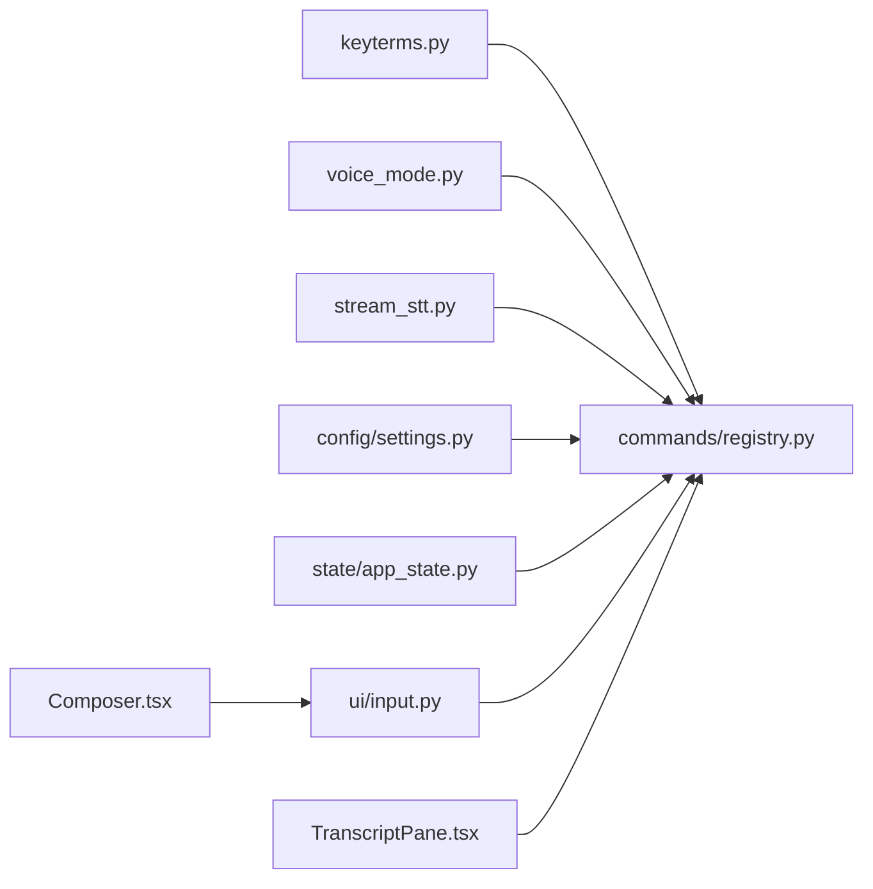

# 关键词检测

<cite>
**本文引用的文件**
- [src/openharness/voice/keyterms.py](file://src/openharness/voice/keyterms.py)
- [src/openharness/voice/__init__.py](file://src/openharness/voice/__init__.py)
- [src/openharness/voice/voice_mode.py](file://src/openharness/voice/voice_mode.py)
- [src/openharness/voice/stream_stt.py](file://src/openharness/voice/stream_stt.py)
- [src/openharness/commands/registry.py](file://src/openharness/commands/registry.py)
- [src/openharness/state/app_state.py](file://src/openharness/state/app_state.py)
- [src/openharness/config/settings.py](file://src/openharness/config/settings.py)
- [src/openharness/ui/input.py](file://src/openharness/ui/input.py)
- [frontend/terminal/src/components/TranscriptPane.tsx](file://frontend/terminal/src/components/TranscriptPane.tsx)
- [frontend/terminal/src/components/Composer.tsx](file://frontend/terminal/src/components/Composer.tsx)
</cite>

## 目录
1. [简介](#简介)
2. [项目结构](#项目结构)
3. [核心组件](#核心组件)
4. [架构总览](#架构总览)
5. [详细组件分析](#详细组件分析)
6. [依赖关系分析](#依赖关系分析)
7. [性能考虑](#性能考虑)
8. [故障排除指南](#故障排除指南)
9. [结论](#结论)
10. [附录](#附录)

## 简介
本文件面向 OpenHarness 的“关键词检测”能力，聚焦于语音转写文本中的关键词抽取与命令入口。当前仓库中并未提供通用的“关键词触发器（如阈值、重复检测、响应延迟）”配置或运行时逻辑；但提供了以下与关键词相关的能力：
- 从语音转写文本中提取候选关键词（按正则规则筛选出长度≥4的字母数字片段）
- 命令入口 /voice keyterms 可直接展示候选关键词列表
- 语音模式可用性诊断与开关控制
- 与 UI 层的转写显示与输入提示联动

因此，本文档以“关键词抽取与命令入口”为核心，解释其实现机制与使用方式，并给出在现有代码基础上扩展“触发条件配置”的实践建议。

## 项目结构
与关键词检测相关的核心位置如下：
- 语音关键词抽取：src/openharness/voice/keyterms.py
- 语音模块导出：src/openharness/voice/__init__.py
- 语音模式诊断与开关：src/openharness/voice/voice_mode.py
- 语音转写占位接口：src/openharness/voice/stream_stt.py
- 命令注册与 /voice 子命令：src/openharness/commands/registry.py
- 应用状态模型：src/openharness/state/app_state.py
- 设置模型与持久化：src/openharness/config/settings.py
- 终端 UI 输入会话与提示：src/openharness/ui/input.py
- 转写面板与输入框（前端）：frontend/terminal/src/components/TranscriptPane.tsx、frontend/terminal/src/components/Composer.tsx

图表来源
- [src/openharness/voice/keyterms.py:1-11](file://src/openharness/voice/keyterms.py#L1-L11)
- [src/openharness/voice/voice_mode.py:1-45](file://src/openharness/voice/voice_mode.py#L1-L45)
- [src/openharness/voice/stream_stt.py:1-9](file://src/openharness/voice/stream_stt.py#L1-L9)
- [src/openharness/voice/__init__.py:1-8](file://src/openharness/voice/__init__.py#L1-L8)
- [src/openharness/commands/registry.py:1052-1086](file://src/openharness/commands/registry.py#L1052-L1086)
- [src/openharness/state/app_state.py:1-31](file://src/openharness/state/app_state.py#L1-L31)
- [src/openharness/config/settings.py:1-161](file://src/openharness/config/settings.py#L1-L161)
- [src/openharness/ui/input.py:1-33](file://src/openharness/ui/input.py#L1-L33)
- [frontend/terminal/src/components/TranscriptPane.tsx:1-58](file://frontend/terminal/src/components/TranscriptPane.tsx#L1-L58)
- [frontend/terminal/src/components/Composer.tsx:1-33](file://frontend/terminal/src/components/Composer.tsx#L1-L33)

章节来源
- [src/openharness/voice/keyterms.py:1-11](file://src/openharness/voice/keyterms.py#L1-L11)
- [src/openharness/voice/voice_mode.py:1-45](file://src/openharness/voice/voice_mode.py#L1-L45)
- [src/openharness/voice/stream_stt.py:1-9](file://src/openharness/voice/stream_stt.py#L1-L9)
- [src/openharness/voice/__init__.py:1-8](file://src/openharness/voice/__init__.py#L1-L8)
- [src/openharness/commands/registry.py:1052-1086](file://src/openharness/commands/registry.py#L1052-L1086)
- [src/openharness/state/app_state.py:1-31](file://src/openharness/state/app_state.py#L1-L31)
- [src/openharness/config/settings.py:1-161](file://src/openharness/config/settings.py#L1-L161)
- [src/openharness/ui/input.py:1-33](file://src/openharness/ui/input.py#L1-L33)
- [frontend/terminal/src/components/TranscriptPane.tsx:1-58](file://frontend/terminal/src/components/TranscriptPane.tsx#L1-L58)
- [frontend/terminal/src/components/Composer.tsx:1-33](file://frontend/terminal/src/components/Composer.tsx#L1-L33)

## 核心组件
- 关键词抽取函数
  - 功能：从转写文本中提取长度≥4的字母数字片段，去重并排序返回
  - 实现位置：[extract_keyterms:8-10](file://src/openharness/voice/keyterms.py#L8-L10)
- 语音模式诊断与开关
  - 功能：检查录音工具可用性、判断语音能力是否可用，并支持切换语音模式
  - 实现位置：[inspect_voice_capabilities:25-43](file://src/openharness/voice/voice_mode.py#L25-L43)、[toggle_voice_mode:20-22](file://src/openharness/voice/voice_mode.py#L20-L22)
- 命令入口 /voice keyterms
  - 功能：解析参数，调用关键词抽取函数，输出候选关键词列表
  - 实现位置：[/voice 子命令处理:1052-1086](file://src/openharness/commands/registry.py#L1052-L1086)
- 语音转写占位接口
  - 功能：当前构建下返回未配置提示
  - 实现位置：[transcribe_stream:6-8](file://src/openharness/voice/stream_stt.py#L6-L8)
- 应用状态与设置
  - 功能：维护 voice_enabled/voice_available/voice_reason 等状态；保存/加载设置
  - 实现位置：[AppState:8-30](file://src/openharness/state/app_state.py#L8-L30)、[load_settings/save_settings:123-161](file://src/openharness/config/settings.py#L123-L161)
- 终端 UI 集成
  - 功能：显示转写面板、输入框与提示；输入会话根据模式动态更新前缀
  - 实现位置：[TranscriptPane:6-27](file://frontend/terminal/src/components/TranscriptPane.tsx#L6-L27)、[Composer:5-31](file://frontend/terminal/src/components/Composer.tsx#L5-L31)、[InputSession.set_modes:15-23](file://src/openharness/ui/input.py#L15-L23)

章节来源
- [src/openharness/voice/keyterms.py:8-10](file://src/openharness/voice/keyterms.py#L8-L10)
- [src/openharness/voice/voice_mode.py:20-43](file://src/openharness/voice/voice_mode.py#L20-L43)
- [src/openharness/commands/registry.py:1052-1086](file://src/openharness/commands/registry.py#L1052-L1086)
- [src/openharness/voice/stream_stt.py:6-8](file://src/openharness/voice/stream_stt.py#L6-L8)
- [src/openharness/state/app_state.py:8-30](file://src/openharness/state/app_state.py#L8-L30)
- [src/openharness/config/settings.py:123-161](file://src/openharness/config/settings.py#L123-L161)
- [frontend/terminal/src/components/TranscriptPane.tsx:6-27](file://frontend/terminal/src/components/TranscriptPane.tsx#L6-L27)
- [frontend/terminal/src/components/Composer.tsx:5-31](file://frontend/terminal/src/components/Composer.tsx#L5-L31)
- [src/openharness/ui/input.py:15-23](file://src/openharness/ui/input.py#L15-L23)

## 架构总览
关键词检测在当前实现中由“命令入口 + 关键词抽取函数 + 语音模式诊断”构成闭环，数据流从命令输入到关键词展示，不涉及外部触发器配置。

图表来源
- [src/openharness/commands/registry.py:1052-1086](file://src/openharness/commands/registry.py#L1052-L1086)
- [src/openharness/voice/keyterms.py:8-10](file://src/openharness/voice/keyterms.py#L8-L10)
- [src/openharness/voice/voice_mode.py:20-43](file://src/openharness/voice/voice_mode.py#L20-L43)
- [src/openharness/voice/stream_stt.py:6-8](file://src/openharness/voice/stream_stt.py#L6-L8)
- [src/openharness/ui/input.py:15-23](file://src/openharness/ui/input.py#L15-L23)

## 详细组件分析

### 组件一：关键词抽取算法与匹配策略
- 算法概述
  - 输入：一段转写文本
  - 步骤：使用正则匹配长度≥4的字母数字片段，去重后按字典序排序
  - 输出：关键词列表
- 复杂度分析
  - 时间复杂度：O(n + k log k)，其中 n 为文本长度，k 为候选词数量（去重后）
  - 空间复杂度：O(k)
- 匹配策略
  - 当前实现采用“精确匹配（全词）+ 正则过滤（长度与字符集）”，未包含模糊匹配、大小写折叠、停用词过滤、权重评分等高级策略
- 适用场景
  - 快速提取可操作的短语（如命令、标识符、路径片段），便于后续人工确认或作为触发器的候选词源

图表来源
- [src/openharness/voice/keyterms.py:8-10](file://src/openharness/voice/keyterms.py#L8-L10)

章节来源
- [src/openharness/voice/keyterms.py:8-10](file://src/openharness/voice/keyterms.py#L8-L10)

### 组件二：命令入口与交互流程
- 命令形式
  - /voice show：查看语音模式状态与可用性
  - /voice on/off/toggle：切换语音模式
  - /voice keyterms TEXT：对 TEXT 进行关键词抽取并输出
- 流程图

图表来源
- [src/openharness/commands/registry.py:1052-1086](file://src/openharness/commands/registry.py#L1052-L1086)
- [src/openharness/voice/keyterms.py:8-10](file://src/openharness/voice/keyterms.py#L8-L10)
- [src/openharness/voice/voice_mode.py:20-43](file://src/openharness/voice/voice_mode.py#L20-L43)
- [src/openharness/config/settings.py:123-161](file://src/openharness/config/settings.py#L123-L161)
- [src/openharness/state/app_state.py:8-30](file://src/openharness/state/app_state.py#L8-L30)

章节来源
- [src/openharness/commands/registry.py:1052-1086](file://src/openharness/commands/registry.py#L1052-L1086)
- [src/openharness/voice/voice_mode.py:20-43](file://src/openharness/voice/voice_mode.py#L20-L43)
- [src/openharness/config/settings.py:123-161](file://src/openharness/config/settings.py#L123-L161)
- [src/openharness/state/app_state.py:8-30](file://src/openharness/state/app_state.py#L8-L30)

### 组件三：语音模式诊断与可用性
- 诊断逻辑
  - 检查提供方是否支持语音
  - 检查系统是否存在 sox/ffmpeg/arecord 等录音工具
  - 返回可用性、原因与录音工具名
- 开关逻辑
  - 支持 on/off/toggle 切换
  - 更新设置与应用状态

图表来源
- [src/openharness/commands/registry.py:1052-1086](file://src/openharness/commands/registry.py#L1052-L1086)
- [src/openharness/voice/voice_mode.py:25-43](file://src/openharness/voice/voice_mode.py#L25-L43)
- [src/openharness/config/settings.py:123-161](file://src/openharness/config/settings.py#L123-L161)
- [src/openharness/state/app_state.py:8-30](file://src/openharness/state/app_state.py#L8-L30)

章节来源
- [src/openharness/voice/voice_mode.py:25-43](file://src/openharness/voice/voice_mode.py#L25-L43)
- [src/openharness/commands/registry.py:1052-1086](file://src/openharness/commands/registry.py#L1052-L1086)
- [src/openharness/config/settings.py:123-161](file://src/openharness/config/settings.py#L123-L161)
- [src/openharness/state/app_state.py:8-30](file://src/openharness/state/app_state.py#L8-L30)

### 组件四：与语音转写的集成与数据流
- 当前实现
  - 语音转写接口为占位实现，返回“未配置”提示
  - 关键词抽取函数仅依赖传入的文本字符串
- 数据流示意

图表来源
- [src/openharness/voice/stream_stt.py:6-8](file://src/openharness/voice/stream_stt.py#L6-L8)
- [src/openharness/voice/keyterms.py:8-10](file://src/openharness/voice/keyterms.py#L8-L10)
- [src/openharness/commands/registry.py:1052-1086](file://src/openharness/commands/registry.py#L1052-L1086)

章节来源
- [src/openharness/voice/stream_stt.py:6-8](file://src/openharness/voice/stream_stt.py#L6-L8)
- [src/openharness/voice/keyterms.py:8-10](file://src/openharness/voice/keyterms.py#L8-L10)
- [src/openharness/commands/registry.py:1052-1086](file://src/openharness/commands/registry.py#L1052-L1086)

### 组件五：前端 UI 集成
- 转写面板负责展示对话历史与助手缓冲区
- 输入框支持提交与历史导航
- 输入会话根据模式动态添加提示前缀（如 [voice]）

章节来源
- [frontend/terminal/src/components/TranscriptPane.tsx:6-27](file://frontend/terminal/src/components/TranscriptPane.tsx#L6-L27)
- [frontend/terminal/src/components/Composer.tsx:5-31](file://frontend/terminal/src/components/Composer.tsx#L5-L31)
- [src/openharness/ui/input.py:15-23](file://src/openharness/ui/input.py#L15-L23)

## 依赖关系分析
- 模块内聚与耦合
  - 关键词抽取函数独立于命令系统与语音模块，耦合度低，便于复用
  - 命令处理器依赖语音模块导出的函数与设置/状态模块
  - UI 层通过命令处理器间接消费关键词抽取结果
- 外部依赖
  - 语音转写接口为占位实现，当前未引入第三方 STT 依赖
  - 语音模式诊断依赖系统工具检测

图表来源
- [src/openharness/voice/keyterms.py:1-11](file://src/openharness/voice/keyterms.py#L1-L11)
- [src/openharness/voice/voice_mode.py:1-45](file://src/openharness/voice/voice_mode.py#L1-L45)
- [src/openharness/voice/stream_stt.py:1-9](file://src/openharness/voice/stream_stt.py#L1-L9)
- [src/openharness/commands/registry.py:1052-1086](file://src/openharness/commands/registry.py#L1052-L1086)
- [src/openharness/config/settings.py:1-161](file://src/openharness/config/settings.py#L1-L161)
- [src/openharness/state/app_state.py:1-31](file://src/openharness/state/app_state.py#L1-L31)
- [src/openharness/ui/input.py:1-33](file://src/openharness/ui/input.py#L1-L33)
- [frontend/terminal/src/components/TranscriptPane.tsx:1-58](file://frontend/terminal/src/components/TranscriptPane.tsx#L1-L58)
- [frontend/terminal/src/components/Composer.tsx:1-33](file://frontend/terminal/src/components/Composer.tsx#L1-L33)

章节来源
- [src/openharness/commands/registry.py:1052-1086](file://src/openharness/commands/registry.py#L1052-L1086)
- [src/openharness/voice/__init__.py:1-8](file://src/openharness/voice/__init__.py#L1-L8)

## 性能考虑
- 关键词抽取
  - 正则匹配与集合去重的时间复杂度近似 O(n)，排序成本 O(k log k)
  - 对超长转写文本，可考虑分段处理或限制最大候选数
- 命令处理
  - 命令解析与状态更新为常数级开销，瓶颈不在关键词抽取
- UI 渲染
  - 转写面板渲染与输入框交互为前端渲染成本，与关键词数量线性相关

[本节为通用性能建议，无需特定文件引用]

## 故障排除指南
- 无法看到关键词列表
  - 确认命令格式正确：/voice keyterms “你的转写文本”
  - 检查命令处理器是否被正确调用
  - 参考：[/voice 子命令处理:1052-1086](file://src/openharness/commands/registry.py#L1052-L1086)
- 语音模式不可用
  - 使用 /voice show 查看可用性与原因
  - 确认系统已安装 sox/ffmpeg/arecord 中至少一个
  - 参考：[inspect_voice_capabilities:25-43](file://src/openharness/voice/voice_mode.py#L25-L43)
- 语音转写未生效
  - 当前构建返回“未配置”提示，需接入实际 STT 实现
  - 参考：[transcribe_stream:6-8](file://src/openharness/voice/stream_stt.py#L6-L8)
- 设置未持久化
  - 切换语音模式后检查设置文件是否更新
  - 参考：[save_settings/load_settings:123-161](file://src/openharness/config/settings.py#L123-L161)

章节来源
- [src/openharness/commands/registry.py:1052-1086](file://src/openharness/commands/registry.py#L1052-L1086)
- [src/openharness/voice/voice_mode.py:25-43](file://src/openharness/voice/voice_mode.py#L25-L43)
- [src/openharness/voice/stream_stt.py:6-8](file://src/openharness/voice/stream_stt.py#L6-L8)
- [src/openharness/config/settings.py:123-161](file://src/openharness/config/settings.py#L123-L161)

## 结论
当前 OpenHarness 的关键词检测以“关键词抽取 + 命令入口”为核心，具备快速从转写文本中提取候选词的能力，并通过 /voice keyterms 提供即用型工具。由于未内置通用触发器配置（如阈值、重复检测、响应延迟），建议在现有基础上扩展：
- 在命令处理器中增加触发器配置项与执行逻辑
- 引入模糊匹配与停用词过滤
- 将关键词抽取结果与 UI 状态联动，支持自动补全与高亮

[本节为总结性内容，无需特定文件引用]

## 附录

### 配置示例（基于现有能力）
- 常用命令关键词
  - 使用 /voice keyterms 对一段转写进行关键词抽取，得到可操作短语列表
  - 参考：[/voice keyterms:1072-1074](file://src/openharness/commands/registry.py#L1072-L1074)
- 自定义关键词列表
  - 将关键词抽取结果复制到外部配置文件，结合命令处理器扩展触发器逻辑
  - 参考：[extract_keyterms:8-10](file://src/openharness/voice/keyterms.py#L8-L10)
- 敏感词过滤
  - 在命令处理器中增加黑名单校验步骤，对抽取结果进行过滤后再输出
  - 参考：[/voice 子命令处理:1052-1086](file://src/openharness/commands/registry.py#L1052-L1086)

[本节为实践建议，无需特定文件引用]