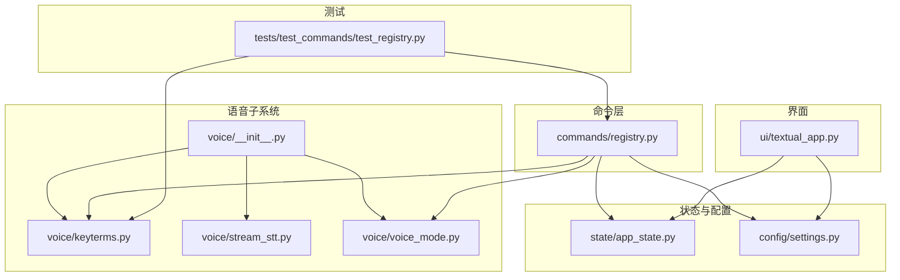
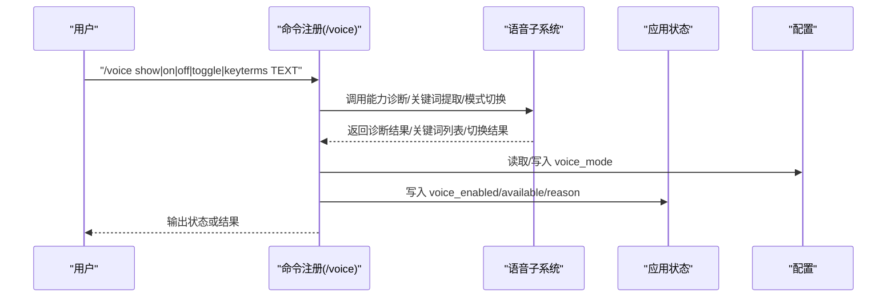
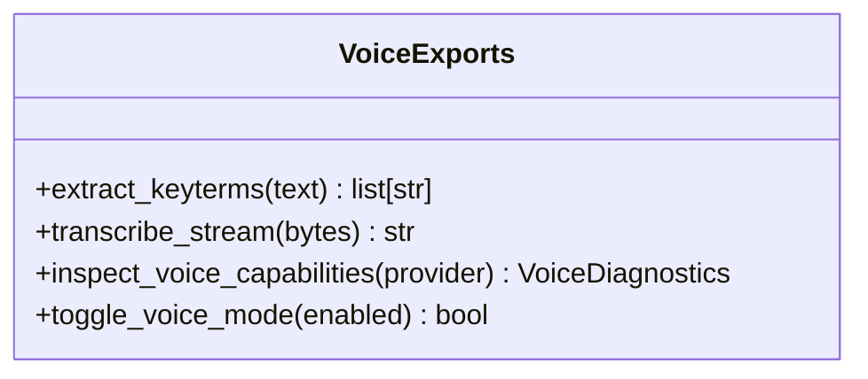
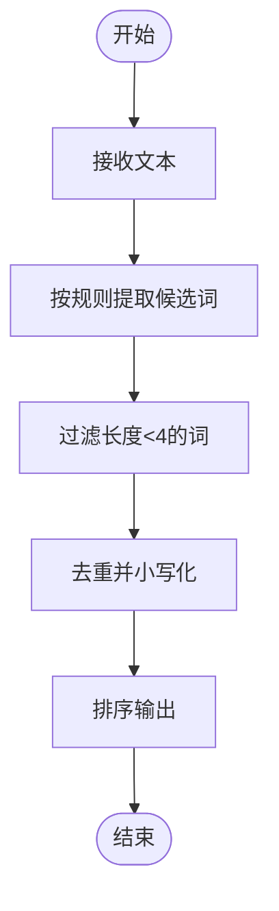
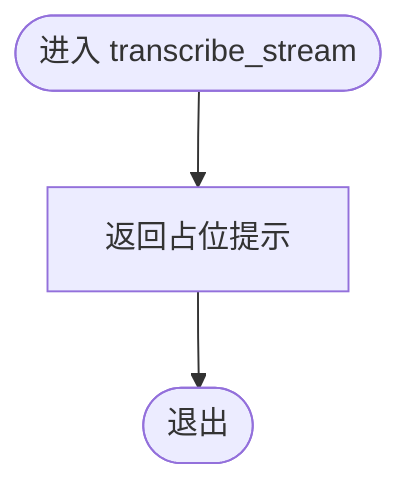
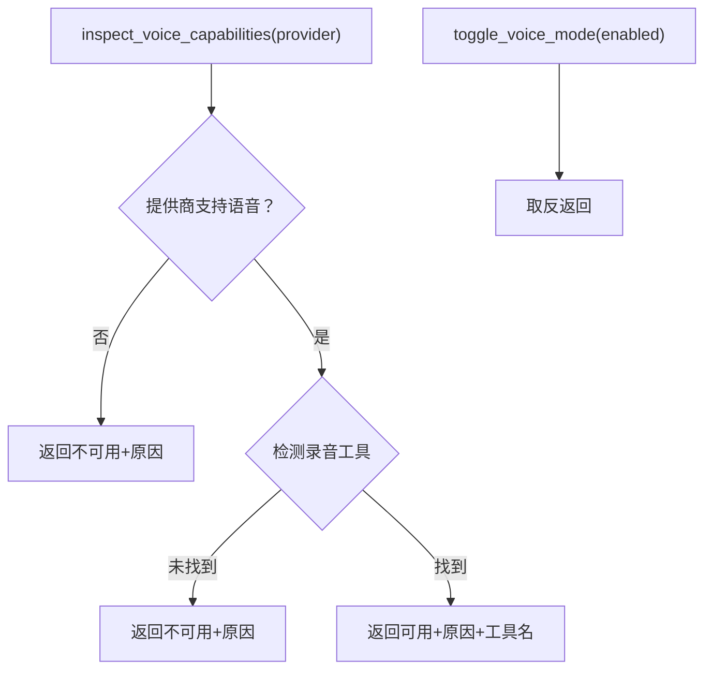
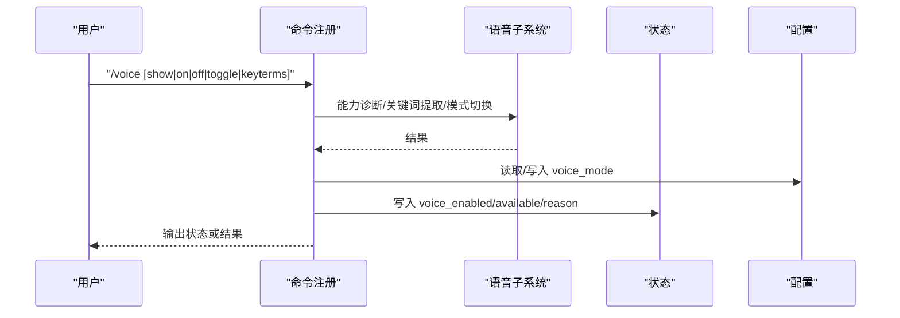
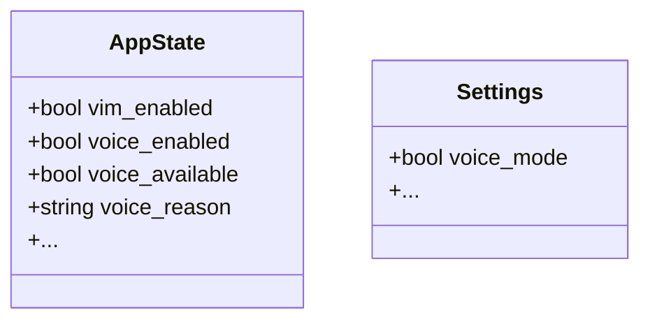
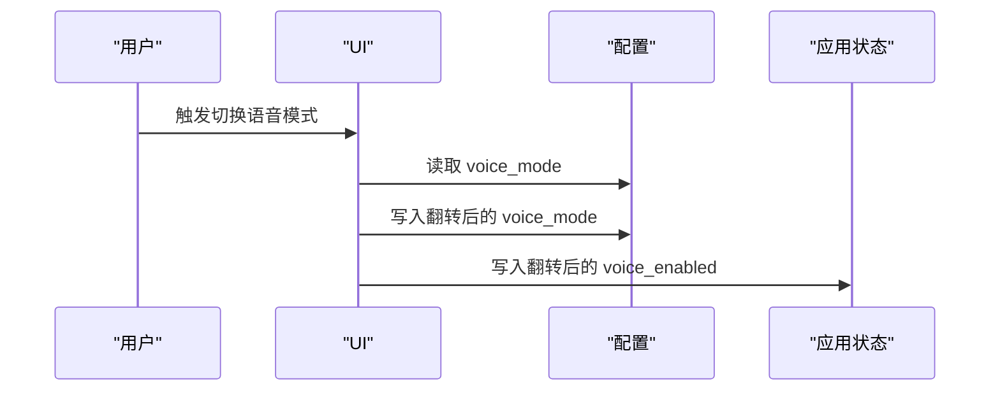
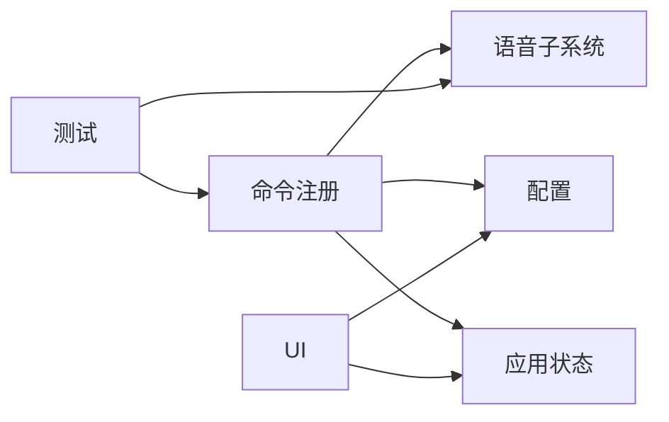

# 语音功能

<cite>
**本文引用的文件**
- [src/openharness/voice/__init__.py](file://src/openharness/voice/__init__.py)
- [src/openharness/voice/stream_stt.py](file://src/openharness/voice/stream_stt.py)
- [src/openharness/voice/keyterms.py](file://src/openharness/voice/keyterms.py)
- [src/openharness/voice/voice_mode.py](file://src/openharness/voice/voice_mode.py)
- [src/openharness/commands/registry.py](file://src/openharness/commands/registry.py)
- [src/openharness/state/app_state.py](file://src/openharness/state/app_state.py)
- [src/openharness/config/settings.py](file://src/openharness/config/settings.py)
- [src/openharness/ui/textual_app.py](file://src/openharness/ui/textual_app.py)
- [tests/test_commands/test_registry.py](file://tests/test_commands/test_registry.py)
</cite>

## 目录
1. [简介](#简介)
2. [项目结构](#项目结构)
3. [核心组件](#核心组件)
4. [架构总览](#架构总览)
5. [详细组件分析](#详细组件分析)
6. [依赖分析](#依赖分析)
7. [性能考虑](#性能考虑)
8. [故障排除指南](#故障排除指南)
9. [结论](#结论)
10. [附录：使用示例与最佳实践](#附录使用示例与最佳实践)

## 简介
本文件系统性地梳理 OpenHarness 的语音功能，覆盖整体架构、工作流程、状态管理、关键词提取、命令接口、配置项以及与文本输入的协同机制，并提供可操作的使用示例与故障排除建议。当前仓库中语音功能处于占位实现阶段：STT 流式识别接口返回“未配置”的占位提示；但语音模式开关、能力诊断、关键词提取等基础能力已具备，便于后续扩展接入真实语音识别服务。

## 项目结构
语音功能主要由以下模块组成：
- 语音导出与入口：统一导出关键词提取、流式 STT、语音模式诊断与切换等能力
- 关键词提取：从文本中抽取候选关键词
- 流式 STT：占位接口，未来用于接收音频流并返回识别结果
- 语音模式：能力诊断、模式切换、状态注入到应用状态
- 命令注册：提供 /voice 命令，支持显示状态、开关模式、提取关键词
- 应用状态：保存 voice_enabled、voice_available、voice_reason 等字段
- 配置：持久化 voice_mode 开关
- UI：提供快捷键切换语音模式
- 测试：验证 /voice 关键词提取与模式切换行为

图表来源
- [src/openharness/voice/__init__.py:1-8](file://src/openharness/voice/__init__.py#L1-L8)
- [src/openharness/voice/keyterms.py:1-11](file://src/openharness/voice/keyterms.py#L1-L11)
- [src/openharness/voice/stream_stt.py:1-9](file://src/openharness/voice/stream_stt.py#L1-L9)
- [src/openharness/voice/voice_mode.py:1-45](file://src/openharness/voice/voice_mode.py#L1-L45)
- [src/openharness/commands/registry.py:1051-1086](file://src/openharness/commands/registry.py#L1051-L1086)
- [src/openharness/state/app_state.py:1-31](file://src/openharness/state/app_state.py#L1-L31)
- [src/openharness/config/settings.py:69-75](file://src/openharness/config/settings.py#L69-L75)
- [src/openharness/ui/textual_app.py:355-363](file://src/openharness/ui/textual_app.py#L355-L363)
- [tests/test_commands/test_registry.py:192-194](file://tests/test_commands/test_registry.py#L192-L194)

章节来源
- [src/openharness/voice/__init__.py:1-8](file://src/openharness/voice/__init__.py#L1-L8)
- [src/openharness/voice/keyterms.py:1-11](file://src/openharness/voice/keyterms.py#L1-L11)
- [src/openharness/voice/stream_stt.py:1-9](file://src/openharness/voice/stream_stt.py#L1-L9)
- [src/openharness/voice/voice_mode.py:1-45](file://src/openharness/voice/voice_mode.py#L1-L45)
- [src/openharness/commands/registry.py:1051-1086](file://src/openharness/commands/registry.py#L1051-L1086)
- [src/openharness/state/app_state.py:1-31](file://src/openharness/state/app_state.py#L1-L31)
- [src/openharness/config/settings.py:69-75](file://src/openharness/config/settings.py#L69-L75)
- [src/openharness/ui/textual_app.py:355-363](file://src/openharness/ui/textual_app.py#L355-L363)
- [tests/test_commands/test_registry.py:192-194](file://tests/test_commands/test_registry.py#L192-L194)

## 核心组件
- 语音导出入口：集中导出关键词提取、流式 STT、语音模式诊断与切换
- 关键词提取：从任意文本中抽取长度≥4的字母数字下划线片段并去重排序
- 流式 STT：占位接口，返回“未配置”提示；未来用于接入真实识别器
- 语音模式：能力诊断（基于外部录音工具存在性与提供商能力）、模式切换、状态写入
- 命令接口：/voice show/on/off/toggle/keyterms TEXT
- 应用状态：记录 voice_enabled、voice_available、voice_reason
- 配置：持久化 voice_mode 开关
- UI：快捷键切换语音模式
- 测试：验证关键词提取与模式切换

章节来源
- [src/openharness/voice/__init__.py:1-8](file://src/openharness/voice/__init__.py#L1-L8)
- [src/openharness/voice/keyterms.py:8-10](file://src/openharness/voice/keyterms.py#L8-L10)
- [src/openharness/voice/stream_stt.py:6-8](file://src/openharness/voice/stream_stt.py#L6-L8)
- [src/openharness/voice/voice_mode.py:20-43](file://src/openharness/voice/voice_mode.py#L20-L43)
- [src/openharness/commands/registry.py:1051-1086](file://src/openharness/commands/registry.py#L1051-L1086)
- [src/openharness/state/app_state.py:19-22](file://src/openharness/state/app_state.py#L19-L22)
- [src/openharness/config/settings.py:69-75](file://src/openharness/config/settings.py#L69-L75)
- [src/openharness/ui/textual_app.py:355-363](file://src/openharness/ui/textual_app.py#L355-L363)
- [tests/test_commands/test_registry.py:192-194](file://tests/test_commands/test_registry.py#L192-L194)

## 架构总览
语音功能在命令层、状态层、配置层与 UI 层之间形成清晰分层，命令层负责解析用户指令并调用语音子系统；状态层与配置层负责持久化与跨会话共享；UI 层提供快捷键入口；测试层覆盖关键行为。

图表来源
- [src/openharness/commands/registry.py:1051-1086](file://src/openharness/commands/registry.py#L1051-L1086)
- [src/openharness/voice/voice_mode.py:25-43](file://src/openharness/voice/voice_mode.py#L25-L43)
- [src/openharness/voice/keyterms.py:8-10](file://src/openharness/voice/keyterms.py#L8-L10)
- [src/openharness/state/app_state.py:19-22](file://src/openharness/state/app_state.py#L19-L22)
- [src/openharness/config/settings.py:69-75](file://src/openharness/config/settings.py#L69-L75)

## 详细组件分析

### 组件：语音导出与入口
- 职责：统一导出关键词提取、流式 STT、语音模式诊断与切换
- 作用：为命令层与 UI 层提供一致的调用接口

图表来源
- [src/openharness/voice/__init__.py:3-7](file://src/openharness/voice/__init__.py#L3-L7)

章节来源
- [src/openharness/voice/__init__.py:1-8](file://src/openharness/voice/__init__.py#L1-L8)

### 组件：关键词提取（Key Terms）
- 输入：任意文本
- 处理：正则匹配长度≥4的字母数字下划线片段，去重并排序
- 输出：关键词列表
- 典型用途：辅助识别关键术语、触发条件、响应机制

图表来源
- [src/openharness/voice/keyterms.py:8-10](file://src/openharness/voice/keyterms.py#L8-L10)

章节来源
- [src/openharness/voice/keyterms.py:1-11](file://src/openharness/voice/keyterms.py#L1-L11)

### 组件：流式 STT（占位）
- 当前实现：直接返回“未配置”提示
- 后续扩展：接收音频字节流，返回识别文本；需对接本地/云端识别器
- 错误处理：占位返回值可作为异常路径的统一出口

图表来源
- [src/openharness/voice/stream_stt.py:6-8](file://src/openharness/voice/stream_stt.py#L6-L8)

章节来源
- [src/openharness/voice/stream_stt.py:1-9](file://src/openharness/voice/stream_stt.py#L1-L9)

### 组件：语音模式诊断与切换
- 能力诊断：检查外部录音工具是否存在（优先 sox/ffmpeg/arecord），并结合提供商能力判断是否可用
- 切换逻辑：简单取反，写入应用状态与配置
- 状态注入：将可用性与原因写入应用状态，供 UI 与命令层展示

图表来源
- [src/openharness/voice/voice_mode.py:25-43](file://src/openharness/voice/voice_mode.py#L25-L43)
- [src/openharness/voice/voice_mode.py:20-22](file://src/openharness/voice/voice_mode.py#L20-L22)

章节来源
- [src/openharness/voice/voice_mode.py:1-45](file://src/openharness/voice/voice_mode.py#L1-L45)

### 组件：命令接口（/voice）
- 支持子命令：
  - show：显示当前语音模式、可用性、录音工具、原因
  - on/off/toggle：切换语音模式并持久化
  - keyterms TEXT：提取关键词
- 行为要点：根据应用状态或配置决定当前模式；更新应用状态中的 voice_enabled/available/reason；持久化 voice_mode

图表来源
- [src/openharness/commands/registry.py:1051-1086](file://src/openharness/commands/registry.py#L1051-L1086)
- [src/openharness/voice/voice_mode.py:25-43](file://src/openharness/voice/voice_mode.py#L25-L43)
- [src/openharness/voice/keyterms.py:8-10](file://src/openharness/voice/keyterms.py#L8-L10)
- [src/openharness/state/app_state.py:19-22](file://src/openharness/state/app_state.py#L19-L22)
- [src/openharness/config/settings.py:69-75](file://src/openharness/config/settings.py#L69-L75)

章节来源
- [src/openharness/commands/registry.py:1051-1086](file://src/openharness/commands/registry.py#L1051-L1086)
- [tests/test_commands/test_registry.py:192-194](file://tests/test_commands/test_registry.py#L192-L194)

### 组件：应用状态与配置
- 应用状态：包含 voice_enabled、voice_available、voice_reason 等字段，供 UI 与命令层读取
- 配置：voice_mode 字段持久化到配置文件，重启后仍生效

图表来源
- [src/openharness/state/app_state.py:19-22](file://src/openharness/state/app_state.py#L19-L22)
- [src/openharness/config/settings.py:69-75](file://src/openharness/config/settings.py#L69-L75)

章节来源
- [src/openharness/state/app_state.py:1-31](file://src/openharness/state/app_state.py#L1-L31)
- [src/openharness/config/settings.py:69-75](file://src/openharness/config/settings.py#L69-L75)

### 组件：UI 快捷键切换
- 文本界面通过快捷键触发切换语音模式，读取/写入配置与应用状态

图表来源
- [src/openharness/ui/textual_app.py:355-363](file://src/openharness/ui/textual_app.py#L355-L363)
- [src/openharness/config/settings.py:69-75](file://src/openharness/config/settings.py#L69-L75)
- [src/openharness/state/app_state.py:19-22](file://src/openharness/state/app_state.py#L19-L22)

章节来源
- [src/openharness/ui/textual_app.py:355-363](file://src/openharness/ui/textual_app.py#L355-L363)

## 依赖分析
- 模块内聚：语音子系统内部低耦合，职责清晰（关键词、STT、模式）
- 外部依赖：能力诊断依赖系统工具（sox/ffmpeg/arecord）与提供商信息
- 命令层依赖：命令注册依赖语音子系统与配置/状态
- UI 依赖：UI 依赖配置与状态进行渲染与交互
- 测试依赖：测试覆盖命令行为与关键词提取

图表来源
- [src/openharness/commands/registry.py:1051-1086](file://src/openharness/commands/registry.py#L1051-L1086)
- [src/openharness/voice/__init__.py:3-7](file://src/openharness/voice/__init__.py#L3-L7)
- [src/openharness/config/settings.py:69-75](file://src/openharness/config/settings.py#L69-L75)
- [src/openharness/state/app_state.py:19-22](file://src/openharness/state/app_state.py#L19-L22)
- [src/openharness/ui/textual_app.py:355-363](file://src/openharness/ui/textual_app.py#L355-L363)
- [tests/test_commands/test_registry.py:192-194](file://tests/test_commands/test_registry.py#L192-L194)

章节来源
- [src/openharness/commands/registry.py:1051-1086](file://src/openharness/commands/registry.py#L1051-L1086)
- [src/openharness/voice/__init__.py:1-8](file://src/openharness/voice/__init__.py#L1-L8)
- [src/openharness/config/settings.py:69-75](file://src/openharness/config/settings.py#L69-L75)
- [src/openharness/state/app_state.py:1-31](file://src/openharness/state/app_state.py#L1-L31)
- [src/openharness/ui/textual_app.py:355-363](file://src/openharness/ui/textual_app.py#L355-L363)
- [tests/test_commands/test_registry.py:192-194](file://tests/test_commands/test_registry.py#L192-L194)

## 性能考虑
- 占位 STT：当前实现不涉及实际音频处理，性能开销极低；后续接入时应关注音频采样率、分片大小、网络延迟与并发识别数
- 关键词提取：正则与集合操作时间复杂度近似 O(n)，对长文本线性增长；建议在 UI 层做节流或异步处理
- 能力诊断：系统工具查询为常量时间；避免重复调用可在命令层缓存
- 状态与配置：频繁读写磁盘可能成为瓶颈，建议批量写入与合并变更

## 故障排除指南
- 无法启用语音模式
  - 使用 /voice show 查看可用性与原因
  - 若提示缺少录音工具，请安装 sox/ffmpeg/arecord 中之一
  - 若提供商不支持语音，请确认模型与服务端能力
- 切换无效
  - 检查 /voice on/off/toggle 是否正确传参
  - 确认配置文件已写入 voice_mode
  - 确认应用状态已更新 voice_enabled/available/reason
- 关键词提取为空
  - 确认输入文本包含足够长度的字母数字下划线片段
  - 参考测试用例验证行为

章节来源
- [src/openharness/commands/registry.py:1051-1086](file://src/openharness/commands/registry.py#L1051-L1086)
- [src/openharness/voice/voice_mode.py:25-43](file://src/openharness/voice/voice_mode.py#L25-L43)
- [tests/test_commands/test_registry.py:192-194](file://tests/test_commands/test_registry.py#L192-L194)

## 结论
当前语音功能以占位实现为主，提供了稳定的命令接口、状态与配置持久化、UI 快捷键入口以及关键词提取与能力诊断的基础能力。后续只需替换流式 STT 接口为真实识别器，并完善音频采集与实时识别链路，即可实现完整的语音输入体验。

## 附录：使用示例与最佳实践
- 基本用法
  - /voice show：查看语音模式、可用性、录音工具与原因
  - /voice on/off/toggle：切换语音模式并持久化
  - /voice keyterms TEXT：提取关键词
- 最佳实践
  - 在命令层统一处理参数校验与错误提示
  - 将能力诊断结果缓存于命令上下文，减少重复系统调用
  - UI 层根据应用状态及时刷新，保证一致性
  - 对长文本关键词提取采用异步处理，避免阻塞
  - 配置层仅保存必要字段，避免冗余写入

章节来源
- [src/openharness/commands/registry.py:1051-1086](file://src/openharness/commands/registry.py#L1051-L1086)
- [tests/test_commands/test_registry.py:192-194](file://tests/test_commands/test_registry.py#L192-L194)