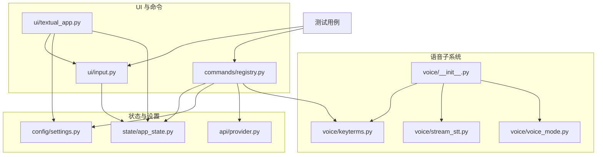
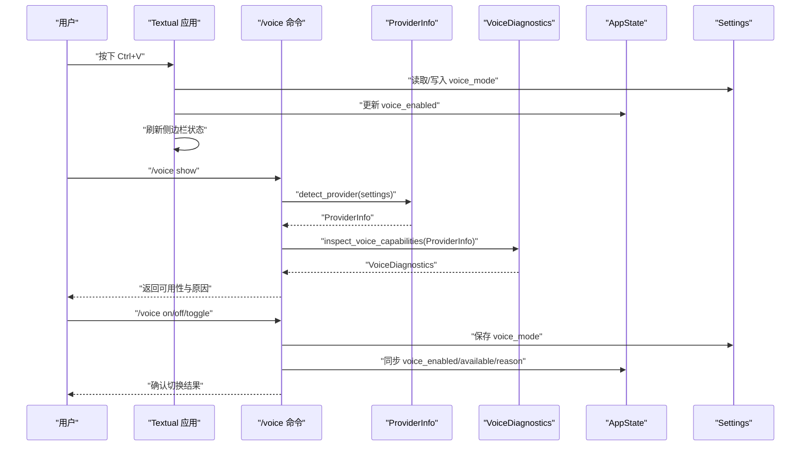
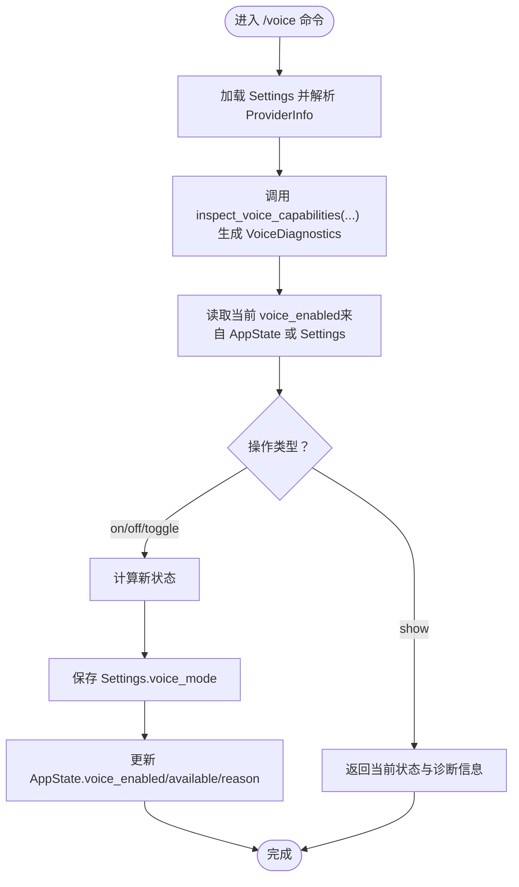
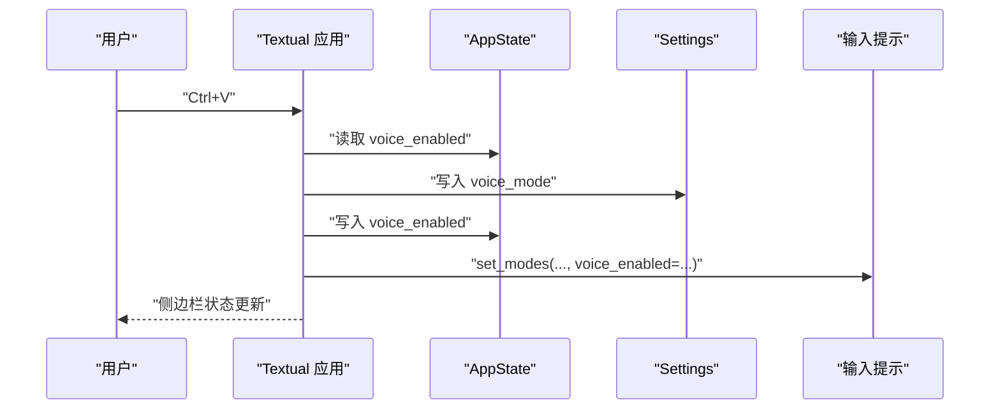
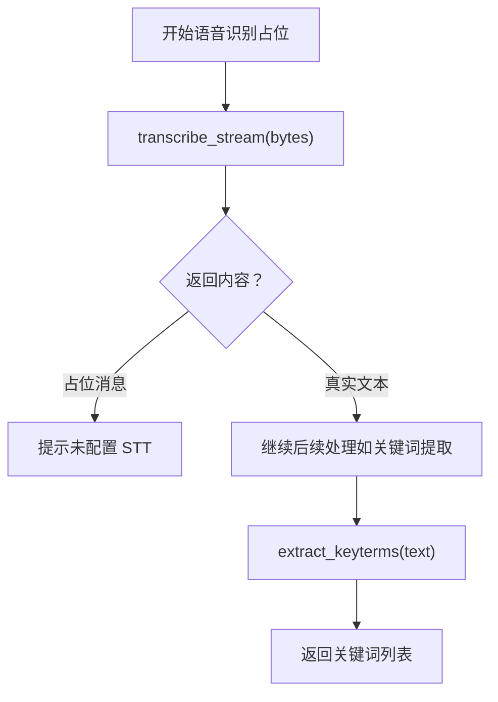
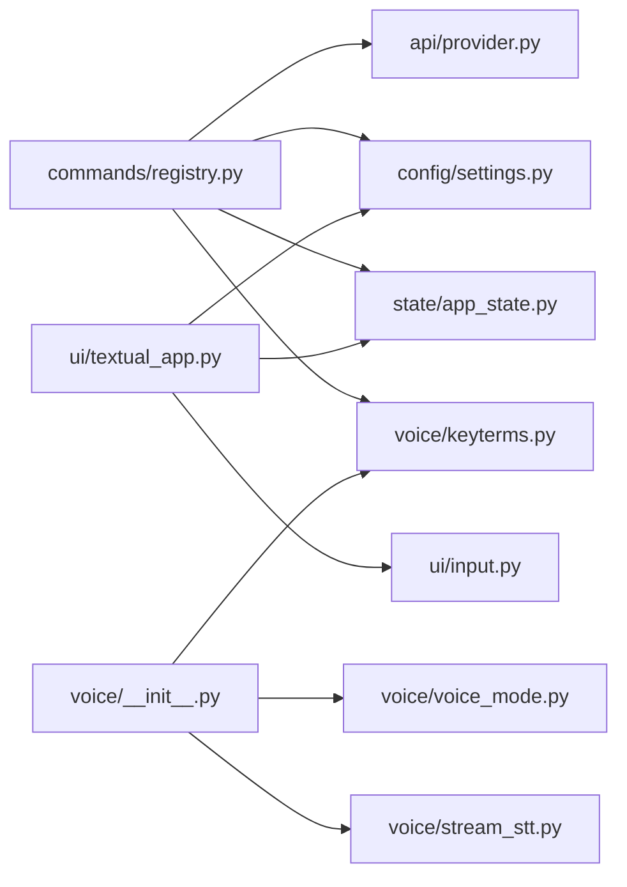

# 语音模式

<cite>
**本文引用的文件**
- [src/openharness/voice/__init__.py](file://src/openharness/voice/__init__.py)
- [src/openharness/voice/voice_mode.py](file://src/openharness/voice/voice_mode.py)
- [src/openharness/voice/stream_stt.py](file://src/openharness/voice/stream_stt.py)
- [src/openharness/voice/keyterms.py](file://src/openharness/voice/keyterms.py)
- [src/openharness/state/app_state.py](file://src/openharness/state/app_state.py)
- [src/openharness/ui/textual_app.py](file://src/openharness/ui/textual_app.py)
- [src/openharness/ui/input.py](file://src/openharness/ui/input.py)
- [src/openharness/commands/registry.py](file://src/openharness/commands/registry.py)
- [src/openharness/config/settings.py](file://src/openharness/config/settings.py)
- [src/openharness/api/provider.py](file://src/openharness/api/provider.py)
- [tests/test_ui/test_modes.py](file://tests/test_ui/test_modes.py)
- [tests/test_commands/test_registry.py](file://tests/test_commands/test_registry.py)
</cite>

## 目录
1. [简介](#简介)
2. [项目结构](#项目结构)
3. [核心组件](#核心组件)
4. [架构总览](#架构总览)
5. [详细组件分析](#详细组件分析)
6. [依赖分析](#依赖分析)
7. [性能考虑](#性能考虑)
8. [故障排查指南](#故障排查指南)
9. [结论](#结论)
10. [附录](#附录)

## 简介
本文件面向 OpenHarness 的“语音模式”能力，系统性阐述其设计理念、工作原理、状态管理机制、与文本输入模式的切换流程、配置项、交互流程、使用场景与最佳实践，并给出扩展与自定义建议。当前仓库中语音模式处于“壳层可用但未接入实时语音识别”的状态：命令与 UI 支持语音模式开关与诊断；底层语音识别接口为占位实现，需在构建或运行时按需替换为真实 STT 实现。

## 项目结构
语音模式相关代码主要分布在以下模块：
- 语音能力导出与工具：src/openharness/voice/*
- 应用状态模型：src/openharness/state/app_state.py
- 命令注册与 /voice 命令处理：src/openharness/commands/registry.py
- 文本界面 UI 与按键绑定：src/openharness/ui/textual_app.py
- 输入提示装饰（模式指示）：src/openharness/ui/input.py
- 设置与持久化：src/openharness/config/settings.py
- 提供商能力探测：src/openharness/api/provider.py
- 测试用例验证行为：tests/test_ui/test_modes.py、tests/test_commands/test_registry.py

图表来源
- [src/openharness/voice/__init__.py:1-7](file://src/openharness/voice/__init__.py#L1-L7)
- [src/openharness/voice/voice_mode.py:1-44](file://src/openharness/voice/voice_mode.py#L1-L44)
- [src/openharness/voice/stream_stt.py:1-8](file://src/openharness/voice/stream_stt.py#L1-L8)
- [src/openharness/voice/keyterms.py:1-11](file://src/openharness/voice/keyterms.py#L1-L11)
- [src/openharness/state/app_state.py:1-31](file://src/openharness/state/app_state.py#L1-L31)
- [src/openharness/config/settings.py:49-75](file://src/openharness/config/settings.py#L49-L75)
- [src/openharness/api/provider.py:10-57](file://src/openharness/api/provider.py#L10-L57)
- [src/openharness/ui/textual_app.py:194-200](file://src/openharness/ui/textual_app.py#L194-L200)
- [src/openharness/ui/input.py:15-24](file://src/openharness/ui/input.py#L15-L24)
- [src/openharness/commands/registry.py:1052-1086](file://src/openharness/commands/registry.py#L1052-L1086)

章节来源
- [src/openharness/voice/__init__.py:1-7](file://src/openharness/voice/__init__.py#L1-L7)
- [src/openharness/voice/voice_mode.py:1-44](file://src/openharness/voice/voice_mode.py#L1-L44)
- [src/openharness/voice/stream_stt.py:1-8](file://src/openharness/voice/stream_stt.py#L1-L8)
- [src/openharness/voice/keyterms.py:1-11](file://src/openharness/voice/keyterms.py#L1-L11)
- [src/openharness/state/app_state.py:1-31](file://src/openharness/state/app_state.py#L1-L31)
- [src/openharness/config/settings.py:49-75](file://src/openharness/config/settings.py#L49-L75)
- [src/openharness/api/provider.py:10-57](file://src/openharness/api/provider.py#L10-L57)
- [src/openharness/ui/textual_app.py:194-200](file://src/openharness/ui/textual_app.py#L194-L200)
- [src/openharness/ui/input.py:15-24](file://src/openharness/ui/input.py#L15-L24)
- [src/openharness/commands/registry.py:1052-1086](file://src/openharness/commands/registry.py#L1052-L1086)

## 核心组件
- 语音诊断与能力探测：用于判断当前环境是否满足语音模式的前置条件（如录音器可用、提供商支持等），并返回诊断结果。
- 语音模式开关：提供简单的布尔切换函数，配合 UI 与命令系统进行状态更新。
- 关键词提取：从文本中抽取关键词，辅助语音转写后的意图识别或摘要。
- 占位流式 STT 接口：当前返回占位消息，需在构建或运行时替换为真实实现。
- 应用状态模型：集中存储 voice_enabled、voice_available、voice_reason 等语音相关状态字段。
- 命令与 UI 集成：/voice 命令展示状态与能力，Ctrl+V 切换语音模式；输入提示会根据模式动态显示。

章节来源
- [src/openharness/voice/voice_mode.py:11-44](file://src/openharness/voice/voice_mode.py#L11-L44)
- [src/openharness/voice/voice_mode.py:20-22](file://src/openharness/voice/voice_mode.py#L20-L22)
- [src/openharness/voice/keyterms.py:8-10](file://src/openharness/voice/keyterms.py#L8-L10)
- [src/openharness/voice/stream_stt.py:6-8](file://src/openharness/voice/stream_stt.py#L6-L8)
- [src/openharness/state/app_state.py:19-22](file://src/openharness/state/app_state.py#L19-L22)
- [src/openharness/commands/registry.py:1052-1086](file://src/openharness/commands/registry.py#L1052-L1086)
- [src/openharness/ui/textual_app.py:355-363](file://src/openharness/ui/textual_app.py#L355-L363)
- [src/openharness/ui/input.py:15-24](file://src/openharness/ui/input.py#L15-L24)

## 架构总览
语音模式在系统中的位置如下：
- 命令层：/voice 命令负责展示状态、切换模式、提取关键词。
- UI 层：Textual 应用提供 Ctrl+V 快捷键与侧边栏状态展示；输入会根据模式添加前缀装饰。
- 状态层：AppState 统一持有 voice_enabled、voice_available、voice_reason 等字段。
- 能力探测：ProviderInfo 决定是否支持语音；VoiceDiagnostics 汇总环境检查结果。
- 语音引擎：stream_stt 当前为占位实现，未来可替换为具体 STT 实现。

图表来源
- [src/openharness/ui/textual_app.py:355-363](file://src/openharness/ui/textual_app.py#L355-L363)
- [src/openharness/commands/registry.py:1052-1086](file://src/openharness/commands/registry.py#L1052-L1086)
- [src/openharness/api/provider.py:20-57](file://src/openharness/api/provider.py#L20-L57)
- [src/openharness/voice/voice_mode.py:25-43](file://src/openharness/voice/voice_mode.py#L25-L43)
- [src/openharness/state/app_state.py:19-22](file://src/openharness/state/app_state.py#L19-L22)
- [src/openharness/config/settings.py:69-70](file://src/openharness/config/settings.py#L69-L70)

## 详细组件分析

### 语音模式状态管理
- 状态字段
  - voice_enabled：当前是否启用语音模式
  - voice_available：环境是否满足语音能力
  - voice_reason：能力可用性的简要说明
- 更新路径
  - UI 快捷键 Ctrl+V：切换 voice_enabled 并持久化到 Settings
  - /voice 命令：根据 ProviderInfo 与本地录音器检测生成 VoiceDiagnostics，更新 AppState 并持久化 Settings
- 状态保存与恢复
  - Settings 中的 voice_mode 字段用于持久化；应用启动后可通过 Settings 加载并回填到 AppState

图表来源
- [src/openharness/commands/registry.py:1052-1086](file://src/openharness/commands/registry.py#L1052-L1086)
- [src/openharness/api/provider.py:20-57](file://src/openharness/api/provider.py#L20-L57)
- [src/openharness/voice/voice_mode.py:25-43](file://src/openharness/voice/voice_mode.py#L25-L43)
- [src/openharness/state/app_state.py:19-22](file://src/openharness/state/app_state.py#L19-L22)
- [src/openharness/config/settings.py:69-70](file://src/openharness/config/settings.py#L69-L70)

章节来源
- [src/openharness/state/app_state.py:19-22](file://src/openharness/state/app_state.py#L19-L22)
- [src/openharness/config/settings.py:69-70](file://src/openharness/config/settings.py#L69-L70)
- [src/openharness/commands/registry.py:1052-1086](file://src/openharness/commands/registry.py#L1052-L1086)
- [src/openharness/ui/textual_app.py:355-363](file://src/openharness/ui/textual_app.py#L355-L363)

### 语音模式与文本输入模式的切换
- 切换入口
  - UI：Ctrl+V 触发 action_toggle_voice，同时更新输入提示装饰与侧边栏状态
  - 命令：/voice toggle 切换 voice_mode 并同步到 AppState
- 用户体验设计
  - 输入提示前缀：当任一模式开启时，会在提示符中追加相应标记，直观反映当前模式
  - 侧边栏状态：展示 voice_enabled 状态，便于快速确认
- 与文本输入模式的关系
  - 两者互不影响，可叠加显示（例如同时启用 vim 与 voice）

图表来源
- [src/openharness/ui/textual_app.py:355-363](file://src/openharness/ui/textual_app.py#L355-L363)
- [src/openharness/ui/input.py:15-24](file://src/openharness/ui/input.py#L15-L24)
- [src/openharness/state/app_state.py:19-22](file://src/openharness/state/app_state.py#L19-L22)
- [src/openharness/config/settings.py:69-70](file://src/openharness/config/settings.py#L69-L70)

章节来源
- [src/openharness/ui/textual_app.py:194-200](file://src/openharness/ui/textual_app.py#L194-L200)
- [src/openharness/ui/textual_app.py:355-363](file://src/openharness/ui/textual_app.py#L355-L363)
- [src/openharness/ui/input.py:15-24](file://src/openharness/ui/input.py#L15-L24)
- [tests/test_ui/test_modes.py:9-18](file://tests/test_ui/test_modes.py#L9-L18)

### 语音模式配置选项
- 启动与持久化
  - Settings.voice_mode：控制默认是否启用语音模式
  - 通过 /voice on/off/toggle 或 Ctrl+V 进行切换并持久化
- 能力探测与限制
  - ProviderInfo.voice_supported：由提供商决定是否支持语音
  - 本地录音器探测：优先级 sox > ffmpeg > arecord
- 诊断输出
  - /voice show 返回 voice_enabled、voice_available、录音器名称、原因等

章节来源
- [src/openharness/config/settings.py:69-70](file://src/openharness/config/settings.py#L69-L70)
- [src/openharness/api/provider.py:20-57](file://src/openharness/api/provider.py#L20-L57)
- [src/openharness/voice/voice_mode.py:25-43](file://src/openharness/voice/voice_mode.py#L25-L43)
- [src/openharness/commands/registry.py:1063-1071](file://src/openharness/commands/registry.py#L1063-L1071)

### 语音模式下的用户交互流程
- 语音识别占位流程
  - 当前 transcribe_stream 返回占位消息，表示未配置真实 STT
- 关键词提取
  - /voice keyterms TEXT 可对任意文本抽取关键词
- 确认与取消
  - UI 层未内置语音确认/取消对话框；若需要，可在上层业务中结合现有权限/问答弹窗机制实现

图表来源
- [src/openharness/voice/stream_stt.py:6-8](file://src/openharness/voice/stream_stt.py#L6-L8)
- [src/openharness/voice/keyterms.py:8-10](file://src/openharness/voice/keyterms.py#L8-L10)
- [src/openharness/commands/registry.py:1072-1074](file://src/openharness/commands/registry.py#L1072-L1074)

章节来源
- [src/openharness/voice/stream_stt.py:6-8](file://src/openharness/voice/stream_stt.py#L6-L8)
- [src/openharness/voice/keyterms.py:8-10](file://src/openharness/voice/keyterms.py#L8-L10)
- [src/openharness/commands/registry.py:1072-1074](file://src/openharness/commands/registry.py#L1072-L1074)

### 实际使用场景与最佳实践
- 场景
  - 在不便打字或需要双手空闲时，通过 /voice show 快速检查可用性，再用 /voice toggle 开启语音模式
  - 使用 /voice keyterms 对长文本进行关键词抽取，辅助检索与摘要
- 最佳实践
  - 先用 /voice show 确认 voice_available 与录音器名称，避免在不支持的环境中浪费资源
  - 将 voice_mode 写入配置文件以保持会话间一致性
  - 结合侧边栏状态与输入提示，确保团队协作时能清晰感知模式变化

章节来源
- [src/openharness/commands/registry.py:1063-1071](file://src/openharness/commands/registry.py#L1063-L1071)
- [src/openharness/ui/textual_app.py:390-391](file://src/openharness/ui/textual_app.py#L390-L391)
- [src/openharness/ui/input.py:15-24](file://src/openharness/ui/input.py#L15-L24)

### 扩展与自定义指导
- 替换 STT 实现
  - 将 transcribe_stream 的占位实现替换为真实异步流式识别函数，接收音频数据并返回文本
  - 注意与现有 UI/命令链路解耦，保持相同签名以便无缝替换
- 自定义关键词提取
  - 可在 keyterms 基础上扩展正则或引入 NLP 工具，提升关键词质量
- 增强交互
  - 可在 UI 中增加“开始/停止录音”按钮与确认/取消对话框，结合现有 PermissionScreen/QuestionScreen 机制
- 能力探测增强
  - 可扩展 ProviderInfo 以支持更多提供商的语音能力，并在 VoiceDiagnostics 中细化可用性原因

章节来源
- [src/openharness/voice/stream_stt.py:6-8](file://src/openharness/voice/stream_stt.py#L6-L8)
- [src/openharness/voice/keyterms.py:8-10](file://src/openharness/voice/keyterms.py#L8-L10)
- [src/openharness/api/provider.py:20-57](file://src/openharness/api/provider.py#L20-L57)
- [src/openharness/ui/textual_app.py:42-131](file://src/openharness/ui/textual_app.py#L42-L131)

## 依赖分析
- 模块内聚与耦合
  - voice 子模块内部高内聚：导出、诊断、关键词、占位 STT 彼此独立
  - 与状态/设置/命令/UI 的耦合通过明确的数据通道（AppState、Settings、命令处理器）实现
- 外部依赖
  - 本地录音器探测依赖系统命令（sox/ffmpeg/arecord）
  - 提供商能力由 ProviderInfo 推断，影响 voice_supported 与 voice_reason
- 循环依赖
  - 未发现循环依赖迹象

图表来源
- [src/openharness/commands/registry.py:1052-1086](file://src/openharness/commands/registry.py#L1052-L1086)
- [src/openharness/api/provider.py:20-57](file://src/openharness/api/provider.py#L20-L57)
- [src/openharness/config/settings.py:69-70](file://src/openharness/config/settings.py#L69-L70)
- [src/openharness/state/app_state.py:19-22](file://src/openharness/state/app_state.py#L19-L22)
- [src/openharness/ui/textual_app.py:355-363](file://src/openharness/ui/textual_app.py#L355-L363)
- [src/openharness/ui/input.py:15-24](file://src/openharness/ui/input.py#L15-L24)
- [src/openharness/voice/__init__.py:1-7](file://src/openharness/voice/__init__.py#L1-L7)

章节来源
- [src/openharness/commands/registry.py:1052-1086](file://src/openharness/commands/registry.py#L1052-L1086)
- [src/openharness/api/provider.py:20-57](file://src/openharness/api/provider.py#L20-L57)
- [src/openharness/config/settings.py:69-70](file://src/openharness/config/settings.py#L69-L70)
- [src/openharness/state/app_state.py:19-22](file://src/openharness/state/app_state.py#L19-L22)
- [src/openharness/ui/textual_app.py:355-363](file://src/openharness/ui/textual_app.py#L355-L363)
- [src/openharness/ui/input.py:15-24](file://src/openharness/ui/input.py#L15-L24)
- [src/openharness/voice/__init__.py:1-7](file://src/openharness/voice/__init__.py#L1-L7)

## 性能考虑
- 语音识别延迟
  - 占位实现会阻断真实识别流程；建议尽快接入低延迟 STT 实现
- 本地录音器选择
  - 不同录音器在不同平台上的性能差异较大，建议在诊断阶段记录并提示
- UI 响应
  - 在识别过程中保持 UI 可响应，避免阻塞用户交互

## 故障排查指南
- 无法启用语音模式
  - 使用 /voice show 查看 voice_available 与 voice_reason，确认录音器是否存在
  - 若 ProviderInfo.voice_supported 为否，需更换支持语音的提供商
- 输入提示未显示语音模式
  - 确认 UI 的 set_modes 是否被调用且传入 voice_enabled
- /voice keyterms 无输出
  - 检查输入文本长度与关键词筛选规则（至少 4 个字符的字母数字下划线）
- 测试验证
  - 测试用例覆盖了 /voice show 与 /voice keyterms 的基本行为，可作为回归参考

章节来源
- [src/openharness/commands/registry.py:1063-1071](file://src/openharness/commands/registry.py#L1063-L1071)
- [src/openharness/voice/keyterms.py:8-10](file://src/openharness/voice/keyterms.py#L8-L10)
- [tests/test_commands/test_registry.py:455-459](file://tests/test_commands/test_registry.py#L455-L459)
- [tests/test_ui/test_modes.py:9-18](file://tests/test_ui/test_modes.py#L9-L18)

## 结论
OpenHarness 的语音模式已具备完善的开关、诊断与关键词提取能力，并通过命令与 UI 提供良好的用户体验。当前受限于占位 STT 实现，建议在构建或运行时接入真实流式语音识别服务，以完整发挥语音模式的价值。状态管理清晰、扩展点明确，便于进一步增强交互与能力。

## 附录
- 快速参考
  - /voice show：查看语音模式状态与可用性
  - /voice on/off/toggle：切换语音模式
  - /voice keyterms TEXT：抽取关键词
  - Ctrl+V：在 UI 中切换语音模式
- 相关文件路径
  - 语音能力导出：src/openharness/voice/__init__.py
  - 诊断与开关：src/openharness/voice/voice_mode.py
  - 占位 STT：src/openharness/voice/stream_stt.py
  - 关键词提取：src/openharness/voice/keyterms.py
  - 应用状态：src/openharness/state/app_state.py
  - 命令注册：src/openharness/commands/registry.py
  - UI 与输入：src/openharness/ui/textual_app.py、src/openharness/ui/input.py
  - 设置与持久化：src/openharness/config/settings.py
  - 提供商能力：src/openharness/api/provider.py