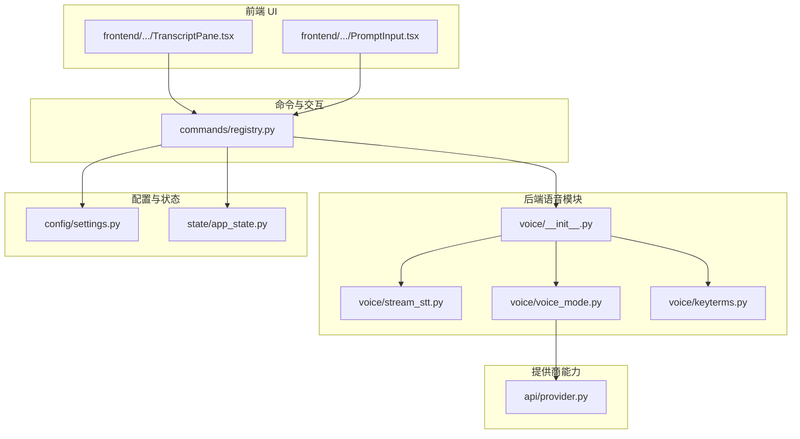
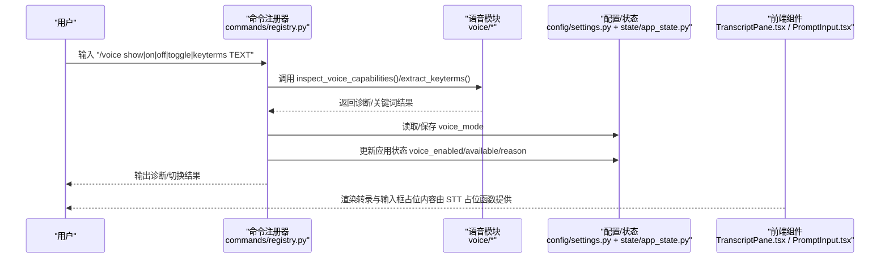
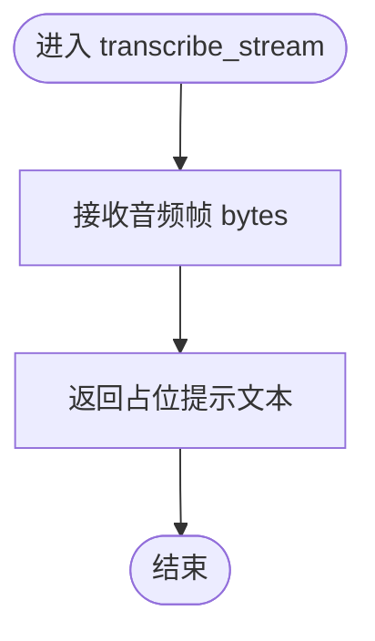
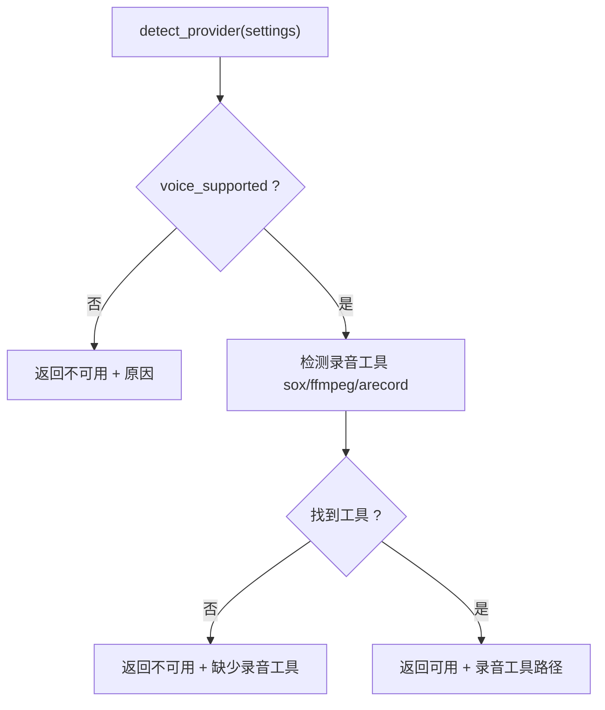
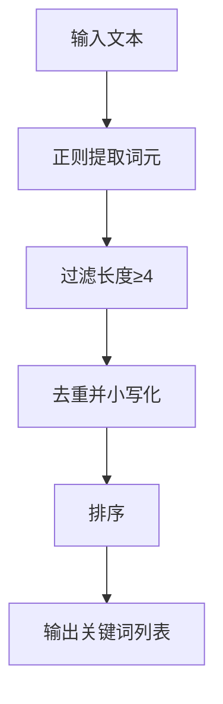
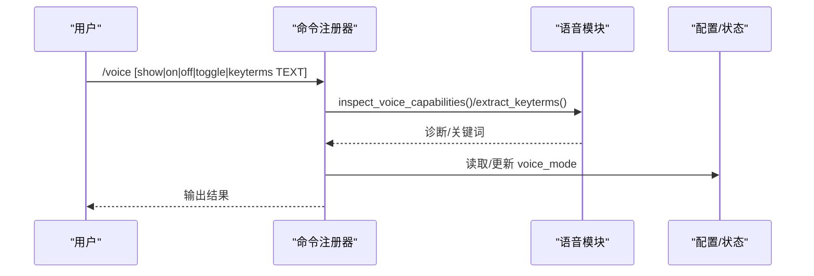
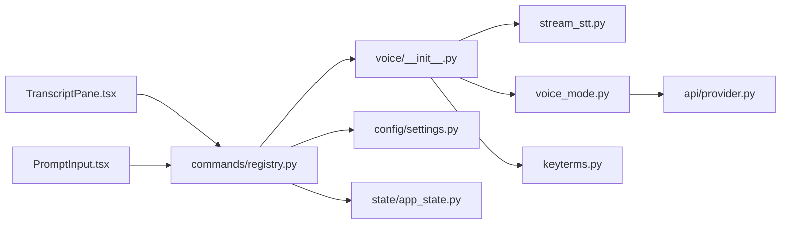

# 语音转文字

<cite>
**本文引用的文件**
- [src/openharness/voice/__init__.py](file://src/openharness/voice/__init__.py)
- [src/openharness/voice/stream_stt.py](file://src/openharness/voice/stream_stt.py)
- [src/openharness/voice/voice_mode.py](file://src/openharness/voice/voice_mode.py)
- [src/openharness/voice/keyterms.py](file://src/openharness/voice/keyterms.py)
- [src/openharness/api/provider.py](file://src/openharness/api/provider.py)
- [src/openharness/commands/registry.py](file://src/openharness/commands/registry.py)
- [src/openharness/config/settings.py](file://src/openharness/config/settings.py)
- [src/openharness/state/app_state.py](file://src/openharness/state/app_state.py)
- [frontend/terminal/src/components/TranscriptPane.tsx](file://frontend/terminal/src/components/TranscriptPane.tsx)
- [frontend/terminal/src/components/PromptInput.tsx](file://frontend/terminal/src/components/PromptInput.tsx)
- [tests/test_commands/test_registry.py](file://tests/test_commands/test_registry.py)
</cite>

## 目录
1. [简介](#简介)
2. [项目结构](#项目结构)
3. [核心组件](#核心组件)
4. [架构总览](#架构总览)
5. [详细组件分析](#详细组件分析)
6. [依赖分析](#依赖分析)
7. [性能考虑](#性能考虑)
8. [故障排查指南](#故障排查指南)
9. [结论](#结论)
10. [附录：使用示例与集成方法](#附录使用示例与集成方法)

## 简介
本文件面向 OpenHarness 的语音转文字（Speech-to-Text, STT）能力，系统性说明当前的占位实现、诊断与配置路径、以及可扩展方向。当前仓库中的 STT 为占位接口，实际的音频采集与流式转写尚未接入具体实现；但已提供语音模式开关、环境能力诊断、关键词提取等基础能力，并通过命令行与前端 UI 提供可见反馈。

## 项目结构
围绕语音功能的相关代码主要分布在以下位置：
- 后端 Python 模块：src/openharness/voice/*（导出、占位 STT、语音模式诊断、关键词提取）
- 配置与状态：src/openharness/config/settings.py、src/openharness/state/app_state.py
- 提供商能力检测：src/openharness/api/provider.py
- 命令注册与交互：src/openharness/commands/registry.py
- 前端终端 UI 组件：frontend/terminal/src/components/*

图表来源
- [src/openharness/voice/__init__.py:1-8](file://src/openharness/voice/__init__.py#L1-L8)
- [src/openharness/voice/stream_stt.py:1-9](file://src/openharness/voice/stream_stt.py#L1-L9)
- [src/openharness/voice/voice_mode.py:1-45](file://src/openharness/voice/voice_mode.py#L1-L45)
- [src/openharness/voice/keyterms.py:1-11](file://src/openharness/voice/keyterms.py#L1-L11)
- [src/openharness/api/provider.py:1-66](file://src/openharness/api/provider.py#L1-L66)
- [src/openharness/commands/registry.py:1052-1086](file://src/openharness/commands/registry.py#L1052-L1086)
- [src/openharness/config/settings.py:49-75](file://src/openharness/config/settings.py#L49-L75)
- [src/openharness/state/app_state.py:8-31](file://src/openharness/state/app_state.py#L8-L31)
- [frontend/terminal/src/components/TranscriptPane.tsx:1-58](file://frontend/terminal/src/components/TranscriptPane.tsx#L1-L58)
- [frontend/terminal/src/components/PromptInput.tsx:1-39](file://frontend/terminal/src/components/PromptInput.tsx#L1-L39)

章节来源
- [src/openharness/voice/__init__.py:1-8](file://src/openharness/voice/__init__.py#L1-L8)
- [src/openharness/voice/stream_stt.py:1-9](file://src/openharness/voice/stream_stt.py#L1-L9)
- [src/openharness/voice/voice_mode.py:1-45](file://src/openharness/voice/voice_mode.py#L1-L45)
- [src/openharness/voice/keyterms.py:1-11](file://src/openharness/voice/keyterms.py#L1-L11)
- [src/openharness/api/provider.py:1-66](file://src/openharness/api/provider.py#L1-L66)
- [src/openharness/commands/registry.py:1052-1086](file://src/openharness/commands/registry.py#L1052-L1086)
- [src/openharness/config/settings.py:49-75](file://src/openharness/config/settings.py#L49-L75)
- [src/openharness/state/app_state.py:8-31](file://src/openharness/state/app_state.py#L8-L31)
- [frontend/terminal/src/components/TranscriptPane.tsx:1-58](file://frontend/terminal/src/components/TranscriptPane.tsx#L1-L58)
- [frontend/terminal/src/components/PromptInput.tsx:1-39](file://frontend/terminal/src/components/PromptInput.tsx#L1-L39)

## 核心组件
- 占位 STT 接口：提供异步转写函数，当前返回“未配置”的占位消息。
- 语音模式诊断：基于提供商能力与本地录音工具可用性，给出是否可用及原因。
- 关键词提取：从文本中抽取候选关键词，便于后续检索或摘要。
- 命令行入口：/voice 命令支持显示状态、开关语音模式、提取关键词等。
- 配置与状态：持久化 voice_mode 开关，并在运行时同步到应用状态。
- 前端展示：转录面板与输入框用于呈现转写结果与用户交互。

章节来源
- [src/openharness/voice/stream_stt.py:6-8](file://src/openharness/voice/stream_stt.py#L6-L8)
- [src/openharness/voice/voice_mode.py:25-43](file://src/openharness/voice/voice_mode.py#L25-L43)
- [src/openharness/voice/keyterms.py:8-10](file://src/openharness/voice/keyterms.py#L8-L10)
- [src/openharness/commands/registry.py:1052-1086](file://src/openharness/commands/registry.py#L1052-L1086)
- [src/openharness/config/settings.py:70-70](file://src/openharness/config/settings.py#L70-L70)
- [src/openharness/state/app_state.py:20-22](file://src/openharness/state/app_state.py#L20-L22)
- [frontend/terminal/src/components/TranscriptPane.tsx:6-27](file://frontend/terminal/src/components/TranscriptPane.tsx#L6-L27)
- [frontend/terminal/src/components/PromptInput.tsx:9-38](file://frontend/terminal/src/components/PromptInput.tsx#L9-L38)

## 架构总览
下图展示了语音功能从命令触发到 UI 展示的关键流程，以及当前占位实现的位置。

图表来源
- [src/openharness/commands/registry.py:1052-1086](file://src/openharness/commands/registry.py#L1052-L1086)
- [src/openharness/voice/__init__.py:3-7](file://src/openharness/voice/__init__.py#L3-L7)
- [src/openharness/config/settings.py:70-70](file://src/openharness/config/settings.py#L70-L70)
- [src/openharness/state/app_state.py:20-22](file://src/openharness/state/app_state.py#L20-L22)
- [frontend/terminal/src/components/TranscriptPane.tsx:6-27](file://frontend/terminal/src/components/TranscriptPane.tsx#L6-L27)
- [frontend/terminal/src/components/PromptInput.tsx:9-38](file://frontend/terminal/src/components/PromptInput.tsx#L9-L38)

## 详细组件分析

### 占位 STT 接口（transcribe_stream）
- 功能定位：作为未来接入第三方 STT 的统一异步接口，当前直接返回“未配置”提示。
- 数据流：接收二进制音频帧，返回字符串文本；调用方需按流式节奏推送音频并聚合结果。
- 当前状态：未实现，仅作占位。

图表来源
- [src/openharness/voice/stream_stt.py:6-8](file://src/openharness/voice/stream_stt.py#L6-L8)

章节来源
- [src/openharness/voice/stream_stt.py:1-9](file://src/openharness/voice/stream_stt.py#L1-L9)

### 语音模式诊断（VoiceDiagnostics 与 inspect_voice_capabilities）
- 能力判定依据：
  - 提供商能力：由 ProviderInfo.voice_supported 决定是否支持语音模式。
  - 本地录音工具：优先检测 sox、ffmpeg、arecord，任一存在即认为具备录音能力。
- 返回值：包含可用性布尔值、原因说明，以及检测到的录音工具路径。

图表来源
- [src/openharness/api/provider.py:20-57](file://src/openharness/api/provider.py#L20-L57)
- [src/openharness/voice/voice_mode.py:25-43](file://src/openharness/voice/voice_mode.py#L25-L43)

章节来源
- [src/openharness/api/provider.py:10-57](file://src/openharness/api/provider.py#L10-L57)
- [src/openharness/voice/voice_mode.py:11-43](file://src/openharness/voice/voice_mode.py#L11-L43)

### 关键词提取（extract_keyterms）
- 输入：一段文本
- 处理：正则匹配长度≥4 的字母数字下划线片段，去重并排序
- 输出：关键词列表

图表来源
- [src/openharness/voice/keyterms.py:8-10](file://src/openharness/voice/keyterms.py#L8-L10)

章节来源
- [src/openharness/voice/keyterms.py:1-11](file://src/openharness/voice/keyterms.py#L1-L11)

### 命令行交互（/voice 命令）
- 支持子命令：
  - show：显示当前语音模式、可用性、录音工具与原因
  - on/off/toggle：切换语音模式并持久化
  - keyterms TEXT：对文本执行关键词提取
- 执行流程：解析参数 → 生成诊断 → 切换状态（如需要）→ 返回结果

图表来源
- [src/openharness/commands/registry.py:1052-1086](file://src/openharness/commands/registry.py#L1052-L1086)
- [src/openharness/voice/__init__.py:3-7](file://src/openharness/voice/__init__.py#L3-L7)

章节来源
- [src/openharness/commands/registry.py:1052-1086](file://src/openharness/commands/registry.py#L1052-L1086)
- [tests/test_commands/test_registry.py:192-194](file://tests/test_commands/test_registry.py#L192-L194)

### 配置与状态（Settings 与 AppState）
- Settings.voice_mode：控制语音模式开关的持久化字段
- AppState.voice_enabled/voice_available/voice_reason：运行时状态，用于 UI 与逻辑判断
- 两者在命令处理中保持同步更新

章节来源
- [src/openharness/config/settings.py:70-70](file://src/openharness/config/settings.py#L70-L70)
- [src/openharness/state/app_state.py:20-22](file://src/openharness/state/app_state.py#L20-L22)
- [src/openharness/commands/registry.py:1078-1085](file://src/openharness/commands/registry.py#L1078-L1085)

### 前端展示（转录面板与输入框）
- TranscriptPane.tsx：渲染最近若干条对话项，支持助手缓冲区文本高亮
- PromptInput.tsx：在非忙碌状态下提供输入框，忙碌时显示加载动画
- 二者均与语音功能解耦，当前转写内容由占位 STT 提供

章节来源
- [frontend/terminal/src/components/TranscriptPane.tsx:6-27](file://frontend/terminal/src/components/TranscriptPane.tsx#L6-L27)
- [frontend/terminal/src/components/PromptInput.tsx:9-38](file://frontend/terminal/src/components/PromptInput.tsx#L9-L38)

## 依赖分析
- 语音模块导出：向外部暴露 transcribe_stream、inspect_voice_capabilities、extract_keyterms、toggle_voice_mode、VoiceDiagnostics
- 语音模式诊断依赖：ProviderInfo（提供商能力）、本地录音工具检测
- 命令注册依赖：语音模块导出、配置与状态、提供商检测
- 前端依赖：命令结果与 UI 组件，不直接依赖 STT 实现

图表来源
- [src/openharness/voice/__init__.py:3-7](file://src/openharness/voice/__init__.py#L3-L7)
- [src/openharness/voice/stream_stt.py:1-9](file://src/openharness/voice/stream_stt.py#L1-L9)
- [src/openharness/voice/voice_mode.py:1-45](file://src/openharness/voice/voice_mode.py#L1-L45)
- [src/openharness/voice/keyterms.py:1-11](file://src/openharness/voice/keyterms.py#L1-L11)
- [src/openharness/api/provider.py:1-66](file://src/openharness/api/provider.py#L1-L66)
- [src/openharness/commands/registry.py:1052-1086](file://src/openharness/commands/registry.py#L1052-L1086)
- [src/openharness/config/settings.py:49-75](file://src/openharness/config/settings.py#L49-L75)
- [src/openharness/state/app_state.py:8-31](file://src/openharness/state/app_state.py#L8-L31)
- [frontend/terminal/src/components/TranscriptPane.tsx:1-58](file://frontend/terminal/src/components/TranscriptPane.tsx#L1-L58)
- [frontend/terminal/src/components/PromptInput.tsx:1-39](file://frontend/terminal/src/components/PromptInput.tsx#L1-L39)

## 性能考虑
- 占位实现：当前 STT 为同步占位，不涉及网络或本地推理，延迟极低但无实际转写。
- 未来优化方向（建议）：
  - 流式分片：将长音频切分为较小片段，降低单次处理时延与内存峰值
  - 并行化：多通道并发处理不同音频源或会话
  - 缓存与去噪：对重复片段进行缓存，结合本地降噪提升识别准确率
  - 异常恢复：在网络抖动或服务超时场景下自动重试与断点续传

## 故障排查指南
- 无法启用语音模式
  - 检查提供商能力：ProviderInfo.voice_supported 是否为真
  - 检查本地录音工具：是否存在 sox/ffmpeg/arecord
  - 使用 /voice show 查看可用性与原因
- 语音模式已开启但无转写
  - 当前占位 STT 不会真正转写，需按“扩展与集成”章节接入真实 STT
- 关键词提取为空
  - 文本过短或缺少字母数字字符，尝试更丰富的输入

章节来源
- [src/openharness/api/provider.py:20-57](file://src/openharness/api/provider.py#L20-L57)
- [src/openharness/voice/voice_mode.py:25-43](file://src/openharness/voice/voice_mode.py#L25-L43)
- [src/openharness/commands/registry.py:1063-1071](file://src/openharness/commands/registry.py#L1063-L1071)

## 结论
当前 OpenHarness 的语音转文字处于“框架就绪、实现占位”的阶段：命令行与 UI 已可感知语音模式，诊断与关键词提取能力可用，但真正的音频采集与流式转写尚未接入。建议在保持现有接口不变的前提下，逐步替换占位实现为具体 STT 服务，并完善音频设备配置与错误处理。

## 附录：使用示例与集成方法

### 使用示例
- 显示语音模式与诊断
  - 在终端输入：/voice show
  - 参考路径：[命令处理逻辑:1063-1071](file://src/openharness/commands/registry.py#L1063-L1071)
- 切换语音模式
  - /voice on 或 /voice off 或 /voice toggle
  - 参考路径：[命令处理逻辑:1075-1086](file://src/openharness/commands/registry.py#L1075-L1086)
- 提取关键词
  - /voice keyterms 这是一段测试文本
  - 参考路径：[命令处理逻辑:1072-1074](file://src/openharness/commands/registry.py#L1072-L1074)，[关键词提取实现:8-10](file://src/openharness/voice/keyterms.py#L8-L10)
- 前端展示
  - 转录面板与输入框会在忙碌态显示加载动画，参考：
    - [转录面板:6-27](file://frontend/terminal/src/components/TranscriptPane.tsx#L6-L27)
    - [输入框:9-38](file://frontend/terminal/src/components/PromptInput.tsx#L9-L38)

章节来源
- [src/openharness/commands/registry.py:1052-1086](file://src/openharness/commands/registry.py#L1052-L1086)
- [src/openharness/voice/keyterms.py:8-10](file://src/openharness/voice/keyterms.py#L8-L10)
- [frontend/terminal/src/components/TranscriptPane.tsx:6-27](file://frontend/terminal/src/components/TranscriptPane.tsx#L6-L27)
- [frontend/terminal/src/components/PromptInput.tsx:9-38](file://frontend/terminal/src/components/PromptInput.tsx#L9-L38)

### 集成方法与扩展指导

#### 1) 替换占位 STT
- 目标：将 [transcribe_stream:6-8](file://src/openharness/voice/stream_stt.py#L6-L8) 的占位实现替换为真实 STT
- 接口契约：保持异步、接收音频字节、返回文本
- 建议实现要点：
  - 音频格式：确保输入符合目标 STT 的采样率、位深、声道要求
  - 流式处理：按帧推送，聚合中间结果，支持断句与最终句
  - 错误处理：网络异常、鉴权失败、模型不可用等情况的降级与重试

章节来源
- [src/openharness/voice/stream_stt.py:6-8](file://src/openharness/voice/stream_stt.py#L6-L8)

#### 2) 音频设备配置指南
- 录音工具检测：当前通过 sox/ffmpeg/arecord 检测，确保这些工具在 PATH 中可用
- 麦克风选择：优先使用系统默认麦克风；若需指定设备，可在调用录音工具时显式传参
- 采样率与质量：根据目标 STT 的要求设置采样率（常见 16kHz 或 44.1kHz），并选择合适的比特深度与单双声道
- 注意：当前仓库未内置录音采集逻辑，请在接入 STT 时同时实现或复用可靠的音频采集与格式转换

章节来源
- [src/openharness/voice/voice_mode.py:27-27](file://src/openharness/voice/voice_mode.py#L27-L27)

#### 3) 第三方 STT 服务集成思路
- 云服务（如 Claude AI、Google Cloud Speech、Azure Speech、阿里云、百度等）
  - 步骤：初始化客户端 → 设置音频参数 → 流式发送音频帧 → 解析中间与最终结果 → 错误重试与日志
  - 注意：遵循各平台的鉴权与配额限制
- 本地模型（如 Whisper 系列）
  - 步骤：加载模型 → 预处理音频 → 推理 → 后处理（断句、标点、去噪）
  - 注意：资源占用较大，建议配合缓存与并发控制

#### 4) 与现有模块的对接
- 语音模式开关：通过 Settings.voice_mode 与 AppState.voice_enabled 同步，参考：
  - [配置模型:70-70](file://src/openharness/config/settings.py#L70-L70)
  - [应用状态:20-22](file://src/openharness/state/app_state.py#L20-L22)
- 诊断与命令：/voice 命令负责展示与切换，参考：
  - [命令处理:1052-1086](file://src/openharness/commands/registry.py#L1052-L1086)
  - [提供商能力:20-57](file://src/openharness/api/provider.py#L20-L57)

章节来源
- [src/openharness/config/settings.py:70-70](file://src/openharness/config/settings.py#L70-L70)
- [src/openharness/state/app_state.py:20-22](file://src/openharness/state/app_state.py#L20-L22)
- [src/openharness/commands/registry.py:1052-1086](file://src/openharness/commands/registry.py#L1052-L1086)
- [src/openharness/api/provider.py:20-57](file://src/openharness/api/provider.py#L20-L57)