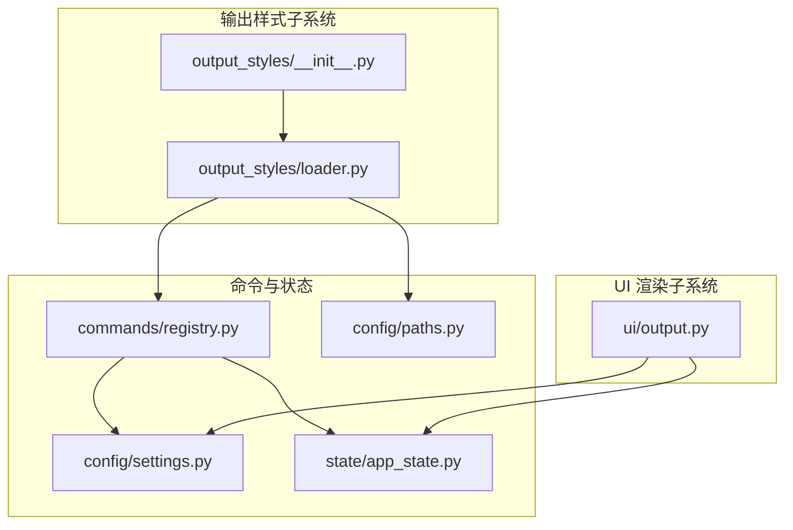
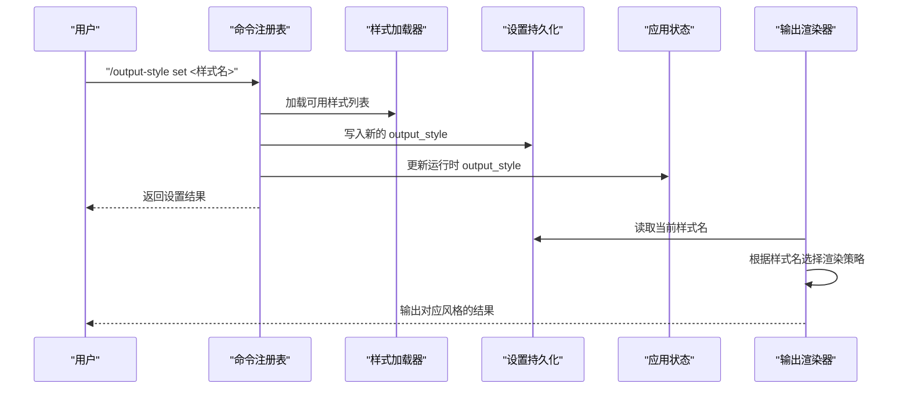
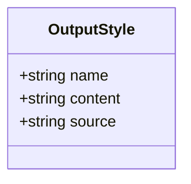
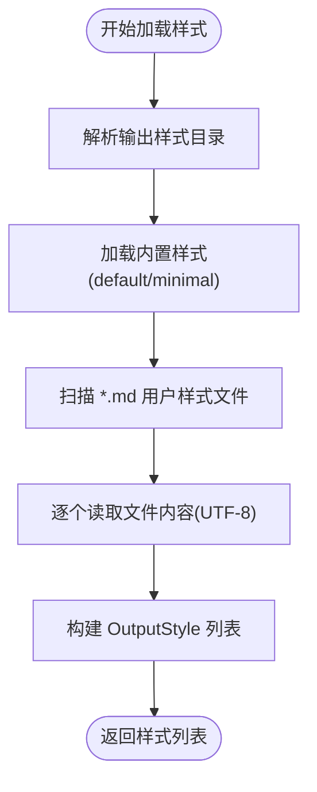
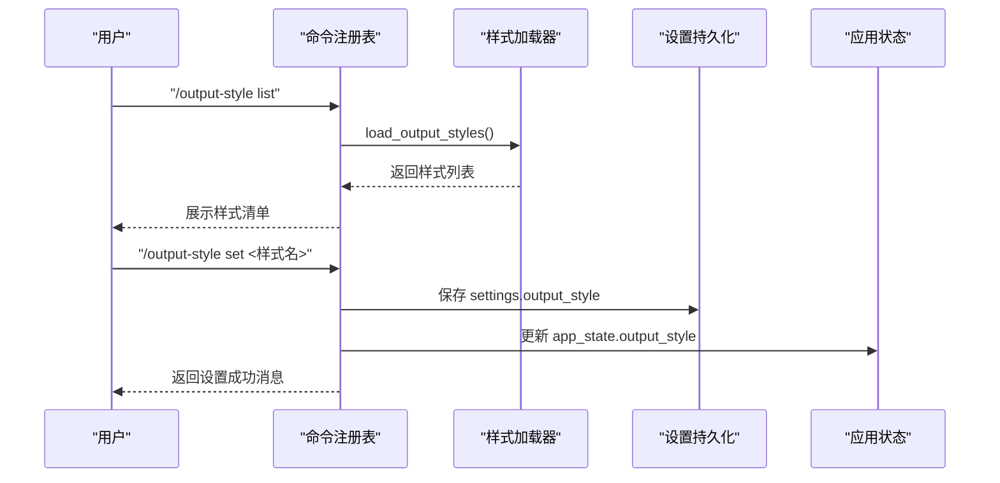
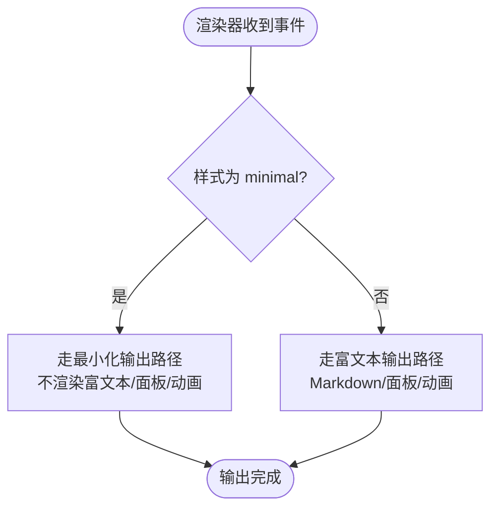
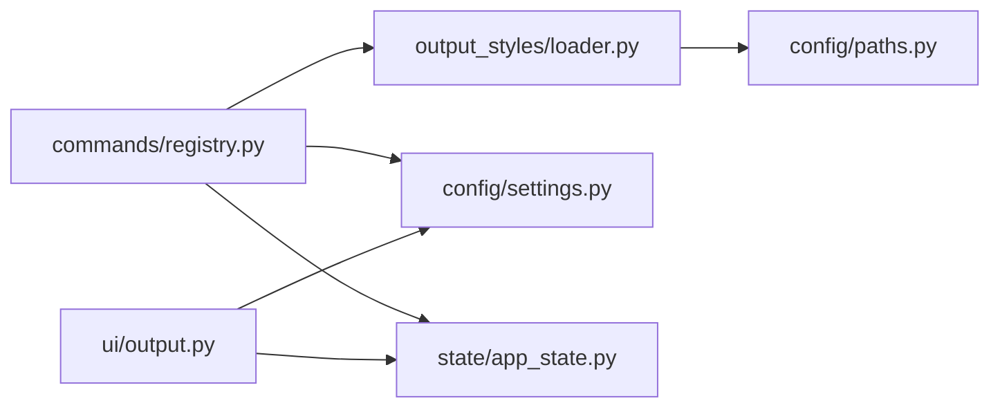

# 输出样式系统

<cite>
**本文引用的文件**
- [src/openharness/output_styles/__init__.py](file://src/openharness/output_styles/__init__.py)
- [src/openharness/output_styles/loader.py](file://src/openharness/output_styles/loader.py)
- [src/openharness/ui/output.py](file://src/openharness/ui/output.py)
- [src/openharness/commands/registry.py](file://src/openharness/commands/registry.py)
- [src/openharness/config/paths.py](file://src/openharness/config/paths.py)
- [src/openharness/config/settings.py](file://src/openharness/config/settings.py)
- [src/openharness/state/app_state.py](file://src/openharness/state/app_state.py)
- [tests/test_ui/test_modes.py](file://tests/test_ui/test_modes.py)
- [tests/test_commands/test_registry.py](file://tests/test_commands/test_registry.py)
</cite>

## 目录
1. [简介](#简介)
2. [项目结构](#项目结构)
3. [核心组件](#核心组件)
4. [架构总览](#架构总览)
5. [详细组件分析](#详细组件分析)
6. [依赖分析](#依赖分析)
7. [性能考虑](#性能考虑)
8. [故障排查指南](#故障排查指南)
9. [结论](#结论)
10. [附录：样式编写与最佳实践](#附录样式编写与最佳实践)

## 简介
本文件系统性地介绍 OpenHarness 的“输出样式”系统，涵盖其核心概念、数据模型、内置样式、自定义样式加载机制、样式切换与应用原理，并提供可操作的样式编写指南与最佳实践。该系统通过一个轻量的数据类承载样式元信息与内容，结合命令行接口与运行时渲染器，实现对终端输出风格的灵活控制。

## 项目结构
输出样式系统主要由以下模块组成：
- 输出样式导出与加载：位于 output_styles 子包，负责样式数据类定义、样式目录解析与样式加载。
- 终端渲染器：位于 ui 子包，负责根据当前样式名称选择渲染策略（如最小化输出、富文本 Markdown、工具调用面板等）。
- 命令注册表：位于 commands 子包，提供 /output-style 命令用于列出、显示与设置样式。
- 配置与状态：config 与 state 子包分别管理持久化设置与运行时共享状态，确保样式变更在会话间生效。

图表来源
- [src/openharness/output_styles/__init__.py:1-6](file://src/openharness/output_styles/__init__.py#L1-L6)
- [src/openharness/output_styles/loader.py:1-42](file://src/openharness/output_styles/loader.py#L1-L42)
- [src/openharness/ui/output.py:1-231](file://src/openharness/ui/output.py#L1-L231)
- [src/openharness/commands/registry.py:998-1026](file://src/openharness/commands/registry.py#L998-L1026)
- [src/openharness/config/paths.py:1-117](file://src/openharness/config/paths.py#L1-L117)
- [src/openharness/config/settings.py:49-75](file://src/openharness/config/settings.py#L49-L75)
- [src/openharness/state/app_state.py:29](file://src/openharness/state/app_state.py#L29)

章节来源
- [src/openharness/output_styles/__init__.py:1-6](file://src/openharness/output_styles/__init__.py#L1-L6)
- [src/openharness/output_styles/loader.py:1-42](file://src/openharness/output_styles/loader.py#L1-L42)
- [src/openharness/ui/output.py:1-231](file://src/openharness/ui/output.py#L1-L231)
- [src/openharness/commands/registry.py:998-1026](file://src/openharness/commands/registry.py#L998-L1026)
- [src/openharness/config/paths.py:15-29](file://src/openharness/config/paths.py#L15-L29)
- [src/openharness/config/settings.py:49-75](file://src/openharness/config/settings.py#L49-L75)
- [src/openharness/state/app_state.py:29](file://src/openharness/state/app_state.py#L29)

## 核心组件
- OutputStyle 数据类：描述一个具名输出样式，包含名称、内容与来源三要素。
- 样式目录解析：从配置根目录下解析出输出样式专用目录。
- 样式加载：合并内置样式与用户自定义样式，形成可用样式集合。
- 渲染器样式应用：根据当前样式名称决定渲染行为（最小化、富文本等）。
- 命令行样式控制：提供列出、显示、设置样式的命令接口。

章节来源
- [src/openharness/output_styles/loader.py:11-18](file://src/openharness/output_styles/loader.py#L11-L18)
- [src/openharness/output_styles/loader.py:20-24](file://src/openharness/output_styles/loader.py#L20-L24)
- [src/openharness/output_styles/loader.py:27-41](file://src/openharness/output_styles/loader.py#L27-L41)
- [src/openharness/ui/output.py:20-33](file://src/openharness/ui/output.py#L20-L33)
- [src/openharness/commands/registry.py:998-1026](file://src/openharness/commands/registry.py#L998-L1026)

## 架构总览
输出样式系统采用“数据模型 + 加载器 + 渲染器 + 命令控制”的分层设计：
- 数据模型：OutputStyle 承载样式元信息与内容。
- 加载器：读取内置样式与用户自定义样式文件，统一输出样式列表。
- 渲染器：依据当前样式名称选择渲染路径，影响输出的丰富度与可读性。
- 命令控制：通过 /output-style 命令展示当前样式、列出可用样式、设置新样式；同时写入设置与更新运行时状态。

图表来源
- [src/openharness/commands/registry.py:998-1026](file://src/openharness/commands/registry.py#L998-L1026)
- [src/openharness/output_styles/loader.py:27-41](file://src/openharness/output_styles/loader.py#L27-L41)
- [src/openharness/config/settings.py:68](file://src/openharness/config/settings.py#L68)
- [src/openharness/state/app_state.py:29](file://src/openharness/state/app_state.py#L29)
- [src/openharness/ui/output.py:31-33](file://src/openharness/ui/output.py#L31-L33)

## 详细组件分析

### OutputStyle 数据类
- 字段
  - name: 样式名称（字符串）
  - content: 样式内容（字符串，通常为 Markdown 文本）
  - source: 样式来源（字符串，builtin 或 user）
- 设计要点
  - 使用不可变数据类，保证样式对象在多处引用时的一致性与线程安全。
  - content 字段用于承载样式描述或模板内容，便于后续扩展为“样式模板引擎”。

图表来源
- [src/openharness/output_styles/loader.py:11-18](file://src/openharness/output_styles/loader.py#L11-L18)

章节来源
- [src/openharness/output_styles/loader.py:11-18](file://src/openharness/output_styles/loader.py#L11-L18)

### 样式目录与加载机制
- 目录解析
  - 自定义样式目录位于配置根目录下的 output_styles 子目录。
  - 若未显式设置环境变量，则默认使用用户主目录下的 .openharness。
- 加载流程
  - 先加载内置样式（default、minimal），再扫描自定义目录中的所有 .md 文件作为用户样式。
  - 用户样式名称取自文件名（不含扩展名），内容读取为 UTF-8 文本。
- 可扩展性
  - 当前仅支持 .md 文件；未来可扩展为支持其他格式或模板语言。

图表来源
- [src/openharness/output_styles/loader.py:20-24](file://src/openharness/output_styles/loader.py#L20-L24)
- [src/openharness/output_styles/loader.py:27-41](file://src/openharness/output_styles/loader.py#L27-L41)
- [src/openharness/config/paths.py:15-29](file://src/openharness/config/paths.py#L15-L29)

章节来源
- [src/openharness/output_styles/loader.py:20-24](file://src/openharness/output_styles/loader.py#L20-L24)
- [src/openharness/output_styles/loader.py:27-41](file://src/openharness/output_styles/loader.py#L27-L41)
- [src/openharness/config/paths.py:15-29](file://src/openharness/config/paths.py#L15-L29)

### 内置样式与适用场景
- default
  - 特点：富文本控制台输出，支持 Markdown 渲染、工具调用面板、进度指示等。
  - 适用场景：交互式终端体验、需要丰富视觉反馈的开发与调试。
- minimal
  - 特点：极简纯文本输出，减少装饰性元素，强调信息密度。
  - 适用场景：低带宽网络、自动化脚本、日志聚合、快速浏览。

章节来源
- [src/openharness/output_styles/loader.py:29-32](file://src/openharness/output_styles/loader.py#L29-L32)
- [src/openharness/ui/output.py:38-54](file://src/openharness/ui/output.py#L38-L54)
- [src/openharness/ui/output.py:82-98](file://src/openharness/ui/output.py#L82-L98)

### 自定义样式加载与应用
- 存储位置
  - 用户样式文件应放置于配置目录的 output_styles 子目录中。
- 命名规则
  - 文件必须为 .md 后缀；样式名称取自文件名（不含扩展名）。
- 格式要求
  - 内容为 UTF-8 编码的文本；当前渲染器将 content 字段作为 Markdown 处理。
- 应用流程
  - 设置样式后，渲染器在构造时读取当前样式名，随后在渲染事件时按样式分支执行不同输出策略。

章节来源
- [src/openharness/output_styles/loader.py:33-40](file://src/openharness/output_styles/loader.py#L33-L40)
- [src/openharness/ui/output.py:23](file://src/openharness/ui/output.py#L23)
- [src/openharness/ui/output.py:31-33](file://src/openharness/ui/output.py#L31-L33)

### 样式切换与命令控制
- 命令接口
  - /output-style show：显示当前样式。
  - /output-style list：列出所有可用样式及其来源。
  - /output-style set <样式名>：设置新样式并持久化。
- 持久化与状态同步
  - 新样式写入设置文件；若存在运行时应用状态，同步更新。

图表来源
- [src/openharness/commands/registry.py:998-1026](file://src/openharness/commands/registry.py#L998-L1026)
- [src/openharness/output_styles/loader.py:27-41](file://src/openharness/output_styles/loader.py#L27-L41)
- [src/openharness/config/settings.py:68](file://src/openharness/config/settings.py#L68)
- [src/openharness/state/app_state.py:29](file://src/openharness/state/app_state.py#L29)

章节来源
- [src/openharness/commands/registry.py:998-1026](file://src/openharness/commands/registry.py#L998-L1026)
- [tests/test_commands/test_registry.py:178-181](file://tests/test_commands/test_registry.py#L178-L181)

### 渲染器样式应用原理
- 样式读取
  - 渲染器初始化时接收样式名称；也可通过 set_style 动态切换。
- 分支逻辑
  - minimal：减少装饰，直接打印关键信息；禁用富文本与动画。
  - default：启用 Markdown 渲染、工具调用面板、进度指示等。
- 事件处理
  - 对不同流事件（如助手文本、工具开始/完成、会话结束）按样式分支进行差异化输出。

图表来源
- [src/openharness/ui/output.py:31-33](file://src/openharness/ui/output.py#L31-L33)
- [src/openharness/ui/output.py:38-54](file://src/openharness/ui/output.py#L38-L54)
- [src/openharness/ui/output.py:82-98](file://src/openharness/ui/output.py#L82-L98)
- [src/openharness/ui/output.py:67-72](file://src/openharness/ui/output.py#L67-L72)

章节来源
- [src/openharness/ui/output.py:20-33](file://src/openharness/ui/output.py#L20-L33)
- [src/openharness/ui/output.py:38-54](file://src/openharness/ui/output.py#L38-L54)
- [src/openharness/ui/output.py:67-72](file://src/openharness/ui/output.py#L67-L72)
- [src/openharness/ui/output.py:82-98](file://src/openharness/ui/output.py#L82-L98)
- [tests/test_ui/test_modes.py:20-25](file://tests/test_ui/test_modes.py#L20-L25)

## 依赖分析
- 模块耦合
  - output_styles/loader 依赖 config/paths 获取配置目录。
  - commands/registry 依赖 output_styles/loader 提供样式列表，并与 config/settings、state/app_state 协作实现持久化与状态同步。
  - ui/output 依赖 settings 与 app_state 读取当前样式名，据此分支渲染。
- 外部依赖
  - 渲染器使用 rich 进行富文本、Markdown、语法高亮与面板渲染。
- 循环依赖
  - 未发现循环导入；各模块职责清晰，边界明确。

图表来源
- [src/openharness/output_styles/loader.py:8](file://src/openharness/output_styles/loader.py#L8)
- [src/openharness/commands/registry.py:998-1026](file://src/openharness/commands/registry.py#L998-L1026)
- [src/openharness/config/settings.py:68](file://src/openharness/config/settings.py#L68)
- [src/openharness/state/app_state.py:29](file://src/openharness/state/app_state.py#L29)
- [src/openharness/ui/output.py:23](file://src/openharness/ui/output.py#L23)

章节来源
- [src/openharness/output_styles/loader.py:8](file://src/openharness/output_styles/loader.py#L8)
- [src/openharness/commands/registry.py:998-1026](file://src/openharness/commands/registry.py#L998-L1026)
- [src/openharness/config/settings.py:68](file://src/openharness/config/settings.py#L68)
- [src/openharness/state/app_state.py:29](file://src/openharness/state/app_state.py#L29)
- [src/openharness/ui/output.py:23](file://src/openharness/ui/output.py#L23)

## 性能考虑
- 样式加载
  - 用户样式按 .md 文件数量线性扫描，建议控制自定义样式文件数量，避免过多文件导致加载开销。
- 渲染性能
  - 富文本渲染涉及 Markdown 解析与语法高亮，minimal 模式可显著降低 CPU 与 I/O 开销。
- I/O 优化
  - 样式内容读取为一次性文本，建议保持单个样式文件大小适中，避免超大文件带来的内存压力。

## 故障排查指南
- 设置样式后未生效
  - 确认是否同时更新了设置文件与运行时状态；检查命令返回值与当前样式显示。
  - 参考：命令设置流程与状态同步。
- 样式文件未被识别
  - 检查文件是否位于正确的输出样式目录且为 .md 后缀；确认文件名不含扩展名的样式名正确。
  - 参考：样式目录解析与加载流程。
- 渲染异常或输出不符合预期
  - 切换到 minimal 模式验证基础输出；逐步恢复到 desired 样式定位问题。
  - 参考：渲染器分支逻辑与事件处理。

章节来源
- [src/openharness/commands/registry.py:998-1026](file://src/openharness/commands/registry.py#L998-L1026)
- [src/openharness/output_styles/loader.py:20-24](file://src/openharness/output_styles/loader.py#L20-L24)
- [src/openharness/output_styles/loader.py:33-40](file://src/openharness/output_styles/loader.py#L33-L40)
- [src/openharness/ui/output.py:31-33](file://src/openharness/ui/output.py#L31-L33)

## 结论
OpenHarness 的输出样式系统以简洁的数据模型与清晰的加载/渲染分离架构，实现了对终端输出风格的灵活控制。内置 default 与 minimal 两种样式覆盖常见交互需求，用户可通过 Markdown 文件扩展自定义样式。配合命令行接口与持久化设置，用户可在不同场景下快速切换并获得一致的输出体验。

## 附录：样式编写与最佳实践
- 存放位置
  - 将样式文件放置于配置目录的 output_styles 子目录中，文件名为样式名称（不含 .md 扩展）。
- 文件格式
  - 使用 UTF-8 编码；内容为 Markdown 文本，渲染器会将其作为 Markdown 处理。
- 命名规范
  - 文件名即样式名；建议使用短横线或下划线分隔的可读名称。
- 最佳实践
  - 将样式视为“描述性模板”，尽量保持内容简洁、语义明确。
  - 在 minimal 模式下优先保证关键信息可见，避免冗余装饰。
  - 如需复杂渲染，优先在渲染器侧扩展而非过度依赖样式内容。
  - 对于团队协作，建议约定样式命名与内容规范，统一输出风格。

章节来源
- [src/openharness/output_styles/loader.py:33-40](file://src/openharness/output_styles/loader.py#L33-L40)
- [src/openharness/output_styles/loader.py:20-24](file://src/openharness/output_styles/loader.py#L20-L24)
- [src/openharness/ui/output.py:67-72](file://src/openharness/ui/output.py#L67-L72)