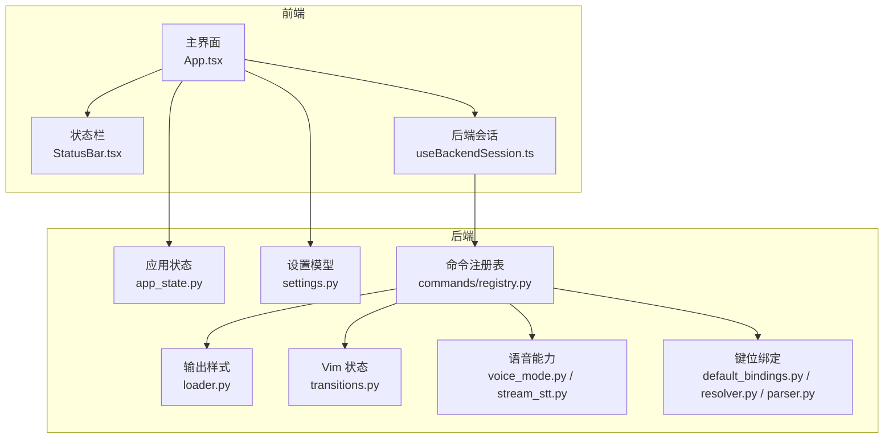
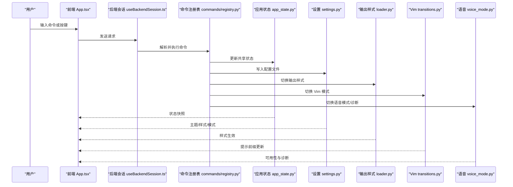
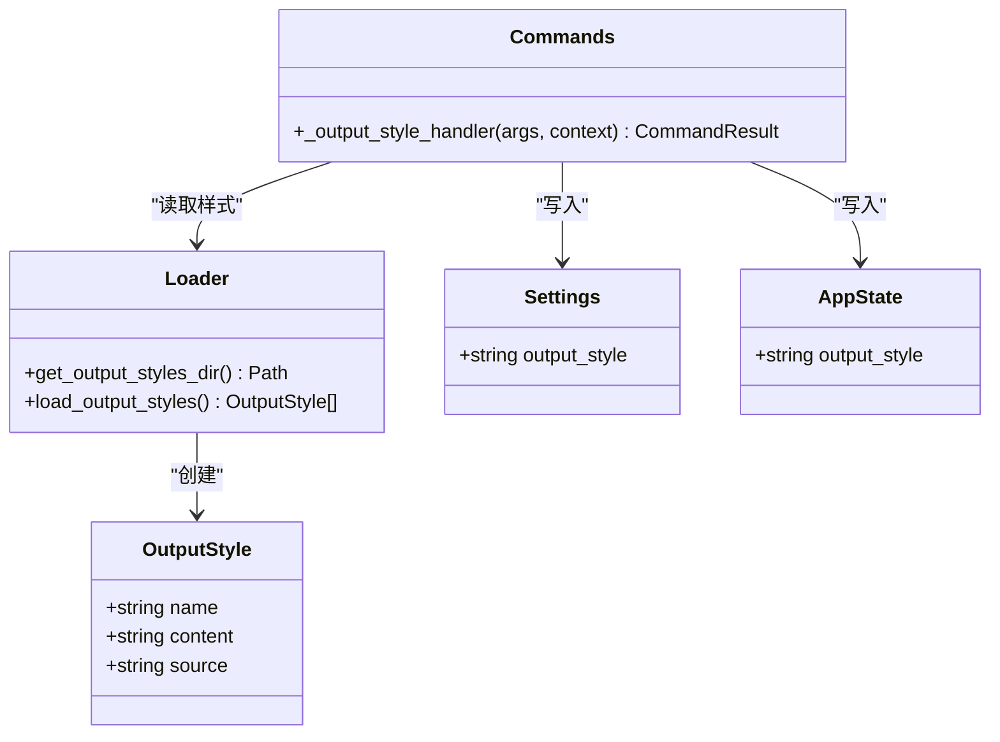
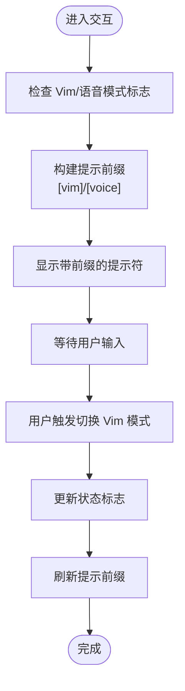
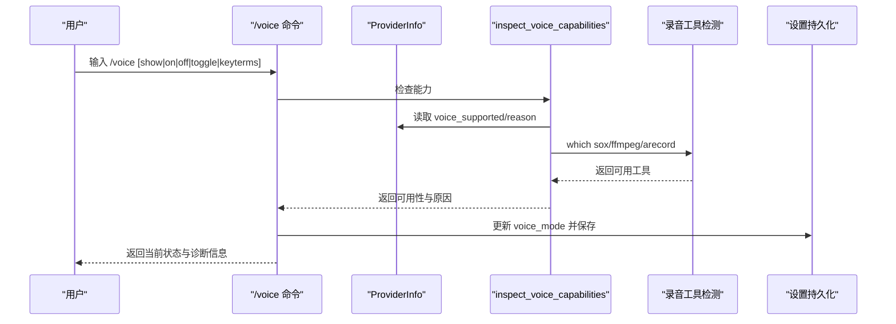
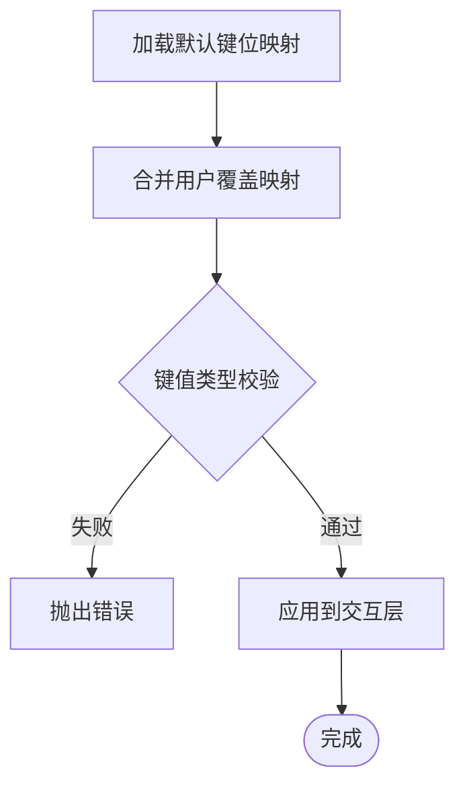
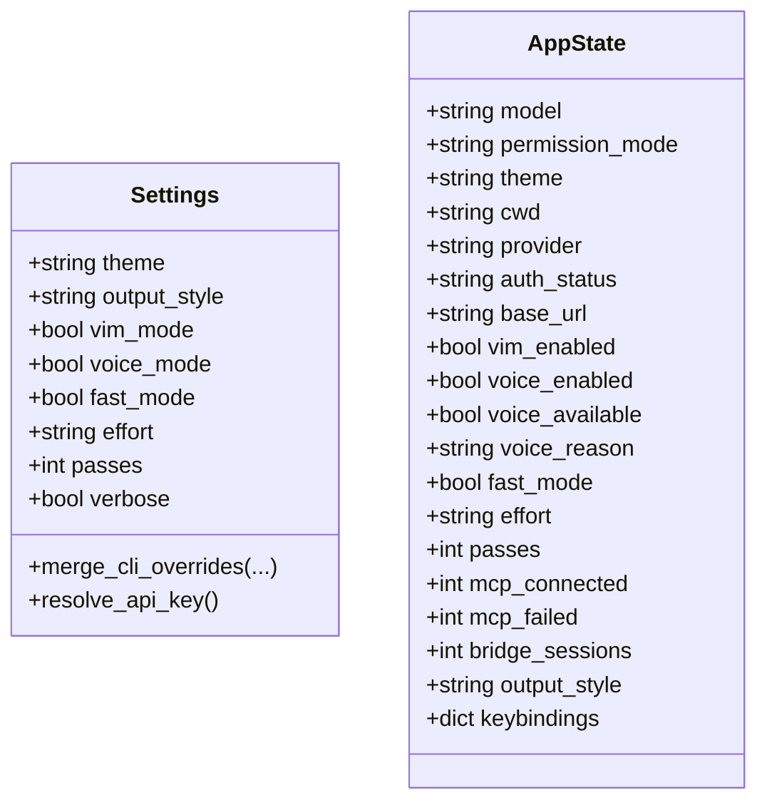
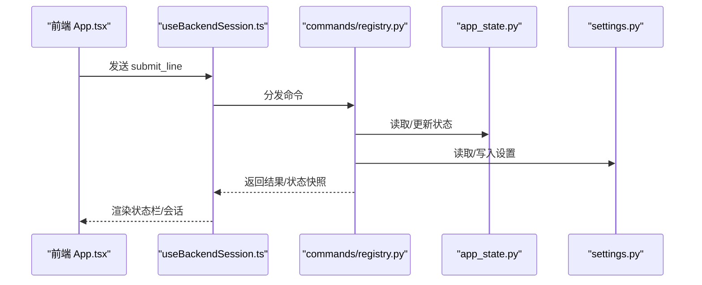
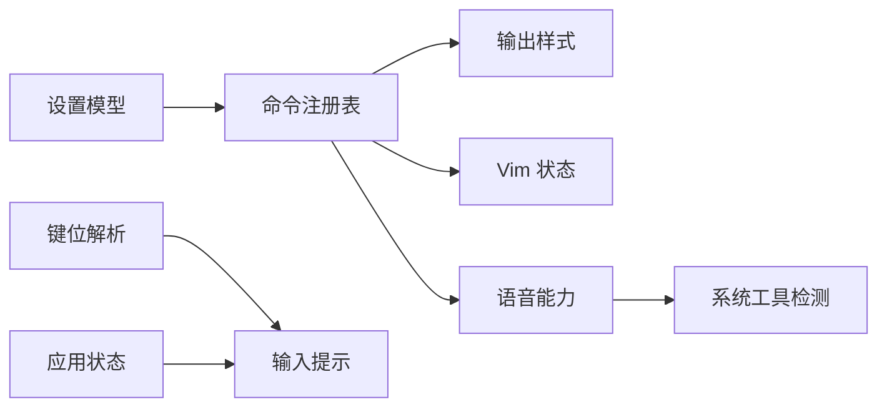

# 高级功能

<cite>
**本文引用的文件**
- [src/openharness/output_styles/loader.py](file://src/openharness/output_styles/loader.py)
- [src/openharness/output_styles/__init__.py](file://src/openharness/output_styles/__init__.py)
- [src/openharness/vim/transitions.py](file://src/openharness/vim/transitions.py)
- [src/openharness/voice/stream_stt.py](file://src/openharness/voice/stream_stt.py)
- [src/openharness/voice/voice_mode.py](file://src/openharness/voice/voice_mode.py)
- [src/openharness/keybindings/default_bindings.py](file://src/openharness/keybindings/default_bindings.py)
- [src/openharness/keybindings/resolver.py](file://src/openharness/keybindings/resolver.py)
- [src/openharness/keybindings/parser.py](file://src/openharness/keybindings/parser.py)
- [src/openharness/state/app_state.py](file://src/openharness/state/app_state.py)
- [src/openharness/ui/input.py](file://src/openharness/ui/input.py)
- [src/openharness/config/settings.py](file://src/openharness/config/settings.py)
- [src/openharness/commands/registry.py](file://src/openharness/commands/registry.py)
- [src/openharness/ui/textual_app.py](file://src/openharness/ui/textual_app.py)
- [frontend/terminal/src/App.tsx](file://frontend/terminal/src/App.tsx)
- [frontend/terminal/src/components/StatusBar.tsx](file://frontend/terminal/src/components/StatusBar.tsx)
- [frontend/terminal/src/hooks/useBackendSession.ts](file://frontend/terminal/src/hooks/useBackendSession.ts)
- [tests/test_ui/test_modes.py](file://tests/test_ui/test_modes.py)
</cite>

## 目录
1. [简介](#简介)
2. [项目结构](#项目结构)
3. [核心组件](#核心组件)
4. [架构总览](#架构总览)
5. [详细组件分析](#详细组件分析)
6. [依赖分析](#依赖分析)
7. [性能考虑](#性能考虑)
8. [故障排查指南](#故障排查指南)
9. [结论](#结论)
10. [附录](#附录)

## 简介
本文件面向希望深度定制与扩展 OpenHarness 高级功能的用户，系统性讲解以下能力：
- 输出样式：颜色主题、格式化选项、自定义样式加载与切换
- Vim 集成：状态转换、编辑模式、快捷键映射
- 语音功能：语音转文字占位接口、语音模式切换、环境诊断
- 配置与使用场景：命令行、环境变量、配置文件三者优先级；在 TUI 前端与文本应用中的集成方式
- 扩展指南：如何添加新的输出样式、扩展 Vim 模式、定制语音功能
- 实战示例与性能优化建议：覆盖常见使用路径与调优要点

## 项目结构
OpenHarness 的高级功能主要分布在后端 Python 包与前端终端应用之间：
- 后端（Python）：输出样式加载、Vim 状态切换、语音能力与诊断、键位绑定解析、应用状态与设置模型、命令注册表
- 前端（React Ink）：对话展示、状态栏、输入与交互、与后端会话通信

**图表来源**
- [src/openharness/output_styles/loader.py:1-42](file://src/openharness/output_styles/loader.py#L1-L42)
- [src/openharness/vim/transitions.py:1-9](file://src/openharness/vim/transitions.py#L1-L9)
- [src/openharness/voice/voice_mode.py:1-45](file://src/openharness/voice/voice_mode.py#L1-L45)
- [src/openharness/voice/stream_stt.py:1-9](file://src/openharness/voice/stream_stt.py#L1-L9)
- [src/openharness/keybindings/default_bindings.py:1-12](file://src/openharness/keybindings/default_bindings.py#L1-L12)
- [src/openharness/keybindings/resolver.py:1-14](file://src/openharness/keybindings/resolver.py#L1-L14)
- [src/openharness/keybindings/parser.py:1-19](file://src/openharness/keybindings/parser.py#L1-L19)
- [src/openharness/state/app_state.py:1-31](file://src/openharness/state/app_state.py#L1-L31)
- [src/openharness/config/settings.py:1-161](file://src/openharness/config/settings.py#L1-L161)
- [src/openharness/commands/registry.py:995-1080](file://src/openharness/commands/registry.py#L995-L1080)
- [frontend/terminal/src/App.tsx:1-400](file://frontend/terminal/src/App.tsx#L1-L400)
- [frontend/terminal/src/components/StatusBar.tsx:1-54](file://frontend/terminal/src/components/StatusBar.tsx#L1-L54)
- [frontend/terminal/src/hooks/useBackendSession.ts:1-172](file://frontend/terminal/src/hooks/useBackendSession.ts#L1-L172)

**章节来源**
- [src/openharness/output_styles/loader.py:1-42](file://src/openharness/output_styles/loader.py#L1-L42)
- [src/openharness/vim/transitions.py:1-9](file://src/openharness/vim/transitions.py#L1-L9)
- [src/openharness/voice/voice_mode.py:1-45](file://src/openharness/voice/voice_mode.py#L1-L45)
- [src/openharness/voice/stream_stt.py:1-9](file://src/openharness/voice/stream_stt.py#L1-L9)
- [src/openharness/keybindings/default_bindings.py:1-12](file://src/openharness/keybindings/default_bindings.py#L1-L12)
- [src/openharness/keybindings/resolver.py:1-14](file://src/openharness/keybindings/resolver.py#L1-L14)
- [src/openharness/keybindings/parser.py:1-19](file://src/openharness/keybindings/parser.py#L1-L19)
- [src/openharness/state/app_state.py:1-31](file://src/openharness/state/app_state.py#L1-L31)
- [src/openharness/config/settings.py:1-161](file://src/openharness/config/settings.py#L1-L161)
- [src/openharness/commands/registry.py:995-1080](file://src/openharness/commands/registry.py#L995-L1080)
- [frontend/terminal/src/App.tsx:1-400](file://frontend/terminal/src/App.tsx#L1-L400)
- [frontend/terminal/src/components/StatusBar.tsx:1-54](file://frontend/terminal/src/components/StatusBar.tsx#L1-L54)
- [frontend/terminal/src/hooks/useBackendSession.ts:1-172](file://frontend/terminal/src/hooks/useBackendSession.ts#L1-L172)

## 核心组件
- 输出样式系统：内置默认与极简样式，支持从用户配置目录加载 Markdown 样式文件，并通过命令进行列出、显示与切换
- Vim 集成：提供最小化的 Vim 模式开关逻辑，配合输入提示前缀在交互中可视化当前模式
- 语音功能：提供语音模式开关与环境诊断（基于录音工具可用性），以及流式语音转文字的占位接口
- 键位绑定：默认键位映射可被用户覆盖，解析器负责合并用户覆盖与默认映射
- 应用状态与设置：集中管理主题、输出样式、Vim/语音模式、权限模式等全局状态，并持久化到配置文件
- 命令注册表：统一暴露 /theme、/output-style、/voice、/vim 等高级功能命令，驱动状态变更与持久化

**章节来源**
- [src/openharness/output_styles/loader.py:27-41](file://src/openharness/output_styles/loader.py#L27-L41)
- [src/openharness/ui/input.py:15-24](file://src/openharness/ui/input.py#L15-L24)
- [src/openharness/voice/voice_mode.py:20-43](file://src/openharness/voice/voice_mode.py#L20-L43)
- [src/openharness/voice/stream_stt.py:6-8](file://src/openharness/voice/stream_stt.py#L6-L8)
- [src/openharness/keybindings/default_bindings.py:6-11](file://src/openharness/keybindings/default_bindings.py#L6-L11)
- [src/openharness/state/app_state.py:8-31](file://src/openharness/state/app_state.py#L8-L31)
- [src/openharness/config/settings.py:49-75](file://src/openharness/config/settings.py#L49-L75)
- [src/openharness/commands/registry.py:982-1080](file://src/openharness/commands/registry.py#L982-L1080)

## 架构总览
下图展示了“命令—状态—持久化—前端”的闭环流程，体现高级功能的控制链路。

**图表来源**
- [frontend/terminal/src/App.tsx:149-290](file://frontend/terminal/src/App.tsx#L149-L290)
- [frontend/terminal/src/hooks/useBackendSession.ts:71-150](file://frontend/terminal/src/hooks/useBackendSession.ts#L71-L150)
- [src/openharness/commands/registry.py:982-1080](file://src/openharness/commands/registry.py#L982-L1080)
- [src/openharness/state/app_state.py:8-31](file://src/openharness/state/app_state.py#L8-L31)
- [src/openharness/config/settings.py:123-161](file://src/openharness/config/settings.py#L123-L161)
- [src/openharness/output_styles/loader.py:27-41](file://src/openharness/output_styles/loader.py#L27-L41)
- [src/openharness/vim/transitions.py:6-8](file://src/openharness/vim/transitions.py#L6-L8)
- [src/openharness/voice/voice_mode.py:20-43](file://src/openharness/voice/voice_mode.py#L20-L43)

## 详细组件分析

### 输出样式系统
- 数据结构：输出样式以名称、内容与来源标识存储，支持内置与用户自定义样式
- 加载策略：内置默认与极简样式，同时扫描用户配置目录下的 Markdown 文件作为自定义样式
- 命令接口：/output-style 支持 show、list、set，切换后持久化至配置文件并可影响渲染
- 前端联动：状态与设置模型中包含输出样式字段，前端根据状态更新渲染

**图表来源**
- [src/openharness/output_styles/loader.py:11-41](file://src/openharness/output_styles/loader.py#L11-L41)
- [src/openharness/commands/registry.py:995-1020](file://src/openharness/commands/registry.py#L995-L1020)
- [src/openharness/config/settings.py:68-68](file://src/openharness/config/settings.py#L68-L68)
- [src/openharness/state/app_state.py:29-29](file://src/openharness/state/app_state.py#L29-L29)

**章节来源**
- [src/openharness/output_styles/loader.py:20-41](file://src/openharness/output_styles/loader.py#L20-L41)
- [src/openharness/output_styles/__init__.py:1-5](file://src/openharness/output_styles/__init__.py#L1-L5)
- [src/openharness/commands/registry.py:995-1020](file://src/openharness/commands/registry.py#L995-L1020)
- [src/openharness/config/settings.py:68-68](file://src/openharness/config/settings.py#L68-L68)
- [src/openharness/state/app_state.py:29-29](file://src/openharness/state/app_state.py#L29-L29)

### Vim 集成功能
- 状态切换：提供最小化的布尔切换函数，用于在交互中切换 Vim 模式
- 前端提示：输入会话根据是否启用 Vim/语音模式动态更新提示前缀，便于用户感知
- 快捷键映射：默认键位将 ctrl+k 绑定到切换 Vim 模式，可在用户配置中覆盖

**图表来源**
- [src/openharness/ui/input.py:15-24](file://src/openharness/ui/input.py#L15-L24)
- [src/openharness/vim/transitions.py:6-8](file://src/openharness/vim/transitions.py#L6-L8)
- [src/openharness/keybindings/default_bindings.py:8-8](file://src/openharness/keybindings/default_bindings.py#L8-L8)

**章节来源**
- [src/openharness/ui/input.py:15-24](file://src/openharness/ui/input.py#L15-L24)
- [src/openharness/vim/transitions.py:6-8](file://src/openharness/vim/transitions.py#L6-L8)
- [src/openharness/keybindings/default_bindings.py:8-8](file://src/openharness/keybindings/default_bindings.py#L8-L8)
- [src/openharness/state/app_state.py:19-19](file://src/openharness/state/app_state.py#L19-L19)
- [src/openharness/config/settings.py:69-69](file://src/openharness/config/settings.py#L69-L69)

### 语音功能
- 能力诊断：检查语音能力是否受提供商支持，以及本地是否存在录音工具（如 sox/ffmpeg/arecord）
- 模式切换：提供语音模式开关函数，结合命令接口与设置持久化
- 流式 STT 占位：提供异步转写接口，当前返回未配置提示

**图表来源**
- [src/openharness/commands/registry.py:1052-1080](file://src/openharness/commands/registry.py#L1052-L1080)
- [src/openharness/voice/voice_mode.py:25-43](file://src/openharness/voice/voice_mode.py#L25-L43)
- [src/openharness/voice/stream_stt.py:6-8](file://src/openharness/voice/stream_stt.py#L6-L8)
- [src/openharness/config/settings.py:70-70](file://src/openharness/config/settings.py#L70-L70)

**章节来源**
- [src/openharness/voice/voice_mode.py:20-43](file://src/openharness/voice/voice_mode.py#L20-L43)
- [src/openharness/voice/stream_stt.py:6-8](file://src/openharness/voice/stream_stt.py#L6-L8)
- [src/openharness/commands/registry.py:1052-1080](file://src/openharness/commands/registry.py#L1052-L1080)
- [src/openharness/config/settings.py:70-70](file://src/openharness/config/settings.py#L70-L70)

### 键位绑定与快捷键映射
- 默认映射：提供一组默认键位，例如清屏、切换 Vim、切换语音、打开任务面板
- 用户覆盖：解析用户提供的 JSON 映射，与默认映射合并
- 解析校验：确保键值均为字符串，否则抛出错误

**图表来源**
- [src/openharness/keybindings/default_bindings.py:6-11](file://src/openharness/keybindings/default_bindings.py#L6-L11)
- [src/openharness/keybindings/resolver.py:8-13](file://src/openharness/keybindings/resolver.py#L8-L13)
- [src/openharness/keybindings/parser.py:8-18](file://src/openharness/keybindings/parser.py#L8-L18)

**章节来源**
- [src/openharness/keybindings/default_bindings.py:6-11](file://src/openharness/keybindings/default_bindings.py#L6-L11)
- [src/openharness/keybindings/resolver.py:8-13](file://src/openharness/keybindings/resolver.py#L8-L13)
- [src/openharness/keybindings/parser.py:8-18](file://src/openharness/keybindings/parser.py#L8-L18)

### 应用状态与设置模型
- 全局状态：集中保存主题、输出样式、Vim/语音模式、权限模式、令牌统计等
- 设置模型：包含 UI 相关字段（主题、输出样式、Vim/语音模式等），支持从配置文件、环境变量、CLI 参数加载与合并
- 持久化：提供保存设置到默认位置的能力

**图表来源**
- [src/openharness/config/settings.py:49-75](file://src/openharness/config/settings.py#L49-L75)
- [src/openharness/state/app_state.py:8-31](file://src/openharness/state/app_state.py#L8-L31)

**章节来源**
- [src/openharness/config/settings.py:123-161](file://src/openharness/config/settings.py#L123-L161)
- [src/openharness/state/app_state.py:8-31](file://src/openharness/state/app_state.py#L8-L31)

### 命令注册表与交互
- 命令入口：统一处理 /theme、/output-style、/voice、/vim 等命令，读取当前状态或设置，执行变更并持久化
- 前端交互：前端监听后端事件，渲染状态栏、会话与输入框，支持脚本化提交与选择弹窗

**图表来源**
- [frontend/terminal/src/App.tsx:292-318](file://frontend/terminal/src/App.tsx#L292-L318)
- [frontend/terminal/src/hooks/useBackendSession.ts:71-150](file://frontend/terminal/src/hooks/useBackendSession.ts#L71-L150)
- [src/openharness/commands/registry.py:982-1080](file://src/openharness/commands/registry.py#L982-L1080)
- [src/openharness/state/app_state.py:8-31](file://src/openharness/state/app_state.py#L8-L31)
- [src/openharness/config/settings.py:123-161](file://src/openharness/config/settings.py#L123-L161)

**章节来源**
- [src/openharness/commands/registry.py:982-1080](file://src/openharness/commands/registry.py#L982-L1080)
- [frontend/terminal/src/App.tsx:149-290](file://frontend/terminal/src/App.tsx#L149-L290)
- [frontend/terminal/src/hooks/useBackendSession.ts:71-150](file://frontend/terminal/src/hooks/useBackendSession.ts#L71-L150)

## 依赖分析
- 组件内聚与耦合
  - 输出样式与命令注册表耦合于“列出/设置样式”流程
  - 键位绑定解析器与默认映射解耦，便于用户覆盖
  - 应用状态与设置模型共同驱动前端渲染与持久化
  - 语音模块与命令注册表耦合于“诊断/切换/关键词提取”
- 外部依赖
  - 录音工具检测依赖系统工具（sox/ffmpeg/arecord）
  - 前端依赖 Node 子进程与 readline 进行后端会话通信

**图表来源**
- [src/openharness/commands/registry.py:995-1080](file://src/openharness/commands/registry.py#L995-L1080)
- [src/openharness/output_styles/loader.py:27-41](file://src/openharness/output_styles/loader.py#L27-L41)
- [src/openharness/vim/transitions.py:6-8](file://src/openharness/vim/transitions.py#L6-L8)
- [src/openharness/voice/voice_mode.py:27-43](file://src/openharness/voice/voice_mode.py#L27-L43)
- [src/openharness/keybindings/resolver.py:8-13](file://src/openharness/keybindings/resolver.py#L8-L13)
- [src/openharness/ui/input.py:15-24](file://src/openharness/ui/input.py#L15-L24)
- [src/openharness/config/settings.py:123-161](file://src/openharness/config/settings.py#L123-L161)
- [src/openharness/state/app_state.py:8-31](file://src/openharness/state/app_state.py#L8-L31)

**章节来源**
- [src/openharness/commands/registry.py:995-1080](file://src/openharness/commands/registry.py#L995-L1080)
- [src/openharness/voice/voice_mode.py:27-43](file://src/openharness/voice/voice_mode.py#L27-L43)
- [src/openharness/keybindings/resolver.py:8-13](file://src/openharness/keybindings/resolver.py#L8-L13)
- [src/openharness/ui/input.py:15-24](file://src/openharness/ui/input.py#L15-L24)
- [src/openharness/config/settings.py:123-161](file://src/openharness/config/settings.py#L123-L161)
- [src/openharness/state/app_state.py:8-31](file://src/openharness/state/app_state.py#L8-L31)

## 性能考虑
- 输出样式
  - 自定义样式采用一次性读取与缓存策略，建议避免频繁重载大体积样式文件
  - 在前端渲染时尽量减少重复计算，复用已解析的样式对象
- 键位绑定
  - 用户映射应保持精简，避免过多覆盖导致解析与查找开销增加
- 语音功能
  - 仅在环境满足时启用语音模式，避免无效的外部工具探测
  - 流式 STT 接口当前为占位实现，建议在实际接入后按数据块大小与缓冲策略优化吞吐
- 前端交互
  - 使用状态快照与增量更新，避免不必要的重渲染
  - 合理使用脚本化提交与选择弹窗，减少用户等待时间

[本节为通用指导，无需特定文件来源]

## 故障排查指南
- 输出样式无法切换
  - 检查 /output-style list 是否包含目标样式名
  - 确认配置文件写入成功且重启会话后生效
- Vim/语音模式不生效
  - 确认键位映射是否被用户覆盖
  - 检查应用状态与设置模型中的对应字段是否正确更新
- 语音不可用
  - 查看 /voice show 输出的可用性与原因
  - 安装并确保 sox/ffmpeg/arecord 中至少一个可用
- 前端无响应
  - 检查后端会话是否正常建立与事件分发
  - 关注状态栏与日志输出，定位错误事件

**章节来源**
- [src/openharness/commands/registry.py:995-1080](file://src/openharness/commands/registry.py#L995-L1080)
- [src/openharness/voice/voice_mode.py:25-43](file://src/openharness/voice/voice_mode.py#L25-L43)
- [frontend/terminal/src/hooks/useBackendSession.ts:71-150](file://frontend/terminal/src/hooks/useBackendSession.ts#L71-L150)

## 结论
OpenHarness 的高级功能围绕“命令—状态—持久化—前端渲染”的闭环展开，具备良好的扩展性与可定制性。通过输出样式、Vim 集成与语音能力的组合，用户可以在不同场景下获得更高效、更个性化的交互体验。建议在生产环境中结合性能优化与故障排查实践，持续迭代配置与扩展方案。

[本节为总结，无需特定文件来源]

## 附录

### 配置与使用场景
- 配置优先级（最高到最低）：CLI 参数 > 环境变量 > 配置文件 > 默认值
- 常见场景
  - 开发调试：开启 fast_mode 与 minimal 输出样式，减少冗余信息
  - 团队协作：统一 theme 与 output_style，便于一致性
  - 无障碍与语音：在支持环境下启用 voice_mode，并配置录音工具
  - 编辑效率：启用 vim_mode 并自定义键位映射，提升键盘操作效率

**章节来源**
- [src/openharness/config/settings.py:3-8](file://src/openharness/config/settings.py#L3-L8)
- [src/openharness/config/settings.py:123-161](file://src/openharness/config/settings.py#L123-L161)
- [src/openharness/state/app_state.py:19-31](file://src/openharness/state/app_state.py#L19-L31)
- [src/openharness/config/settings.py:67-74](file://src/openharness/config/settings.py#L67-L74)

### 功能扩展指南
- 自定义输出样式
  - 在用户配置目录创建 Markdown 文件，文件名即样式名
  - 使用 /output-style list 查看并 /output-style set 切换
- 扩展 Vim 模式
  - 在键位映射中添加或修改键位到 toggle_vim 的映射
  - 在输入会话中扩展提示前缀以反映更多模式
- 语音功能定制
  - 实现 transcribe_stream 的具体逻辑，替换占位实现
  - 在 /voice 命令中扩展关键词提取与模式联动

**章节来源**
- [src/openharness/output_styles/loader.py:20-41](file://src/openharness/output_styles/loader.py#L20-L41)
- [src/openharness/commands/registry.py:995-1020](file://src/openharness/commands/registry.py#L995-L1020)
- [src/openharness/keybindings/resolver.py:8-13](file://src/openharness/keybindings/resolver.py#L8-L13)
- [src/openharness/ui/input.py:15-24](file://src/openharness/ui/input.py#L15-L24)
- [src/openharness/voice/stream_stt.py:6-8](file://src/openharness/voice/stream_stt.py#L6-L8)

### 实际使用示例
- 列出并切换输出样式
  - 步骤：/output-style list → /output-style set <name>
  - 验证：查看状态栏与会话渲染差异
- 切换 Vim 模式
  - 步骤：按键或命令切换 → 观察提示前缀变化
- 语音模式诊断与启用
  - 步骤：/voice show → /voice on → 确认录音工具可用
- 键位映射覆盖
  - 步骤：准备 JSON 映射文件 → 合并默认映射 → 应用到交互层

**章节来源**
- [src/openharness/commands/registry.py:995-1080](file://src/openharness/commands/registry.py#L995-L1080)
- [src/openharness/ui/input.py:15-24](file://src/openharness/ui/input.py#L15-L24)
- [src/openharness/voice/voice_mode.py:25-43](file://src/openharness/voice/voice_mode.py#L25-L43)
- [src/openharness/keybindings/resolver.py:8-13](file://src/openharness/keybindings/resolver.py#L8-L13)